# ByteTrack使用指南

> 分类:01-开始 | articleId:w8fFe9kilI | 描述:帮助您快速使用ByteTrack的客服功能

👋👋👋首先，我将告诉您ByteTrack的相关资料。如果您以后需要的话，可以通过下方的链接快速找到您所需要的各种资料和信息：
- · ByteTrack [官网](https://www.bytrack.com)
- · ByteTrack [帮助中心](https://docs.bytrack.com/8CTFE8cF/help/)
- · ByteTrack [开发者中心](https://docs.bytrack.com/8CTFE8cF/developers)
- · ByteTrack [登录注册 ](https://login.bytrack.com)
 接下来，您只需要执行下面的几个步骤👇，即可以轻松使用。

## 1、注册账号
 您可以通过注册页面，使用邮箱进行账号的注册，如下图所示：

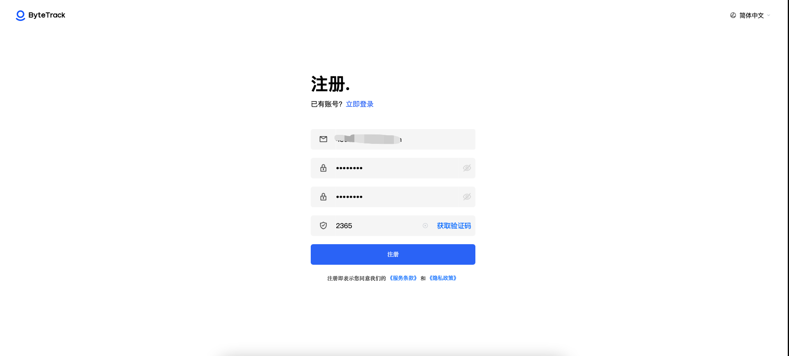

 
 👋👋👋注意：请务必记住您的邮箱和密码。邮箱作为您的账号，同时还用于验证码的接收。

## 2、登录系统
 您可以通过登录页面，输入账号和密码进行登录。
 输入密码之后，您的账号邮箱会收到由ByteTrack发送的登陆验证码，输入正确的验证码，您即可成功登录ByteTrack系统。
 
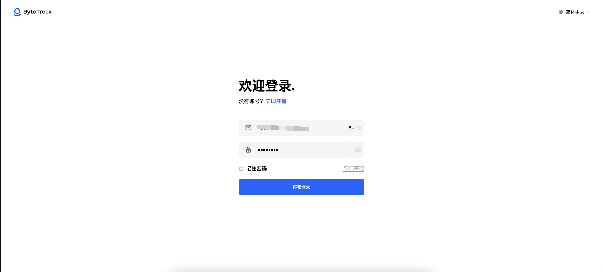
 
 
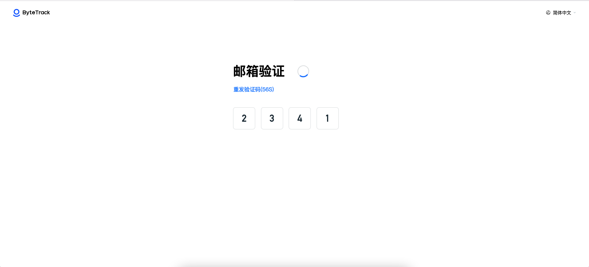

 👋👋👋注意：
1、如果您未能在邮箱中找到验证码，请尝试在“垃圾邮件”中看看，或者您可以尝试重新发送验证码；
2、输入账号和密码，请注意前后的空格；

## 3、创建项目
 我们允许您的一个账号同时创建多个项目。如果你的账号此前没有加入过任何一个ByteTrack项目，那么在您成功登录之后，会引导您立即创建您的第一个项目。
 比如，您可以为您的店铺，创建一个“ZARA专卖店”的项目：
 
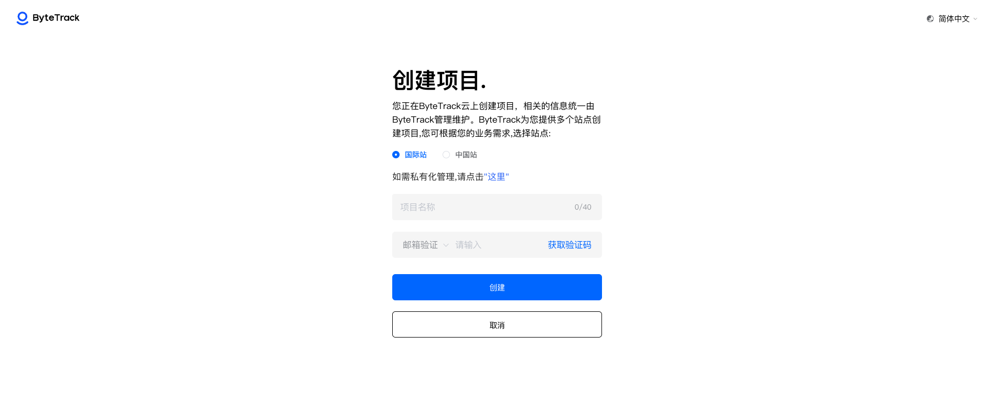

 创建好项目之后，您即可成功进入您的项目中。
 👋👋👋注意：
1、如果您之前通过别人的邀请，加入过别的项目。那么在您登录成功之后，将不再引导您去创建项目，此时您会自动进入到上一个项目中。
 

## 4、进入项目
 进入项目之后，请注意您页面的左上角，可以明显的查看到您当前所处于的项目名称，如下图所示；
 
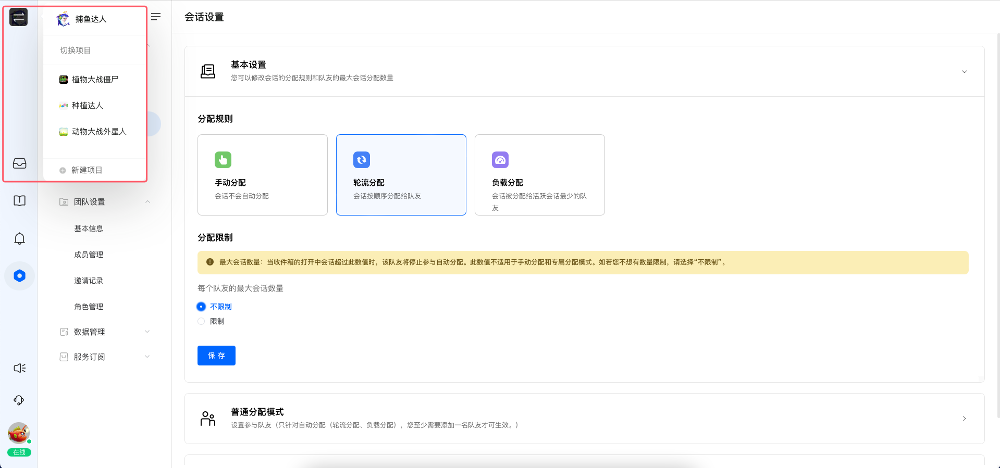

 同时，您可以在项目列表处，自由选择加入您所参与的任何项目。
 

## 5、订阅套餐
 如果您的项目，还没有开通任何订阅服务，那将不可以使用ByteTrack所提供的主要服务。当您进入项目时，会出现如下的场景：
 
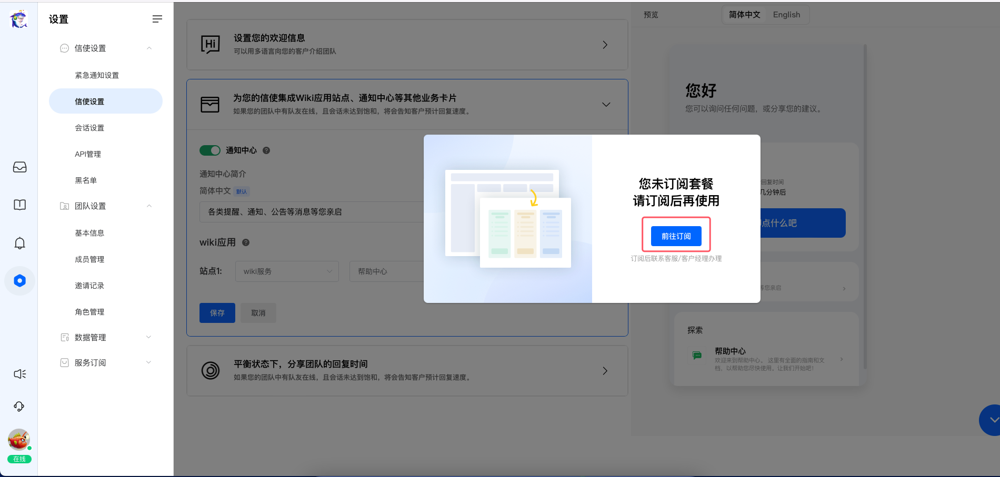

 您可以点击“前往订阅”，选择您需要的套餐进行订阅即可。
 成功订阅之后，您就可以正常使用ByteTrack提供的主要服务。
 👋👋👋注意：
1、您的账号可以同时创建多个项目，您所订阅的套餐，仅针对当前项目有效。请您进行订阅时，务必注意当前的项目是否满足您的预期。
2、正式开通订阅之前，请务必联系您的专属商务经理，让他们给您提供协助。

## 6、组建团队
 您所创建的项目中，可以邀请其他人加入您的项目，组建项目团队，通过团队中所有成员，共同管理项目的日常事务。
 您可以再下述页面，通过邀请的方式，邀请其他成员加入您的项目：
 
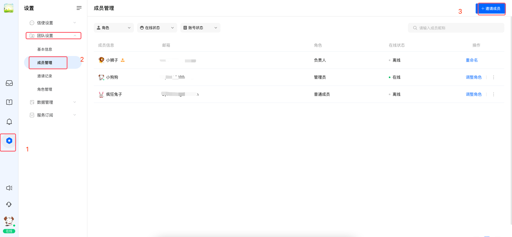

 
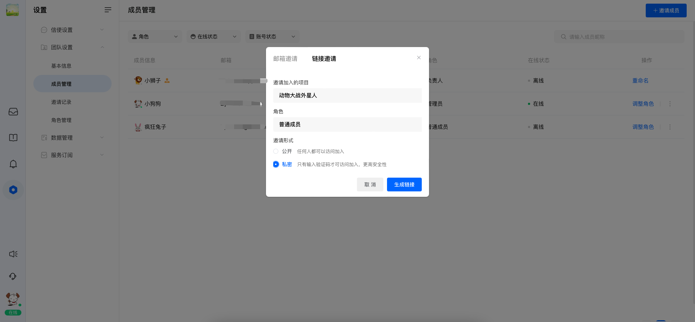

 
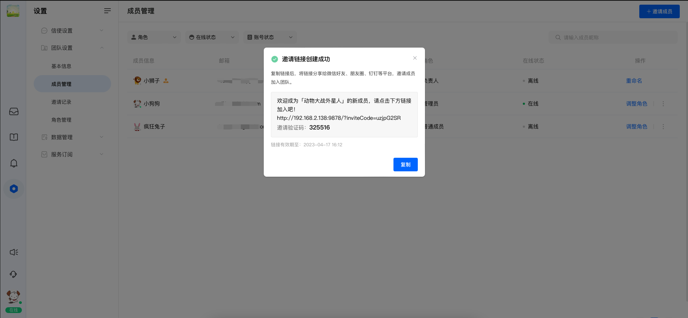

 您可以将邀请链接复制并发送给您的朋友、同事，邀请他们加入您的项目中。点击邀请链接之后，您可以看到如下场景：
 
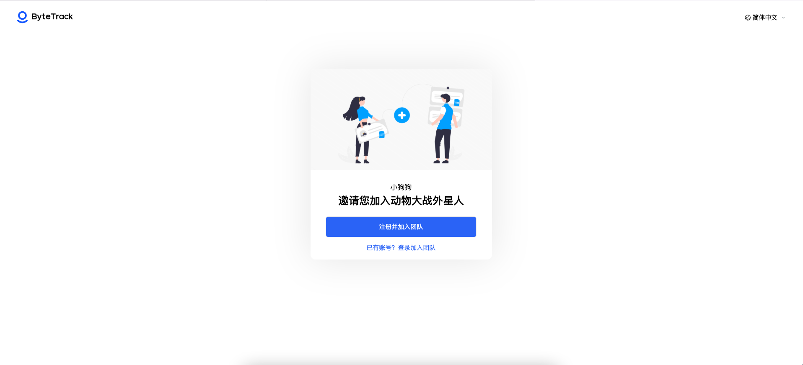

 被您邀请的成员，加入您的项目之后，您就可以在“团队设置--->成员管理”列表中，看到他们的信息。
 您可以在“成员管理”中，修改每个成员的昵称和头像，同时选择是否禁用和删除，如下图所示：
 
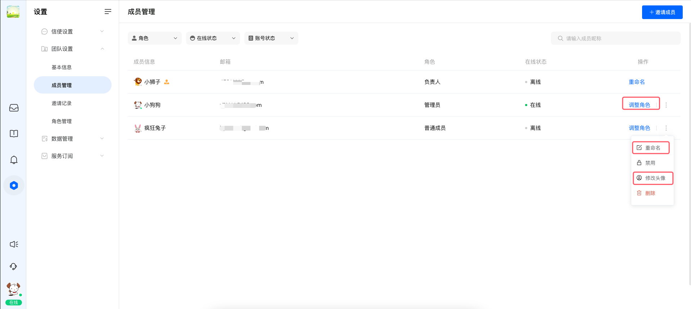

 👋👋👋注意：
1、被邀请的成员，和您一样，需要通过邮箱去创建ByteTrack的账号，
2、被邀请的成员，如果之前已经有ByteTrack账号，那么直接通过邀请链接登录，即可以自动加入您的项目中

## 7、分配权限
 您可以为您项目中的每位成员，分别分配不同的权限。举例：如果您希望您的客服之间，彼此看不到各自负责的聊天信息，那么可以在“团队设置--->权限管理”中进行设置。
 您可以创建一个角色，该角色的名字叫做“客服”，如下图所示：
 
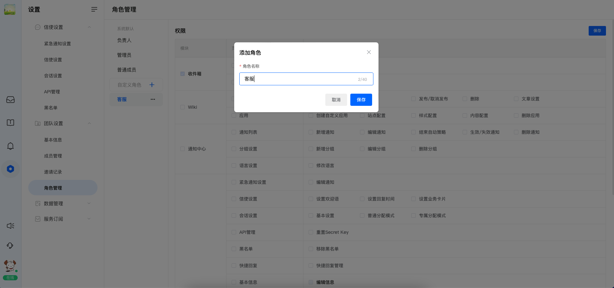

 点击“客服”，将右侧的权限全部取消，仅仅保留“收件箱”模块权限，完成之后点击“保存”。如下图所示：
 
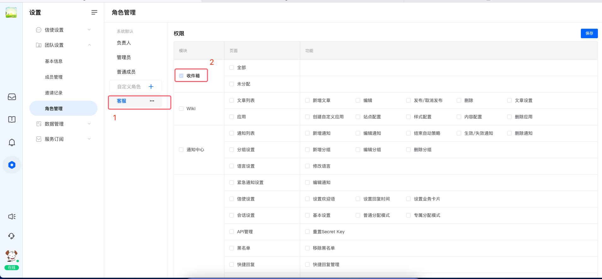
 
 回到“团队设置--->成员管理”页面，调整对应成员的权限，如下图所示：
 
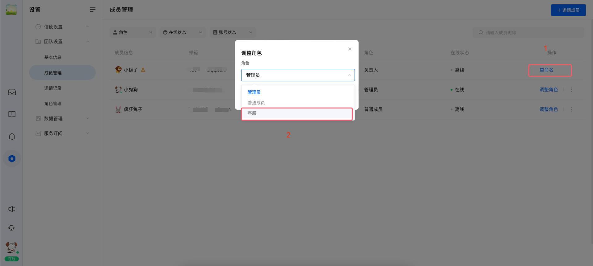

如此，对应成员登录系统，加入该项目之后，就仅仅可以看到属于他负责的会话信息，如下图所示：
 
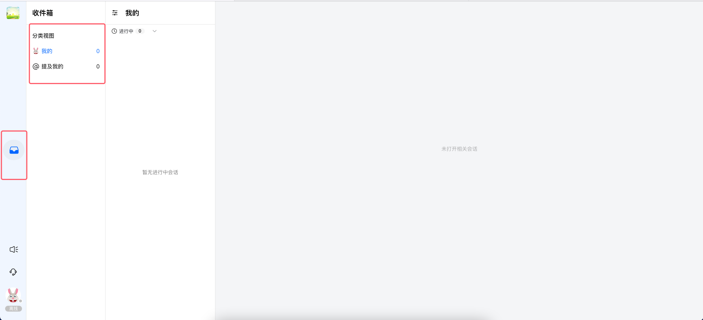
 
这样，您客服之间，就看不到彼此的聊天信息。

## 8、设置客服组
 👍👍👍恭喜，您已经完成了主要的设置。接下来，您只需要根据您的业务需求，设置不同的客服组，就可以正常使用ByteTrack的客服功能。
 您可以进入“设置--->信使设置--->会话设置”页面中，将“分配限制”设置为“不限制”，如下图所示：
 
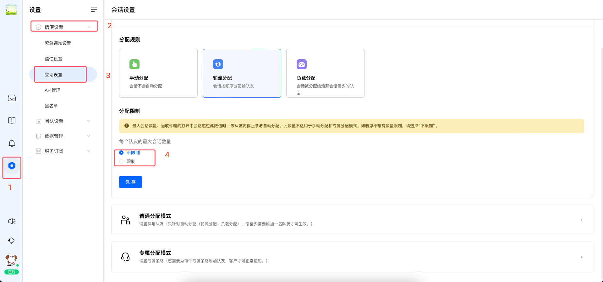

#### 8.1、普通匹配模式
 如果您只要普通的客服系统，您可以选择“普通分配模式”。
 将您组建好的项目团队，按照需求选择成员添加到分配队列中。
 添加到队列中的成员，在有客服消息过来时，会参与分配，并成为该会话消息的负责人。
 
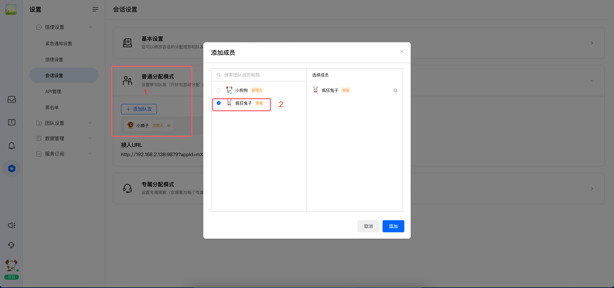

#### 8.2、专属匹配模式 
 如果您的业务系统中，存在多个客服入口，每个客服入口可以自动找到不同的客服去处理问题。
 那么您可以选择“专属匹配模式”。
 您可以结合您实际的业务量，自由创建专属客服组。每个专属客服组，都可以分别接入到您的业务系统中去，作为不同的客服入口。
 
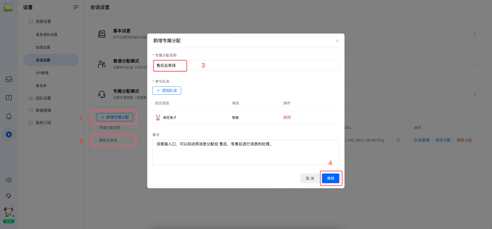

 👋👋👋注意：
1、如果您的业务系统中，不需要区分客服入口，那么使用“普通匹配”模式即可；
2、如果您的业务系统中，有多个客服入口，并且每个客服入口会将消息自动指派给不同客服，那么您需要使用“专属匹配模式”；

## 9、安装信使
 至此，您已经基本完成了所有必须的设置项。
 接下来，您只需要在您的业务系统中，安装ByteTrack的信使，就可以享受ByteTrack提供的服务！
 我们为您提供了三种安装方式：
- URL 接入方式
- 网页插件(JavaScript) 接入方式 
- SDK 接入方式
 您可以根据您的实际需求，自由选择。

#### 9.1、URL接入方式
 在“设置--->信使设置--->会话设置”页面，我们在每一种分配模式下，都提供了一个接入的URL。
 您可以直接将对应的URL链接，放入您的业务系统中，作为客服入口使用。
 
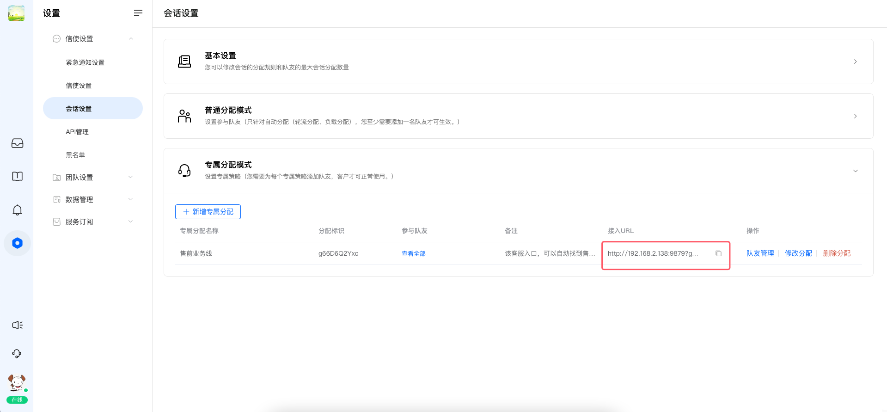

 
 👋👋接下来的内容，请让您的技术人员阅读，熟悉通过“客服URL链接”的方式，能够达成的效果。

##### 9.1.1、 支持多语言：
 如果您的业务系统，需要支持多语言客服，那么可以在获取到的“客服URL”中，拼接语言参数。
 语言类型支持：
 lang=zh_CN 简体中文
 lang=en_US 英文
 lang=zh_TW 繁体中文
 lang=ja_JP 日语
 lang=ko_KR 韩语
 lang=vi_VN 越南语
 lang=ms_MY 马来语
 lang=id_ID 印尼语
 lang=ru_RU 俄语
 lang=th_TH 泰语
 lang=mm_MM 缅甸语
 lang=la_LA 老挝语
 lang=fr_FR 法语
 lang=it_IT 意大利语
 lang=es_ES 西班牙语
 lang=de_DE 德语
 更多的语言类型，请参考 [信使语言编码](/8CTFE8cF/help/wikidetail?articleId=BQdUw3RYjj&usageCategoryId=593&usageGroupId=-1)
 使用如下：
 中文示例： http://192.168.2.138:9879/?appId=mXs634W&lang=zh_CN

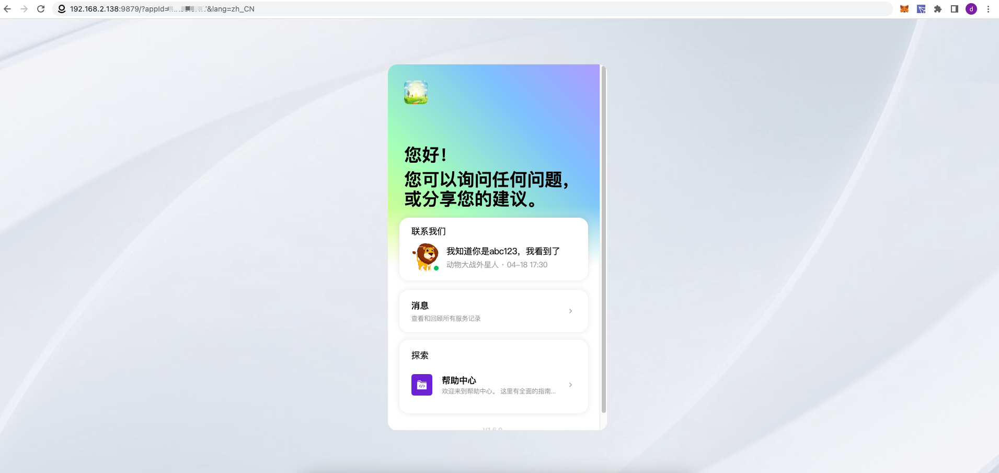

 英文示例：http://192.168.2.138:9879/?appId=mXs634W&lang=en_US

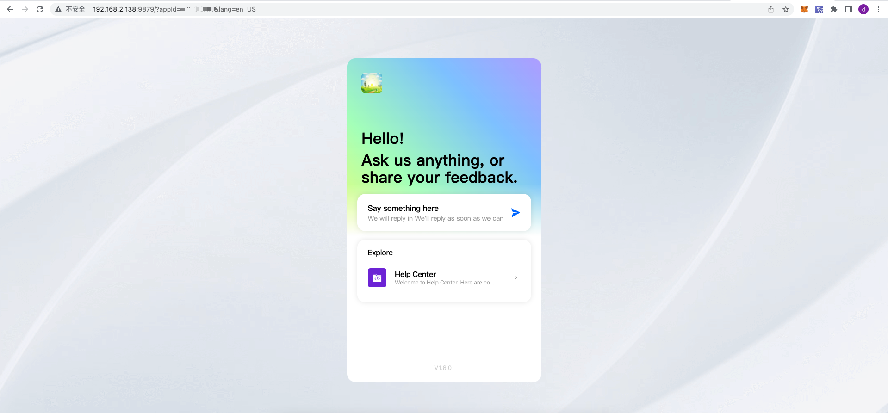

##### 9.1.2、 支持回调到源站点指定页面：
 如果您希望您的用户，在访问客服入口，和您进行沟通之后，能够方便的从客服退出到您的业务系统。那么您可以在获取到的“客服URL”中，拼接redirectUrl参数来实现：
 使用示例： http://192.168.2.138:9879/?appId=mMderAW&redirectUrl=http://192.168.2.138:8877/mMderAW/setting/intercome/chat 
 其中“ http://192.168.2.138:8877/mMderAW/setting/intercome/chat ”是您关闭客服，想要到达的页面地址
 注意：
 1）如果“客服URL”中，携带redirectUrl参数，那么通过“客服URL”访问的客服页面，将携带“关闭”按钮；
 2）如果“客服URL”中，不携带redirectUrl参数，那么通过“客服URL”访问的客服页面，没有“关闭”按钮；
 3）redirectUrl的参数需要通过urlencode进行编码（urlencode编码，请让您的技术自行实现）；
 4）当然，是否使用该参数，取决于您自己的实际需求；
 使用redirectUrl参数效果，如下图所示：
 
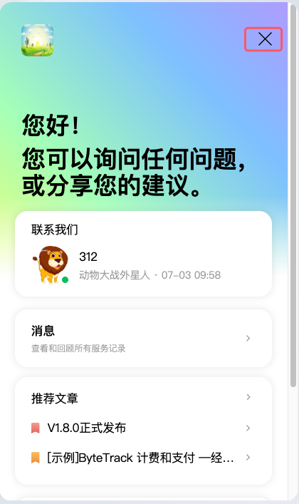

##### 9.1.3、 支持携带业务系统中的UID：
 如果您的客服消息，需要能够携带该用户在您业务系统内的UID，那么也可以在获取到的“客服URL”中，拼接UID参数来实现：
 使用示例：http://192.168.2.138:9879/?appId=mXs634W&lang=zh_CN&userId=abc123
 其中“abc123”是用户在您业务系统重的唯一身份标识，可以是账号，手机号，等等。这个数据从您的业务系统重获取，并且需要满足数字或者英文字母，不可以直接使用汉字。
 👋👋👋注意：
 1）如果携带了该参数，ByteTrack会依赖该参数的内容进行会话筛选，将所有由“userId = abc123”发起的会话，全部展示给用户。
 2）userId的所表示的用户标识，请尽量复杂且无序，应当避免被轻松猜测出来。参考建议：使用“账号-手机号”的形式，或者“账号-注册时间”的形式。(注意：请不要使用“+”)
 3) 从数据安全性的角度上考虑，请您的技术，在生成userId这个参数的时候，保持充分的复杂且无序，避免被轻松的猜测出来。如果这个参数设计的过于简单，而导致被其他人轻松猜测出来，这样其他人会看到不属于其的对话信息。从而造成的影响，ByteTrack将不为此承担任何责任！

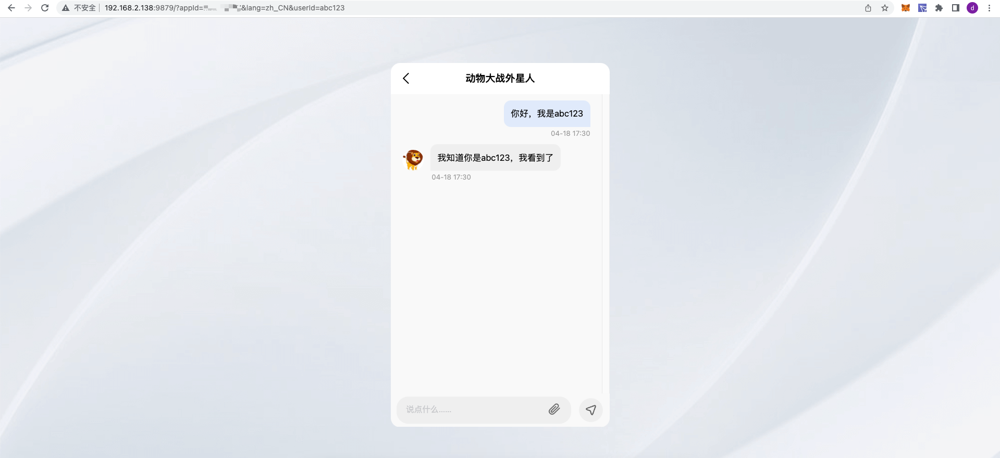

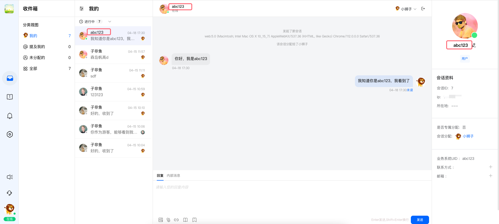

##### 9.1.4、客服URL重定向：
 通过“客服URL链接”的方式接入，确实很方便，不过这样也带来随意打开多个浏览器窗口的问题。为此，我们强烈建议您的技术人员，在您业务系统重接入“客服URL链接”时，采用重定向的方案。
 窗口重定向示例： 
 客服入口1：
window.open("http://192.168.2.138?groupId=g44DfQ213&appId=mD4ud2", "windowName");
 客服入口2：
window.open("http://192.168.2.138?groupId=123JDert34&appId=mD4ud2", "windowName");
 其中“windowName”标识的是浏览器窗口的名字，如果窗口存在，则会直接刷新，不会重新打开新的浏览器窗口。

#### 9.2、SDK 接入方式
 具体的SDK接入方式，请参考本文开始处的“开发者中心”地址

#### 9.3、网页插件 接入方式
 具体的网页插件接入方式，请参 [网页插件接入指南](/8CTFE8cF/developers/wikidetail?articleId=GJC2Pf0mKe&usageCategoryId=725) 
👋👋👋注意：
1、URL方式接入，方便快捷，能够具备自动升级和更新的能力。ByteTrack每次版本升级，您都无需重新接入；
2、URL方式接入，上述展示的四个功能，在“普通匹配模式” 和 "专属匹配模式"的链接，都能够支持；
3、网页插件方式接入，其本质上是使用JavaScript代码，将我们的sdk进行了一次包装，便于您的技术人员使用。ByteTrack每次版本升级，您都无需重新接入；
4、SDK方式接入，是将SDK依赖到您项目本地进行编译，所以无法自动升级。在ByteTrack后续大版本升级之后，您需要让您的技术人员，更新sdk版本，否则ByteTrack的新功能可能无法使用。

## 10、最佳实践
 👍👍👍恭喜，您已经完成了所有设置和信使的安装，接下来即可使用ByteTrack的客服功能。
 在正式使用ByteTrack之前，我们向您提供一些最佳实践方案，以帮助您更好的改善客服系统的使用体验。
1、保持客服在线
 请保持客服在线，这样才能更有效的分配会话，并且为您的用户提供更加及时的服务。
 您可以点击左下角的个人头像，然后切换您的工作状态。

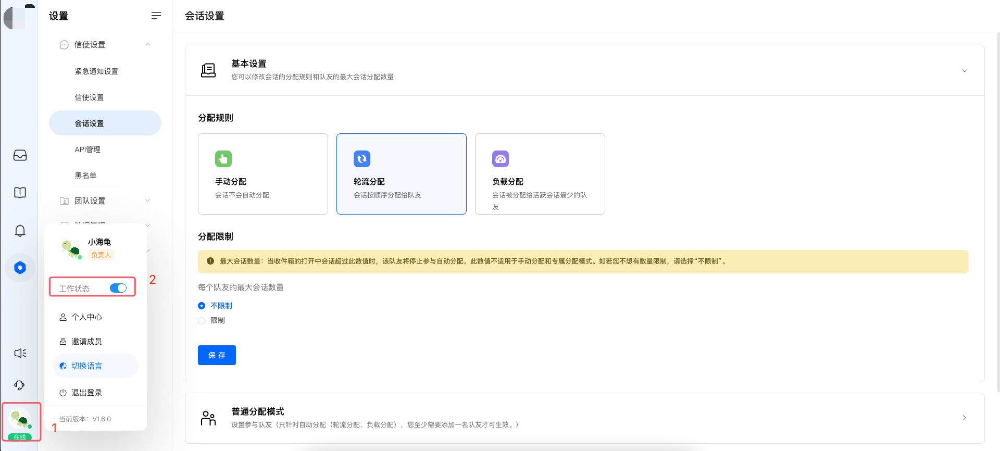

2、及时关闭会话
 客服在处理完一个会话咨询时，建议客服及时将该会话关闭，这样整个系统会更能区分有效会话和结束会话。
 
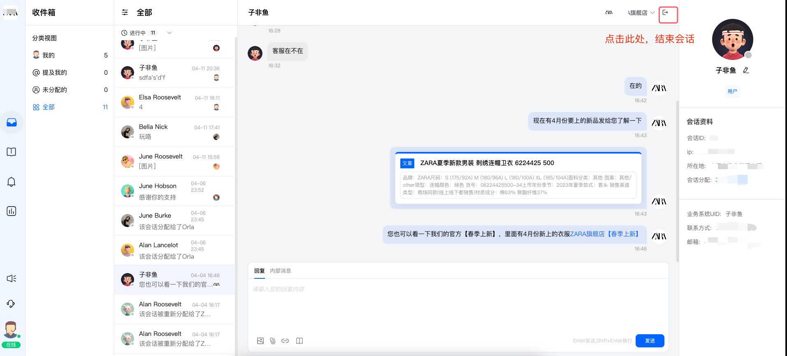

 客服的最大会话承载量是可以设置的，在“信使设置--->会话设置”页面中，如下图所示：
 
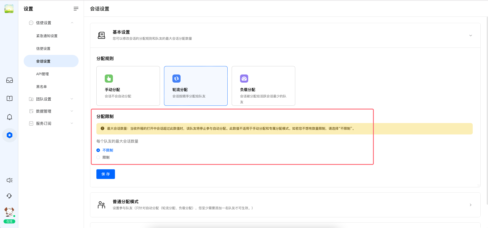

 状态为“进行中”的会话，都会算作客服的会话承载。如果客服的会话承载达到设置的数据，那么我们认为该客服将不再适合处理新的会话，所以该客服也将不再参与会话的分配！
 👋👋👋注意：该参数系统默认为不限制。如果您限制改参数，那么请一定要让客服及时关闭已经处理完的会话！
