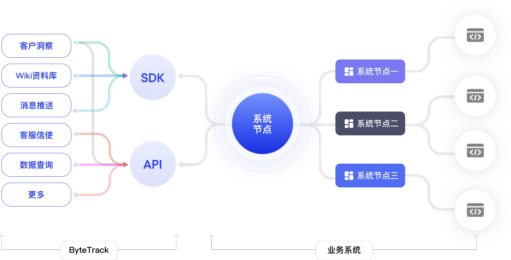
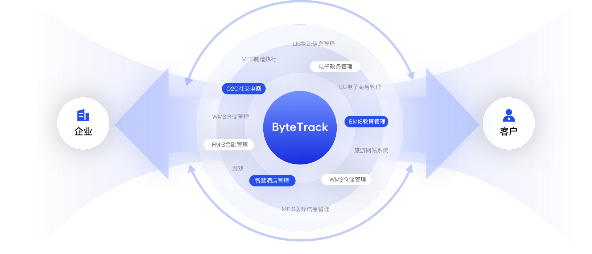
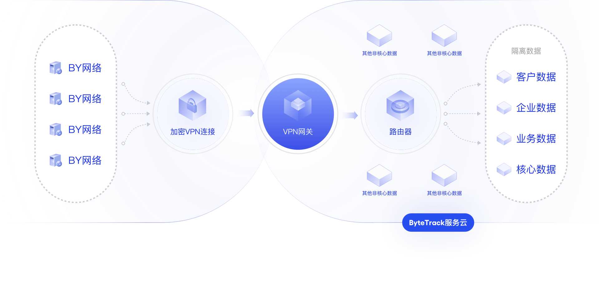
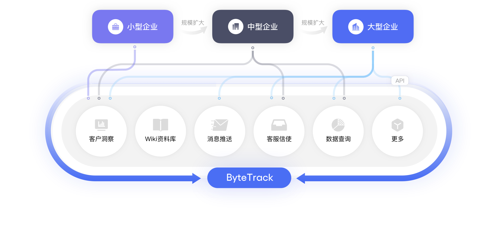
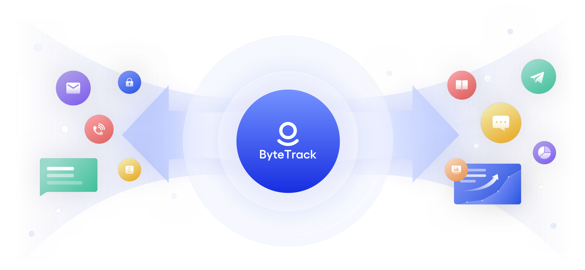
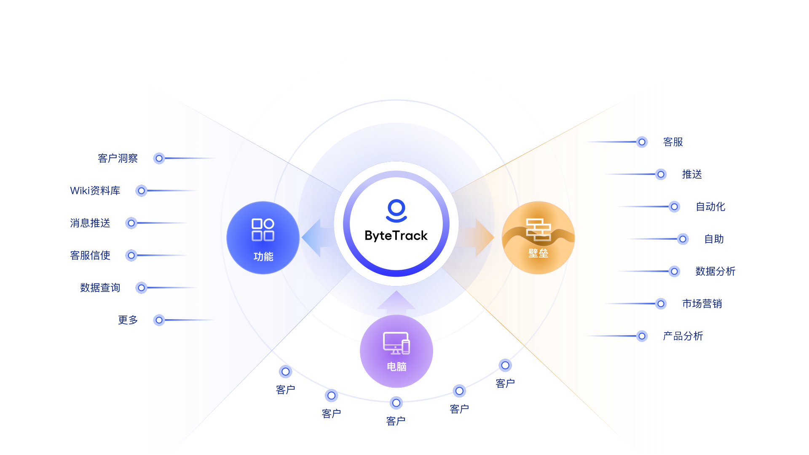

# 什么是ByteTrack？

> 分类:01-开始 | articleId:2BjpId9xVj | 描述:ByteTrack的工作原理，它可以为您做什么，以及它与其他竞品的不同之处。

第一次来这里？还不知道ByteTrack是什么？让我们从这里开始，了解ByteTrack从销售和营销，到客户参与和客户支持，如何向您提供服务。
ByteTrack是简约且高效的SaaS系统，聚焦您的企业和用户之间的互动，通过简约且有效的服务，助力您打造完美的客户体验，协助您培养全周期客户，并为您挖掘、创造更多的客户价值。
 
欢迎您的加入我们很高兴您决定试用ByteTrack。这里将是您了解ByteTrack如何帮助您打造卓越客户服务体验的正确场所。
我们知道您想要问的问题。因此我们在这里为您编制了几个问答列表，您可以查看它们来解决您的困惑。如果还有其他问题，您也可以联系我们商务，请他们向您解答。
● 什么是ByteTrack？
● 谁使用ByteTrack？
● 为什么选择ByteTrack？
● ByteTrack适合我吗？
● 我可以用ByteTrack做什么？
● ByteTrack如何帮助我？
● 我应该从哪里开始上手？
什么是ByteTrack？ ByteTrack是简约且高效的SaaS系统，聚焦您的企业和用户之间的互动，通过简约且有效的服务，助力您打造完美的客户体验，协助您培养全周期客户，并为您挖掘、创造更多的客户价值。
 ByteTrack提供丰富且易用的服务集合，您可自由组合需要的服务。通过低代码、非侵入的方式将ByteTrack轻松接入业务系统中，即可以通过极易上手的功能，来为用户提供完美的服务体验。
最终，您可以达到的理想状态是：
•让您比客户自己更了解他们的想法，并能持续向客户提供更好更人性化的服务。
•构建夯实的数据根基，让数据驱动全场景的业务分析与决策。
•自动绘制企业专属的用户画像，以及统一的用户ID体系，并实时更新。
•自动化提效：
 ◦可视化策略，自动实现全渠道用户主动触达与互动；
 ◦机器学习，自动识别客户沟通中的潜在需求或痛点；
•沉淀的内容和方法，全面融入战略、流程、组织和绩效等体系，并成为企业核心竞争力的一部分。
•彻底释放业务周边系统的研发精力，企业更加专注于业务本身。
ByteTrack是一个即懂企业，也懂企业的客户，即会营销，也会客户体验的平台；它赋予了每个中小型企业培养终身客户的超能力。
 
谁使用ByteTrack？1. 销售团队：想要与其网站上的访问者交谈，以回答他们的问题并帮助他们成为客户；
2. 产品团队：寻求产品反馈并深入了解用户如何使用他们的产品；
3. 营销团队：希望根据用户的行为在正确的时间向正确的用户发送有针对性的消息；
4. 支持团队：需要比电子邮件更智能的解决方案，以便为其客户提供更好的支持。
5. 客户成功团队：需要一个简单的 CRM 来提供实时用户数据和直接、个性化的沟通。
 
为什么选择ByteTrack？1. 开箱即用，小白也能快速上手。市面上已有的客服系统体量太重，使用太复杂。ByteTrack是微服务插件，即插即用，即关即拔，让企业高效开展业务。

2. 非侵入性对接，无论业务形态如何，均不触碰业务，聚焦企业体验，全程陪伴企业培育终身客户。

 
3. 隐私性强，多种部署方式，数据全隔离，不用担心客户和企业数据的泄露。

4. 业务扩展性强，能满足企业在规模扩大过程中，对业务越来越高的精细化分析。

5. 专业性强，但使用简单。ByteTrack为企业提供了不同行业的专业性分析模板，和营销模板。

6. 服务集选配。ByteTrack在客服、推送、自动化、自助服务、数据分析、市场营销等多方面覆盖，将商业和市场活动中需要的工具全融合，让企业不再需要单独对接，同时扫除了不同工具之间的壁垒，让工具之间互相配合，满足所有中小型企业的需求，达到1+1远远＞2的效果。

ByteTrack适合我吗？如果您有任何问题想要得到解答，请加入我们，并评估ByteTrack 是否适合您的业务。
 
我可以用ByteTrack做什么？如果您有一个网站或基于网络的产品，在桌面和/或移动设备上，您可以使用ByteTrack来：
1. 查看您的客户是谁以及他们做什么：跟踪、过滤和细分每个客户；
2. 转换：自动从您的网站获得更多潜客。使用机器人来筛选、路由和安排一对一沟通，并与您的最佳潜客实时聊天；
3. 参与：通过有针对性的电子邮件、聊天、帖子和移动推送消息，将更多的注册用户转化为活跃的、有价值的客户；
4. 支持：使用电子邮件和消息传递来获得更快的响应、更快的解决方案和更满意的客户；
5. 提供自助服务支持：创建和共享内容以帮助人们更好地了解您的产品并更快地获得答案。
所有 ByteTrack 产品都建立在 ByteTrack 平台上，您可以通过该平台了解您的用户和访问者是谁，以及他们在您的应用程序和网站上做了什么。
 
ByteTrack如何帮助我？ByteTrack在客服、推送、自动化、自助服务、数据分析、市场营销等多个方面打造服务集合，帮助企业打造完美体验。
•信使（Message）：可以让团队在会话前5秒了解客户的来源、信息、属性、购买历史、人际关系…了解客户的难点和想法；
•信息推送（Outbound）：在每个客户的生命周期全阶段，自动执行销售外展，在合适的时机向客户发送个性化、高效率的相关推送服务，提高客户归属感；
•Wiki资料站（Wiki）：实现客户在应用内快速自助，并能在客户生命周期的关键阶段主动吸引客户。不光提供顺滑且丰富的阅读体验，还能渗透到客户旅程的任意角落，全旅程陪伴客户；
•数据查询（Market）：按行业按模板提供各类指标数据，并提供营销自动化，在释放企业营销压力的同时，帮助企业纠正营销策略，最快培养终身客户；
•客户洞察（Insight）：打通多源数据，识别唯一客户，并通过标签快速圈定目标人群，实现客户群体的洞察和细分；
封测版本主要实现的是Message、Wiki的部分功能。其他系统敬请期待。

ByteTrack非常适合多种规模的企业，并提供可自由组合的插件式服务来帮助您的团队：
•聚合和帮助管理来自多个渠道的会话
•为服务团队提供重要的客户环境
•使领导者能够更好的管理流程、解决瓶颈并大规模提高效率
•通过知识库不仅帮助客户即时找到答案，还能助力企业服务客户。

ByteTrack能满足企业在规模扩大过程中，对业务越来越高的精细化分析。例如：小企业只需Message即可开展业务，随着企业的扩大，ByteTrack提供不同行业的模板和指标数据，助力企业精细化营销开展。随着企业的进一步扩大，ByteTrack可通过API提供数据查询和分析，供企业自主使用。
 
我应该从哪里开始上手？想了解产品如何使用？请点击
[帮助中心](https://docs.bytrack.com/8CTFE8cF/help)
想了解产品如何接入？请点击
[开发者中心](https://docs.bytrack.com/8CTFE8cF/developers)
想了解ByteTrack的理念？请点击
[ByteTrack学院](https://docs.bytrack.com/8CTFE8cF/academy)
