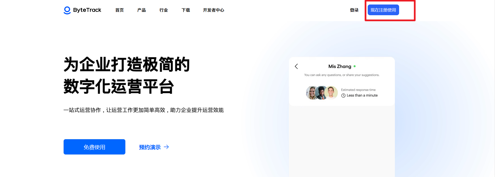
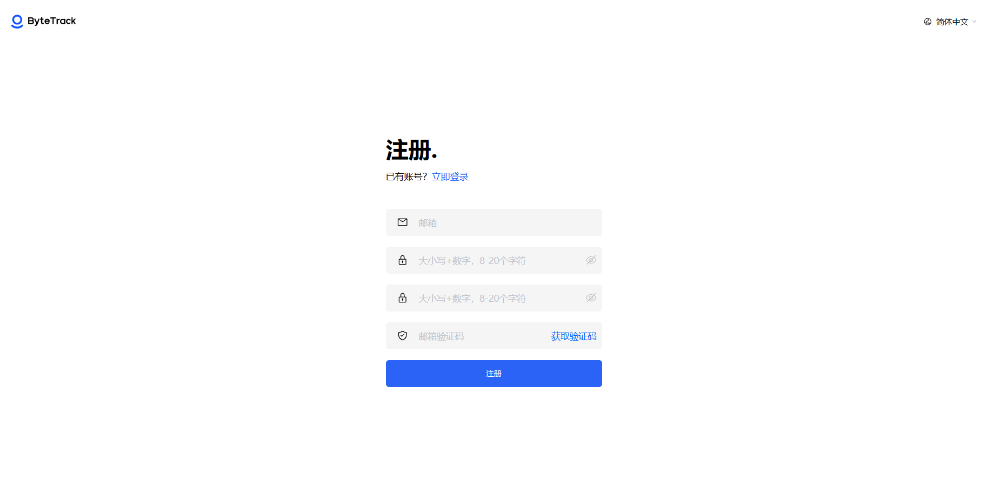

# 使用ByteTrack，请从这里开始

> 分类:01-开始 | articleId:8Bfpv4yoq0 | 描述:

如果您是新用户，请准备开始使用我们的ByteTrack迈出第一步 ——这将是一个完美的起点！在您阅读了这篇文章后，您将立即使用ByteTrack的服务！
在本文中，您将学习：
● 如何创建账户
创建账户您可以在我们的官网上创建一个账户。现在将带您进入注册流程。
在官网的右上角，点击“现在注册使用”，

打开注册页面，并使用邮箱注册账号。

ByteTrack目前只支持邮箱方式注册和登录。
注册成功后，会自动登录系统，就可以创建项目了！
现在让我们继续吧👇 
[创建项目](https://docs.bytrack.com/8CTFE8cF/help/wikidetail?articleId=bPFc7qYx93&usageCategoryId=418&usageGroupId=807)
[在您的产品中安装ByteTrack](https://docs.bytrack.com/8CTFE8cF/help/wikidetail?articleId=kHOTrBsqa4&usageCategoryId=418&usageGroupId=807)
