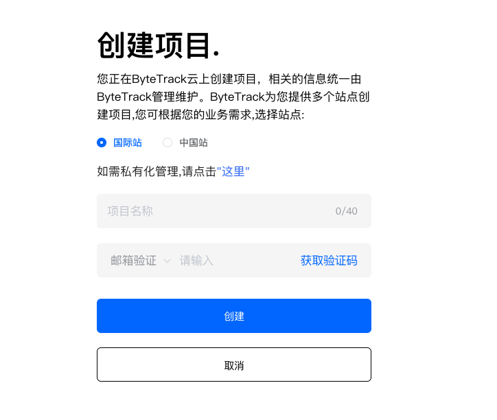
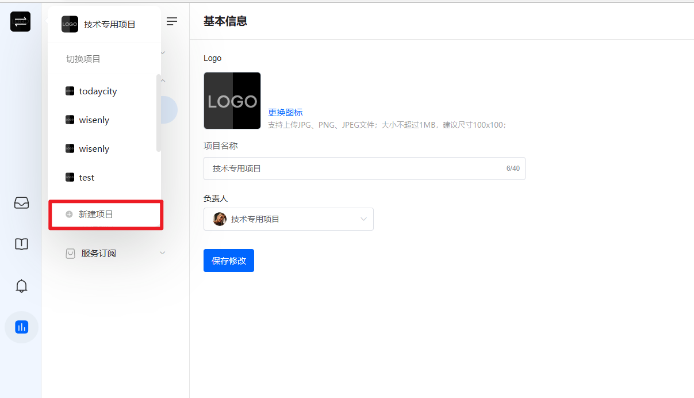
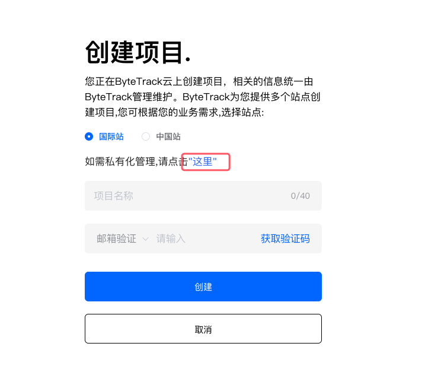
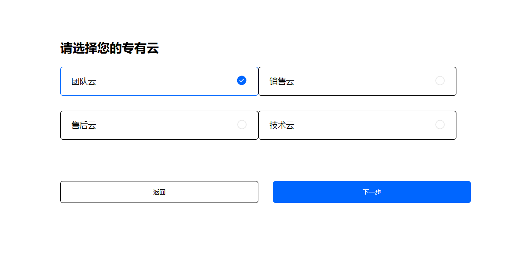
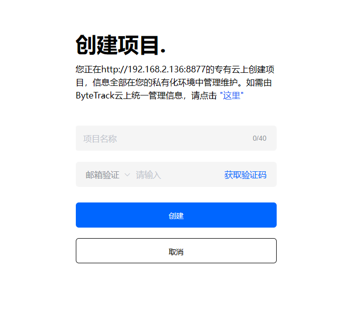
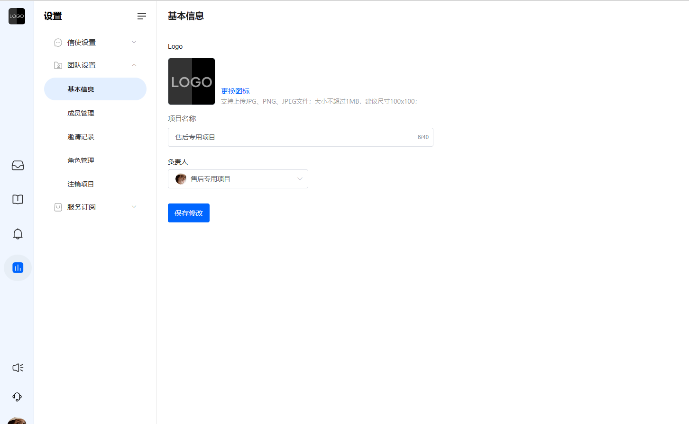
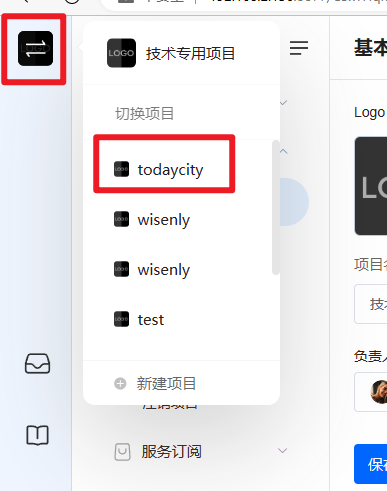

# 创建项目

> 分类:01-开始 | articleId:bPFc7qYx93 | 描述:

第一次注册使用，还未创建过任何项目，ByteTrack会自动引导您进入创建项目页面，如下图：

如若您已经拥有了项目，您也可以创建新的项目，创建入口如下：

创建项目有两种方式：ByteTrack云上创建项目、专有云上创建项目；
ByteTrack云创建项目您在ByteTrack云上创建项目，您的数据将存储在ByteTrack云上，统一由ByteTrack管理维护。
ByteTrack深知客户信任和数据安全，对我们在ByteTrack所做的一切都至关重要，因此ByteTrack通过各种方式确保每一位客户的数据安全。
ByteTrack云拥有 “中国站” 和 “国际站”两个站点，您可以结合您自己业务系统的实际需求，进行站点的选择。参考的选择方式如下：
1，如果您业务系统是面向国际，比如：东南亚、欧美等地区，那么建议您选择 “国际站”；
2，除上述情况之外，那么建议您选择“中国站”；
接下来，
创建项目时，需要进行验证码校验，等校验完毕，您的项目就创建成功啦🍻
项目创建成功后，会自动进入该项目的使用页面。订阅成功后，就可以安装ByteTrack的信使使用啦~

专有云创建项目您也可以在专有云上创建项目，实现项目及数据的私有化管理。
注意：如若您还没有专有云，需要先在ByteTrack云上创建项目，并联系您的商务经理进行专有云环境的部署。
当您有了专有云时，就可以点击相关的入口，进入专有云列表了。

专有云列表如下图：

选择您想部署的专有云，点击“下一步”，就可以创建私有化的项目了，如下图：

如若您想放弃在专有云环境下创建项目，点击页面上的“这里”，就可以切换回ByteTrack云上创建项目了。
专有云项目创建完毕，会自动进入该项目的基本信息设置页面，如下图：

您可为您的项目设置LOGO、名称，并进行服务订阅。订阅成功后，就可以安装ByteTrack的信使使用啦~
切换项目环境当您拥有多个项目时，您可以切换不同的项目进行使用。切换入口如下：

注意：项目方APP中可以切换项目，但不可创建项目，我们建议您在web端创建好项目后，在APP端使用；
👋项目创建成功后，您就是该项目的负责人了，拥有最高的使用权限。您也可以转让负责人，或者将其他的队友拉进您的项目中👇 
[为您的项目团队邀请其他队友](https://docs.bytrack.com/8CTFE8cF/help/wikidetail?articleId=a9PxDyP8Wg&usageCategoryId=493&usageGroupId=955)
[为您的项目团队设置角色权限](https://docs.bytrack.com/8CTFE8cF/help/wikidetail?articleId=KxuUQdgMrf&usageCategoryId=493&usageGroupId=956)
