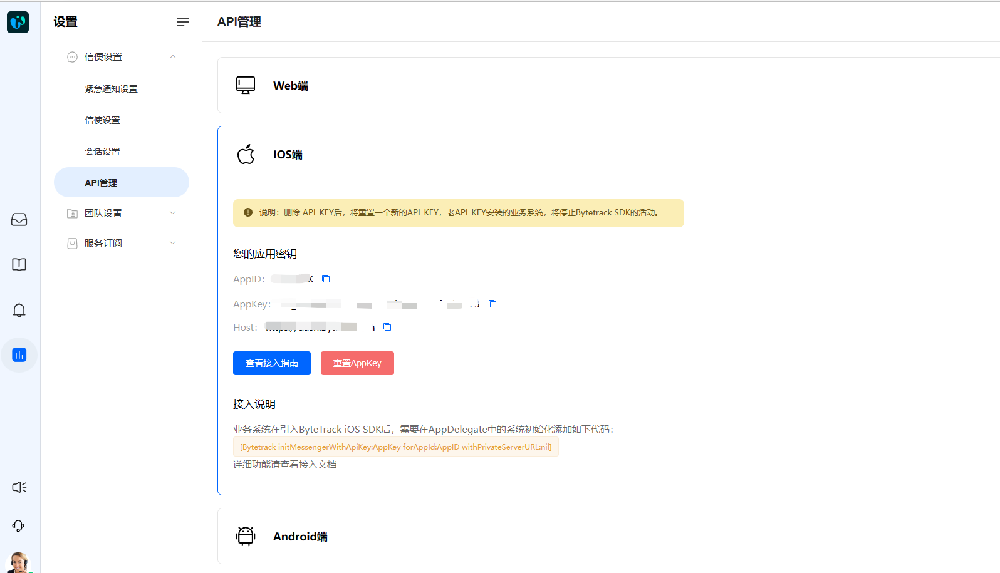

# 在您的产品中安装 ByteTrack 

> 分类:01-开始 | articleId:kHOTrBsqa4 | 描述:安装 ByteTrack 并通过信使与您的用户进行会话。

要在您的网站上安装ByteTrack的信使，请访问我们的开发者中心. 您会在那里找到为您推荐的安装方法。
安装ByteTrack时需要APP_ID，您可以登录ByteTrack后，在API管理中找到它们：设置-->信使设置-->api管理。

详细安装步骤，请参见[开发者中心](https://docs.bytrack.com/8CTFE8cF/developers)
👏👏👏ByteTrack安装好后，那么就让我们继续吧👇
[开始处理会话](https://docs.bytrack.com/8CTFE8cF/help/wikidetail?articleId=JcmVXIy60o&usageCategoryId=418)
