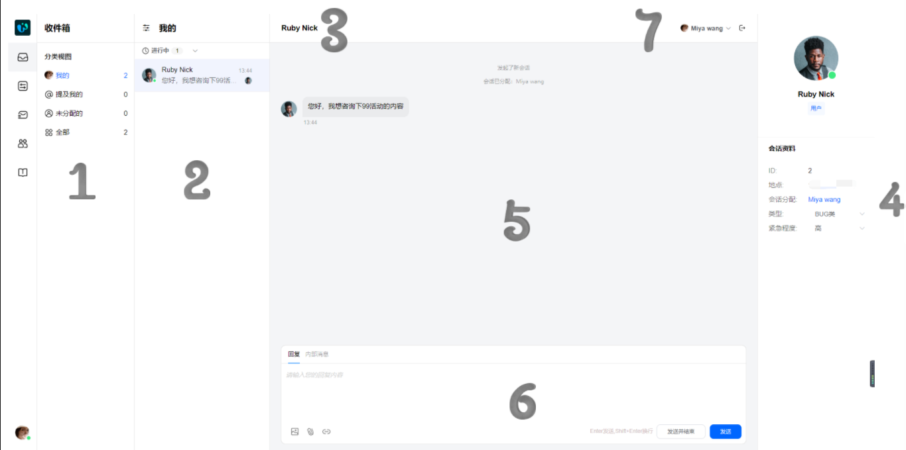
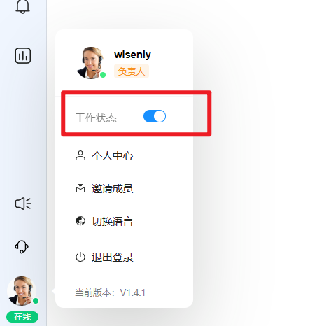
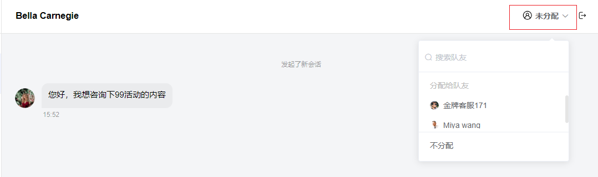
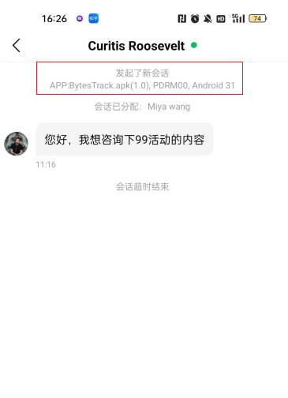
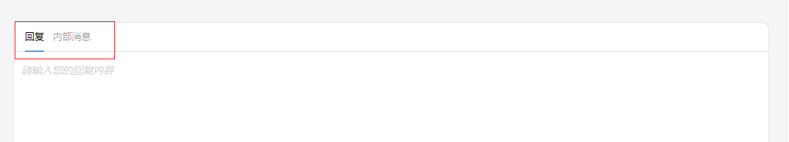
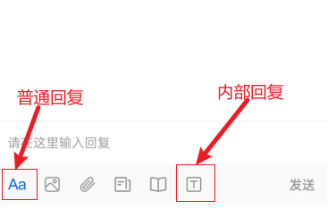
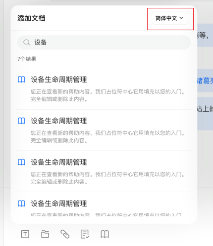
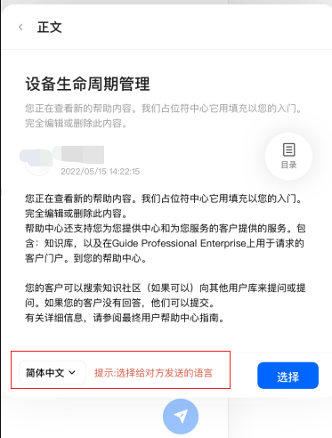
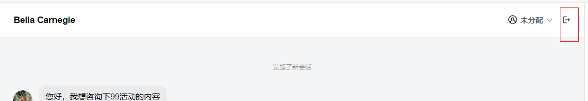
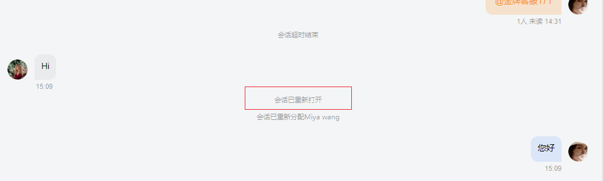

# 开始处理会话

> 分类:01-开始 | articleId:JcmVXIy60o | 描述:什么是会话？怎么处理会话？

什么是会话？ByteTrack中的会话为您提供了以高效和可扩展的方式支持客户所需的一切，同时能保持个性化。当有客户通过信使向您写信时，你们的会话感觉就像每天使用的聊天程序一样自然顺畅。
什么是收件箱？使用收件箱，您可以为您的用户和访问者提供简单、及时和个性化的支持。ByteTrack为您的团队提供了一套可以像处理传统工单一样处理会话的功能，同时还能保证客户的个性化体验。
团队收件箱易于快速阅览，可帮助您查看正在等待回复的客户，以及有多少客户正在和团队沟通。会话列表显示客户的最后一条消息。

1.分类试图。ByteTrack提供了5种会话试图，说明如下：
 a.我的：分配给当前登录队友的会话；
 b.提及我的：未分配给当前登录队友，但是消息中有其他队友@当前登录队友的会话；
 c.未分配的：还未分配给任何队友的会话；
 d.全部：全部会话；
2.会话列表。某个分类试图下的会话列表。会话列表中的会话按照最新消息的倒序排列。同时在列表中会有如下体现：
 a.客户当前是否在线；
 b.最后一条消息内容、消息发送者、消息发送时间；
 c.客户的头像和名称；
说明：客户的头像和名称随机生成。
3.客户名称
4.会话的ID和数据属性。会话ID是会话的唯一且不变的标识符。
5.消息区。消息区显示了该会话的所有消息。ByteTrack提供了团队服务客户的方式。消息区会显示所有队友和客户的消息。
6.回复区。队友用于回复会话的位置。回复方式分为普通回复、内部回复。
 a.普通回复：回复的消息客户可见。默认为普通回复方式。
 b.内部回复：回复的消息，只有团队内部可见，客户不可见。点击“内部消息”可切换到内部回复方式。
7.会话的操作区。操作区包括：分配队友、结束会话。
设置您的在线状态在线状态是您参与自动分配的前提。设置的位置如下：

当您处于离开状态，请不要忘记切换您的在线状态为：离开。

如何收到分配的会话会话分配规则包括：自动规则（包括轮流分配、负载分配）、手动规则。

## 自动规则
自动规则下，需要确保您满足：
1.状态在线；
2.收件箱“我的”视图下进行中的会话数量，少于您设置的分配限制，即确保您服务中会话数量没有达到最大限制。

## 手动规则
手动规则下，需要您在“未分配的”视图下，手动分配会话给自己，或者主动回复会话。
1.手动分配会话。在会话右上角的操作区，您可以选择将会话分配给其他人或者您自己。如下图：

2.主动回复会话。ByteTrack的机制，当有队友回复了未分配的会话，即表示该队友主动分配了该会话。

## 等待队列的会话
自动规则下，当所有队友的服务中会话数量都达到最大限制时，新的会话会自动进入等待队列。等待队列中的会话有两种处理方式：
1当有队友的服务中会话少于最大限制时，等待队列中的会话继续被自动分配。
2您在“未分配的”视图下，将会话手动分配给自己或其他队友；
3您主动回复了该会话。
创建会话当有客户点击信使的“聊点什么吧”并发送消息，会立即创建一条进行中的新会话。同时ByteTrack会跟踪客户的具体位置。如下图：

格式说明：
APP端信使发送会话为：APP名称（版本号），手机名称，手机版本号；
PC端信使发送会话为：页面URL、浏览器名称（版本号）、操作系统。
回复会话PC端在回复区点击“回复”、“内部消息”来切换普通回复、内部回复。如下图：

APP端在回复区点击如下图标来切换普通回复、内部回复。如下图：

ByteTrack支持的消息类型包括：文本、图文、附件、wiki文章。
注意：只有PC端支持图文混排方式回复。
回复wiki文章时，您可以根据语言项筛选想要的语言。如下图：

发送文章时，您可以选择想要发送的文章语言。如下图：

结束会话结束会话有以下几种方式：
1.您手动结束；
您可在会话操作区点击“结束会话”，如下图：

2.等待会话自动结束；
会话一旦达到设置的保持期，会话将自动结束，释放队友的服务能力。
3.客户手动结束。
信使端客户在沟通结束，也可以手动选择结束会话。
重新打开会话当客户在已结束的会话中继续回复，则会自动重新打开会话；会话记录显示如下：

如若您设置的分配规则为自动分配，则重新打开的会话将重新参与自动分配。
注意：队友在已结束的会话中继续回复，不会改变会话的已结束状态。
👏👏👏现在您已熟练处理会话，那么就让我们探索其他的吧👇
[选择合适的会话规则](https://docs.bytrack.com/8CTFE8cF/help/wikidetail?articleId=aa6hrkfhe5&usageCategoryId=418&usageGroupId=808)
[为信使设置紧急通知](https://docs.bytrack.com/8CTFE8cF/help/wikidetail?articleId=k8mnDbbsLL&usageCategoryId=418&usageGroupId=808)
