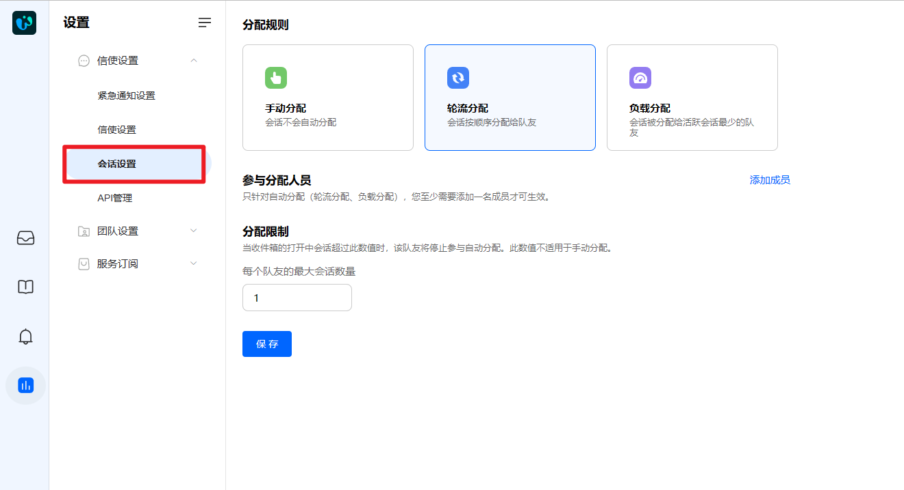
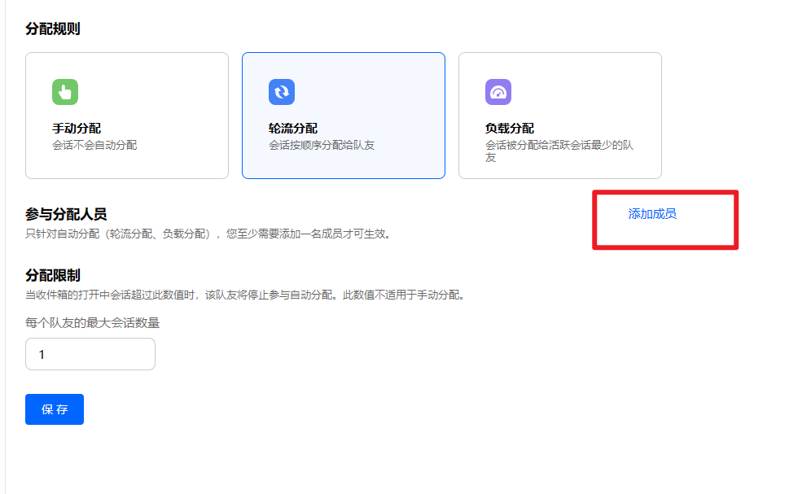
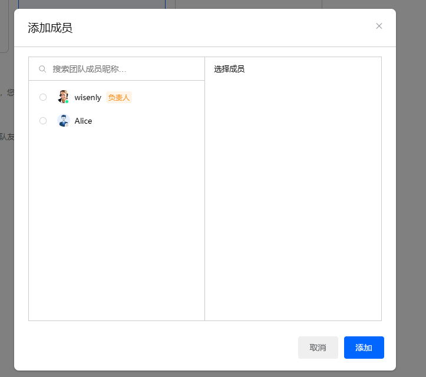

# 选择适合的会话规则

> 分类:01-开始 | articleId:aa6hrkfhe5 | 描述:

您可以登录ByteTrack进行会话设置，以适应您的实际业务需求。入口：设置→会话设置。

分配规则ByteTrack针对会话提供了三种常用的分配规则：
● 手动分配：会话不会自动分配给某个队友，需要队友主动认领，或者其他队友指派。
您希望根据业务的重要性分配给不同的队友跟进时，可以选用此方式。
所有会话都进入“未分配”的收件箱，队友可以主动认领会话，也可以手动分配给指定的其他队友。
● 轮流分配：按顺序分配给在线的队友，这种方式不会考虑队友当前的会话量。
您希望团队在队友之间平均分享新的客户时，可以选用此方式。
● 负载分配：会话将首先分配给进行中会话量最少的队友，这种方式有助于让团队公平的分配会话量。
如果您的团队处理大量会话，整个团队的工作量会很快变得不平衡和杂乱无章。通过负载分配，您可以确保工作负载在队友之间公平分配。
说明：系统默认设置为“轮流分配”。
参与分配的队友确定好分配规则后，您可以配置需要参与分配的队友。页面如下：

并在弹框中选择需要参与的队友即可，如下图：

注意：参与分配人员是点击“添加”后实时保存，删除分配人员也是实时保存，不需要额外点击页面的“保存”按钮。

分配限制

为了防止您的队友高负荷工作，您可以设置每个人同时最多服务的会话数量。当队友达到他们的分配限制时，系统将不再自动分配会话给该队友，直到他同时服务的会话数量低于分配限制，才可继续参与自动分配。
说明：同时服务的会话数量，只统计已经分配给他，且在进行中的会话数量，不包括已结束的会话数量。

👏👏👏现在您已初步设置了信使，那么就让我们继续吧👇
[开始处理会话](https://docs.bytrack.com/8CTFE8cF/help/wikidetail?articleId=JcmVXIy60o&usageCategoryId=418&usageGroupId=808)
[为信使设置紧急通知](https://docs.bytrack.com/8CTFE8cF/help/wikidetail?articleId=k8mnDbbsLL&usageCategoryId=418&usageGroupId=808)
