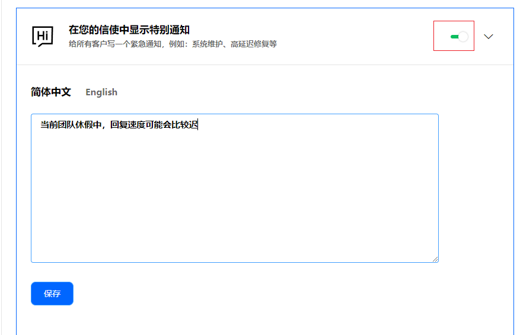

# 紧急通知设置

> 分类:01-开始 | articleId:k8mnDbbsLL | 描述:

您可以设置一个紧急通知，当客户打开信使的时候，会立即看到紧急通知的内容。我们建议以下情况设置紧急通知：
- 团队休假这类会影响您回复速度的；
- 系统维护这类会导致大批量客户联系团队的；
您可以针对单个语言环境设置紧急通知，其他语言环境下不输入即可。
您也可以快速关闭紧急通知，点击右上角的开关即可。
紧急通知设置的入口：设置→信使设置→紧急通知设置。

注意：您可以对单个语言下的紧急通知进行设置，那么信使端只有在该语言下，才能看到紧急通知内容。
信使端显示效果如下图：

