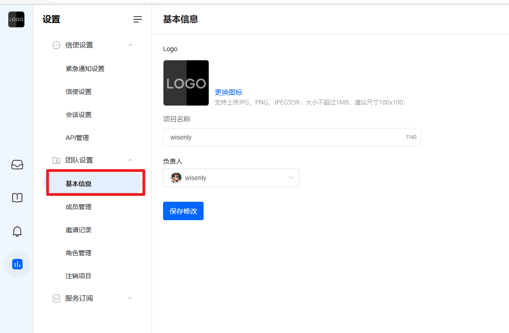
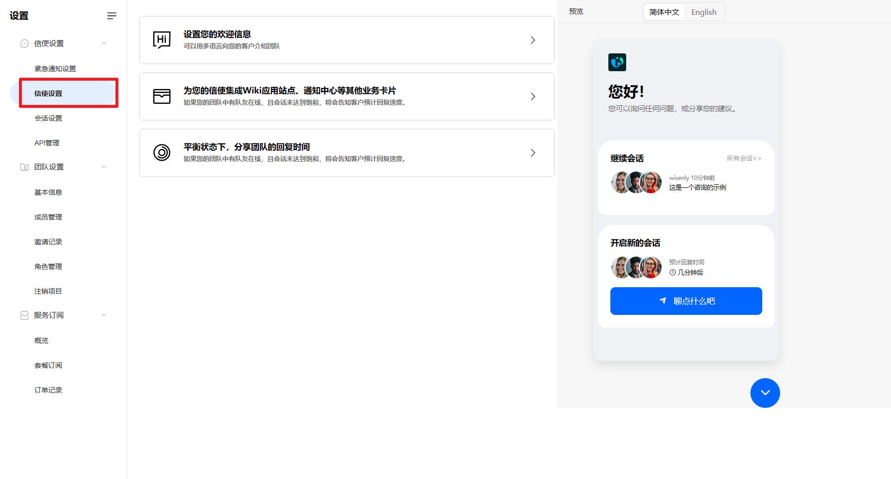
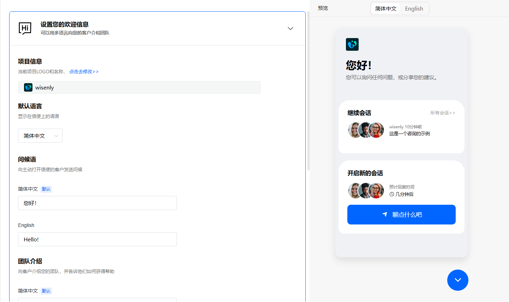
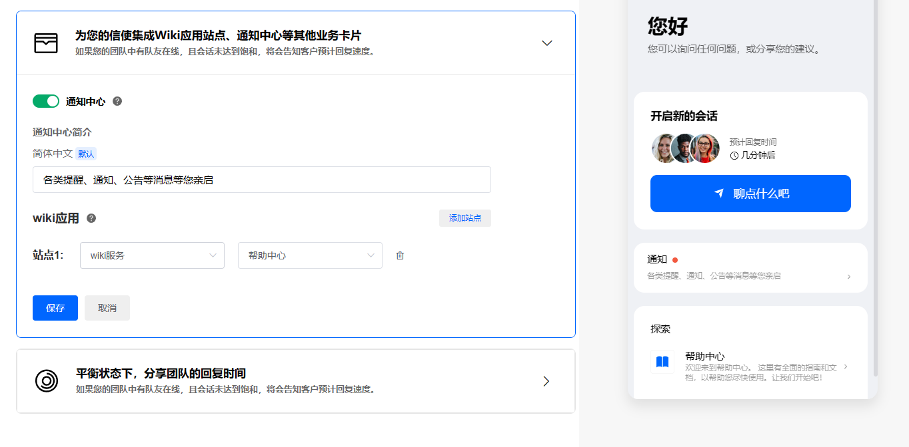
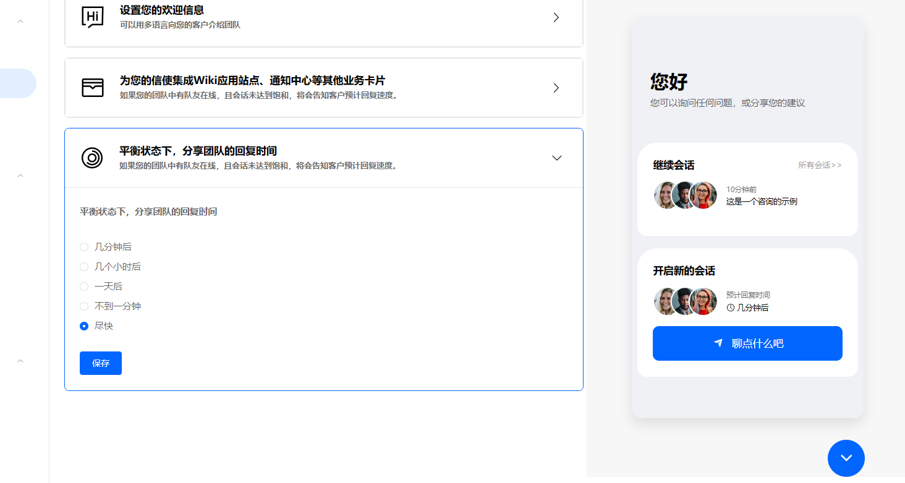

# 信使设置

> 分类:01-开始 | articleId:pRGQSn3ebj | 描述:

第一次登录ByteTrack的具体项目，需要为您的项目设置一些基本信息。
基本信息设置基本信息主要包括：LOGO、项目名称；入口如下：

● 项目名称：显示在信使端的品牌名称，您可以按需设置成产品简称；
● LOGO：显示在信使端的LOGO，利用视觉符号，来传达您企业或产品的信息（当前信使的背景色不可自定义，为了视觉效果，建议您使用深色背景的LOGO）。
注意：基本信息只有负责人能修改；
信使设置信使设置是完善信使的展现内容。信使不仅能传达企业对待客户的态度，也能传达企业对待自己产品的态度。
您可以在设置→信使设置中，为您的信使设置展示内容，如下图：

 当您开始自定义信使时，您会在屏幕右侧看到您的修改效果。

## 欢迎信息
在这里，您可以设置您的品牌信息，并以友好的方式介绍您的团队。如下图：
 

● 问候语：当您的用户点击“聊点什么吧”按钮时，他们会收到您团队的问候语，一个好的问候语，能让客户更轻松的与您沟通。
● 团队介绍：编写您的团队介绍，让您的客户知道您的团队是谁以及您可以如何提供帮助。 一个温暖、友好、切中要害的团队介绍，可以拉近您和客户的距离。
 说明：当前系统支持简体中文、English，您需要为不同的语言设置您的问候语、团队介绍。
● 默认语言：信使会根据您的业务系统语言，自动切换语言显示。下面这几种情况下，信使会以默认语言显示：
 ○ 业务系统没有传输语言，则会以默认语言显示。
 ○ 信使不支持业务系统的语言，则会以默认语言显示。
 说明：若您业务系统常用的语言，ByteTrack暂未支持，请联系我们尽快添加。

## 集成卡片
您可以为您的信使集成通知中心、wiki文章站点等卡片项。如下图：

 ○ 通知中心：您可以设置是否在信使端开启通知中心的显示，同时设置通知中心的简介；
 ○ wiki应用：您可以选择多个wiki应用站点，让它们在信使端显示，方便您的客户查看。

## 团队回复时间
您可以设定您的团队在办公时间内的预期回复速度。说明您的团队通常多久会回复。如下图：

 说明：系统预设了几种常用的回复速度，建议您根据实际情况设置，不要和实际情况偏差太多。

设置完记得点击“保存”按钮，才可生效。
👏👏👏现在您已初步设置了信使，那么就让我们继续吧👇
[在您的产品中安装ByteTrack](https://docs.bytrack.com/8CTFE8cF/help/wikidetail?articleId=kHOTrBsqa4&usageCategoryId=418&usageGroupId=807)
[邀请您的队友加入项目](https://docs.bytrack.com/8CTFE8cF/help/wikidetail?articleId=a9PxDyP8Wg&usageCategoryId=493&usageGroupId=955)
