# 服务订阅

> 分类:01-开始 | articleId:TtUkzeLYbF | 描述:如果您想订阅我们的计划并开始使用 ByteTrack 高级功能，那么您来对地方了。现在开始了解如何开通使用，以及您的价格是如何计算的。

现在，您已经创建好项目。在使用前，先让我们了解服务订阅吧~
订阅套餐当您创建好项目，点击不同的功能菜单，进入具体的页面时，会有服务订阅的提醒，如下图：

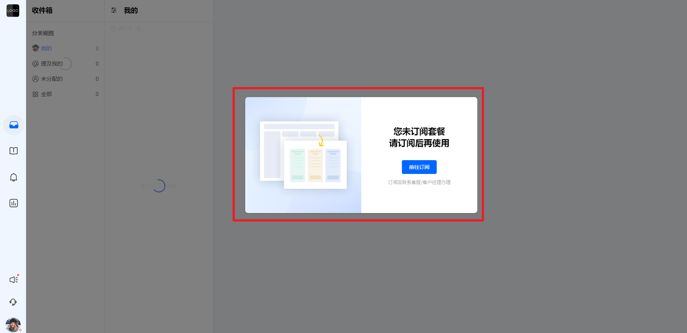

点击“前往订阅”，进入套餐订阅页面，如下图：

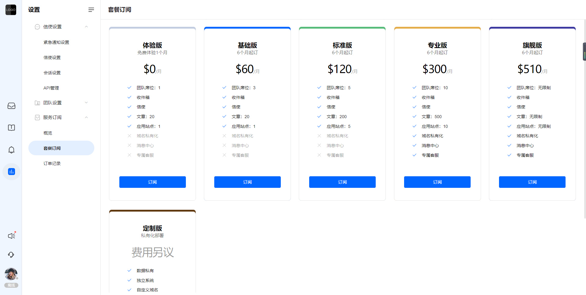

套餐的订阅是以独立的项目为单位，即开通套餐只在该项目下生效，账户创建其他项目需要再次开通套餐。套餐目前分为五个版本，级别从低到高分别为体验版，基础版，标准版，专业版，旗舰版。其中定制版为私有化部署的费用，而非套餐订阅费用。
您在选择的套餐上点击“订阅”后，会有弹窗展示套餐类型和对应权限，您需要选择订阅周期，并在勾选协议后，确认您的订阅费用。订阅费用=套餐的每月费用*订阅时间。如下图：

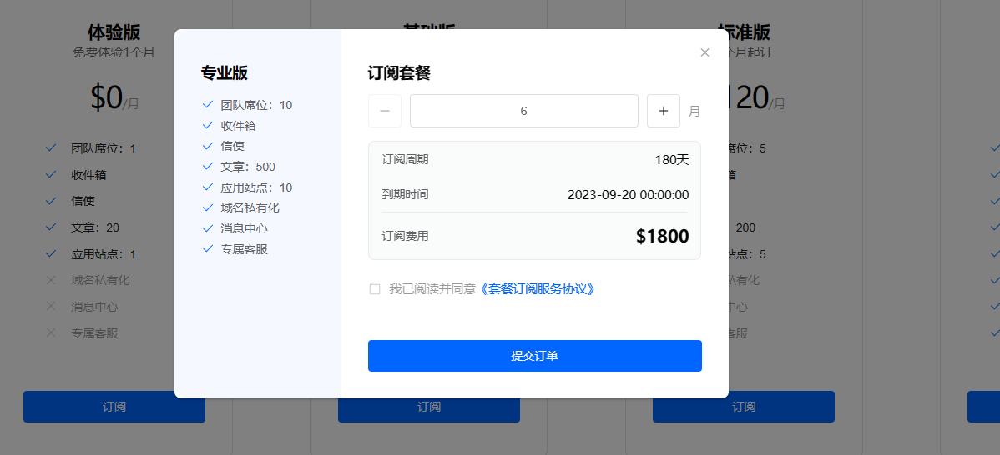

确认没问题后，您需要提交订单，并将订单编号复制给您的客户经理，线下付款即可。如下图：

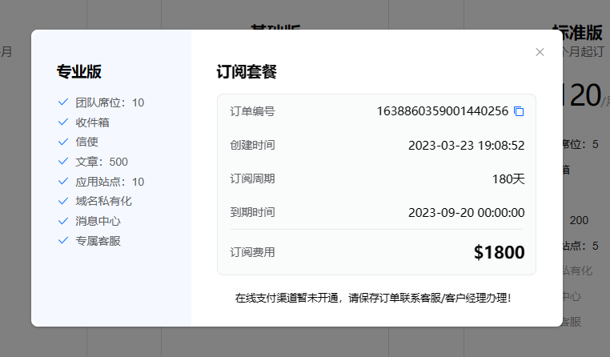

付款完成后，等待开通即可。开通后，您会在“订单记录”中看到这笔已经成功的订单。如下图：

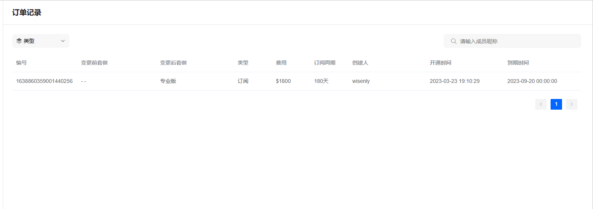

注意：
● 不同版本在允许使用的功能上和开放的资源使用量上有不同的设置，对应的订阅费用也不同，用户根据自身的需要选择合适的版本订阅。具体请参考套餐订阅页面；
● 定制版（私有化部署）需要收取费用（具体费用联系客服），这个费用与套餐无关，只是环境部署需要收取的费用，环境部署好后，在私有环境中创建的项目依然需要购买套餐才能使用。
● 套餐的订阅目前无在线支付通道，您在下单成功后，需要将订单编号发送至客服/客户经理，并线下办理付款，付款完成后，才可帮您进行套餐的升级。
● 您在订阅套餐时，需要自行选择订阅的时间，以月为单位，30天为一个月，但不能小于6个月。
● 到期后再次订阅：套餐到期后，再次订阅时，只能订阅那些资源大于等于您已使用资源的套餐，低于您已使用资源的套餐不可订阅。
● 您在订阅套餐时生成的订单为预支付订单，预支付订单暂不记录到订单记录中，订单记录只记录实际开通办理成功的套餐。您在创建预支付订单后需要联系客服/客户经理，如有需要变动套餐，可再次重新订阅套餐办理，之前的预支付订单作废。
● 一个账户只允许开通一次体验版。一个项目只允许开通一次体验版，且之前未购买过付费套餐才可开通成功。因此如若您想要为您的项目开通体验版，需要确保如下几个条件：
 ○ 该项目未开通过体验版；
 ○ 该项目未购买过任何付费套餐；
 ○ 当前操作的账户未在其他项目上开通过体验版；
 如若您仍然开通不了，请联系您的客户经理。
● 您的套餐会从开通时间的第二天开始计算订阅时间；

升级套餐如若您购买的套餐已经无法满足业务需求，您可以对套餐进行升级，如下图：

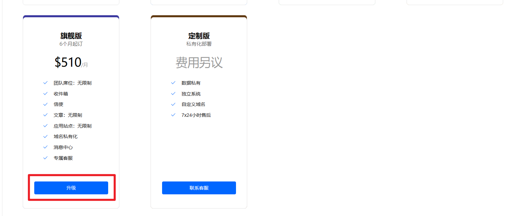

点击“升级”按钮，需要在弹框中对升级时间和价格进行确认，如下图：

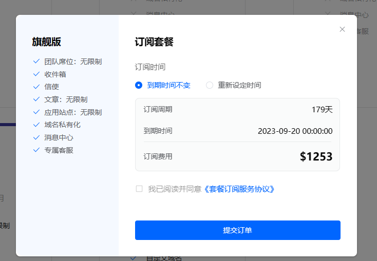

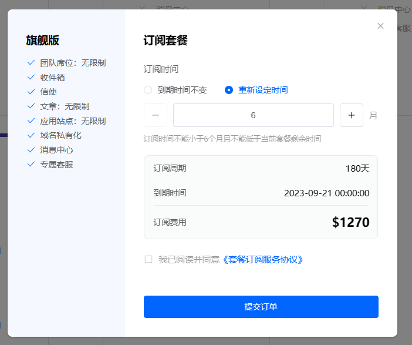

选择订阅时间有两种方式：
○ 到期时间不变：此次升级只是升级套餐内容，并不改变之前的到期时间，因此只需要补齐当前到期时间内，变更套餐的价差即可。即订阅费用=两个套餐的价格差/30*剩余天数；每个月按照30天计算。举例：之前是专业版，需要升级到旗舰版，剩余天数是179天，那么订阅费用=（510-300）*179/30*=1253；
○ 重新设定时间：重新进行订阅，订阅周期不得低于6个月，且不得低于当前套餐的剩余时间。剩余的订阅费用会冲抵这次订阅的费用。即订阅费用=新的套餐价格*订阅周期-原有套餐价格/30*剩余天数；举例：之前是专业版，需要升级到旗舰版，剩余天数是179天，重新订阅6个月，那么订阅费用=510*6-300/30*179=1270；
确认订单，并将订单编号发送至客服/客户经理，线下付款后，即可升级成功；
升级后，您可以在订单记录中查看升级记录，如下图：

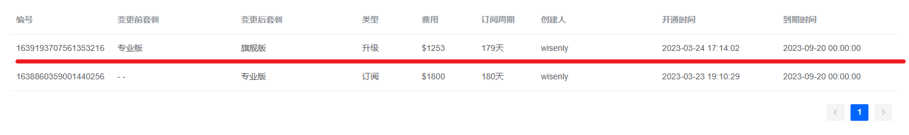

续费套餐如果想对当前套餐进行续费，点击“续费”按钮，如下图：

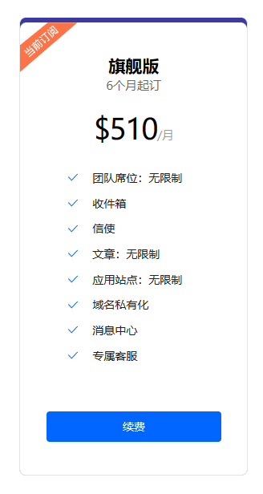

在弹框中设置您需要续费的时间，并确认价格（最少续费6个月），如下图：

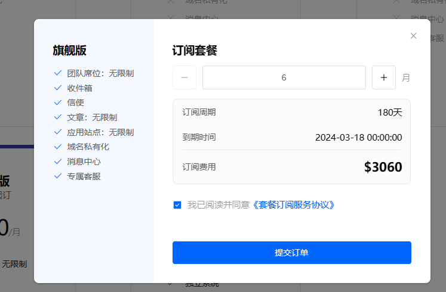

确认订单，并将订单编号发送至客服/客户经理，线下付款后，即可升级成功；
续费后，您可以在订单记录中查看续费记录，如下图：

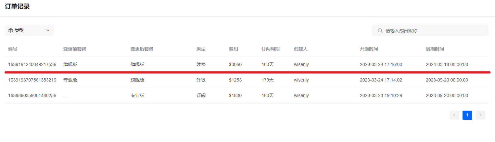

查询套餐使用情况您可以在“服务订阅-概览”中查看您当前的套餐，以及资源使用情况，如下图：

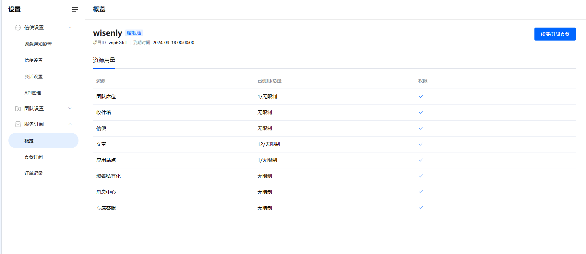

- 
● 概览页面展示当前项目的套餐类型和套餐的资源使用情况。
● 项目名称和项目ID为当前的项目信息，套餐版本为当前使用的版本，如到期有个已到期的提示标签。
● 到期时间为套餐使用的截止时间。
● 资源用量中的总量为该套餐版本允许使用的数据。有数量限制的显示具体的数量，无数量限制的会显示“无限制”。
● 已使用的团队席位为成员管理中的列表成员总数，包含负责人。
● 已用的应用站点为“wiki-应用”里面的应用数量，包含默认应用。
● 已使用的公网文章为“wiki-文章列表”中已发布状态的文章数量。

FAQ1. 我订阅了套餐，为什么我的队友仍然使用不了一些功能？
答：您需要在角色管理中，查看您的队友是否被分配了对应的功能权限。每个项目下，只有负责人才默认拥有完整的功能权限，其他的角色需要您进行调整。
2. 我在系统里看到的价格，为什么和上文中的价格不同？
答：套餐里面的功能限制、数量、费用、起订月数是根据ByteTrack运营情况动态调整的，每次调整只会影响后面订阅的项目，对已经订阅的套餐无影响。具体调整内容，请参见我们的帮助中心。

👏以上，您已经很清楚套餐的订阅了，现在让我们开始安装ByteTrack并设置信使，并使用ByteTrack来加深您和客户之间的联系吧~
[在您的产品中安装ByteTrack](https://docs.bytrack.com/8CTFE8cF/help/wikidetail?articleId=kHOTrBsqa4&usageCategoryId=418&usageGroupId=807)
[信使设置](https://docs.bytrack.com/8CTFE8cF/help/wikidetail?articleId=pRGQSn3ebj&usageCategoryId=418&usageGroupId=809)
[选择适合的会话规则](https://docs.bytrack.com/8CTFE8cF/help/wikidetail?articleId=aa6hrkfhe5&usageCategoryId=418&usageGroupId=808)
