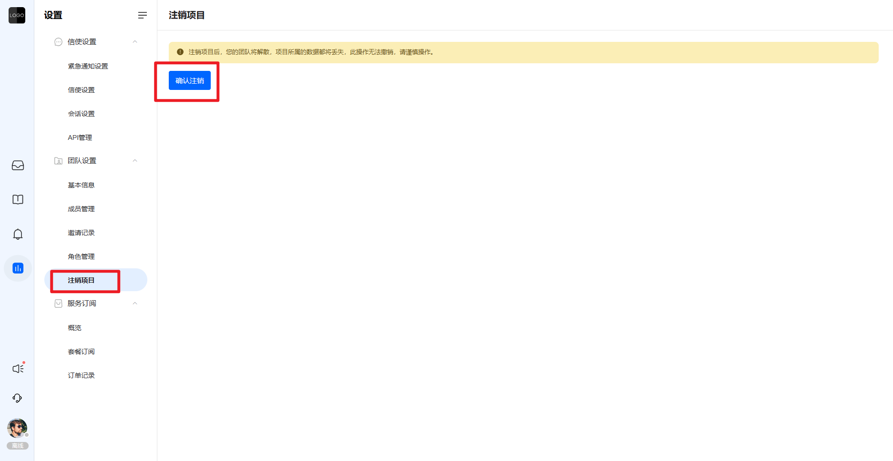
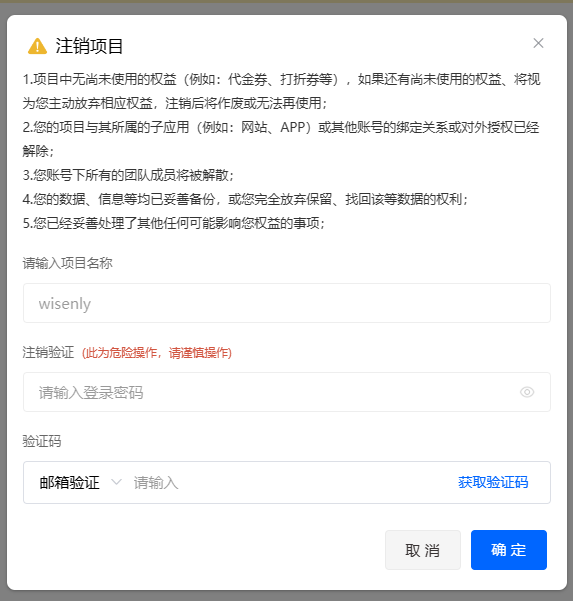

# 注销项目

> 分类:01-开始 | articleId:evDXj9VyxV | 描述:

当您不再希望使用该项目时，可以选择注销项目，入口如下：

点击“确认注销”，需要您进行二次确认，如下：

● 输入项目名称：因为项目一旦注销不可恢复，ByteTrack希望您在输入项目名称时，确认没有注销错项目；
● 登录密码和验证码：身份校验，为了确保是本人操作；
❌❌❌我们希望您谨慎操作，一旦注销，将不可恢复。
注销成功后，您将会被退出登录。
