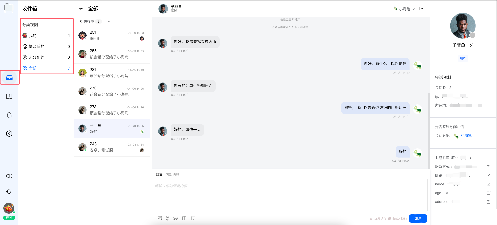
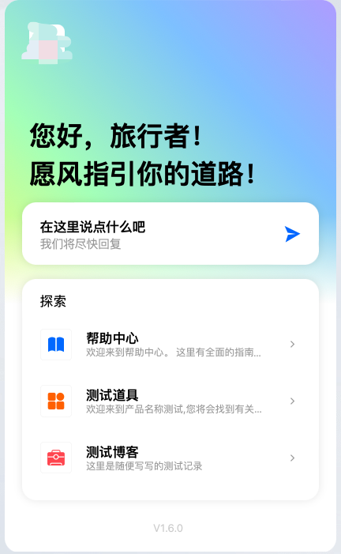

# 会话服务是什么

> 分类:02-会话服务 | articleId:eK74D2Hwtq | 描述:针对会话服务，进行整体的介绍，让您对其有个完整的认知！

👋👋👋会话服务是什么？嗯，简单的说：用户通过客服入口，给客服发送的一条消息，就形成一个会话。在这个会话通道中，用户和客服之间，接收/发送消息，从而进行交流。
 会话服务：其实就是ByteTrack提供的一种功能，让您可以通过这个服务，给您的客服和用户之间，建立一个交流的通道。
 👇👇👇好吧，如果您愿意，可以简单理解，它就是所谓的“客服系统”（但是我们并不希望您这样去理解！）。

## 1、会话服务的组成
 会话服务连接着两端：
1）您的客服：客服通过ByteTrack提供的中台系统，访问您项目中的“收件箱”。在收件箱中，保存用户发送过来的所有信息。客服可以再“收件箱”中，处理所有的用户消息。
2）您的用户：用户通过ByteTrack提供的“信使”，向客服发送消息/接收消息。

### 1.1、收件箱
 "收件箱"如下图所示：

 在“收件箱”中，您可以看到所有的会话信息，同时我们也为您进行了会话的视图分组，让您只关注和您相关的会话。

### 1.2、信使
“信使”如下图所示：
 

 “信使”也称为Messager，需要您的技术接入到您自己的业务系统中，您的用户可以通过“信使”来联系到客服。

## 2、会话服务的功能
 当然，会话服务的最基础功能是提供消息交流。除此之外，会话服务还会提供一些具备特点的功能。
- 黑名单：您可以将不喜欢的用户，拉入黑名单，这样他就无法打扰到您。
- 快捷回复：您可以设置一些通用的回复信息，便于您在需要的时候，直接选择发送。
- 内部消息：您可以通过内部消息，寻求团队其他成员的协助。内部消息，用户不会察觉。
- wiki关联：您可以将维护好的wiki资料库文章，通过会话发送给用户，简单有效。
- 其他：还有很多好玩的功能，我们会逐步补充和实现。
 在这里我们仅仅提及相关的概念，如果您想知道每一种功能的用法和场景，请参考“帮助中心-->会话服务”的其他的文档。
