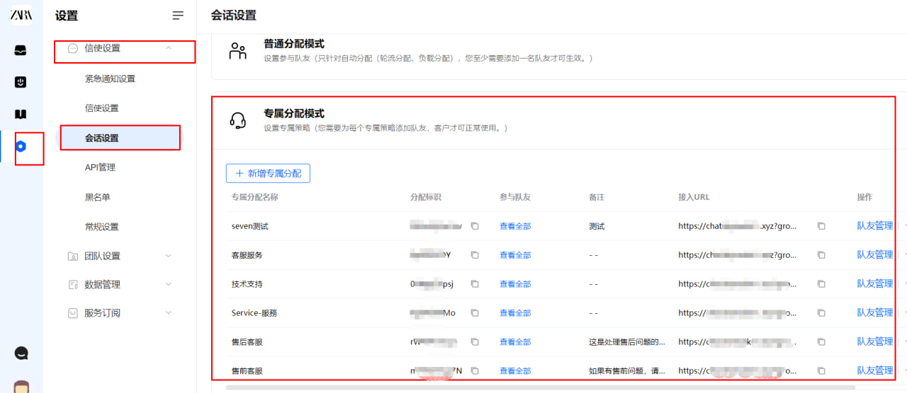
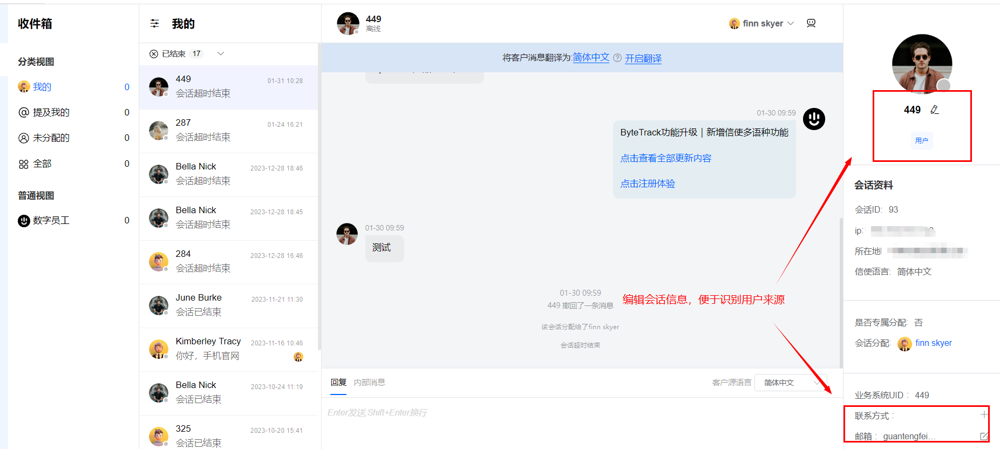
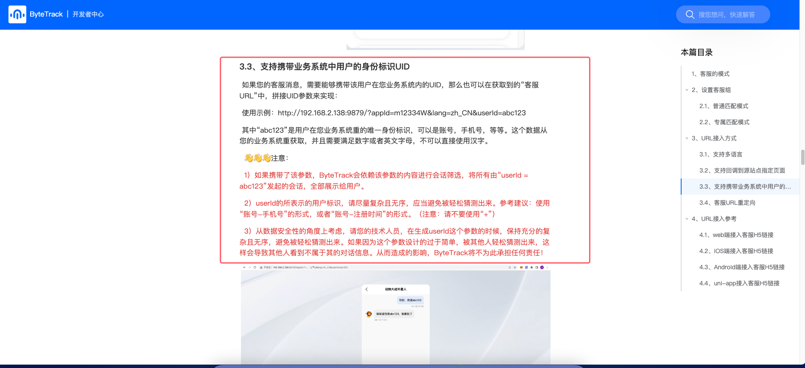

# 用户对话方案

> 分类:02-会话服务 | articleId:YSaQeY0ZNa | 描述:这里描述关于用户对话记录唯一性的处理方案

如果您业务系统中的用户，在和您发起对话咨询信息的时候，您希望您的用户不轻易的新创建对话，那么可以采用如下的方案。

### 1，使用专属会话模式
 如果您的团队技术能力一般，或者没有专业技术人员和您进行密切配合时，您可以直接采用“专属会话模式”。
 您可以登录您的客服后台，在“会话设置”页面，添加“专属客服URL”，如下图所示

 您可以复制专属会话的URL，将该URL复制到您的浏览器中，发起会话进行测试和体验。使用“专属客服URL”，只要您的用户 “不更换设备 或者 不清理缓存” 的情况下，都会只有一条对话记录存在。
 您需要将专属会话URL，提供给您的技术人员，让技术接入到您的业务系统中。
 另外，在您登录客服后台，进行对话处理时，可以手动编辑该对话的信息，以帮助您是被对话的来源。如下图所示

### 2，拼接URL参数
 如果您的技术实力较好，那么可以使用更高级的功能，来实现您的需求。
 您可以通过在客服URL链接后面拼接userId参数，来自动识别该用户在您业务系统中的唯一身份信息。具体您可以参考
 [接入指南](https://docs.bytrack.com/8CTFE8cF/developers/wikidetail?articleId=du7YduQBJw&usageCategoryId=725)
 让您的技术人员，参考接入指南中的3.3小节，如下图所示：

 请注意：高级功能，请一定要遵守接入指南中的注意事项，避免发生不必要的意外情况
