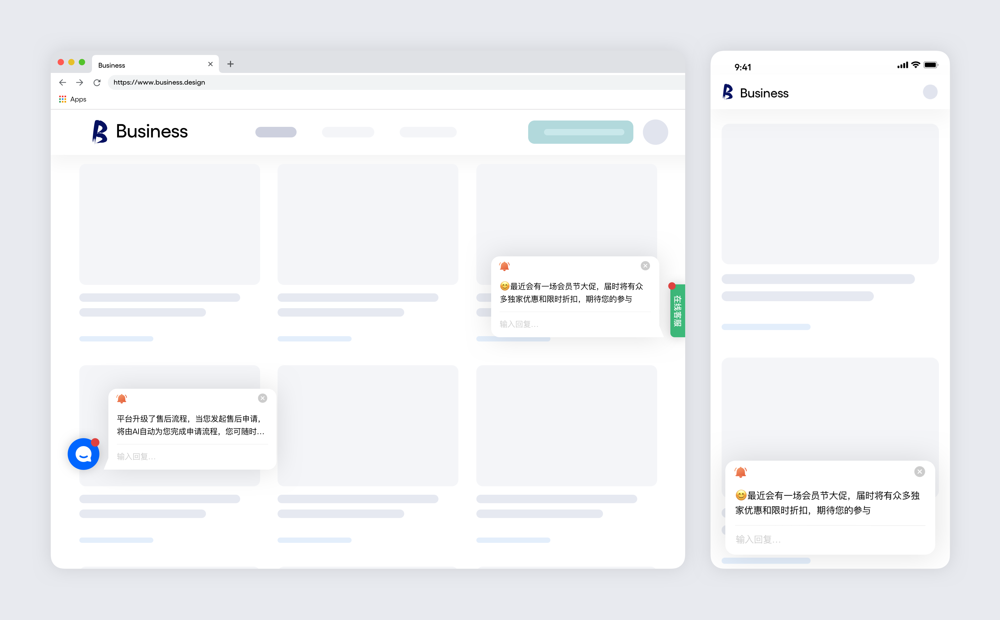
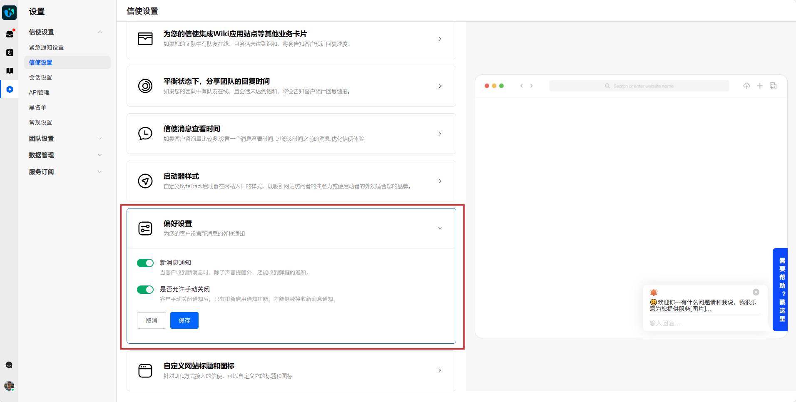
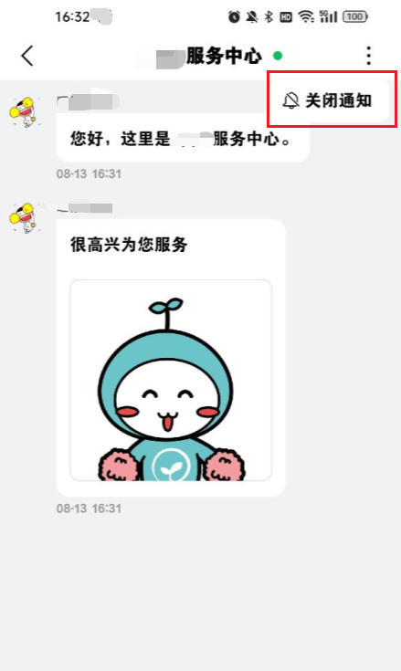
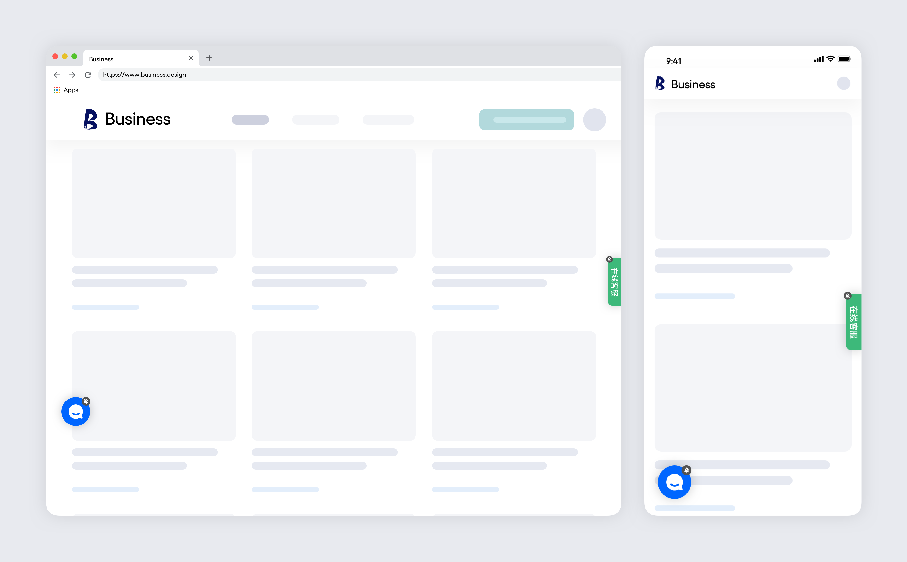
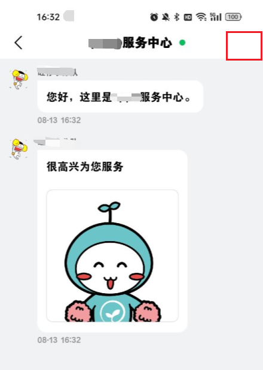

# 升级体验：ByteTrack 多维度信使提醒

> 分类:02-会话服务 | articleId:UE48MPoq2N | 描述:为了帮助您更加高效地与客户沟通，ByteTrack 在信使端提供了三种新消息提醒效果：红点、声效和弹框

在数字化客户服务的时代，及时有效的沟通是维系客户满意度的关键。ByteTrack一直致力于优化用户体验和提升客服效率。我们很高兴地向您介绍 ByteTrack 多维度信使提醒，这个功能将让客户不再错过重要消息。通过红点、声效和弹框提醒，我们确保每一条信息都能及时传达，从而提升客户满意度和服务质量。

## 信使提醒概述
 ByteTrack 的信使提供三种提醒方式，确保您的客户不会错过任何重要信息：
- 红点提醒
- 声效提醒
- 弹框提醒

### 红点提醒
红点提醒是一种视觉指示器，当有新消息时，会在角标的特定位置显示一个醒目的红点。这种静默但有效的提醒方式可以帮助用户快速识别是否有未读消息。

### 声效提醒
声效提醒通过播放提示音，让用户在视觉之外，也能够通过听觉感知到新消息的到来，进一步确保用户不会错过任何重要信息。
声效提醒受浏览器策略影响。在多标签环境中，非当前活动标签可能无法正常播放音频。

### 弹框提醒
弹框提醒是一个弹出式的消息提示框，可以直接展示新消息的内容，便于用户即时查看。

考虑到弹框提醒的显著性可能对某些场景造成干扰，我们提供了灵活的配置选项。您可以选择是否启用信使弹框功能。若启用，您还可以进一步设置是否允许用户自行关闭弹框显示，以平衡及时通知和用户体验。
弹框配置选项：
- 信使是否显示弹框；

- 信使端关闭权限；

#### 如何配置弹框设置
1. 登录ByteTrack后台。
2. 导航至“设置”>“信使设置”。
3. 在“信使设置”>“偏好设置”部分，您将看到两个开关：新消息通知、是否允许手动关闭。
4. 根据您的需求选择适当的设置。
5. 点击“保存”以应用更改。

当您开启了“是否允许手动关闭”，信使端会话详情右上角可以关闭弹框。关闭后，所有会话的新消息将不再弹框，直至下次客户重新开启👇

关闭弹框后，信使角标会有“禁用打扰”的图标👇

当您关闭了“是否允许手动关闭”，信使端会话详情右上角将不再显示“关闭通知”的入口👇，这意味着客户将无法自行禁用弹框提醒，确保所有消息都能得到及时展示

### 最佳实践建议
- 针对弹框提醒，请权衡用户体验，合理使用此功能以避免过度打扰。
- 如果您的服务涉及敏感信息，可以允许客户关闭弹框，以保护他们的隐私。
- 定期检查和调整设置，以优化客户体验和提高客户满意度。
红点提醒和声效提醒是始终启用，无法配置的，确保基本的提醒功能。
若信使端关闭了通知提醒，“禁用打扰”的图标会遮盖住红点提醒。

👏👏👏恭喜！您现在已经了解了 ByteTrack 多维度信使提醒，特别是弹框功能的配置方法。
但是，ByteTrack 的功能远不止于此。为了进一步提升您的客户服务技能，我们建议您继续探索以下相关主题：
[智能流程使用指南](https://docs.bytrack.com/8CTFE8cF/help/wikidetail?articleId=7p26seWJf7&usageCategoryId=870&usageGroupId=-1)
[用户对话方案](https://docs.bytrack.com/8CTFE8cF/help/wikidetail?articleId=YSaQeY0ZNa&usageCategoryId=593&usageGroupId=-1)
