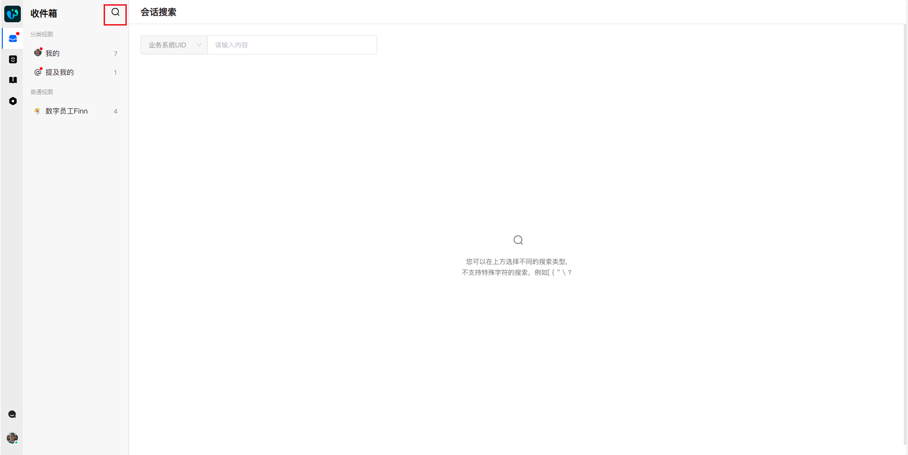
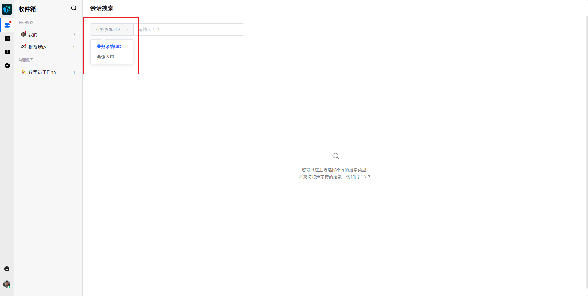
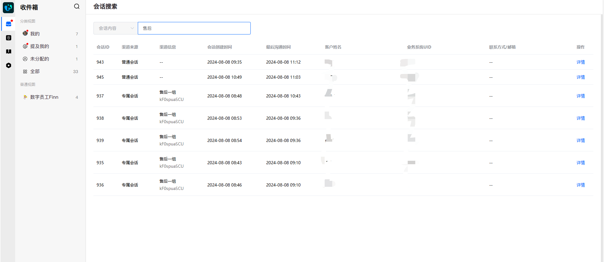
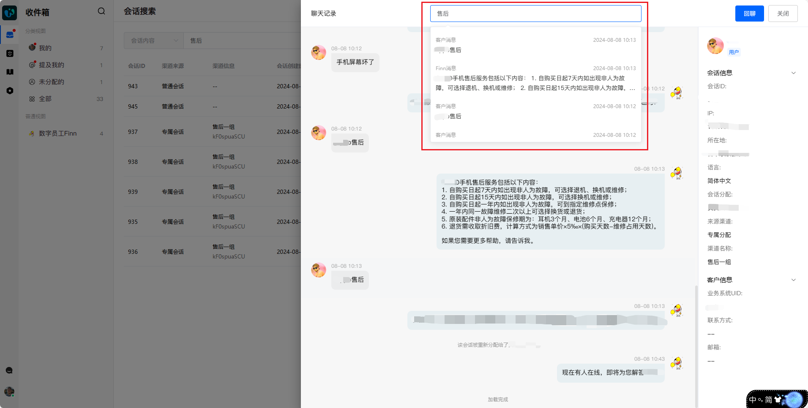
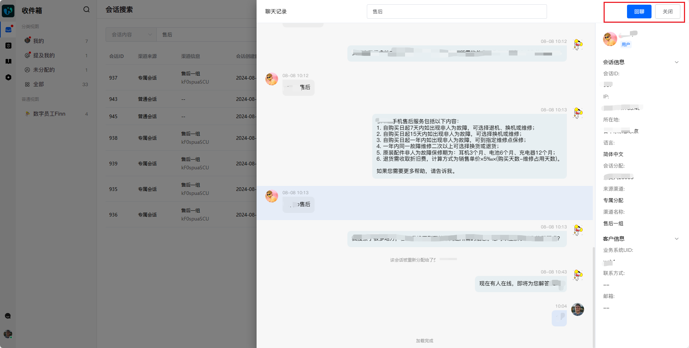

# 快速搜索会话

> 分类:02-会话服务 | articleId:aMpGMuP81J | 描述:🔎了解如何在【收件箱】快速搜索您的会话，对聊单率和回复效率的提升很有帮助。本篇将主要介绍在【收件箱】模块下，搜索会话的相关功能。

ByteTrack提供了两种搜索：全局搜索、会话内搜索👇

## 全局搜索
要全局搜索会话，请单击【收件箱】左上角的搜索图标。勤用搜索，对聊单率和回复效率的提升很有帮助。

然后，根据您的需要，切换搜索类型，ByteTrack提供了两种搜索类型：业务系统UID、会话内容中的关键词。

输入搜索条件后回车，即可触发搜索。

列表中，您可以初步了解这些会话的基础信息，点击“详情”，进入会话详情。
备注：您需要有该会话的访问权限，才可进入会话详情。
如若您是用会话内容搜索，ByteTrack会自动定位到符合条件的最新一条消息，并闪烁提醒👇

如若您想查看其他符合条件的会话，请点击会话上方的搜索框，从下拉列表中点击切换。

若您想在该会话内搜索其他关键词，请在上方搜索框中，删除已有关键词后重新输入，并回车，即可触发搜索。
搜索完毕，您可以通过右上角的按钮继续进行下一步。

回聊：进入【收件箱】，继续在该会话里发送消息；
关闭：回到搜索结果列表页，查看其他会话详情。
会话详情中，您可以上下滑动页面，查看会话上下文。

## 会话内搜索
您也可以在会话内直接根据关键词搜索。会话详情的右上角点击“搜索”。

ByteTrack会打开一个“聊天记录”的页面，您可以在上方的搜索框中，输入您的搜索条件，回车触发搜索。

在下拉的搜索会话列表中，点击选择某条会话，页面将自动定位到该会话所在位置，方便您查询上下文会话👇

## 👉一些提示
- 会话内搜索，只支持会话内容的关键词搜索，不支持业务系统UID搜索。
- 会话内容搜索不区分大小写，业务系统UID搜索区分大小写。
- 不支持多条件的联合搜索，例如AND、OR的方式，连接多个关键词。
- 特殊标点符号可能会导致搜索结果异常，例如[ { “ \ ？等等，因此建议用普通文本搜索
- 会话内容搜索时，ByteTrack会查找与您的查询完全匹配的字词，但也会返回包含这些字词的对话。例如，您搜索run，我们也会返回包含了 running 的会话。

👏👏👏恭喜，您现在已经掌握了ByteTrack收件箱的搜索功能精髓。这个技能将大大提升您的工作效率，让您在海量信息中如鱼得水。但别止步于此-ByteTrack还有很多惊喜等待您去挖掘。
接下来，我们为您准备了一系列实用指南：
[设置系统通知](https://docs.bytrack.com/8CTFE8cF/help/wikidetail?articleId=TQdEabnndo&usageCategoryId=593&usageGroupId=-1)
[消息翻译](https://docs.bytrack.com/8CTFE8cF/help/wikidetail?articleId=LPdBMdTlLd&usageCategoryId=593&usageGroupId=-1)
