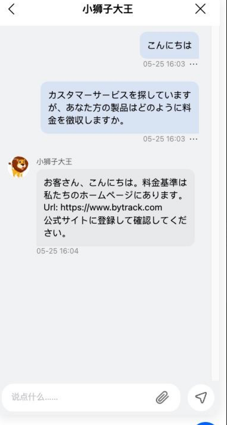
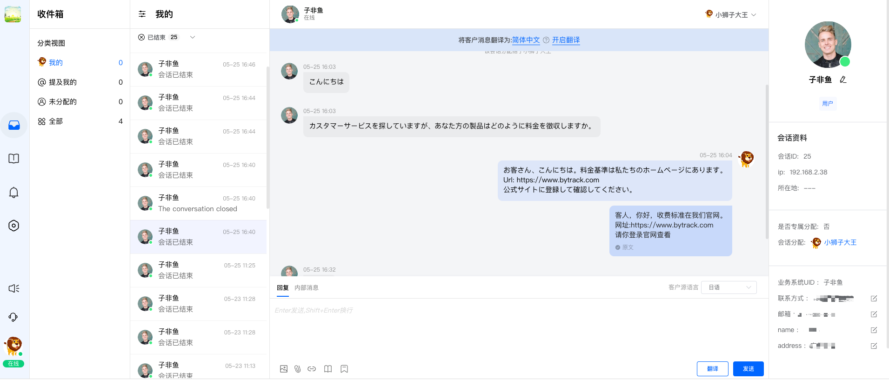
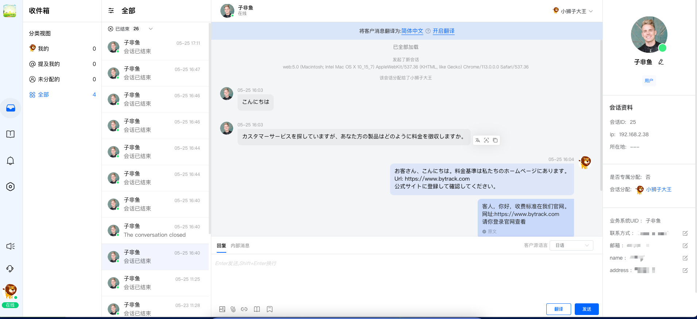
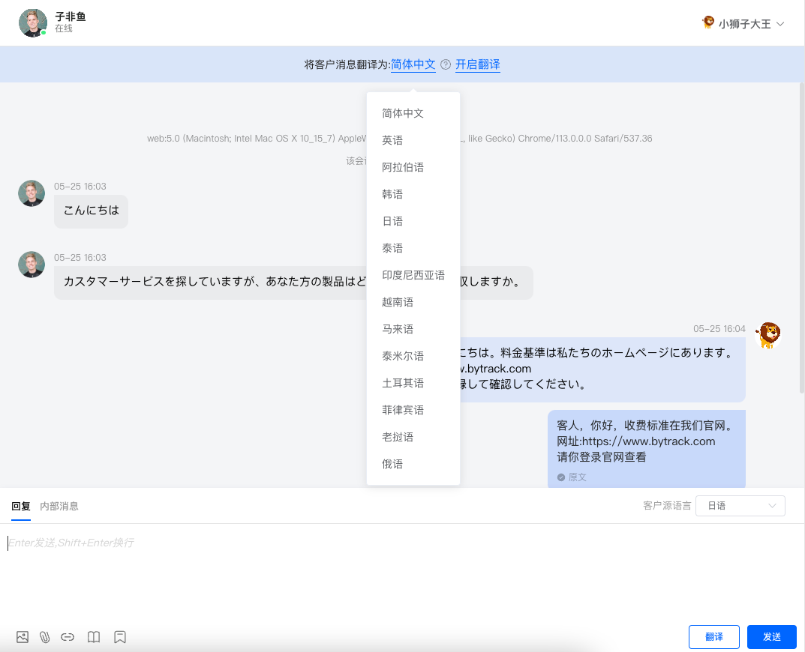
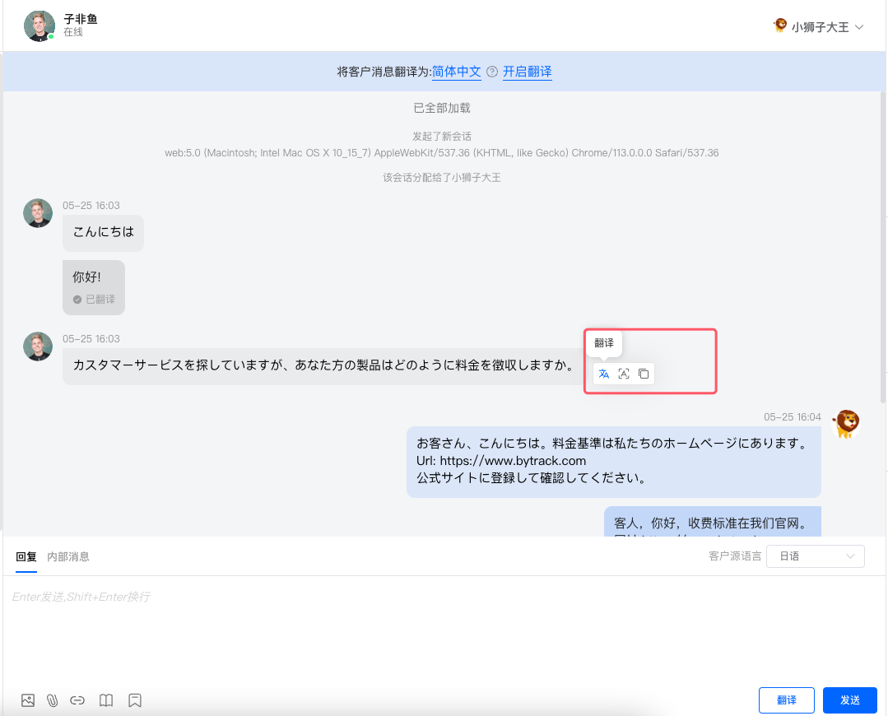
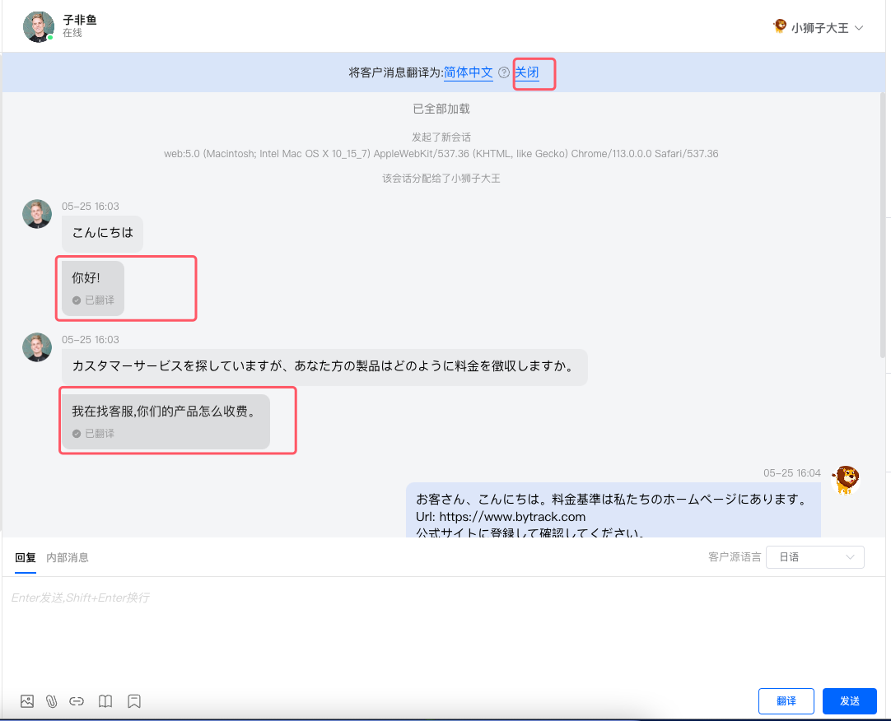
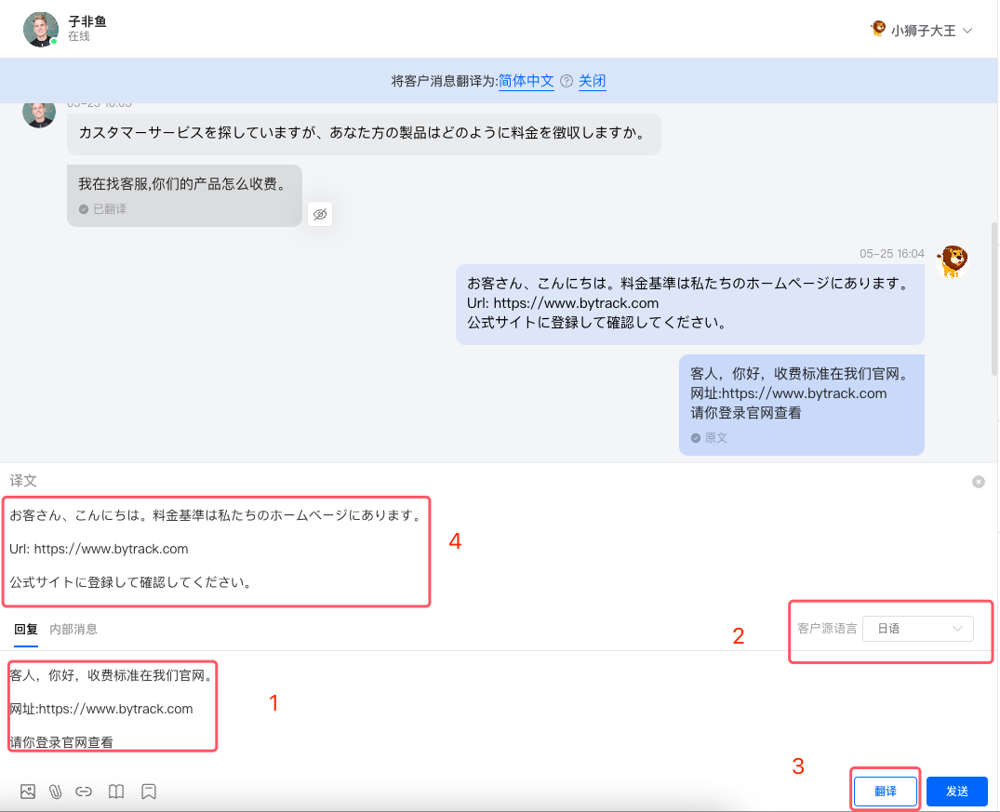
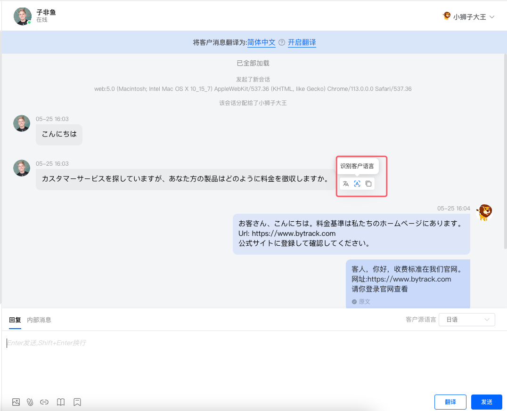
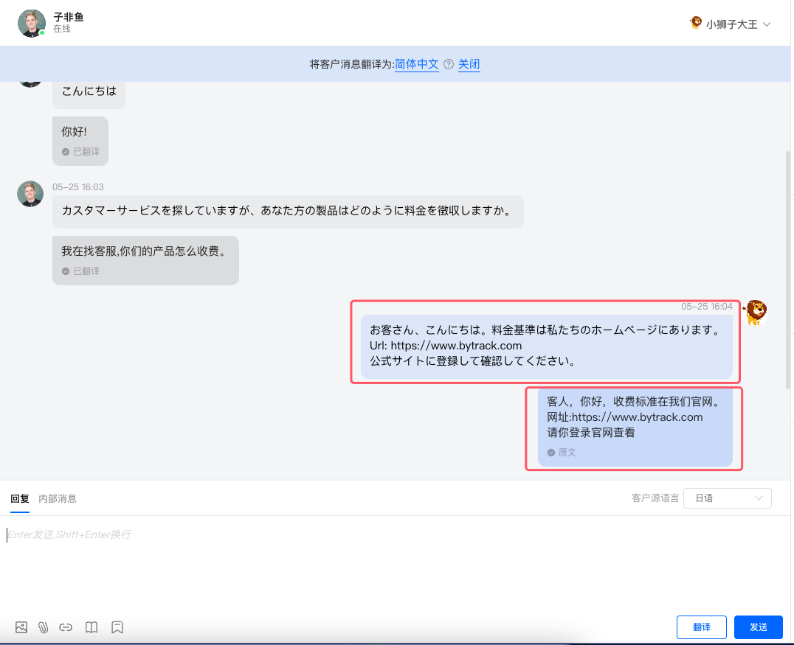
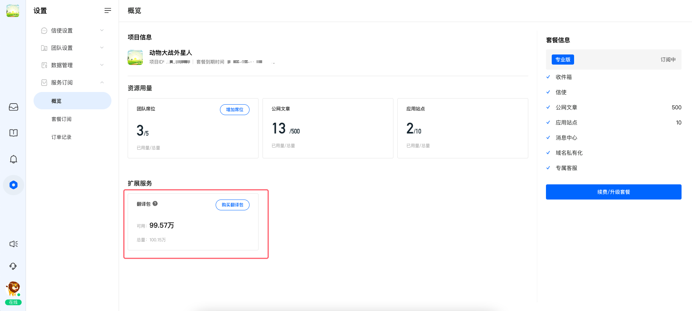

# 消息翻译

> 分类:02-会话服务 | articleId:LPdBMdTlLd | 描述:介绍消息翻译功能

1，背景介绍👋👋👋如果您和您要服务的用户不在同一个国家，你们双方使用不同的语言进行交流。或者，您的业务面向的是全球用户。在进行客服信息交流的时候，您就一定遇到翻译的场景。
为了减少您来回翻译带来的困扰和繁琐，提高您客服的效率，我们提供了会话信息的翻译功能。
👇👇👇消息翻译涉及的功能如下：
- 自动翻译
- 手动翻译
- 语种识别
- 翻译资源包
 在正式介绍翻译功能之前，我们先做个假设：在进行客服对话时，您的用户使用日语，而您不懂日语。
 您的用户需要咨询客服某个问题，他会通过信使给您发送信息：
 

 在您的ByteTrack中台页面，当您点击这个会话时，您将能看到如下的信息：

 是的，您看到的是一些日语。如果您日语不好（假如），那么您接下来可能会将这些日语信息，复制到翻译软件中，通过翻译软件知道这个用户在说什么。然后您还需要将您要回答的问题，写入到翻译软件，翻译为日文。最后将日文信息，复制到客服系统，发送给您的用户。
 嗯，这个过程真的是太繁琐了！
 此刻，我们为您提供了自动翻译功能，您再也不需要因为语言不通，而感到苦恼了！
2，手动翻译 选择一个会话，点进进入会话详情。如果有个日本客户给您发送了消息，那么您能够看到如下的场景 ：

 
 您可以点击消息模块头部的“将客户消息翻译为：简体中文”，这里您可以结合自身实际情况，选择一个您熟悉的语种。后续我们会将客户的消息翻译成这种指定的语言，比如这里的“简体中文”。
 我们支持多种主流语种，具体的语种您可以在选择的时候，通过下拉菜单获取，如下图所示：

 选择好语种之后，我们可以采用手动翻译的方式，将目标消息进行翻译。
 将鼠标选中某条消息，会自动弹出消息的一些操作按钮，选择“翻译”按钮点击，等待翻译完成之后，译文就会出现在消息下方，如下图所示：

3，自动翻译 如果一条条消息，手动去点击翻译，在有些场景下会比较麻烦。所以我们也提供了自动翻译的功能。
 在会话消息模块的头部，手动点击“开始翻译”，那么该会话中所有用户发送过来的消息，都会按照您选择的语种自动进行翻译，翻译完成之后，译文会出现在对应的消息下方，图下图所示：

 当然，如不您不想继续自动翻译，您可以点击上图“关闭”的按钮，即可以将自动翻译关闭。此后，对于新的消息，将不再进行自动翻译。
 关闭自动翻译之后，再次进入该会话，将只会显示用户消息的原文。
4，客服消息的翻译 当您将反馈给用户的消息，编写到输入框之后，您也可以选择语种，进行翻译之后，再将译文发送给用户，如下图所示：

👋👋👋注意：如果您不知道用户的语种，我们也提供“语种识别”功能。您将鼠标选中用户的消息，会自动弹出消息的操作按钮，点击“语种识别”，即可以帮助您识别出用户使用的语种。在识别到语种之后，我们可以帮助您自动调整“客户源语言”（当然，您也可以自己手动去调整）。

选择好“客户源语言”之后，点击“翻译”按钮，等待翻译完成之后，就会在输入框的上方出现对应的“译文”。
点击“发送”按钮，我们会将“译文”发送给用户。在会话的视图中，为了便于您后续的查阅，我们会将您的输入“原文” 和 发送 “译文”都展示出来。当然，请放心，我们只会讲“译文”发送给您的用户，比如这里的日文信息。

5，翻译资源包 使用翻译功能，会消耗您的翻译资源包。当您的资源不够时，将无法正常使用翻译。
 如果您想购买资源包，可以通过“服务订阅”-->“概览”中单独购买资源包。当然，您完全可以在购买套餐时，一起购买资源包。

👋👋👋注意：
- 我们的资源包，是根据您参加翻译文本的字符数量来进行消耗的；
- 对于用户发送过来的消息，我们只会在第一次翻译时消耗资源，再次对同一条消息进行翻译时，将不再额外消耗资源；
- 对于客服反馈的消息，每一次翻译，我们都需要消耗资源；
