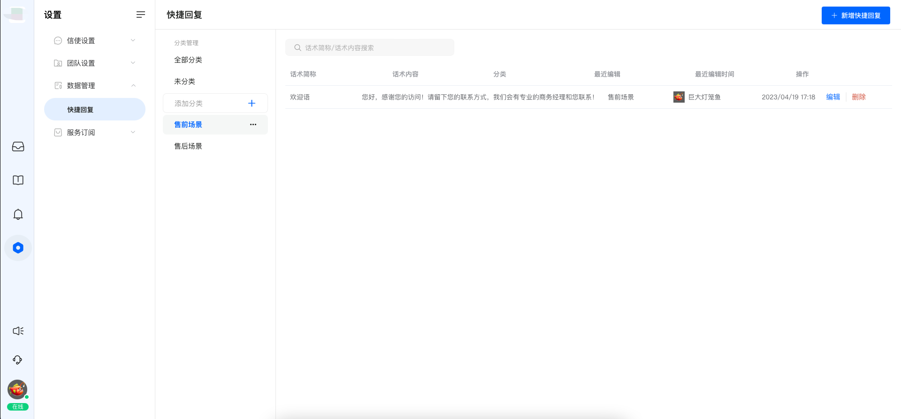
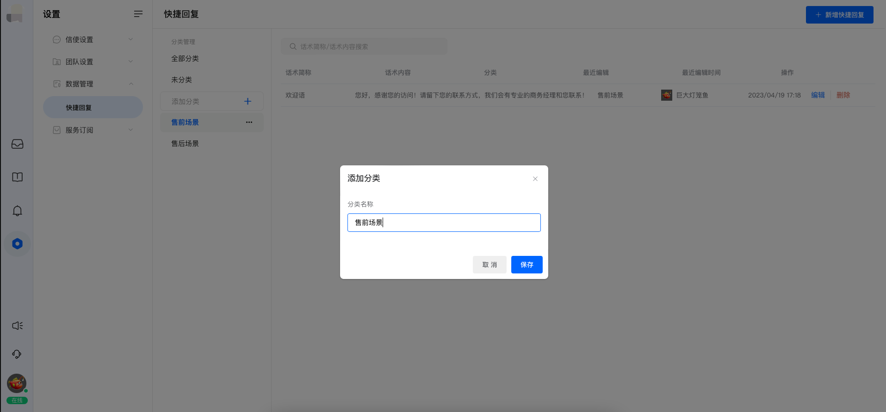
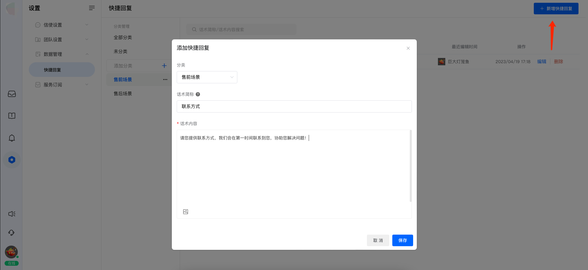
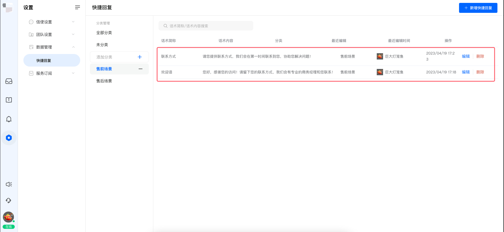
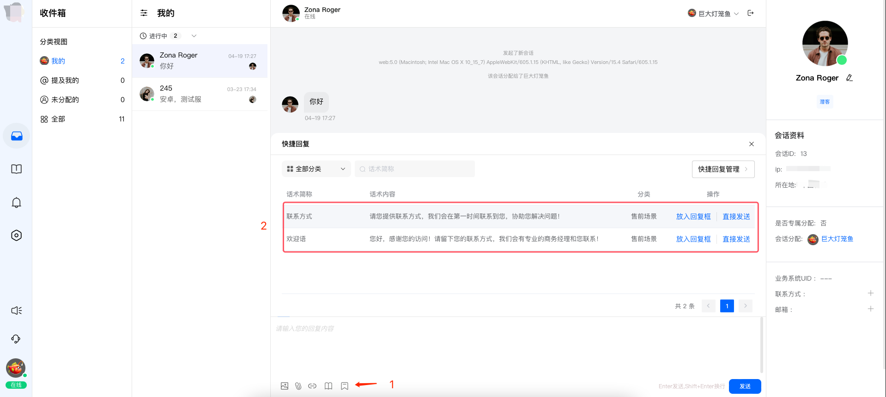
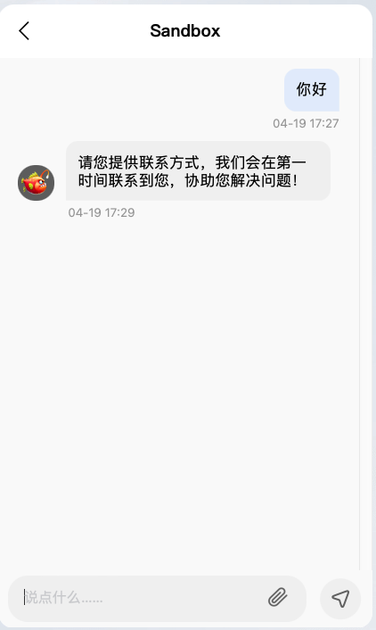

# 快捷回复

> 分类:02-会话服务 | articleId:tNRAacbGxr | 描述:会话服务中，快捷回复功能的介绍

👋👋👋客服总会遇到很多相同场景，需要发送相同的内容给用户。一遍遍的编辑相同内容发送给用户，真的烦！
 现在，您可以通过“快捷回复”，一次编辑，重复使用！

### 1、维护快捷回复
 您可以在"设置-->数据管理-->快捷回复"页面中，管理和维护您的内容，如下图所示：

👇👇👇首先，您需要创建分类（当然，您完全可以跳过这一步），如下图所示：

👇👇👇然后，您需要创建快捷回复。创建完成之后，可以在列表中看到相关内容，并且对选中的内容进行编辑/删除如下图所示：

### 2、使用快捷回复
 进入“收件箱”，选择一个会话，选择一个快捷回复，直接发送。或者复制到聊天框，进行细微调整，之后发送给用户。如下图所示：

 发送出去之后，用户端就会接收到这条信息，如下图所示：
 

👋👋👋注意：
1、快捷回复尽量简单有效。如果内容过大，强烈建议您编写wiki文章，然后通过文章进行发送；
2、快捷回复不能代替wiki文章，两者的使用场景不同；
