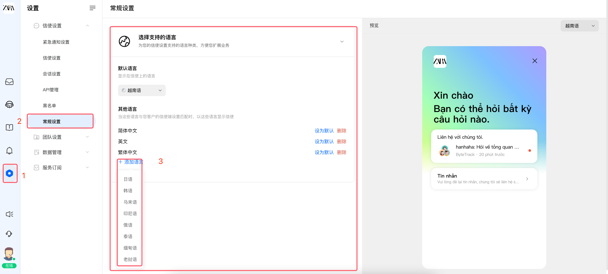
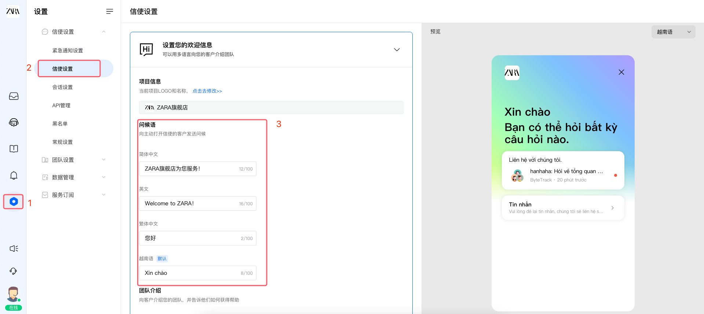

# 信使多语言设置

> 分类:02-会话服务 | articleId:bhCLbs9uwF | 描述:介绍如何实现信使端多语言的设置

👋👋👋在现实的业务场景中，您的业务可能需要面向不同国家和地区，比如：泰国、越南、日本、韩国 等。
ByteTrack满足不同语言种类的支持，以便于能够更好的给您提供便捷的服务。

## 1、语言种类范围
 目前，我们的语言范围支持如下：
- 简体中文
- 英文
- 繁体中文
- 日语
- 韩语
- 越南语
- 马来语
- 印尼语
- 俄语
- 泰语
- 缅甸语
- 老挝语
- 法语
- 意大利语
- 西班牙语
- 德语
 其他的语种，我们也在持续的新增中，敬请期待。

## 2、设置您的语言库
 您的项目在创建的时候，我们会为您的项目默认添加 简体中文 和 英文 这两个语言，其中简体中文是默认语言。
 如果您还需要添加其他的语种，那么您可以在如下的设置界面中，进行语种的添加。

 添加好语种之后，您可以在 “常规设置” 页面 中，指定您需要的语言为信使端的默认语言。
👋👋👋请注意：
1，如果您的信使需要支持其他语言，请让您的技术人员在对接的时候，按照接入指南，将对应的语言参数拼接到客服URL，或者传递给sdk；
2，如果您的技术，在对接信使的时候，没有使用语言参数，或者使用了错误的语言参数。那么信使端将会展示您在此处设置的默认语言；
3，关于信使的接入，请您的技术人员查阅我们的开发者文档；

## 3、设置您的欢迎语和团队介绍
 当您设置好您所需要的语音种类，接来下您可以到 “信使设置” 页面中，针对您的“团队介绍”和“欢迎语”进行个性化设置。（当然，我们会为您提供默认的一套文案，如果您没有特殊的需求，可以跳过本小节的内容）。

👋👋👋请注意：
1，在这个信使设置页面，会将您当前的默认语言标记出来，便于您知道当前的默认项是什么。
2，您可以在这个页面设置 欢迎语 和 团队介绍，页面的右侧可以针对您设置的内容进行预览。
3，设置完毕之后，不要忘记保存生效。

## 4、接入使用
 当您设置好上述内容之后，接下来，可以让您的技术人员进行客服系统的接入。
 具体的接入方法，可以参考：[开发者中心](/8CTFE8cF/developers)
