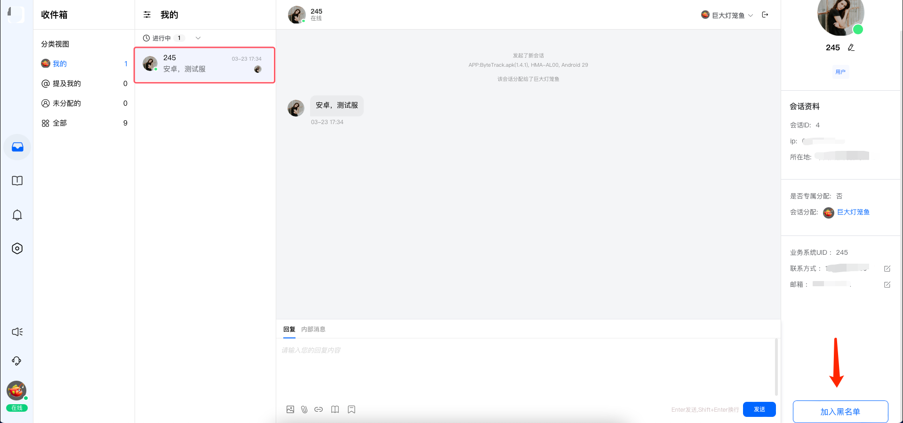
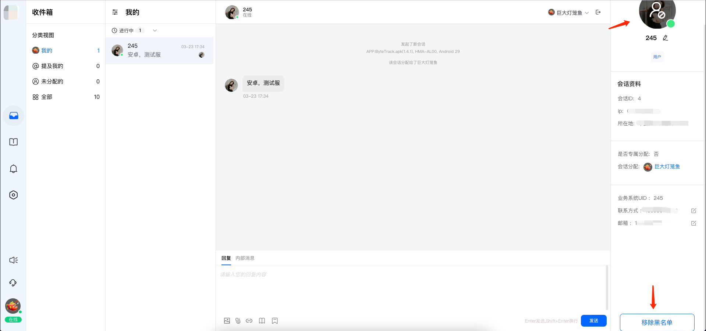
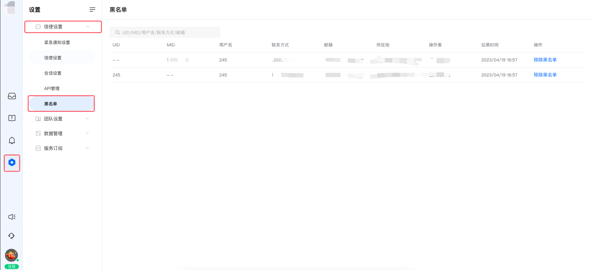
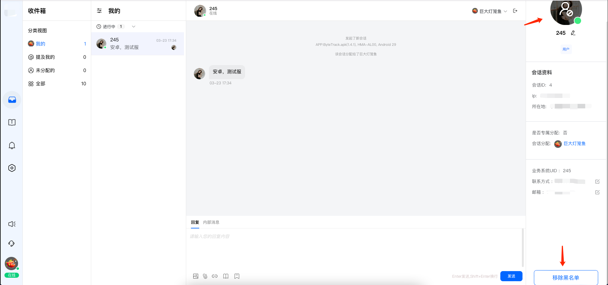
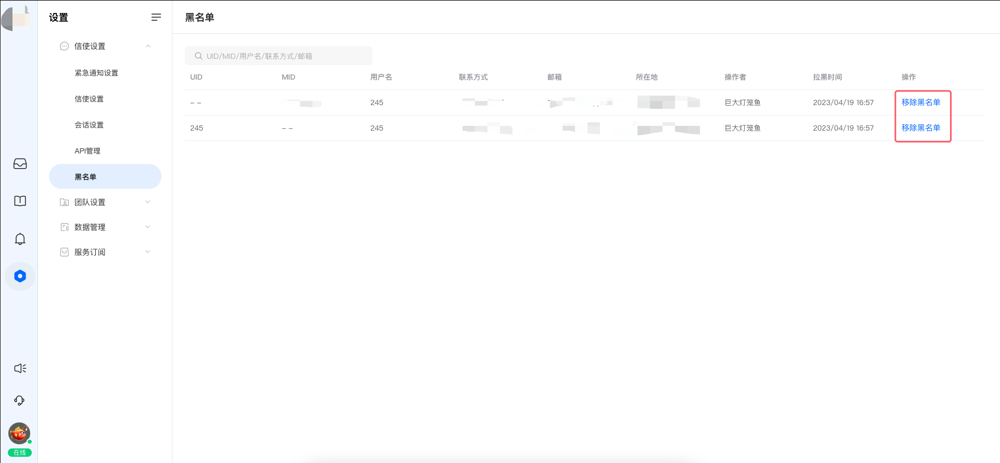

# 黑名单

> 分类:02-会话服务 | articleId:vaYtqQeIM3 | 描述:介绍会话服务中，黑名单的使用方法

👋👋👋总会有些人，您不想遭受到他们的打扰。那么，您可以将他们拉入黑名单，享受清净！

### 1、加入黑名单
 进入您的“收件箱”，找到那条你不喜欢的会话，点击会话打开详情，找到最右侧的“会话资料”。
 在“会话资料”的最下方，您可以点击“加入黑名单”的按钮，如下图所示：（如果您的屏幕较小，可以尝试将鼠标下滑，找到这个按钮）

 成功加入黑名单之后，该“会话资料”上的头像会有展示拉黑状态。
 如果您觉得可以将该用户从黑名单中移除，可以在“会话资料”的下方，点击“移除黑名单”即可。

 拉入黑名单的用户，您也可以在“设置--->信使设置--->黑名单”列表中，看到相关的信息，如下图所示：

👋👋👋注意：拉入黑名单的用户/用户设备，将不再允许发送任何消息；

### 2、移除黑名单
 如果您想要将某个用户移除黑名单，那么您可以通过两个地方进行操作。
1）会话详情--->会话资料的下方，点击“移除黑名单”

2，设置--->信使设置--->黑名单列表 中，点击“移除黑名单”

### 3、黑名单机制
 👋👋👋黑名单机制的核心策略：
1、针对游客，游客没有在您业务系统中的身份标识（比如账号）。当游客被拉入黑名单时，该游客的使用设备会禁止通过“信使”发送消息；
2、针对用户，用户携带在您业务系统中的身份标识（比如账号）。当用户被拉入黑名单时，该用户无论在哪个设备上登录，都会禁止通过“信使”发送消息；
