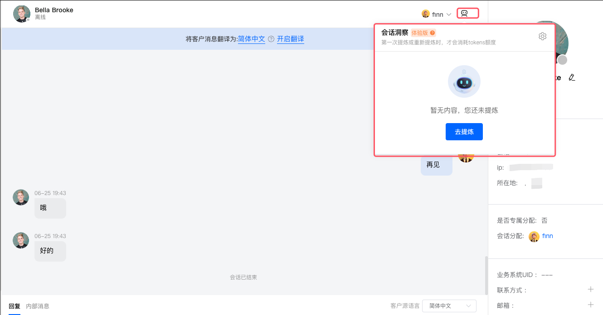
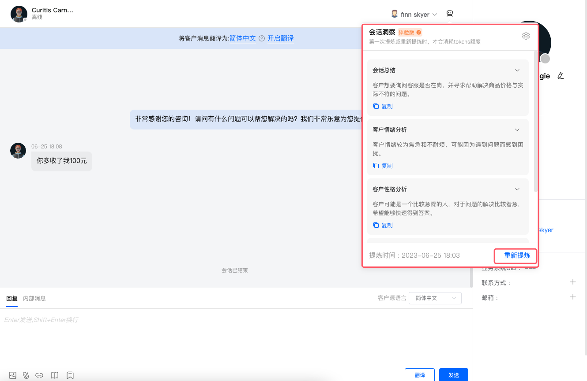
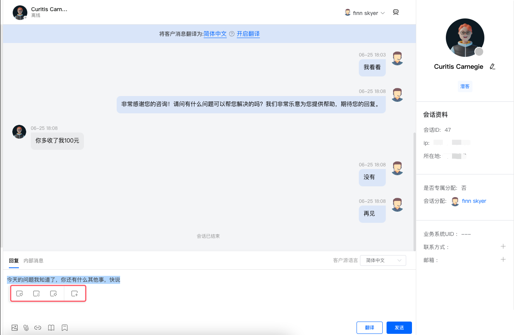
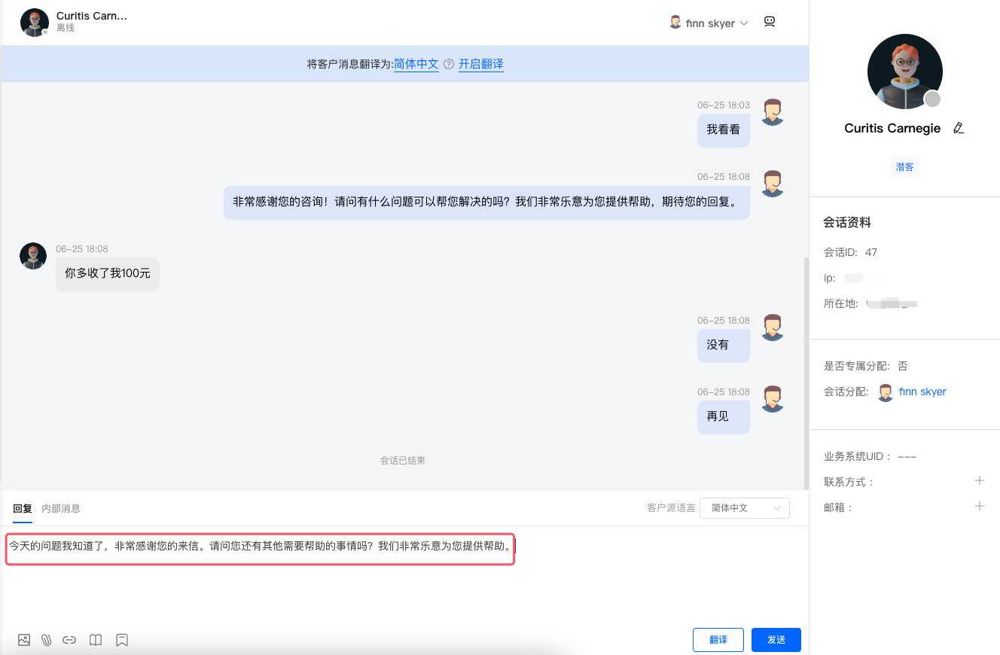
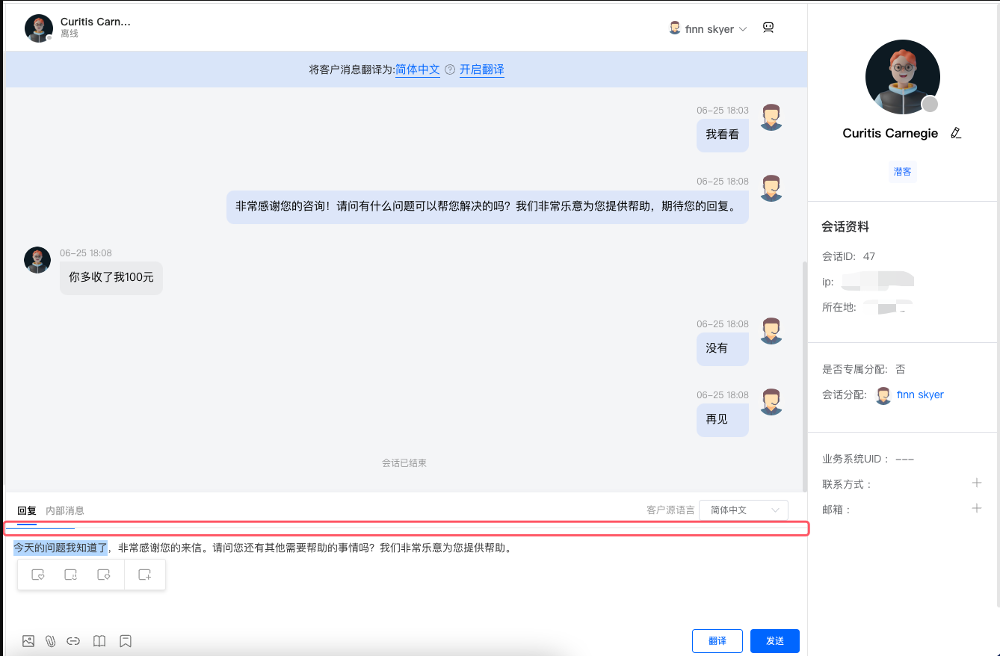
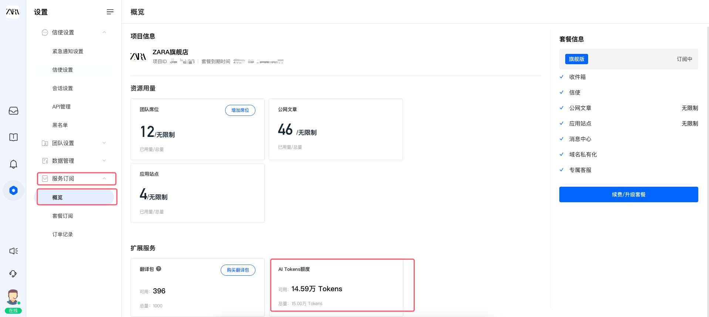

# 会话AI辅助

> 分类:02-会话服务 | articleId:8Z7gbVbmdf | 描述:AI智能，会话辅助

## 1，背景介绍
👋👋👋在现实的客户服务中，您可能会遇到如下的场景：
- 用户咨询问题，但是表述的内容乱七八糟，根本不知道用户想要表达的核心内容是什么；
- 客服协作转交过来的历史会话太长，加入协作的客服成员，需要将历史对话记录全部看完，才能明白用户具体遇到的问题，费时费力；
- 用户的情绪不好，客服该如何应对；
- 客服反馈的内容，该如何让用户阅读起来更舒服；
- 等等；
 我们新加了一些体验性的功能，通过NLP模型，帮助您针对用户的对话信息，快速进行总结和提示。同时，能够在您不知道如何编写反馈信息时，帮您进行内容的扩展和增强。以便于给您带来更好的服务体验。
👇👇👇注意：
1）会话AI辅助 分为：会话洞察 + 会话增强
2）会话AI辅助 是体验性功能，当前的最要目的是提供给您体验使用，并期望能够收集到您的使用反馈；

## 2，会话AI洞察
 在收件箱中，点击会话列表，在会话视图的右上角，您可以看到“会话洞察”的按钮，如下图所示：

 

 通过会话洞察，可以针对用户的历史对话记录，生成四种总结信息：
1、会话总结：用户的所有信息中，想要表达的核心内容是什么；
2、客户情绪分析：用户在进行问题咨询和反馈时，是一种什么样的情绪，比如：高兴、急躁、严谨；
3、客户性格分析：用户的性格如何，便于客服针对性的进行沟通处理；
4、沟通建议：针对该用户，建议客服该采用什么方式进行沟通，有的放矢，便于提高用户的满意度；

## 3、会话AI增强
 当您在编辑器中，写一段文字，反馈给用户的时候，您可以使用“会话增强”功能。
 输入一段文字，然后选中想要增强的内容，就会弹出“会话增强”的选择面板。在选择面板上，包括：
更友好：将选中的内容，通过NLP模型改写，变得更加友好
更俏皮：将选中的内容，通过NLP模型改写，变得俏皮幽默
更专业：将选中的内容，通过NLP模型改写，变得更加专业
扩展：将选中的内容，通过NLP模型，自动进行填充和丰富

👇👇👇注意：
1）编辑器里被选中的内容，经过AI增强之后，会替换原有的内容。AI增强的定位是辅助，所以最终要发送的信息，需要您再审视好。
2）关于不同的增强类型，请结合您实际的需求来选择。
3）会话增强需要一定的时间，您会在如下所示的地方，查看到处理的进度。

## 4、AI Tokens
 会话AI辅助功能，会消耗AI Tokens，即AI资源。
 新项目在创建时，我们会免费赠送 15万的AI Tokens，当您的AI Tokens不足时，您将不能继续使用AI辅助功能。
 您可以在“设置-->服务订阅-->概览”页面，产看到您当前的剩余AI Tokens数量。
 您也可以在订阅套餐时进行AI Tokens的购买，或者任何您需要的时刻，在概览页面进行购买。

