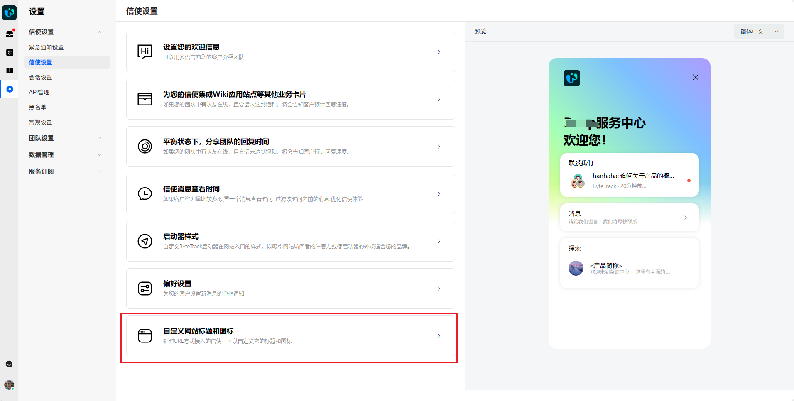
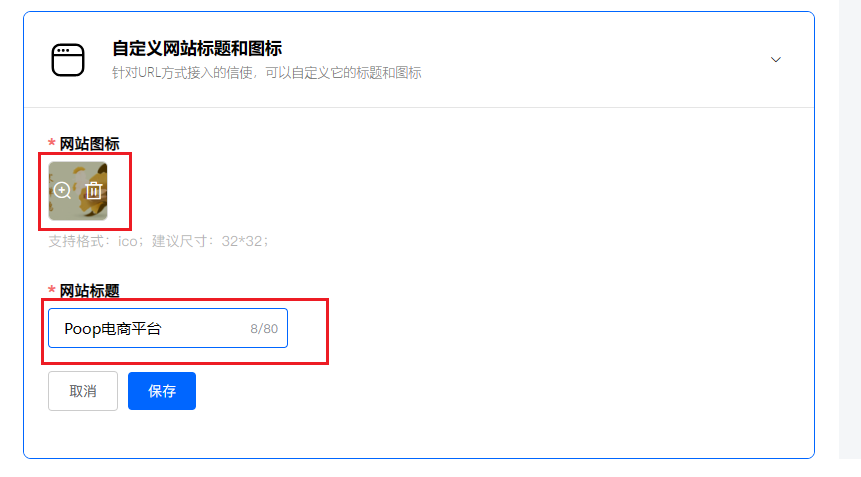
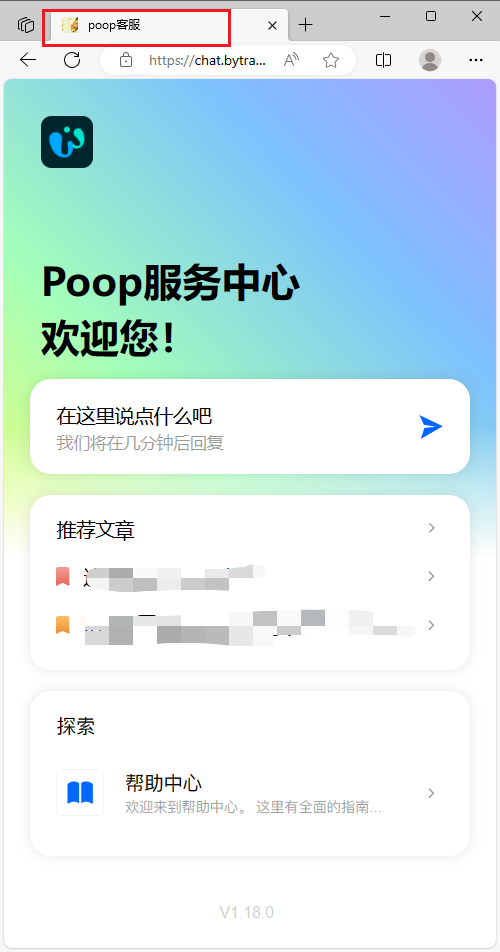
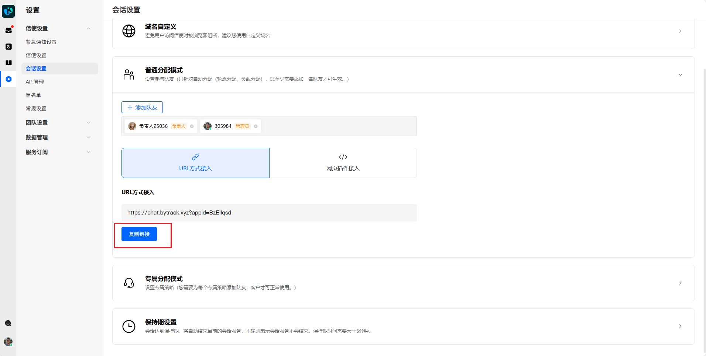

# 自定义网站标题和图标

> 分类:02-会话服务 | articleId:4V9jJy0qAN | 描述:👋👋👋如若您是URL方式接入，您可以轻松自定义网站标题和图标，以适合您的品牌。

自定义网站标题和图标，只针对URL接入有效。若您是JS接入或者SDK接入，请忽略。
您只需要在“设置”→“信使设置”→“信使设置”的最底部，找到“自定义网站标题和图标”👇

上传新的网站图标（只支持ico格式）和网站标题👇

保存后，用URL方式访问您的信使，查看更改是否生效即可。👇

URL地址的位置，在“设置”→“会话设置”→“普通分配模式”。复制后用浏览器打开即可。👇

🎉🎉🎉现在，您已学会自定义网站标题和图标了。接下来，您可以进一步了解：
[为信使设置自定义域名](https://docs.bytrack.com/8CTFE8cF/help/wikidetail?articleId=kHYmF4z0ei&usageCategoryId=593&usageGroupId=-1)
[自定义信使角标](https://docs.bytrack.com/8CTFE8cF/help/wikidetail?articleId=xwpe9Oym6p&usageCategoryId=593&usageGroupId=-1)
