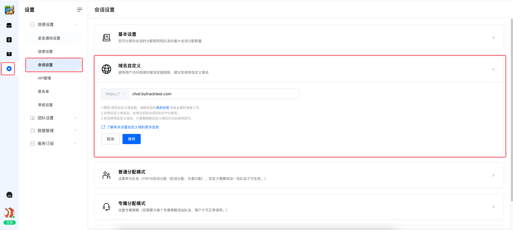
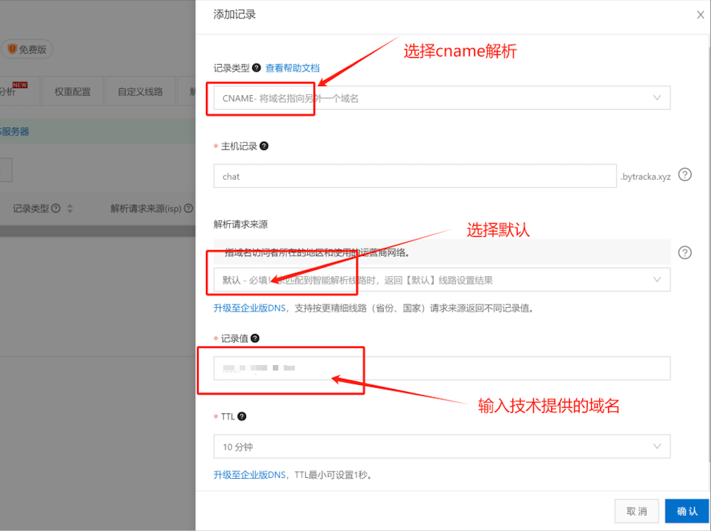
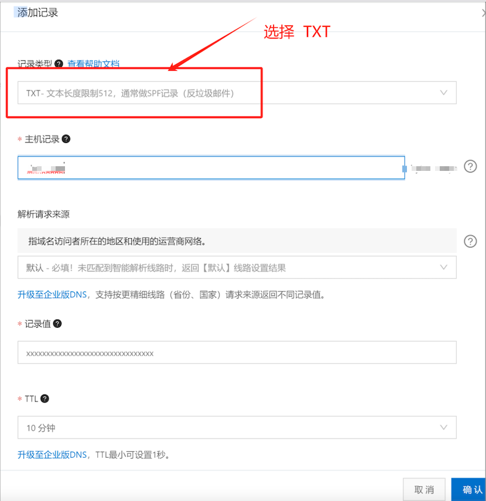
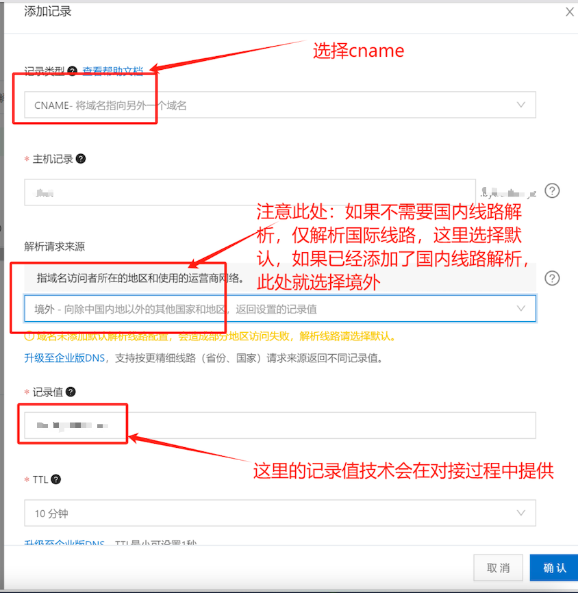
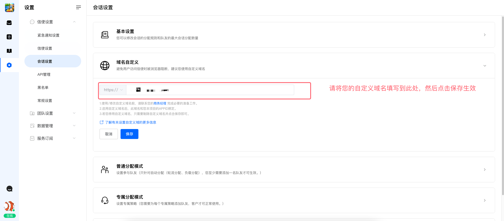
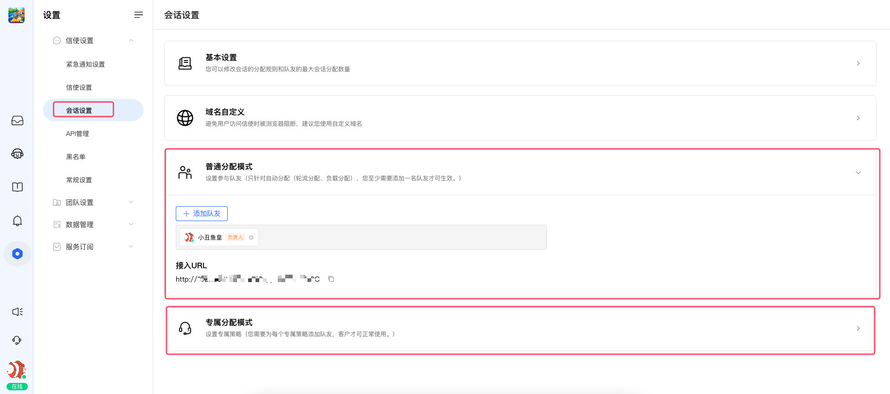

# 如何为信使设置自定义域名

> 分类:02-会话服务 | articleId:kHYmF4z0ei | 描述:信使也可以自定义域名啦

## 1，信使的访问地址
 您在项目中，默认的信使（客服入口链接），使用的是ByteTrack官方提供的通用域名，这个域名被很多其他用户同时在使用。
 如果您对信使的访问地址有特殊的需求，比如想要和您的业务系统保持一致，或者只供您自己使用，那么您可以针对信使的域名自定义。
 比如，默认的信使链接：https://chat.bytetracks.vip/1245。通过您自定义之后，您可以将信使的链接调整为：https://your_domain/1245
 其中your_domian就是您自己提供的域名
 👋👋👋注意：如果您想使用自定义域名，请和您的商务经理联系，我们会安排专门的人员为您提供使用指导！

## 2，信使自定义域名的设置方法
- 申请域名
- 联系您的专属商务经理（或者ByteTrack的官网客服），向ByteTrack申请自定义域名授权。我们将会安排专人，为您提供使用指导
- cname解析域名
- 在上述“会话设置”页面，填写好域名，并点击保存
- 通知您的商务经理，由ByteTrack进行后续的操作验证通过
- 信使自定义域名设置成功

### 2.1，申请域名
 我们推荐您使用alibabacloud进行域名的购买，具体的购买流程，请参考[阿里云域名注册](https://www.alibabacloud.com/zh/domain?_p_lc=1&spm=5176.100251.111252.6.31ec4f15roGxLz)。

### 2.2，提供ssl证书
 您需要向ByteTrack的服务人员，提供您的ssl证书。
👋👋👋注意：您提供的ssl证书，请务必确保证书有效。ssl证书到期不会自动提醒，需要您自行关注证书的有效性。ssl证书到期之前，请您及时将新的证书提供给您的专属客户经理，以便于进行证书的更换！

### 2.3，解析域名
 我们推荐您使用alibabacloud的域名解析服务，下面将以alibabacloud的域名解析服务，进行相关的操作讲解。
 如果您想使用其他解析服务商，您可以参考下面的步骤，让您的技术人员进行相关的处理。
 首先，您需要充分考虑您的业务系统，确定您的用户的区域分布情况：
- 如果您的用户主要是中国境内，那么您可以将域名解析为 “中国境内线路”；
- 如果您的用户主要是中国境外，那么您可以将域名解析为“国际线路”；
- 如果您的用户面向全球，也包括中国境内，那么您可以将域名解析为“全球线路”
 下面，我们将详细介绍每种线路的解析方式。
1，中国境内线路解析
 登陆您的域名解析服务，将您的域名cname解析为 xxx.domain.com, 其中 xxx.domain.com需要您申请开通自定义域名通过之后，由您的服务专员为您提供！

2，国际线路解析
 国际线路解析是需要给域名添加下txt解析验证域名。
 txt解析验证的时候，请使用您的服务专员给您发送的主机记录值和内容。
 具体的操作如下图所示：

txt域名验证通过之后，还需要将您的域名cname解析到指定的目标域名上。

3，全球线路解析
 如果您完成了上述“中国境内线路” 和 “国际线路”的双重解析，则您就已经完成全球线路解析

### 2.4， 填写域名，并保存

域名解析成功之后，您可以在上述页面，将域名填写到“域名自定义”中，填写完毕之后，点击保存即可

### 2.5，使用自定义域名
上述步骤完成之后，您可以直接去“会话设置页面”获取更新之后的信使访问地址

将获取到的信使URL，接入到您的业务系统中即可。
