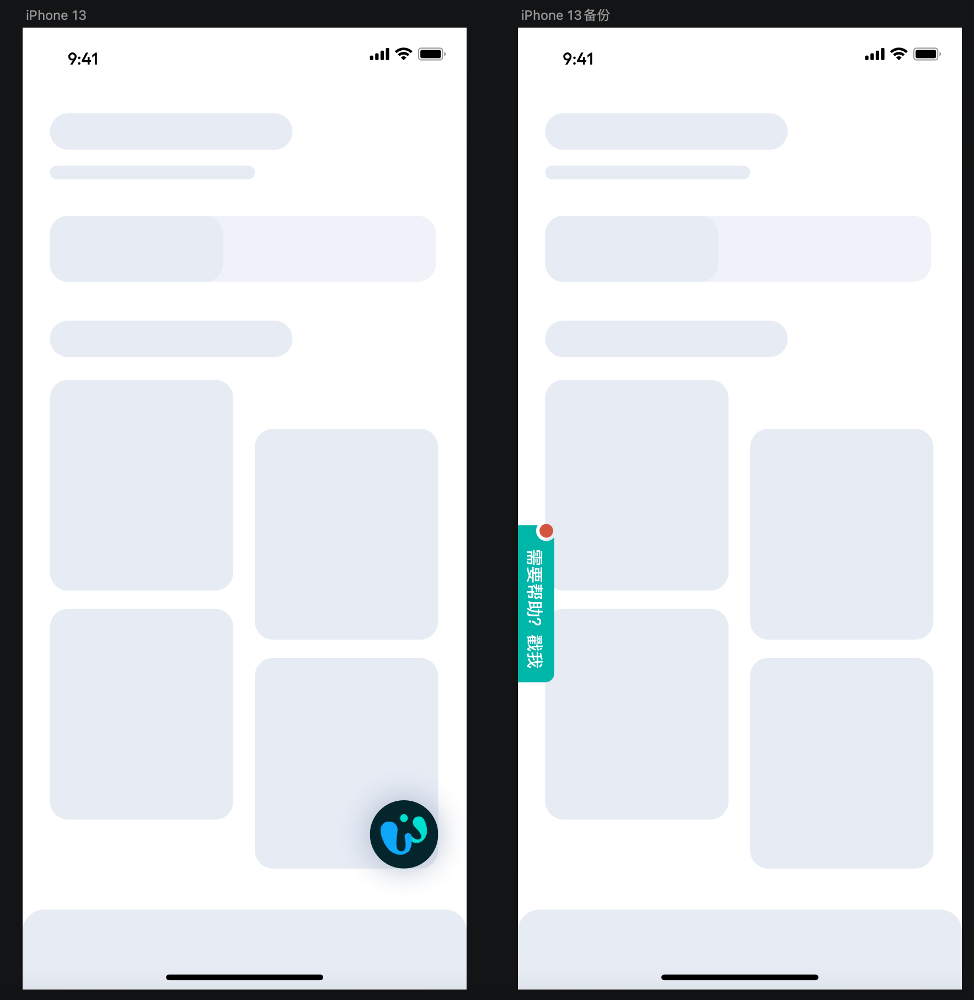
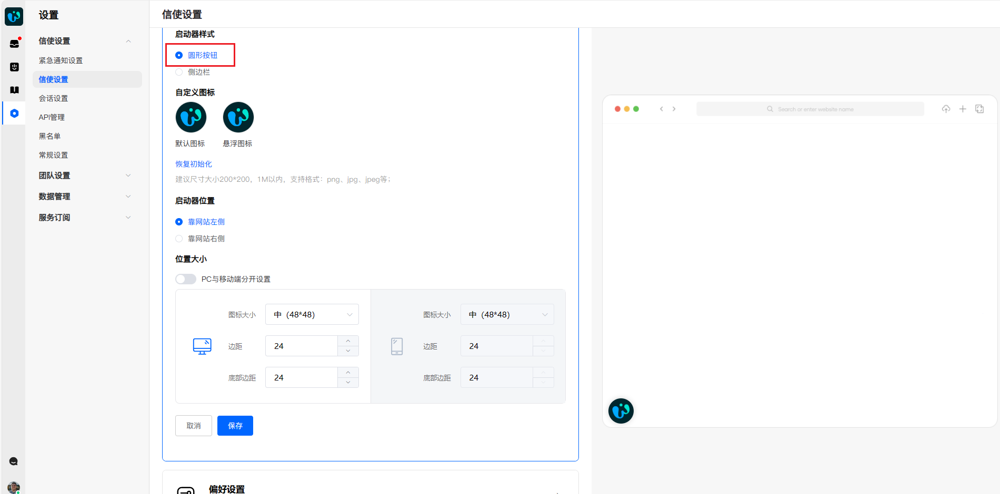
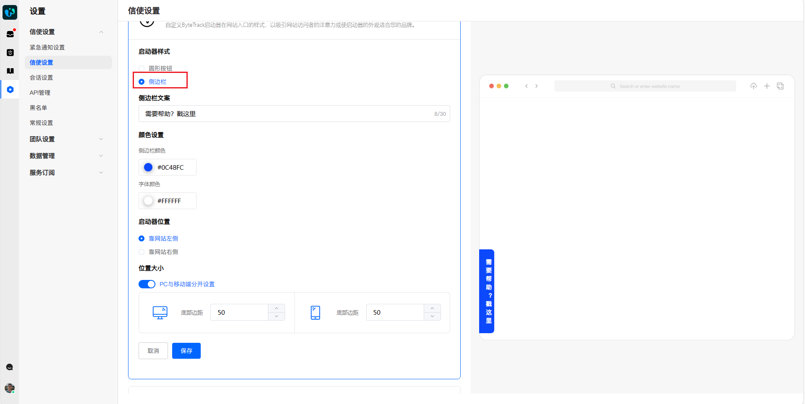

# 如何自定义您的信使角标

> 分类:02-会话服务 | articleId:xwpe9Oym6p | 描述:如果您希望信使角标能更好的适配您的应用或网站，您可以自定义您的信使角标😊

您可以转到“设置”→“信使设置”→“信使设置”，找到“启动器样式”，即可自定义您的信使角标。
信使角标有两种样式：圆形按钮、侧边栏。样式效果见下图👇

## 圆形按钮角标
您需要在“启动器样式”中，选择“圆形按钮”。

下方的所有设置项，均属于圆形按钮的样式设置，包括：
- 默认图标：角标的显示样式。
- 悬浮图标：电脑端，当鼠标悬浮在角标上，角标显示的样式；
- 启动器位置：角标在屏幕里，靠左或靠右显示；
- 图标大小：角标的尺寸，有三种规格：36*36、48*48、60*60；
- 边距：角标靠左时，是角标左边缘与屏幕左边的距离；角标靠右时，是角标右边缘与屏幕右侧的距离。
- 底部边距：角标下边缘与屏幕底边的距离。
您可以为PC和移动端分开设置角标的大小、边距、底部边距。
- PC端：电脑端访问时生效；
- 移动端：APP、H5访问时生效；

如若您对设置的图标不太满意，可以点击“恢复初始化”，重置为系统预设的图标。

## 侧边栏角标
您需要在“启动器样式”中，选择“侧边栏”。

下方的所有设置项，均属于侧边栏的样式设置，包括：
- 侧边栏文案：角标上显示的文案；
- 侧边栏颜色：角标的主题色；
- 字体颜色：侧边栏角标上文案的颜色；
- 启动器位置：角标在屏幕里，靠左或靠右显示；
- 底部边距：角标下边缘与屏幕底边的距离。
您可以为PC和移动端分开设置角标的底部边距。
- PC端：电脑端访问时生效；
- 移动端：APP、H5访问时生效；

请注意：设置的像素尺寸将根据设备的显示密度（DPI）进行自动调整，以确保在不同尺寸的屏幕上保持一致的视觉效果。实际显示的物理尺寸可能与输入的像素值不同。
您可以在右侧预览角标的显示效果（只针对电脑端）。
👋如若您想完全自定义您的角标样式，可以联系您的技术人员，参考[开发者文档。](https://docs.bytrack.com/8CTFE8cF/developers)
