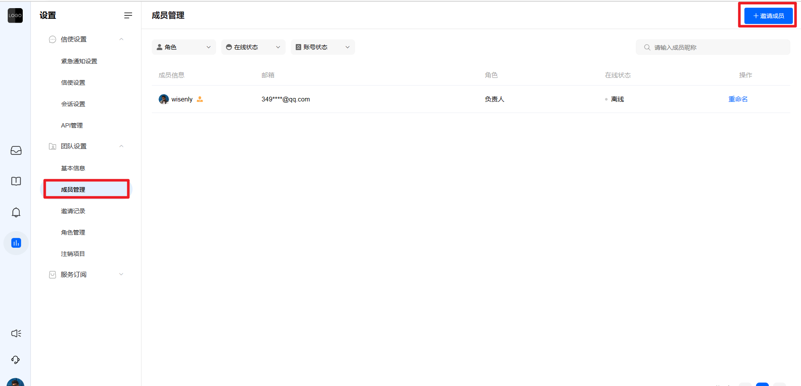
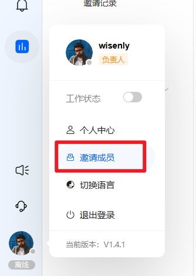
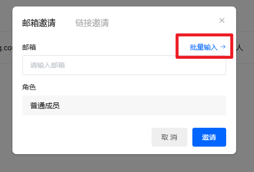
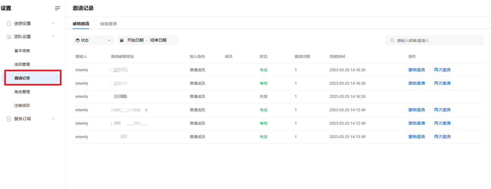
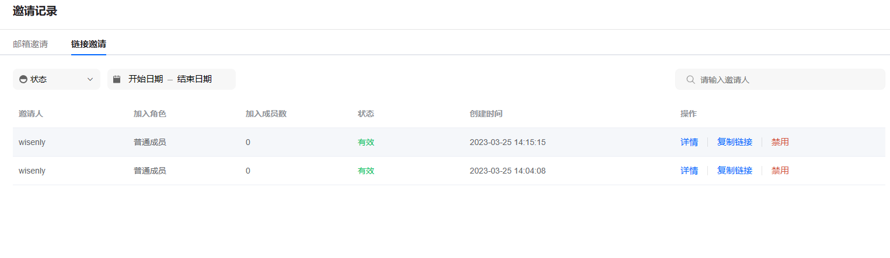

# 邀请队友加入您的团队

> 分类:03-团队角色 | articleId:a9PxDyP8Wg | 描述:

添加队友您可以在设置→成员管理中，点击右上角的“邀请成员”，如下图：

或者左下角点击头像，选择“邀请成员”，如下图：

邀请队友有两种方式：
● 邮箱邀请：输入需要邀请的邮箱，并为该队友指定角色；邀请成功后，对方的邮箱会收到一封邀请链接，可以通过链接直接加入您的项目；
● 链接邀请：如若您不知道对方的邮箱，可以向对方发送邀请链接，对方通过链接直接加入您的项目即可；
注意：
○ 邀请链接的有效期为72小时，一旦过期，需要您重新发起邀请；

批量添加队友ByteTrack 支持批量添加队友，您也可通过两种方式邀请
● 邮箱批量邀请：您只需要在邀请链接的弹框中，点击“批量输入”，如下图：

打开后，在输入框中批量输入对方的邮箱账号即可，如下图：

注意：邮箱之间，需要用逗号区分；
● 链接邀请：您可以切换“链接邀请”，将邀请链接分享给所有需要加入的队友，他们均可通过该链接加入您的项目。
查看邀请记录您可以在“邀请记录”中查看您的历史邀请，如下图：

● 如若想撤销邀请，则在“邀请记录”中点击“撤销邀请”，对方将无法通过邀请地址加入您的团队；如若想继续加入，需要您重新向该邮箱发送新的邀请链接；
● 如若对方在邮件中没有收到邀请链接，可以点击“再次邀请”，系统将重新发送该邀请链接；
您可以切换“链接邀请”查看您的历史邀请链接，如下图：

如若分享的链接不再希望能邀请，则点击“禁用”即可。
您可以点击“详情”，查看通过该邀请链接加入的人数；

👏现在您已成功向队友发送了邀请，那么队友如何加入呢？让我们继续吧👇 
[接受队友的项目邀请并加入项目](https://docs.bytrack.com/8CTFE8cF/help/wikidetail?articleId=RbOl2y8QRF&usageCategoryId=493&usageGroupId=955)
队友加入成功了，在他们工作之前，请为他们设置合适的名称、头像以及角色和权限👇 
[如何为队友设置合适的角色和权限](https://docs.bytrack.com/8CTFE8cF/help/wikidetail?articleId=KxuUQdgMrf&usageCategoryId=493&usageGroupId=956)
[哪里为队友设置名称和头像](https://docs.bytrack.com/8CTFE8cF/help/wikidetail?articleId=74NpWx2xU8&usageCategoryId=493&usageGroupId=957)
