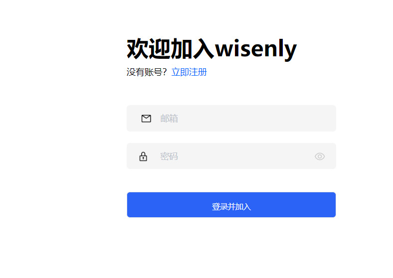
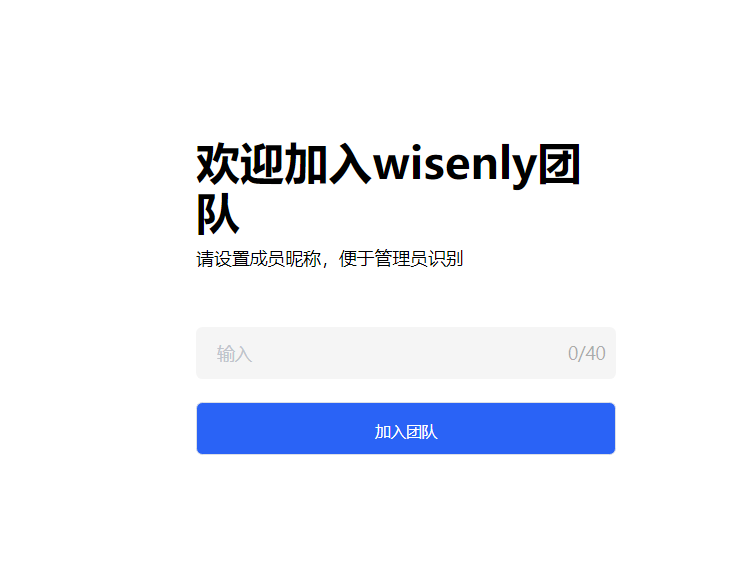

# 接受队友的项目邀请

> 分类:03-团队角色 | articleId:RbOl2y8QRF | 描述:

队友邀请您加入某个项目，要怎么办？如果您是第一次加入 ByteTrack 的项目，请继续阅读。
队友将通过他们的帐户邀请您进入项目，您应该会在收件箱中看到一封邀请电子邮件。您需要做的就是单击“注册并加入”按钮，如下图：

注意：如果您在收件箱中看不到邀请，请检查您的“垃圾邮件”文件夹，以防错过邀请。
接下来，您需要：
通过提供您的电子邮件和密码创建一个新帐户。
如若您已经注册过账号，只需要点击页面下方的“登录并加入团队”，如下图：

您可以更换邮箱加入这个项目。
之后，您还需要设置您在该项目中的名称，以便让客户和队友知道您是谁，如下：

点击“加入团队”，就完成了加入项目流程。
而且，就是这样🎉，您现在已准备好使用ByteTrack与您的团队协作。
当您在这里时，何不查看其他一些指南以帮助您入门：
[开始处理会话](https://docs.bytrack.com/8CTFE8cF/help/wikidetail?articleId=JcmVXIy60o&usageCategoryId=418&usageGroupId=808)
[创建帮助中心的文章](https://docs.bytrack.com/8CTFE8cF/help/wikidetail?articleId=AXVBDeqPkw&usageCategoryId=429&usageGroupId=832)
[创建您的第一条通知](https://docs.bytrack.com/8CTFE8cF/help/wikidetail?articleId=itY5hKtNgV&usageCategoryId=430&usageGroupId=835)
