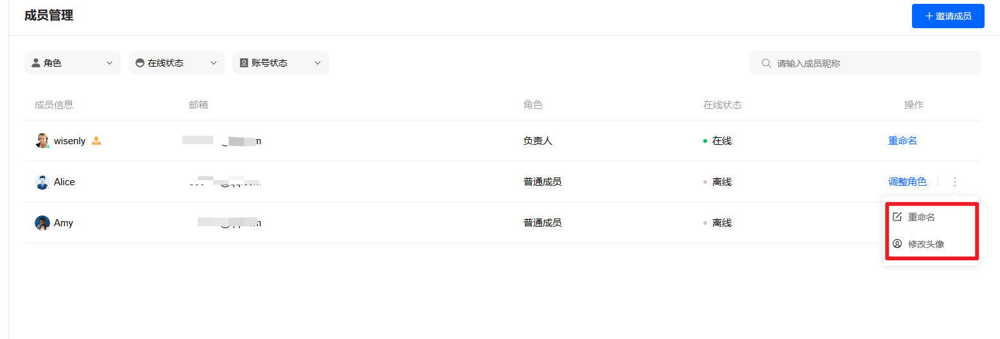
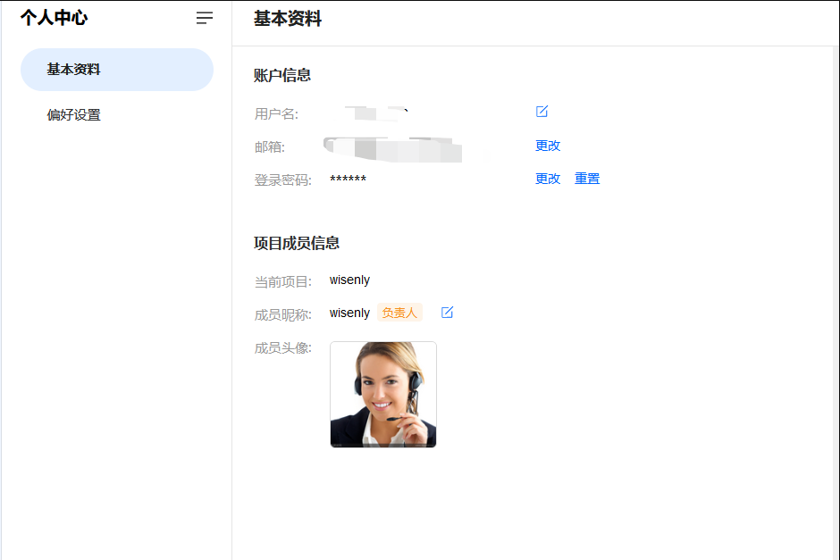

# 哪里设置名称和头像

> 分类:03-团队角色 | articleId:74NpWx2xU8 | 描述:

除了负责人之外，其他队友修改头像和名称只能在成员管理中修改。
因此您可以在成员管理中，为队友设置合适的名称和头像。如下图：

注意：负责人的名称和头像，只能负责人自己在个人中心中设置，如下图：

🎉现在您已知晓在哪里为队友设置名称和头像，那么如何设置一个好的名称呢？让我们继续吧👇
[如何为队友设置一个好的名称](https://docs.bytrack.com/8CTFE8cF/help/wikidetail?articleId=d4l2DcVoGi&usageCategoryId=493&usageGroupId=957)
队友的名称和头像设置完毕，在他们工作之前，请为他们设置合适的角色和权限👇
[如何为队友设置合适的角色和权限](https://docs.bytrack.com/8CTFE8cF/help/wikidetail?articleId=KxuUQdgMrf&usageCategoryId=493&usageGroupId=956)
