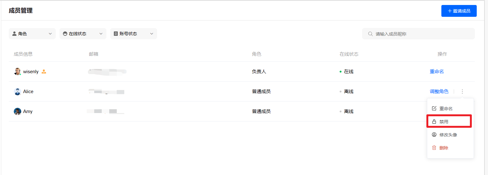
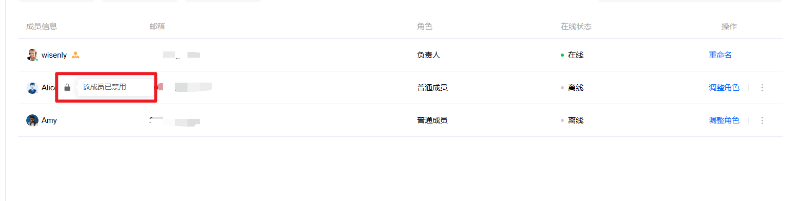
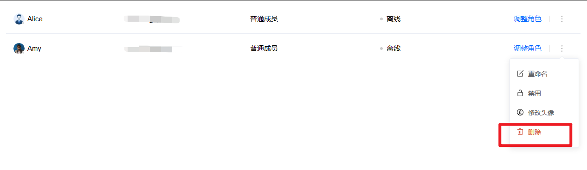

# 如何从团队中禁用、删除队友

> 分类:03-团队角色 | articleId:bglG3lXbJO | 描述:

当有队友从您的团队离职，您可以选择禁用或者删除该名队友。
禁用队友您可以在成员管理中，选中某个队友并禁用，如下图

已经禁用的队友，会出现被禁用的标识，如下图

禁用的队友可以进行解禁，一旦解禁，该队友可以继续访问项目。
注意：
1. 禁用后，被禁用的队友不能再访问该项目。正在访问的队友会被强制退出需重新登录。
2. 禁用时，需要将该队友当前正在进行的会话，分配给其他队友，即您需要在弹框中重新指定要分配的队友。
- 
删除队友您也可以直接删除该队友。如下图：

删除的队友如若想继续加入项目，您需要重新邀请；
注意：
1. 删除队友不影响已经生成的各项记录。如聊天记录。
2. 删除队友时，需要将该队友当前正在进行的会话，分配给其他队友，即您需要在弹框中重新指定要分配的队友。
- 
👏现在您已知晓如何删除、禁用队友了，那就让我们开始处理会话吧👇 
[开始处理会话](https://docs.bytrack.com/8CTFE8cF/help/wikidetail?articleId=JcmVXIy60o&usageCategoryId=418&usageGroupId=808)
