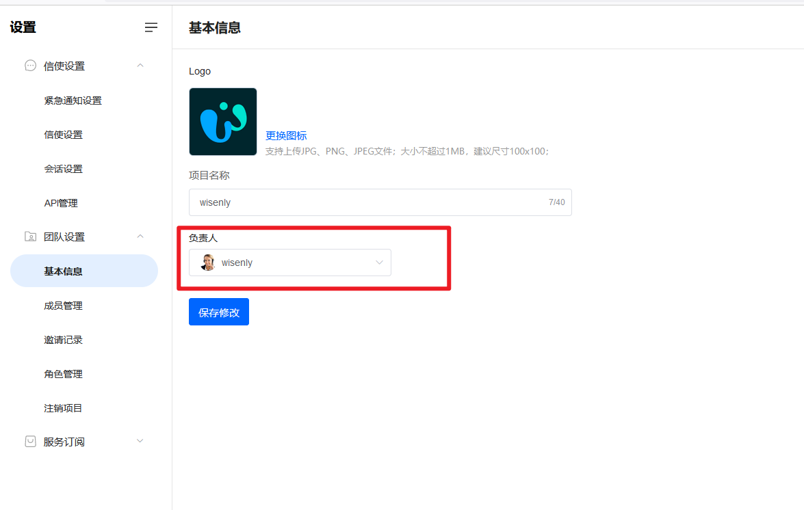
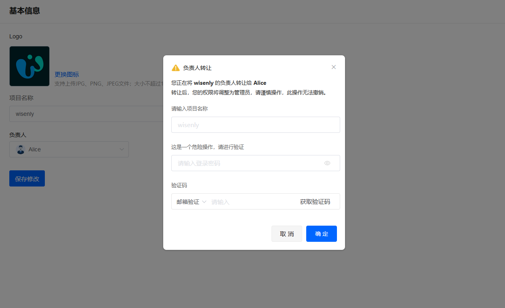

# 如何转让负责人

> 分类:03-团队角色 | articleId:f443Rm4oU9 | 描述:

您创建项目时，项目负责人就是您自己，拥有最高的权限。您可以将您的负责人身份转让给其他队友。入口在基本信息中，如下图：

选择您需要转给的队友，并点击下方的“保存修改”，会出现二次确认页面，如下图：

❌❌❌我们希望您谨慎操作，一旦转让负责人，将不可恢复。
转让成功后，您的角色将变更为管理员。
