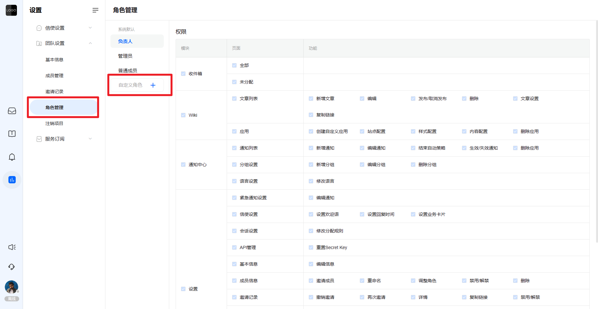
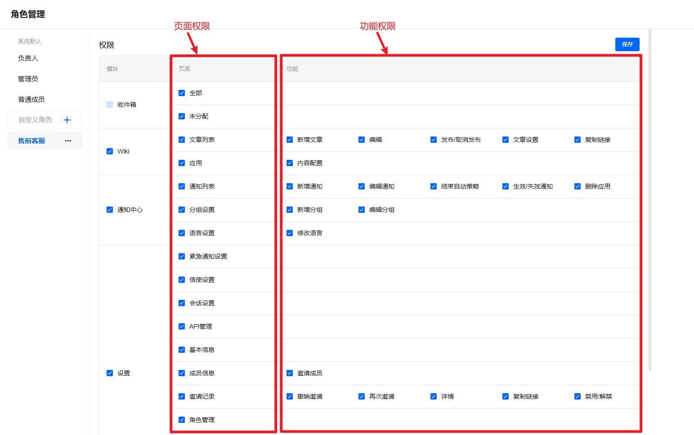
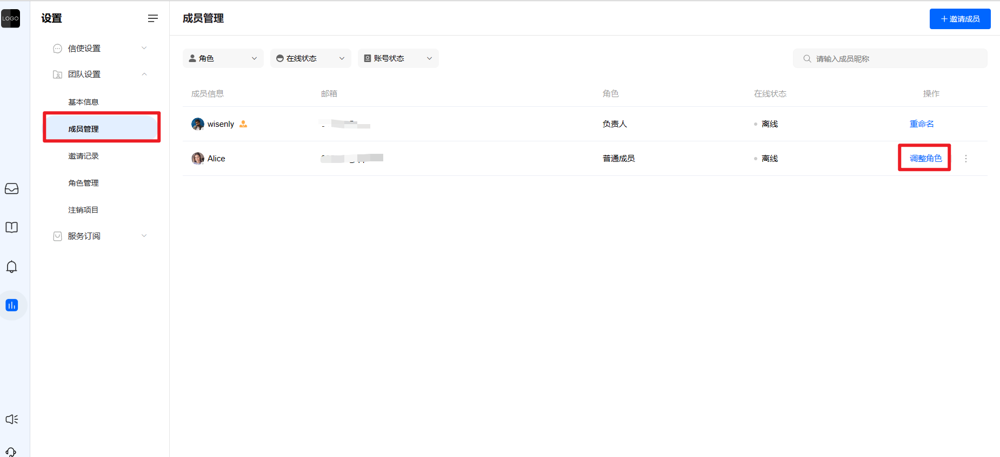

# 为队友设置合适的角色权限

> 分类:03-团队角色 | articleId:KxuUQdgMrf | 描述:

角色管理在为用户设置角色之前，您需要先设置好不同的角色。
ByteTrack初始化时提供三个角色：
● 负责人：负责人是创建该项目的人；
● 管理员：管理员除了项目的敏感权限不支持，其他权限均包括。
● 普通用户：被邀请的队友 ，默认为普通用户。
系统默认的权限以及角色名称不允许被修改。您也可以根据业务需要自定义角色名称。自定义入口如下：

角色权限包括：页面权限、功能权限。
● 页面权限决定了该角色是否能查看该页面的内容；
● 功能权限决定了该角色是否能使用对应的功能；如下图：

注意：
收件箱模块中，我的、提及我的页面权限是默认都有，所有角色都能查看我的、提及我的页面；而全部、未分配页面权限可以根据业务需求自定义。
队友不允许操作自己的角色权限，包括重命名、删除角色和编辑权限。
为队友设置角色权限当角色创建完毕，您就可以将队友拉入对应的角色，从而控制队友的使用权限。入口如下：

👏就是这样，您现在已为您的队友设置好了合适的权限，那么请开始与您的团队协作。
当您在这里时，何不查看其他一些指南以帮助您入门：
[开始处理会话](https://docs.bytrack.com/8CTFE8cF/help/wikidetail?articleId=JcmVXIy60o&usageCategoryId=418&usageGroupId=808)
[创建帮助中心的文章](https://docs.bytrack.com/8CTFE8cF/help/wikidetail?articleId=AXVBDeqPkw&usageCategoryId=429&usageGroupId=832)
[创建您的第一条通知](https://docs.bytrack.com/8CTFE8cF/help/wikidetail?articleId=itY5hKtNgV&usageCategoryId=430&usageGroupId=835)
