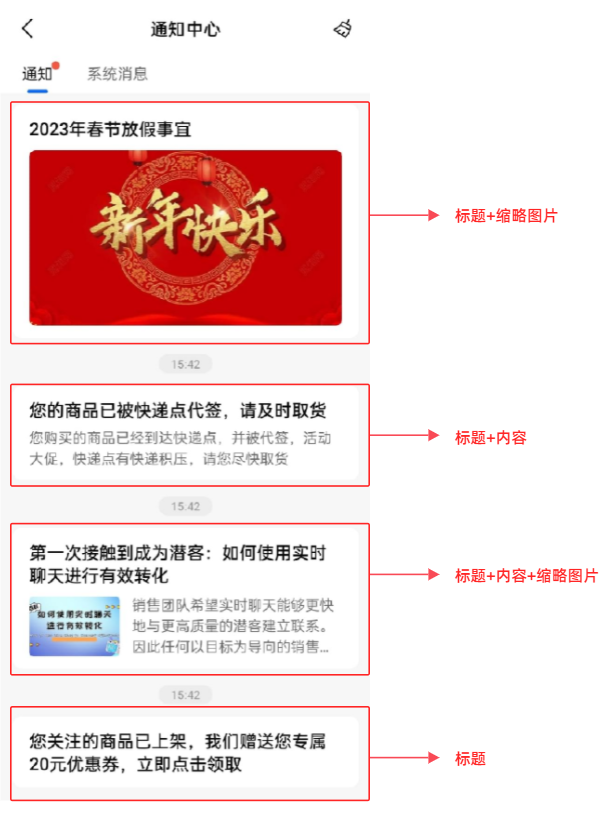
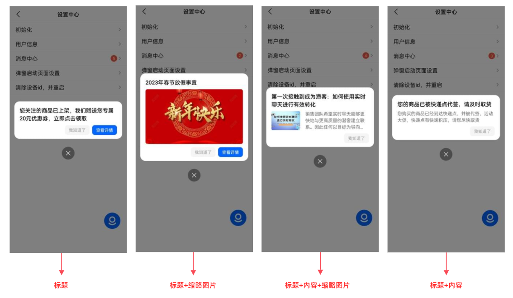
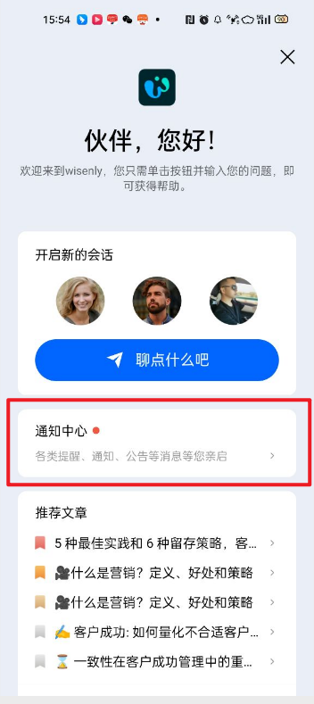

# 什么是通知系统？

> 分类:04-通知中心 | articleId:4p6gbtviNr | 描述:

通知/公告连接了客户和系统，是他们沟通的桥梁，是产品中极其重要的一部分，它能快速将内容的状态及变化通过不同的方式传达给客户，例如：目前的操作状态、交易状态、客户之间的互动内容等，以便客户在收到信息后根据所传递的内容及时做出应对策略。
 但是对于中小企业来说，开发通知/公告系统，需要很长的研发周期，同时后期维护更新的成本也很高。那么如何能像组装积木一样，将完备的通知/公告系统组装在自己的业务中？同时没有后期维护更新的烦恼，在降低研发复杂度的同时，提升客户和系统的沟通，帮助业务打造自己的良性生态。
 ByteTrack提供了通知系统服务，让中小企业像组装积木一样轻松地在自己的业务中集成通知/公告。只要发布编辑通知模板，客户在打开业务系统时，就可以收到个性化的通知。
核心优势[​](https://developer.taptap.com/docs/sdk/billboard/features/#%E6%A0%B8%E5%BF%83%E4%BC%98%E5%8A%BF)节省成本：减少开发成本
运营工具：运营团队日常高频使用到的内容发布工具
个性配置：可以自行上传图文、后续行为，配置多端显示，不需要二次研发
兼容性强：满足移动端和WEB端的多样需求
维护方便：不依赖于其他服务支持
系统介绍ByteTrack的通知系统，支持多种方式发送通知，满足各种场景需求。
● 自动发送（即自动投递）：运营人员创建通知后，由ByteTrack立即或定时发送给指定的客户群；例如：秒杀活动需要定时发送活动入口的通知、系统紧急维护需要立即发送维护通知；
● API发送（即OpenAPI投递）：由业务系统通知ByteTrack发送给指定的用户群；例如：用户充值到账，业务系统通知ByteTrack发送已到账的通知；商品已发货，业务系统通知ByteTrack发送物流单号的通知；
注意：API发送暂不支持定时方式发送；您可以让业务系统延时告知ByteTrack发送通知；
ByteTrack支持向指定用户群发送通知。
● 所有人：无论是否登录，均能收到您发送的通知，包括了用户和游客；
● 所有用户：只有登录成功，才能收到您发送的通知；
● 特定用户：只有您指定的部分用户，才能收到发送的通知；
注意：特定用户需要设置用户的唯一标识（例如UID、手机号等。具体参见[开发者文档](https://docs.bytrack.com/8CTFE8cF/developers/wikidetail?articleId=kFkPUjIL7C&usageGroupId=-1&usageCategoryId=446)）
样式效果介绍ByteTrack支持多种通知模板：
● 标题；
● 标题+内容；
● 标题+内容+缩略图片；
● 标题+缩略图片；
显示效果如下：

ByteTrack支持通知是否弹框显示，弹框样式如下：

注意：
1. API方式暂时不支持弹框样式。
2. 弹框当前支持：WEB端（H5、PC）、APP端；
通知在信使中的显示通知系统除了能任意接入您的业务系统，还能显示在信使中，让客户随时查看通知。页面如下图：

注意：
1. 信使中的未读通知，只支持红点方式显示，业务系统中支持红点、数量两种方式显示（ByteTrack传输的是数量，业务系统若要显示红点，需要稍做处理）。具体请参见[开发者文档](https://docs.bytrack.com/8CTFE8cF/developers/)的各端接口说明文档；
2. WEB端（PC、H5）信使暂不支持显示通知系统，您只能在业务系统中显示；
👏👏👏现在您已初步了解通知系统，那么就让我们继续吧👇
[安装您的通知中心](https://docs.bytrack.com/8CTFE8cF/help/wikidetail?articleId=fGp6FLdhAG&usageCategoryId=430&usageGroupId=836)
[创建您的第一条通知](https://docs.bytrack.com/8CTFE8cF/help/wikidetail?articleId=itY5hKtNgV&usageCategoryId=430&usageGroupId=835)
[创建定制化的通知](https://docs.bytrack.com/8CTFE8cF/help/wikidetail?articleId=KQiIXGsqZ0&usageCategoryId=430&usageGroupId=835)
[查看通知的投递信息](https://docs.bytrack.com/8CTFE8cF/help/wikidetail?articleId=mtdXpLtCor&usageCategoryId=430&usageGroupId=835)
