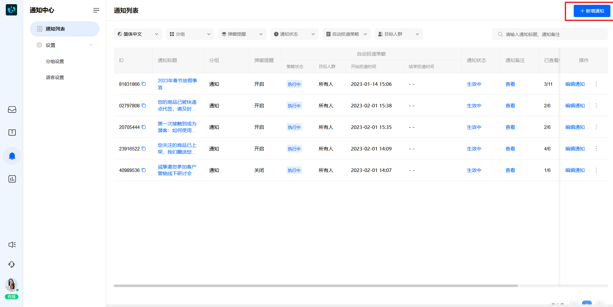
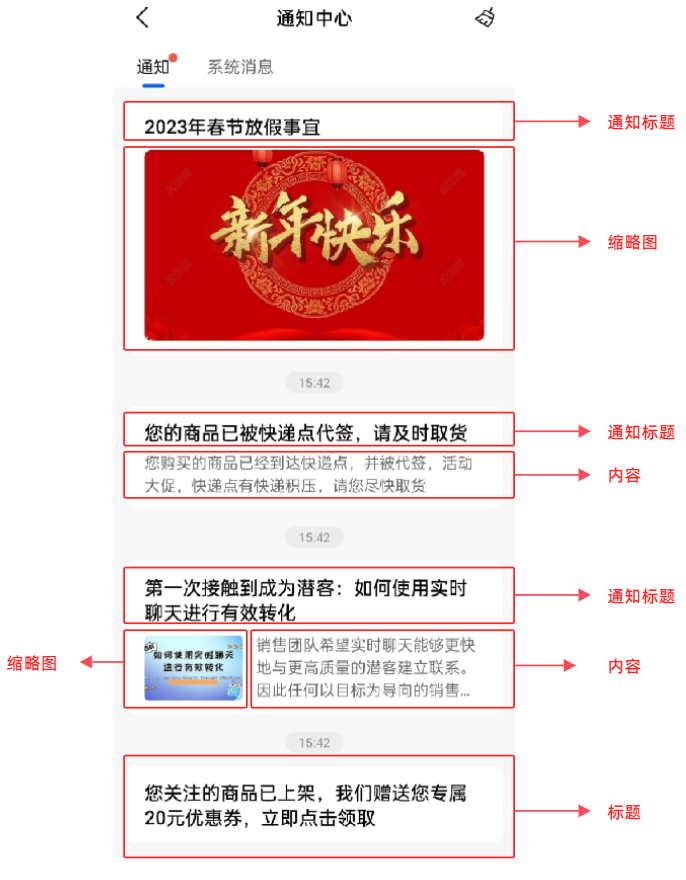
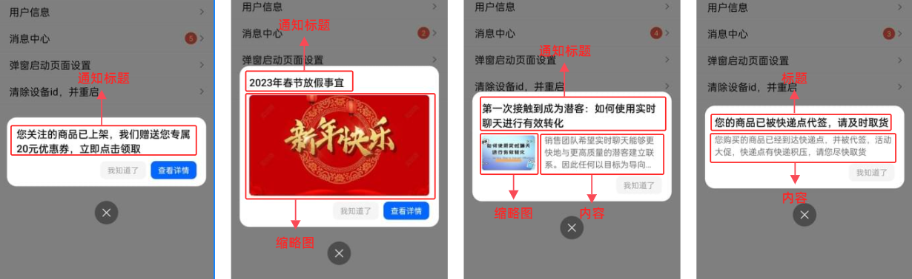
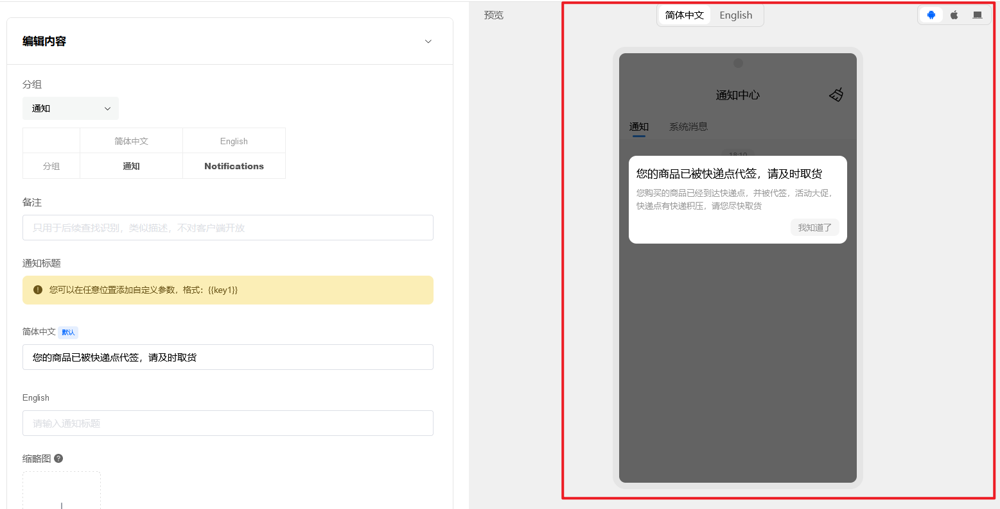
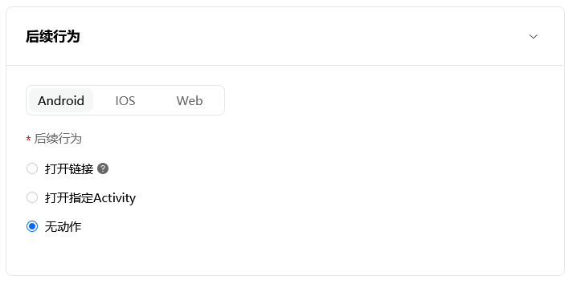
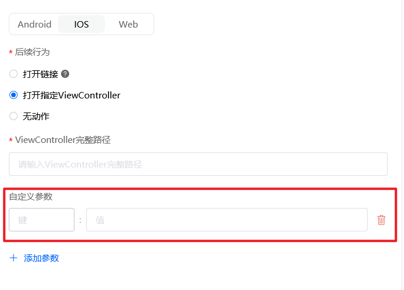
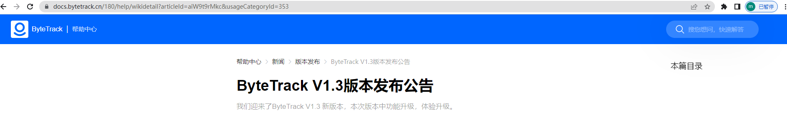

# 创建您的第一条通知

> 分类:04-通知中心 | articleId:itY5hKtNgV | 描述:

创建通知 点击通知中心→通知列表，在页面的右上角，点击“新增通知”按钮，进入创建页面，如下图：

一条通知由以下几个部分组成：
● 基本信息；
● 通知内容；
● 后续行为；
● 投递策略；
通知的基本信息基本信息包括了通知的分组、备注。
● 分组：投递后的通知在哪个分组中显示。通知必须归属到某一个分组才可正常显示在业务端。我们会为您初始化一些分组，您也可以自己编辑您的分组：[为您的通知中心设置分组](https://docs.bytrack.com/8CTFE8cF/help/wikidetail?articleId=IlWF0Ls2ru&usageCategoryId=430&usageGroupId=837)
注意：ByteTrack目前只支持一级分组，不能创建多级分组。
● 备注：对通知的补充说明，用于您内部团队管理通知，不对用户端显示。
什么是通知内容通知内容是能呈现给客户的，这条通知的信息。包括：通知标题、缩略图、内容、弹框。
● 通知标题：必填项，支持多语言显示。如若您的通知开启了多语言，需要为通知标题分别设置每种语言下的显示文案。
注意：
1. 多语言场景下，通知标题至少有一个语言项已经填入，才可保存。
2. 多语言场景下，如若您只想发送一个语言的通知，只需要输入这个语言的通知标题，其他语言的通知标题不输入即可。例如如若您只想发送简体中文的通知，只需要为简体中文设置通知标题，其他语言不设置，即可。
● 缩略图：非必填，缩略图支持格式包括：jpg、jpeg、png、gif。如若您设置了内容，建议上传的图片宽高比3:2，如若您未设置内容，建议上传的图片宽高比为16:9，确保显示的图片不会被裁剪；
● 内容：非必填，支持多语言的显示。如若您的通知开启了多语言，您可为内容分别设置每种语言下的显示文案。
● 弹框：当通知投递后，业务端能在打开应用的时候收到弹框的通知。为了确保不会对客户产生太多的干扰，我们建议您控制弹框的数量，并且为通知设置好结束投递时间，防止积压的通知过多，用户一次性收到很多的弹框。
 ○ 通知投递后，当用户打开应用（APP端）、刷新页面（web端），能收到弹框；
 ○ 一个用户只能在一端收到该条通知的弹框，例如：如果用户在IOS端收到了弹框，在安卓端就不再收到该弹框；
 ○ 用户端弹框太多的时候，会按照投递时间的顺序显示，即优先显示投递时间越久的弹框；
 ○ APP端支持指定页面弹框，具体参见各端的[接入文档](https://docs.bytrack.com/8CTFE8cF/developers/)；
注意：
1. 弹框只有在自动投递策略下才会生效，OpenAPI投递不支持弹框。
2. APP端如若不指定页面弹框，ByteTrack会在业务系统调用SDK时进行弹框，有可能会导致APP正处于开机动画时弹框。因此我们建议您设置好指定页面。

## 位置说明
在业务端通知中心呈现的位置分别如下：

在弹框中呈现的位置分别如下图：

弹框窗口的按钮介绍：
○ 我知道了：关闭当前弹框，如若有其他弹框待显示，继续打开下一个弹框，直到所有弹框均显示完毕，弹框窗口消失；
○ 查看详情：如若弹框有后续行为，点击后跳转到指定页面；
○ 关闭：本次关闭整个弹框的窗口。如若有其他弹框待显示，则在下一次打开APP时显示；

## 实时预览
标题、缩略图在业务端显示的行数有限，建议您在编辑时，根据右侧的预览效果，修正您的字数。如下图：

您可以在预览效果上方，切换多语言按钮，显示不同语言下的预览效果；
为您的通知设置后续行为ByteTrack通知系统支持您为安卓、IOS、Web端设置不同的后续行为。如下图：

○ 打开链接：客户点击后跳转到具体的页面；
○ 打开指定Activity：客户点击后跳转到该类名（完整路径，包名加类名）对应的页面。只有安卓内部跳转，例如：安卓端点击弹框，跳转到订单列表页；
○ 打开指定Viewcontroller：客户点击后跳转到所在视图控制器的类名（字符串）。只有IOS内部跳转，例如：IOS端点击弹框，跳转到订单列表页；
○ 打开自定义事件：客户在点击时候,ByteTrack将通过事件回调的方式将自定义参数和事件名称回调给业务方；
○ 无动作：客户点击没有任何跳转行为。
注意：
1. Activity、Viewcontroller、自定义事件分别在安卓、IOS、web里才能生效；
2. 如若您的类名有自定义参数，例如某一个订单的订单详情页，需要为您的类名设置自定义参数（值是该自定义参数的默认值，若OpenAPI方式没有指定键的值，将使用默认值）如下图：

3. 自定义参数建议您通过OpenAPI方式投递。自动投递策略下，自定义参数的键对应的值不能修改（一直是默认值），详细介绍见创建[定制化通知](https://docs.bytrack.com/8CTFE8cF/help/wikidetail?articleId=KQiIXGsqZ0&usageCategoryId=430&usageGroupId=835)
具体设置，详见[开发者文档](https://docs.bytrack.com/8CTFE8cF/developers/)。
4. 如若后续行为是跳转到wiki应用站点的某篇文章，该站点的类别详情页是列表模式，建议您从wiki应用站点里获取该文章在站点里的链接。如下图：

投递策略ByteTrack支持两种投递方式：自动投递策略、OpenAPI投递策略。

## 自动投递策略
自动投递策略开启后，将有ByteTrack根据您设置的参数，定时定向往客户的通知中心投递该条通知。自动投递策略下，您需要设置：
● 策略状态：一旦开启，表示您启用了自动投递策略。关闭后，自动投递策略不生效；自动投递策略的详细状态包括：未开启、待执行、执行中、已结束。
 ○ 未开启：您未启用自动投递策略；
 ○ 待执行：您开启了自动投递策略，但是执行时间还未到；
 ○ 执行中：您的自动投递策略正在陆续投递中，一旦有符合条件的客户，都将被投递；
 ○ 已结束：结束投递时间已到，不再执行自动投递策略；
● 目标人群：支持向所有人、所有用户、特定用户发送通知；
 ○ 所有人：无论是否登录，均能收到您发送的通知；
 ○ 所有用户：只有登录成功，才能收到您发送的通知；
 ○ 特定用户：只有您指定的部分用户，才能收到发送的通知；
注意：特定用户需要设置用户的唯一标识（例如UID、手机号等。具体参见[开发者文档](https://docs.bytrack.com/8CTFE8cF/developers/)）
● 开始投递时间：开始投递时间到了，ByteTrack才会触发自动投递策略，并陆续往符合条件，且在线的客户投递通知；
● 结束投递时间：结束投递时间到了，该条通知停止自动投递，不再继续为满足的客户投递策略；结束投递时间为非必填。不填则表示所有目标客户，无论何时符合投递条件，都能被投递该条通知。为了确保不会对客户产生太多的未读通知干扰，我们建议您为通知设置合适的结束投递时间。
注意：自动投递策略下，一个客户只会收到该通知投递的一次记录；

## OpenAPI投递策略
ByteTrack在您创建通知时，会为该通知生成一个唯一的ID。您可以通过ID，进行OpenAPI方式投递。
OpenAPI投递策略下，客户被投递时间、投递次数，均由您的业务端决定。只要业务端对ByteTrack进行请求，ByteTrack就会往该客户的通知中心投递通知。具体设置参见[REST API](https://docs.bytrack.com/8CTFE8cF/developers/wikidetail?articleId=kFkPUjIL7C&usageGroupId=-1&usageCategoryId=446)。
注意：我们建议您根据业务场景，在OpenAPI投递、自动投递两者中选择一个使用，尽量不要两者同时使用。
创建好通知后，您可以查看该通知的投递记录，详见[查看通知投递信息](https://docs.bytrack.com/8CTFE8cF/help/wikidetail?articleId=mtdXpLtCor&usageCategoryId=430&usageGroupId=835)
👏👏👏现在您已初步了解如何创建通知，那么就让我们更深入吧👇
[创建定制化的通知](https://docs.bytrack.com/8CTFE8cF/help/wikidetail?articleId=KQiIXGsqZ0&usageCategoryId=430&usageGroupId=835)
