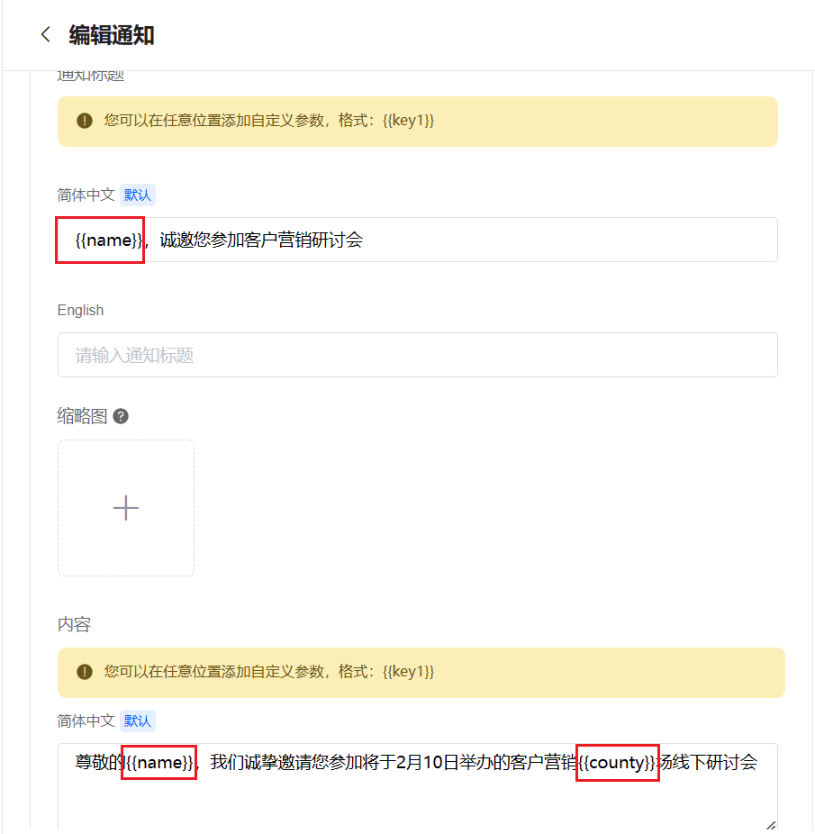
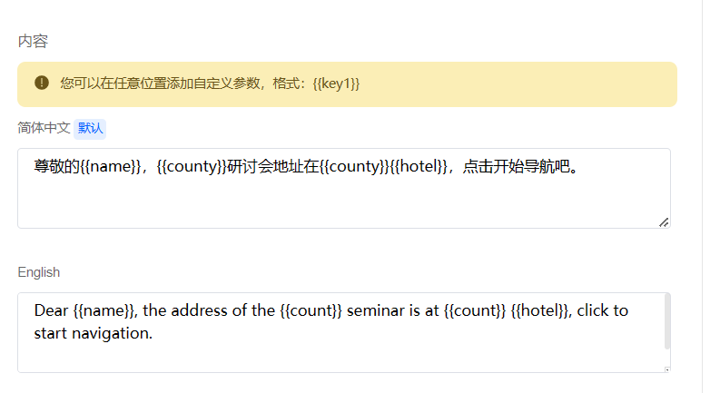
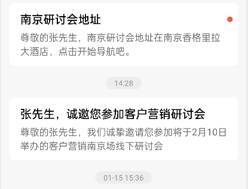
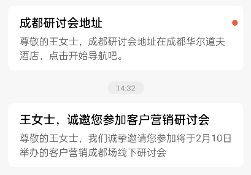
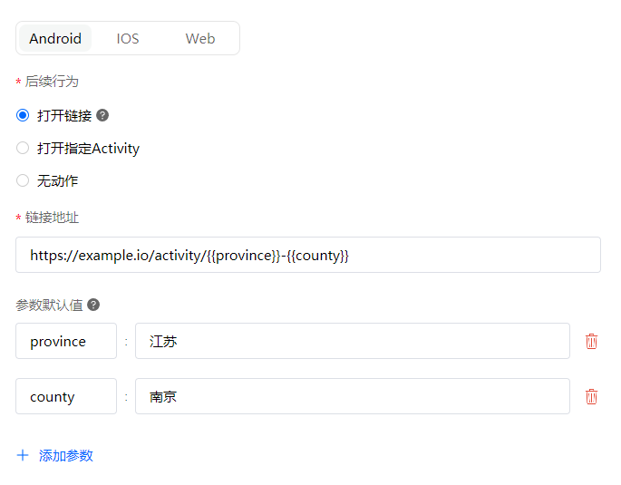
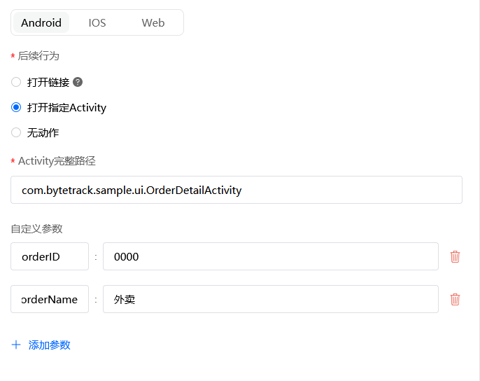
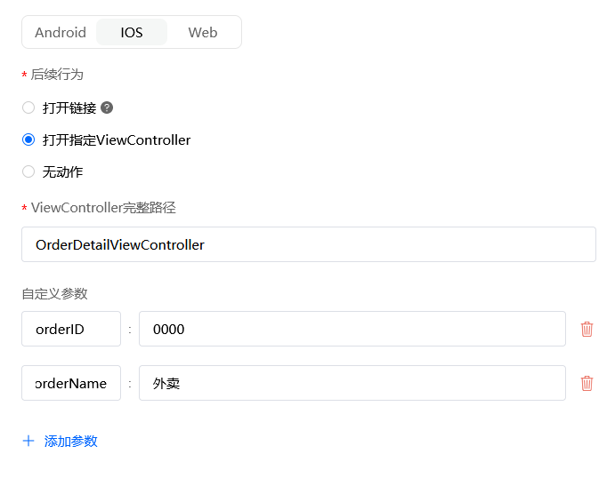
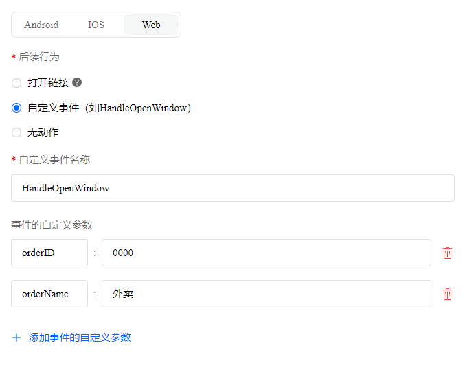

# 创建定制化的通知

> 分类:04-通知中心 | articleId:KQiIXGsqZ0 | 描述:

ByteTrack支持创建定制化的通知，主要体现在两个方面：
● 通知内容的定制化：通知标题、内容添加自定义参数；
● 后续行为添加自定义参数；
注意：定制化内容只针对OpenAPI策略有效，自动投递策略不生效。
通知内容定制化
## 创建定制化的通知内容
编辑通知标题、内容时，在合适的位置，通过自定义参数标识符{{}}，约定自定义参数。如下图：

这里支持同时存在多个自定义参数。例如：

注意：
1. 英文环境下，多个自定义参数之间注意添加空格，防止拼凑成一个单词。
2. 右侧预览时，是直接预览的输入内容，并没有考虑自定义参数的键值。
ByteTrack自定义参数和业务系统的参数逻辑如下：
ByteTrack中定义了自定义参数的key业务系统设置了自定义参数的值自定义参数显示效果案例的结果是，例如{{county}}否以{{}}显示{{county}}是，例如{{county}}是，例如北京正常显示北京否否不会显示无否是，例如北京不会显示无注意：通知内容里的自定义参数是不存在默认值的，即您在后续行为中设置的默认值，并不会影响通知内容里的自定义参数。

## 通知效果预览

后续行为定制化后续行为定制化主要体现在两个方面：
○ 打开的链接定制化；
○ 打开的Activity/打开Viewcontroller/打开自定义事件的定制化

## 打开链接的定制化
场景：
1. 用户参与活动中奖，平台向用户发送通知，邀请用户确认定制化的中奖信息。每个中奖用户的确认页面不一样，就可通过链接定制化的方式解决；
2. 平台举办“为自己城市打CALL”活动，利用通知中心，向用户发送专属城市的活动页面，就可通过链接定制化的方式解决；

### 设置定制化链接
后续行为中，选中“打开链接”，在您想要用户跳转的链接地址中，通过自定义参数符号标识出自定义参数即可。如若自定义参数有默认值，需要选择“参数默认值”，为这些参数分别设置默认值（即“值”对应的输入框中需要输入内容）。例如：

然后在通过OpenAPI方式投递时，业务系统告知ByteTrack每个自定义参数的值即可。
如若您想为安卓、IOS、web设置不同的跳转，请确保这些参数的key不同，如下：
Android-打开链接： https://www.bytetrack.cn/{{industry1}}
IOS-打开连接： https://www.bytetrack.cn/{{industry2}}
Web-打开连接：https://www.bytetrack.cn/{{industry3}}
注意：当业务系统不告知ByteTrack自定义参数的值时，ByteTrack会使用默认值。为了客户的正常显示和使用，建议您为每个参数设置默认值。
ByteTrack自定义参数和业务系统的参数逻辑如下：
ByteTrack定义了自定义参数的keyByteTrack定义了自定义参数的默认值业务系统设置了自定义参数的值自定义参数显示效果案例结果是，例如{{county}}是，例如深圳是，例如北京正常显示北京是，例如{{county}}是，例如深圳否显示为默认值深圳是，例如{{county}}否是，例如北京正常显示北京是，例如{{county}}否否以{{}}显示{{county}}否否是，例如北京不会显示无否否否不会显示无否是，例如深圳是，例如北京不会显示无否是，例如深圳否不会显示无
## 打开Activity/Viewcontroller/自定义事件的定制化
场景：
电商APP中，用户购买的商品已经发货，平台发送通知给用户告知已发货，用户可以点击跳转到该订单详情查看。每个通知对应的订单详情不一样，安卓就可以通过Activity，IOS可以通过Viewcontroller，Web可以通过自定义事件的定制化的方式解决；

### 设置定制化Activity/Viewcontroller/自定义事件
安卓：后续行为中，选中“打开指定Activity”，并输入Activity的完整路径，同时根据实际情况，选择“添加参数”，设置自定义参数的键和默认值（即“值”对应的输入框中需要输入内容）。例如：

IOS：后续行为中，选中“打开指定Viewcontroller”，并输入Viewcontroller的完整路径，同时根据实际情况，选择“添加参数”，设置自定义参数的键和默认值（即“值”对应的输入框中需要输入内容）；例如：

Web：后续行为中，选中“自定义事件”，并输入自定义事件的名称，同时根据实际情况，选择“添加事件的自定义参数”，设置自定义参数的键和默认值（即“值”对应的输入框中需要输入内容）；例如：

然后在通过OpenAPI方式投递时，业务系统告知ByteTrack每个自定义参数的值即可。
ByteTrack自定义参数和业务系统参数逻辑如下：
ByteTrack定义了自定义参数的key和默认值业务系统设置了自定义参数的值自定义参数显示效果案例结果是，例如key为{{county}}，默认值为：深圳是，例如北京正常显示北京是，例如key为{{county}}，默认值为：深圳否显示为默认值深圳否是，例如北京不会显示无否否不会显示无注意：
1. 当ByteTrack不定义自定义参数的key和默认值时，业务系统设置自定义参数的值是无效的。因此当业务系统有新的自定义参数key时，我们建议您及时在ByteTrack中先定义该自定义参数的key和默认值。
2. 当前默认值不支持空值，如若您想传输空值，建议您通过业务系统设置，例如："county": ""
3.如若您想为安卓、IOS、web分别设置自定义参数，请确保自定义参数的key值不同。
4.Activity完整路径、ViewController完整路径、自定义事件名称 这三项不支持通过参数标识符的方式，添加自定义参数，例如：confirmshopcontroller{{name}}，ByteTrack会完整的回调给业务方，而不会根据参数标识符进行替换。
其他请参见[开发者中心](https://docs.bytrack.com/8CTFE8cF/developers/)。
👇如何查看通知投递记录？
[查看通知投递记录](https://docs.bytrack.com/8CTFE8cF/help/wikidetail?articleId=mtdXpLtCor&usageCategoryId=430&usageGroupId=835)
