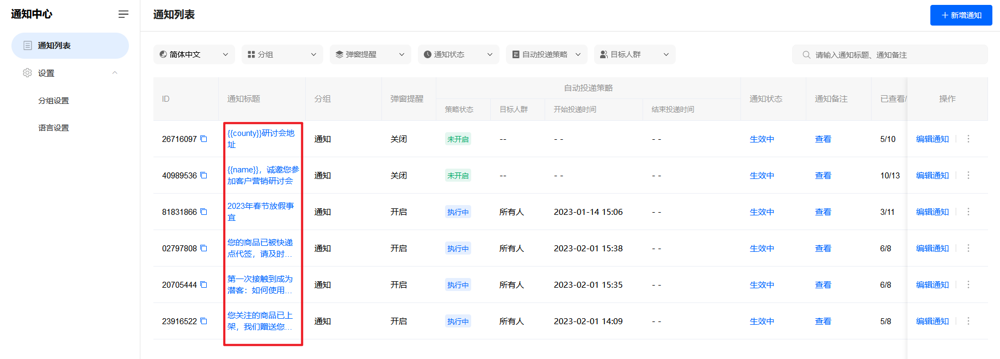
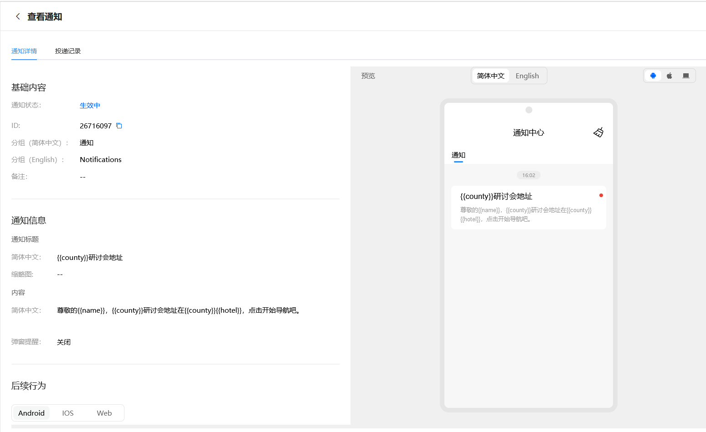
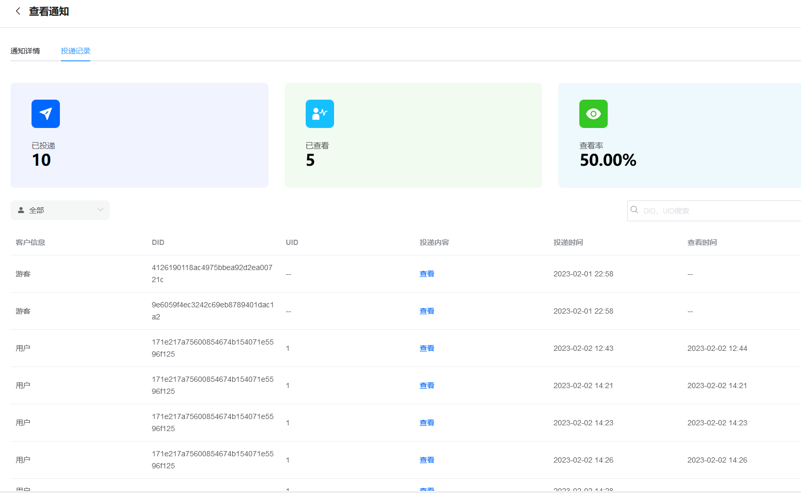
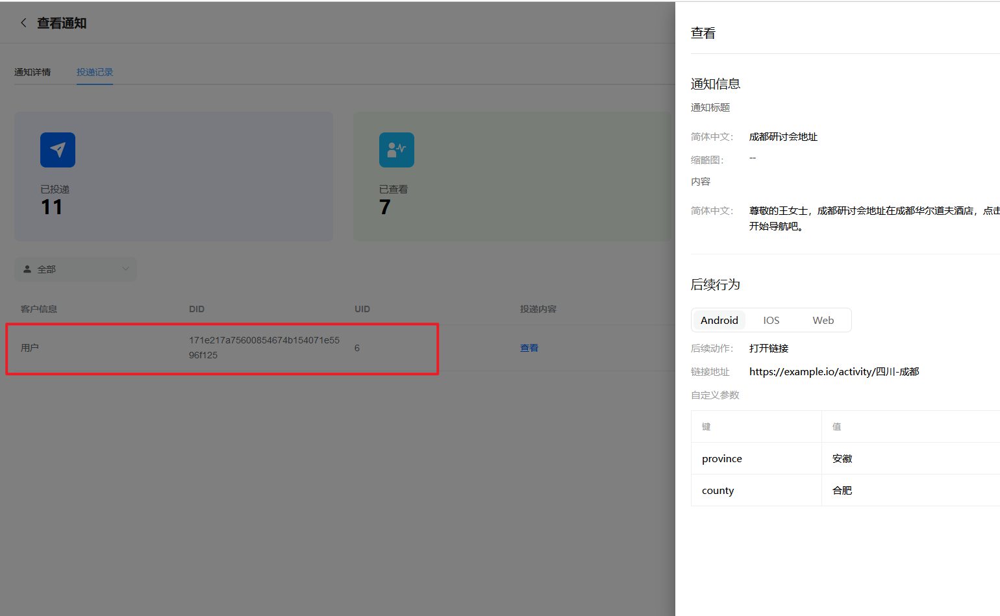

# 查看通知投递信息

> 分类:04-通知中心 | articleId:mtdXpLtCor | 描述:

您可以在通知详情里，查看该通知设置的详细内容、历史投递记录、每个客户显示的投递详情。
在通知列表中，点击某个通知标题，进入通知详情，入口如下图：

通知详情如下图：

您可以切换到“投递记录”，查看所有投递信息，包括每一个客户的投递时间、客户查看时间，如下图：

您还可以点击“查看”，了解该客户收到的详细投递内容，如下图：

👇如何丰富通知中心？
[为您的通知中心设置分组](https://docs.bytrack.com/8CTFE8cF/help/wikidetail?articleId=IlWF0Ls2ru&usageCategoryId=430&usageGroupId=837)
[为通知中心设置多语言](https://docs.bytrack.com/8CTFE8cF/help/wikidetail?articleId=VV8PmZUGdy&usageCategoryId=430&usageGroupId=837)
