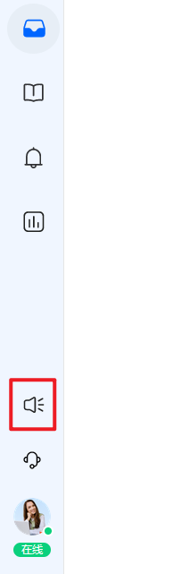
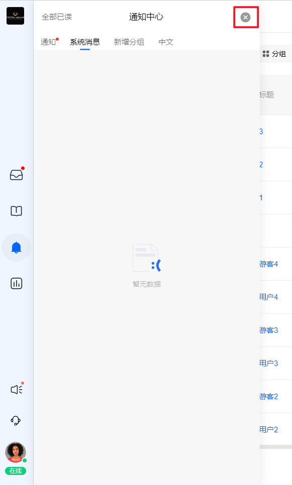
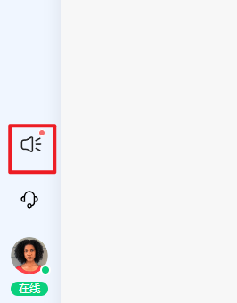

# 安装您的通知中心

> 分类:04-通知中心 | articleId:fGp6FLdhAG | 描述:

通知中心当前支持：安卓、IOS、WEB端显示。
目前通知中心支持如下两种安装方式：
1. ByteTrack的信使中显示通知中心，由ByteTrack提供样式和入口，您只需要一键开启即可使用。
此种方式下，通知中心入口和详情，均显示在信使内部，针对后续行为是“查看正文”类，也在信使内部显示。
2. ByteTrack提供样式，可供项目方在业务系统中单独接入，即能在业务系统中以独立入口显示，点击就可打开/关闭通知中心的显示。如下图：

此种方式下，您可以调整通知中心的大小、位置。
注意：web端通知中心采用动态设置的方式，调整通知中心样式，因此可以用来适配不同的业务界面，例如：PC、H5.
当前版本只能通过这两种方式关闭通知中心的窗口：
 1. 点击通知中心右上角的关闭按钮；如下图：

 2. 点击业务系统的入口；如下图：

注意：暂不支持点击其他的空白处关闭。
您可以同时使用两种方式安装。现在开始安装吧：
[开发者中心](https://docs.bytrack.com/8CTFE8cF/developers/)
👏👏👏安装好通知中心后，就开始创建第一条通知吧👇
[创建您的第一条通知](https://docs.bytrack.com/8CTFE8cF/help/wikidetail?articleId=itY5hKtNgV&usageCategoryId=430&usageGroupId=835)
