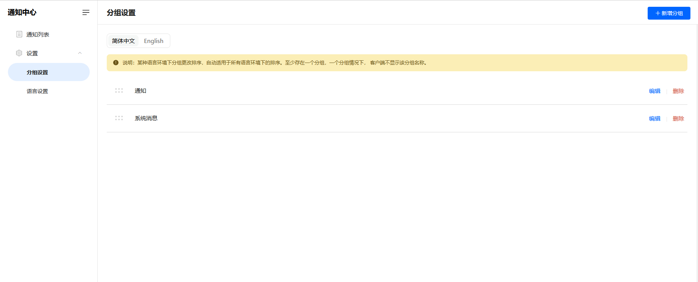
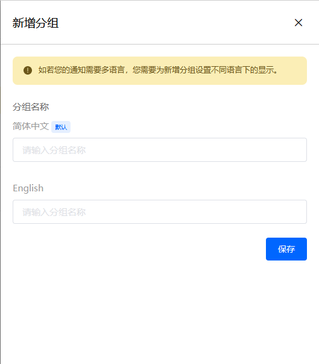
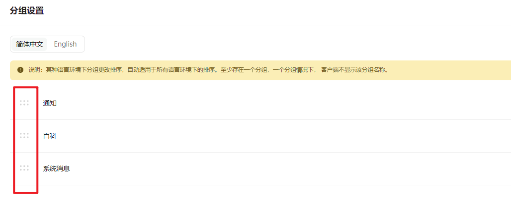

# 为您的通知中心设置分组

> 分类:04-通知中心 | articleId:IlWF0Ls2ru | 描述:

ByteTrack会为您的通知中心初始化创建两个分组，您可以自由调整内容和顺序。
您可以在通知中心→设置→分组设置中，切换语言项，查看各个语言下的分组显示。

新增分组点击页面右上角的“新增分组”，为分组设置不同语言项下的显示。

如若某个语言项没有设置，则表示该语言下没有该分组。
新增时，您需要为至少一个语言项设置分组名称，才可以新增成功。
想要分组支持多语言，请参考 [为分组设置多语言](https://docs.bytrack.com/8CTFE8cF/help/wikidetail?articleId=VV8PmZUGdy&usageCategoryId=430&usageGroupId=837)
注意：当分组在某个语言项下没有设置时，该分组的所有通知，在该语言项下也不会显示。
删除分组当分组被删除，客户的通知中心里，该分组及分组下的通知内容均不再显示，因此我们建议您谨慎操作。
通知中心需要至少存在一个分组。在只有一个分组时，客户的通知中心里不会显示该分组名称，如下图：

为分组进行排序您可以拖动分组列表左侧的按钮，对分组进行排序。如下图：

👏👏👏现在您已设置好分组，那么就让我们继续吧👇
[创建您的第一条通知](https://docs.bytrack.com/8CTFE8cF/help/wikidetail?articleId=itY5hKtNgV&usageCategoryId=430&usageGroupId=835)
[为通知中心设置多语言](https://docs.bytrack.com/8CTFE8cF/help/wikidetail?articleId=VV8PmZUGdy&usageCategoryId=430&usageGroupId=837)
