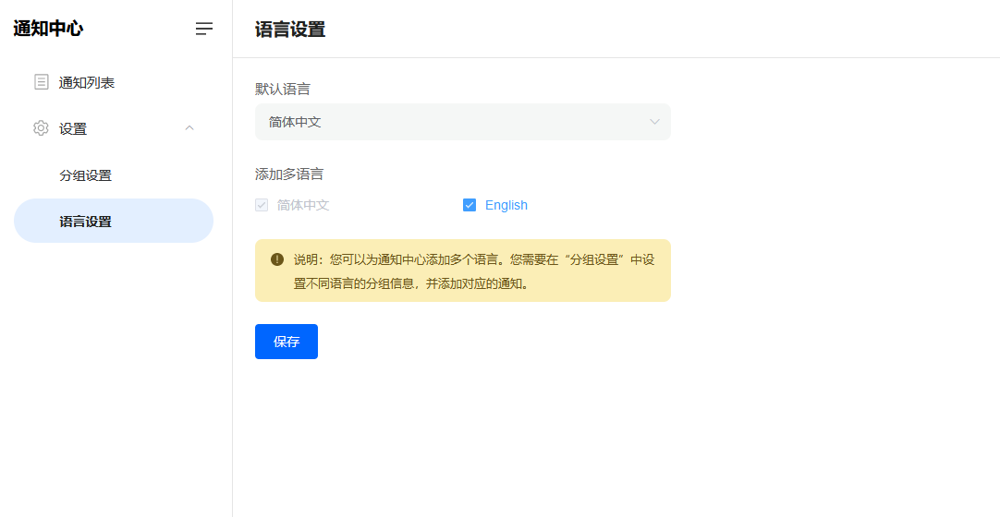

# 为通知中心设置多语言

> 分类:04-通知中心 | articleId:VV8PmZUGdy | 描述:

您可以为通知中心设置多语言，并指定它的默认语言。
点击通知中心→设置→语言设置，如下图：

注意：添加多语言后，业务系统请求通知中心页面时，需要告知通知中心显示的语言。如若通知中心不支持该语言，或者业务系统没有告知语言，通知中心会以默认语言显示。
详细内容请参见[开发者文档](https://docs.bytrack.com/8CTFE8cF/developers/)。
👏👏👏现在您已设置好多语言，那么就让我们继续吧👇
[创建您的第一条通知](https://docs.bytrack.com/8CTFE8cF/help/wikidetail?articleId=itY5hKtNgV&usageCategoryId=430&usageGroupId=835)
[为通知中心设置分组](https://docs.bytrack.com/8CTFE8cF/help/wikidetail?articleId=IlWF0Ls2ru&usageCategoryId=430&usageGroupId=837)
