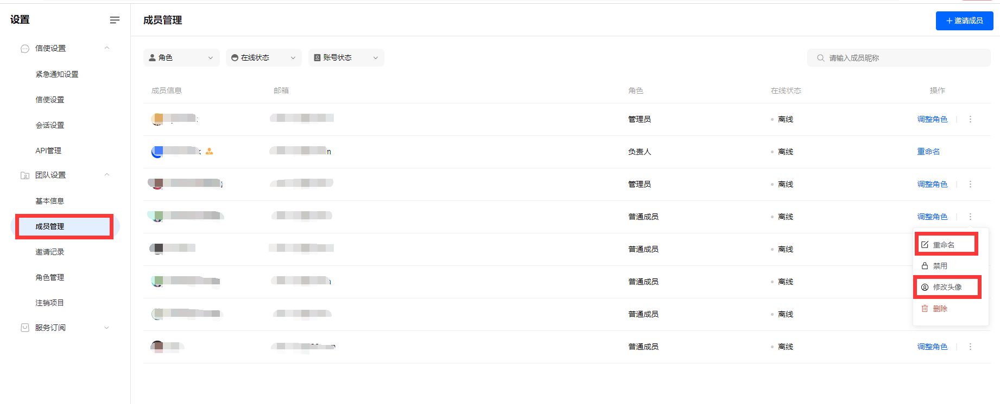
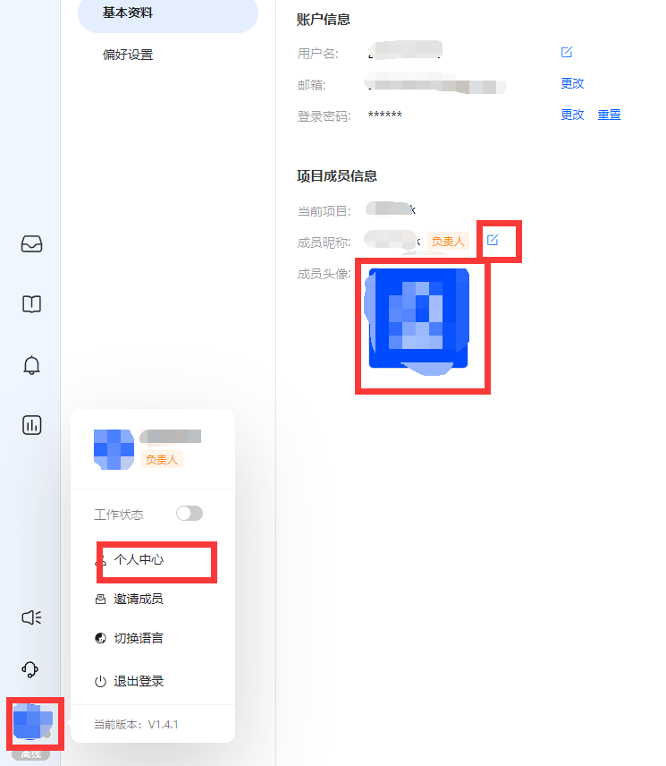
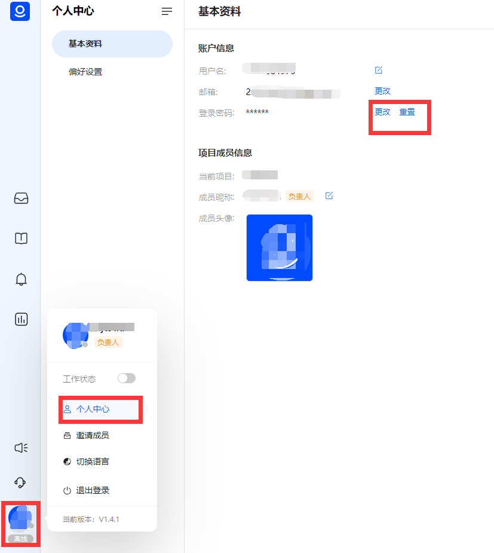

# 资料和偏好设置

> 分类:05-账户隐私 | articleId:OnPDmGabGj | 描述:

修改基本资料您在加入项目时，需要指定您的成员昵称，同时随机生成您的头像。后续您可以通过以下方式修改您的昵称和头像：
1.在“成员管理”中点击“重命名”和“修改头像”按钮，进行修改。如下图：

注意：修改其他队友的姓名和头像，需要相应的操作权限。
2.在个人中心点击“基本资料”，并在“成员昵称”和“成员头像”上进行编辑，如下图：

说明：个人中心修改方式，支持PC、APP。
注意：成员昵称是展示给客户看的，建议您选择一个亲切的称呼。
修改和重置密码您可以在个人中心的“登录密码”中，对密码进行更改和重置，如下图：

说明：更改密码支持PC、APP。重置密码支持PC。
重置密码：忘记了原密码，只能通过邮箱验证码重置密码；
更改密码：还记得原密码，能快速更改密码；
偏好设置您可在“偏好设置”中，修改系统语言，并开启/关闭消息音效（只支持APP）。
系统语言目前支持简体中文、英文两种。
开启消息音效后，当有新消息产生，将会向您发送音效提醒。新消息包括：
1.分配给您的会话产生的消息；
2.未分配给您，但是有消息提及到您的。
注意：信使端也有消息提醒，且不可关闭。
