# 如何设置系统通知

> 分类:05-账户隐私 | articleId:TQdEabnndo | 描述:控制您在桌面和移动设备上接收的通知。

想要在电脑端收到ByteTrack的新消息系统推送，需要确保：
1. 您开启了ByteTrack的推送；
2. 您开启了电脑系统的应用通知；
3. 您开启了电脑浏览器的通知；
想要在APP端收到ByteTrack的新消息系统推送，需要确保：
1. 您开启了ByteTrack的推送；
2. 您开启了手机系统的应用通知；
下面让我们开始吧！
开启ByteTrack的推送
## windows
需要在“个人中心” 下的 “系统推送” 打开推送开关, 默认开启;

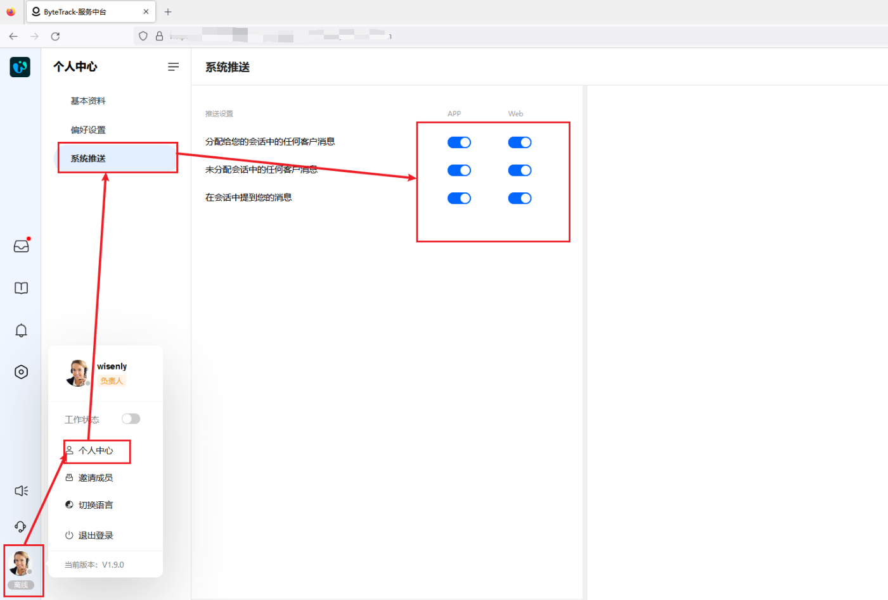

windows可以同时为您的web、app开启推送。

## APP
需要点击您的头像，在“个人中心”的“系统推送”中，打开推送开关，如下图：

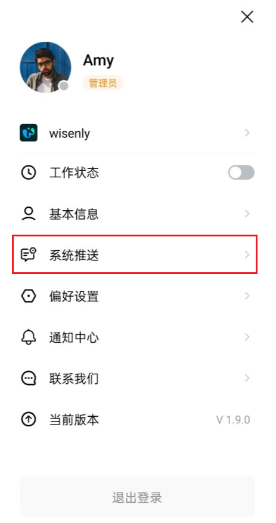
 
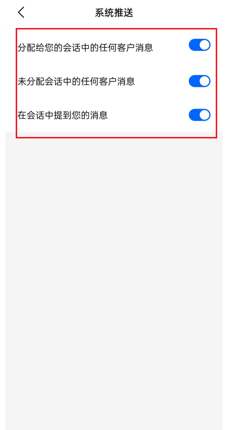

开启电脑系统的应用通知
## windows
在左下角的windows图标上右击，选择“系统”，如下图：

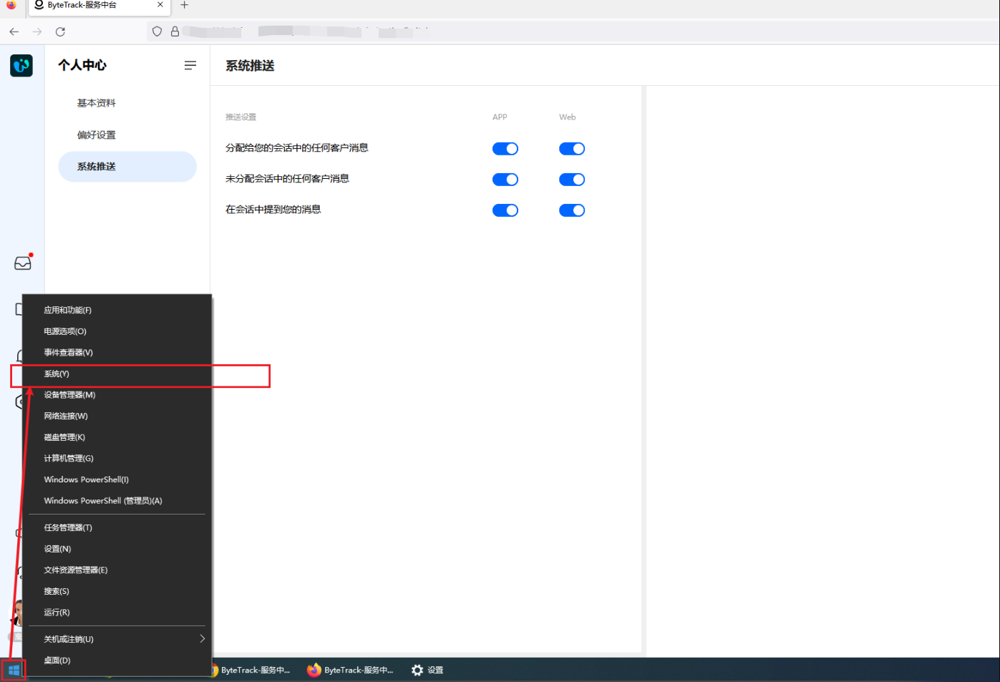

选择“通知和操作”，并打开通知的开关和显示的相关选项，如下图：

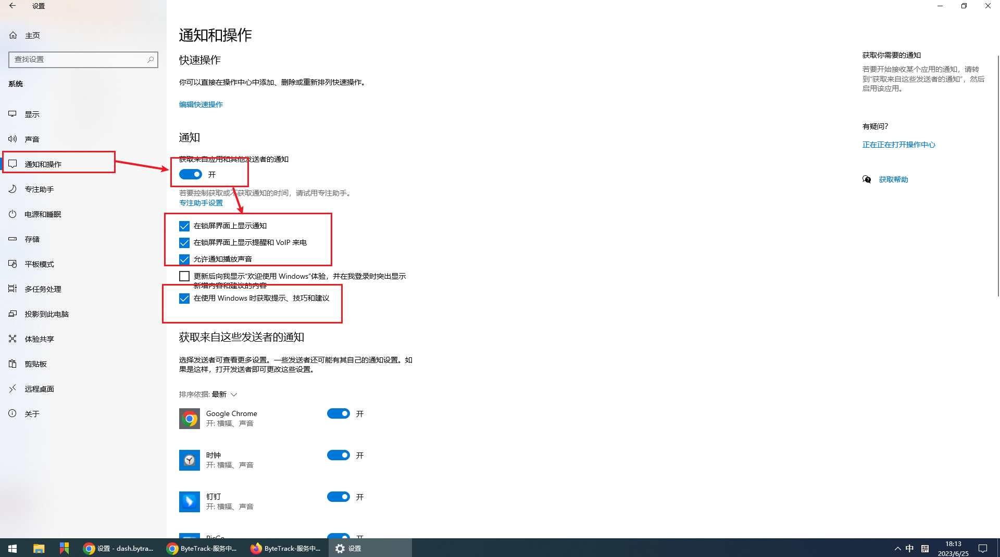

在下方的应用列表找到您的浏览器，并打开该浏览器的开关（此处以Google Chrome为例），如下图：

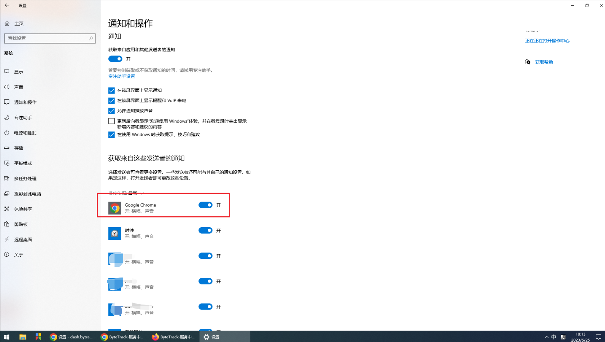

点击“Google Chrome”进入应用详情，并打开“显示通知横幅”、“在操作中心显示通知”、“当通知到达时播放声音”，并将优先级设置为“高”。您还可以设置操作中心的通知数，如下图：

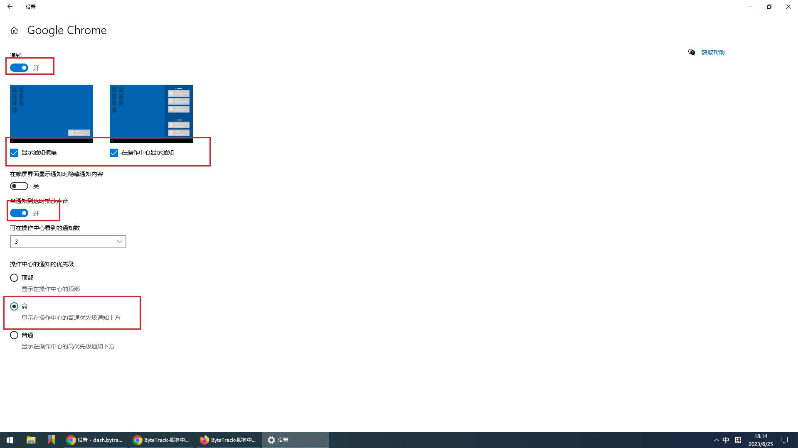

如若您使用的是火狐浏览器，只需重复上述的步骤，选择“Mozilla Firefox”并打开相关的设置项即可。

## Mac
在“启动台”中选择“系统偏好设置”，如下图：

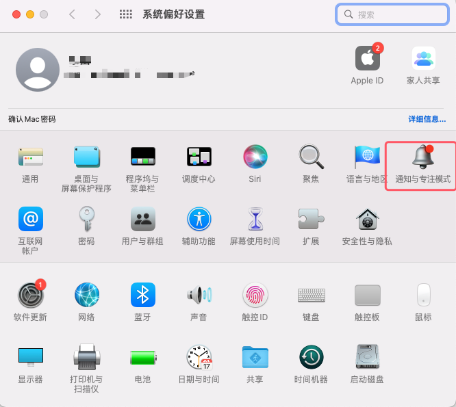

选择“通知与专注模式”，进入通知设置页面，找到“Google Chrome”，打开通知开关，并设置为“提醒”样式，同时将下方的所有设置项打开，如下图：

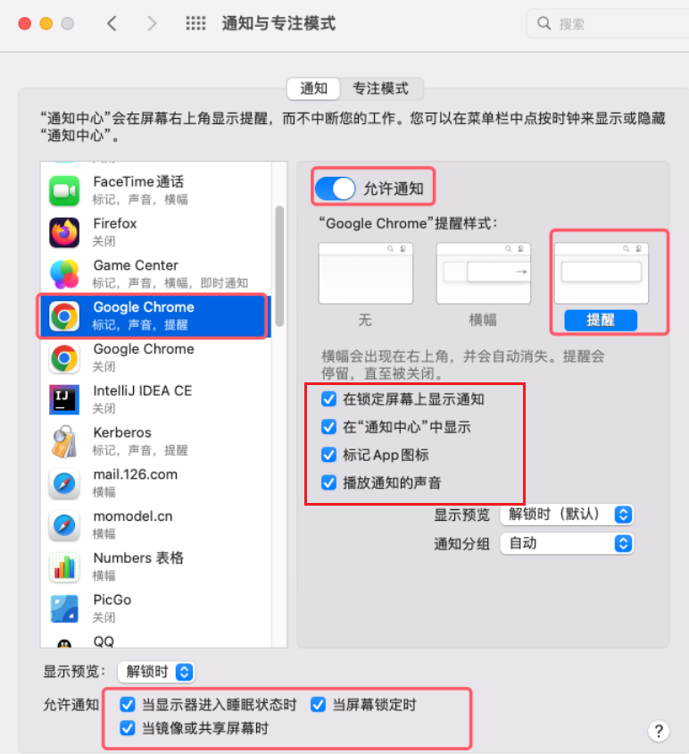

如若您的列表出现了两条“Google Chrome”,您需要将它们的通知均开启。如若未生效，则建议您根据以下操作进行：
1.确保 Mac [安装所有可用的软件更新](https://support.apple.com/zh-cn/HT201541)。
2.尝试[重置 Mac 上的系统管理控制器 (SMC)](https://support.apple.com/zh-cn/HT201295)。
3.尝试[重置非易失的随机访问存储器(NVRAM)](https://support.apple.com/zh-cn/HT204063)。
4.创建新的管理员帐户，使用新建的管理员帐户登录以便查看问题是否仍然存在。
5.移除“Google Chrome”App 并通过 App Store 或应用的官方网站获取下载并保持最新。
如果以上操作未能解决您的问题，请从Apple 官网联系 Apple 支持来获得更多协助。

开启电脑浏览器的通知
## 谷歌浏览器
浏览器的通知权限需要开启, 默认处于关闭状态,。 请点击站点地址栏中的小锁标志 将通知开关开启

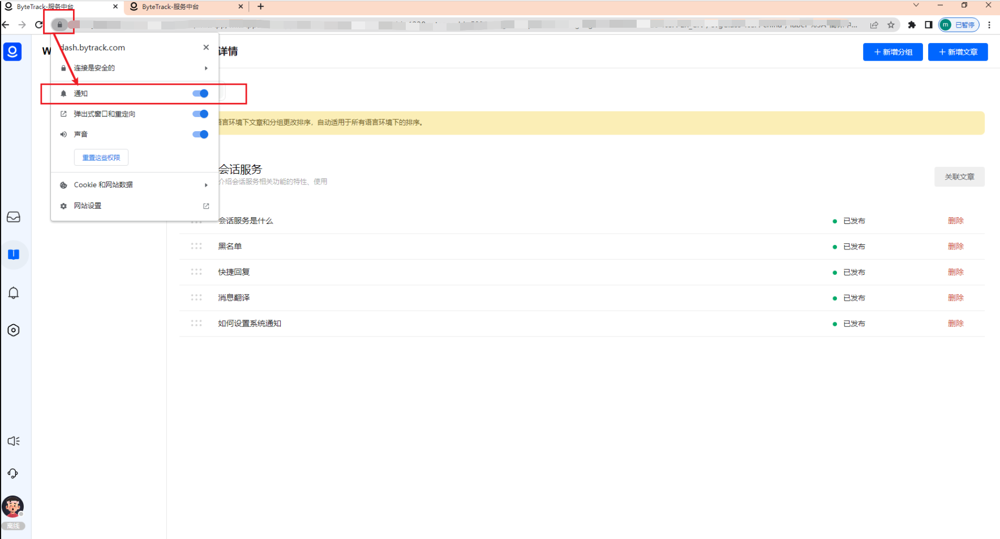

然后, 打开浏览器的设置页面，并进入“隐私和安全”的网站设置：

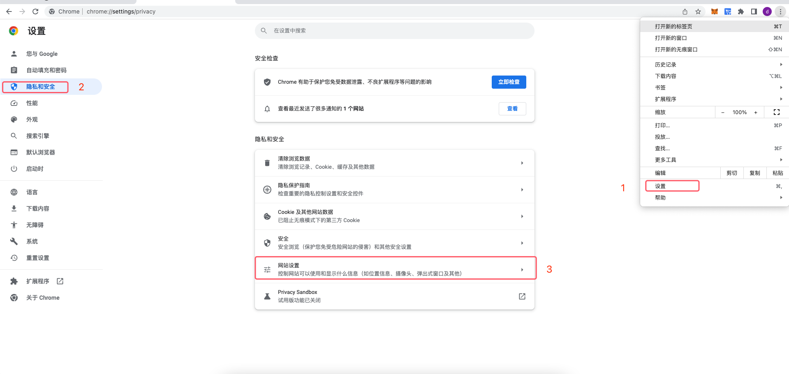

点击页面的“通知”，如下图：

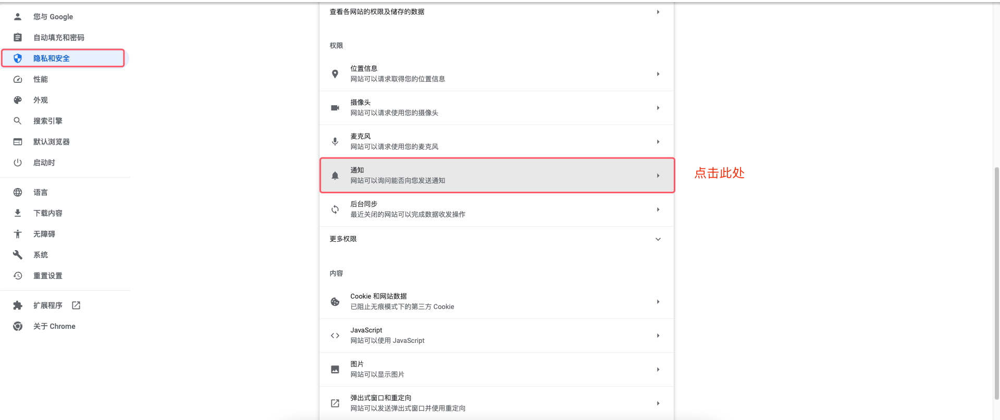

在“默认行为”中，选择“网站可以询问能否向您发送通知”，并点击下方的“添加”按钮，将 https://dash.bytrack.com:443 加入白名单，如下图：

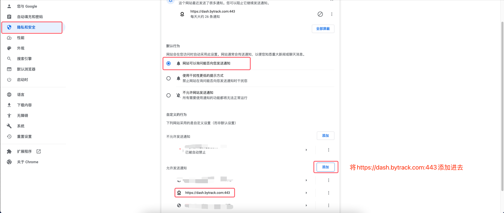

添加成功后，点击该URL，进入详细编辑页面，将“通知”和“弹出式窗口和重定向”均改为“允许”，如下图：

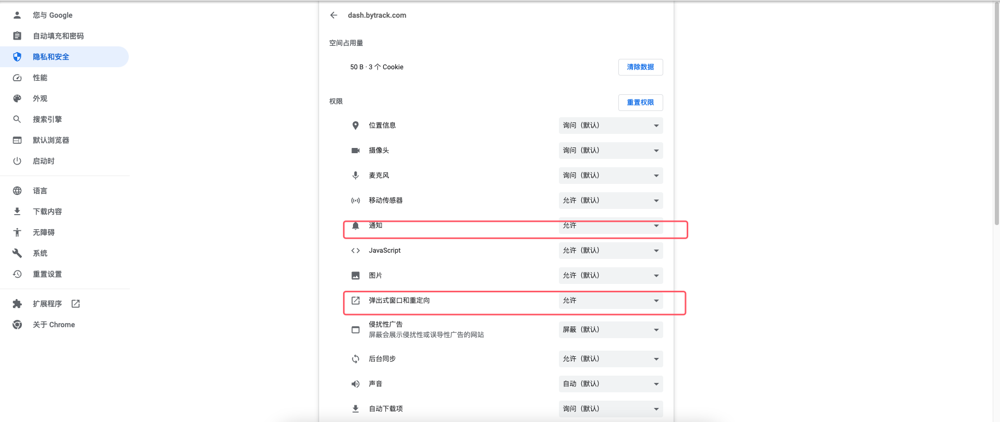

设置结束后，返回至“网站设置”页面，在下方找到“弹出式窗口和重定向”，如下图：

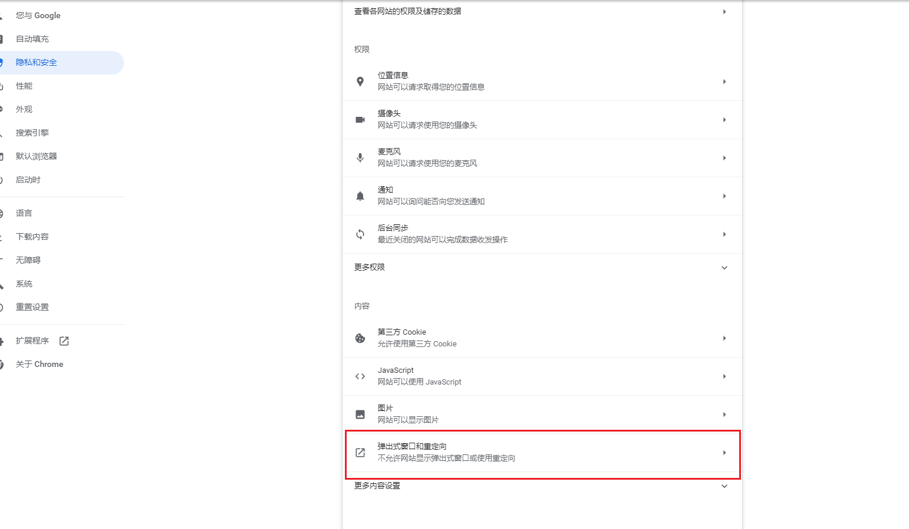

进入“弹出式窗口和重定向”，设置为“网站可以发送弹出式窗口并使用重定向”，同时点击“添加”按钮，将 https://dash.bytrack.com:443 添加进白名单，如下图：

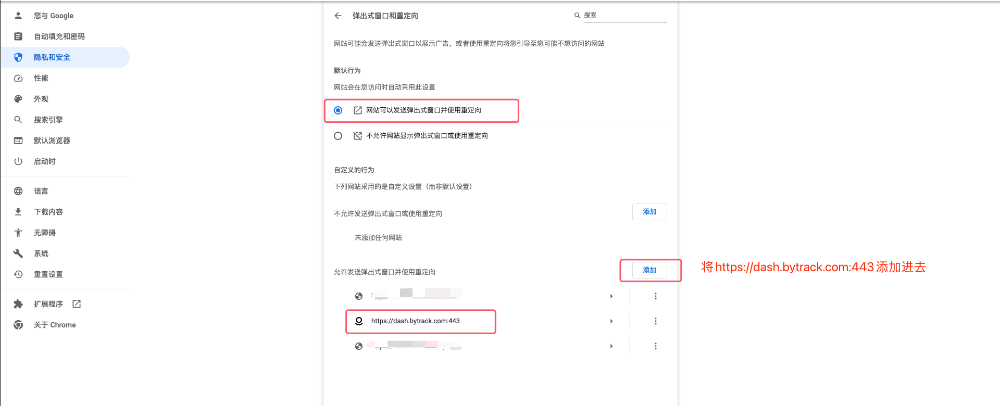

添加后，点击URL进入详细设置页面，确认“弹出式窗口和重定向”是否为“允许”状态。

## safari浏览器
如果您用的是苹果的safari浏览器 
1: 打开设置
2: 打开站点tab
3: 选择通知
4: 设置站点为允许

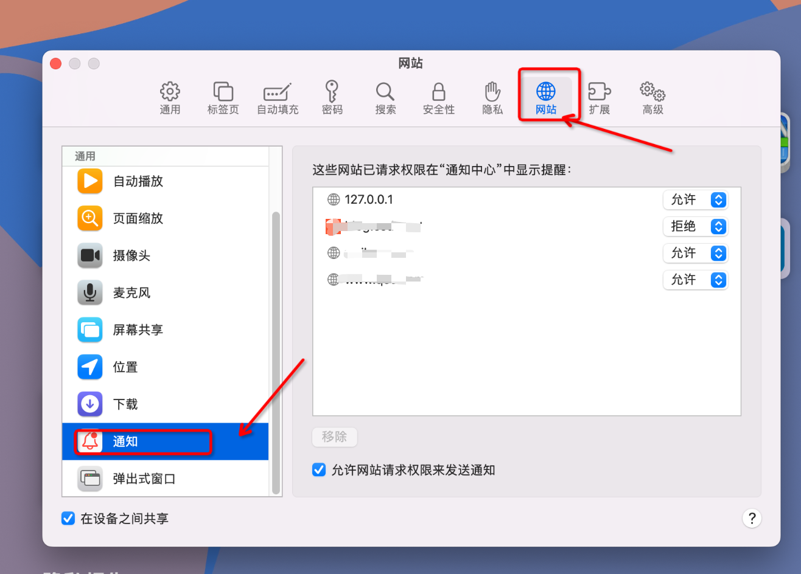

开启手机系统的应用通知
## oppo手机
您需要在手机的“设置”里，选择“通知与状态栏”

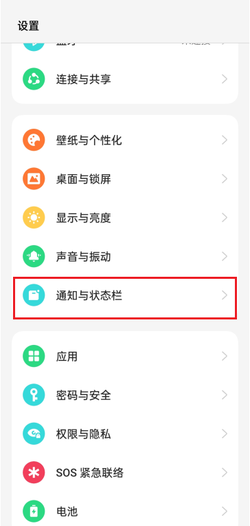

点击“分类设置”中的“锁屏通知”，对它的详细内容进行设置，如下图：

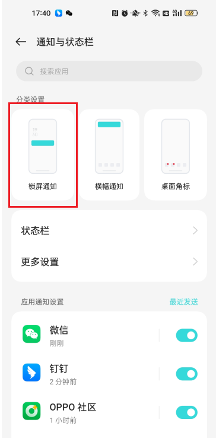

在详细页面，开启“允许锁屏时下拉通知中心”，设置锁屏通知为“显示通知来源和内容”，，并将ByteTrack的锁屏通知权限开启，如下图：

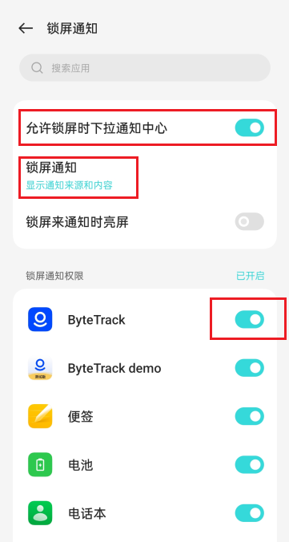

返回上一个页面，并选择“横幅通知”，对它的详细内容进行设置，如下图：

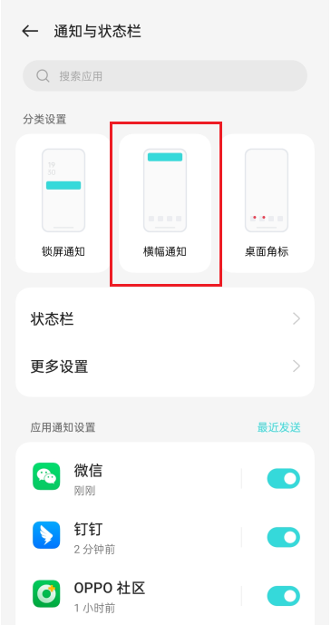

在详细设置页面，开启“浮窗回复”、全屏时显示简洁横幅通知，并将ByteTrack的横幅通知权限开启，如下图：

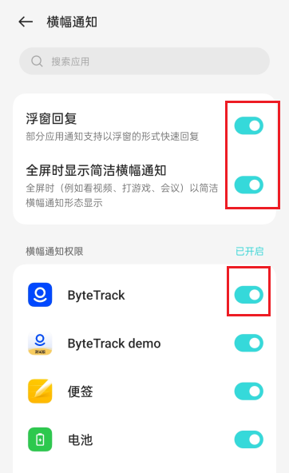

回到“通知与状态栏”，点击“更多设置”，开启“通知中心显示流量信息”、“允许显示延时通知”、“全屏时通知轻反馈”，如下图：

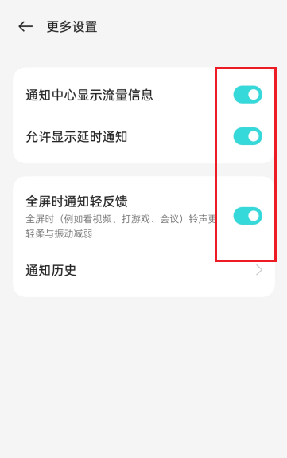

回到“通知与状态栏”，在“应用通知设置”列表，找到ByteTrack，打开开关后，进入详细设置页面，如下图：

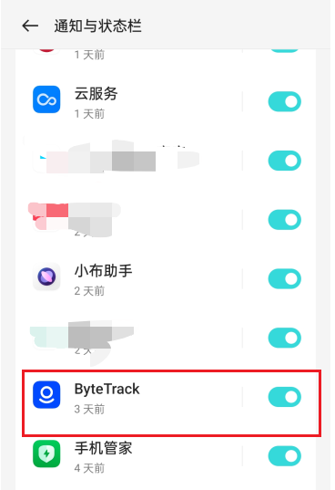

在详细设置页面，开启“允许通知”，并开启“锁屏”与“横幅”，同时开启“铃声”与“震动”，将下方类别项全部开启，如下图：

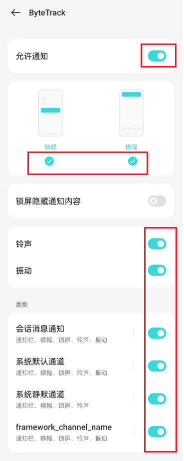

之后，分别点击“会话消息通知”、“系统默认通道”、“系统静默通道”、“framework_channel_name”，进入详细设置页面，开启“允许通知”、“锁屏”、“横幅”、“振动”，同时您还可以为ByteTrack的通知设置单独的声音，如下图：

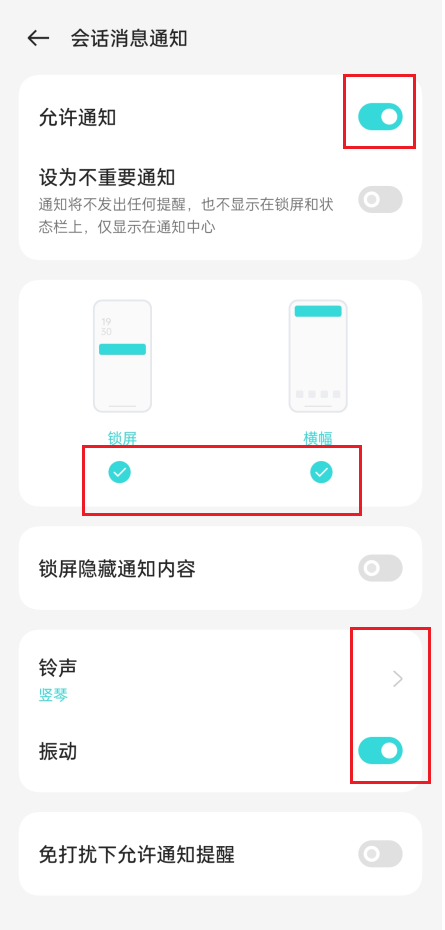

## 苹果手机
您需要在“设置”中，选择“通知”，并找到“ByteTrack”，进入详细页面，开启“锁定屏幕”、“通知中心”、“横幅”、“声音”、“标记”，同时“显示预览”设置为“始终”，如下图：

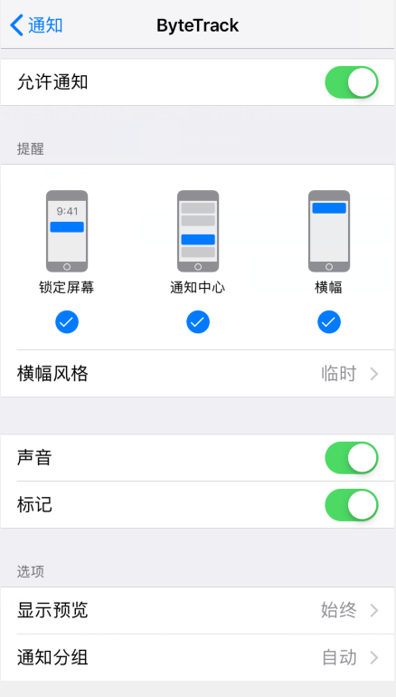

其他问题1.电脑端收不到声音怎么办？
您可参考上方“谷歌浏览器”的设置，在“隐私和安全”中，将声音开启即可。

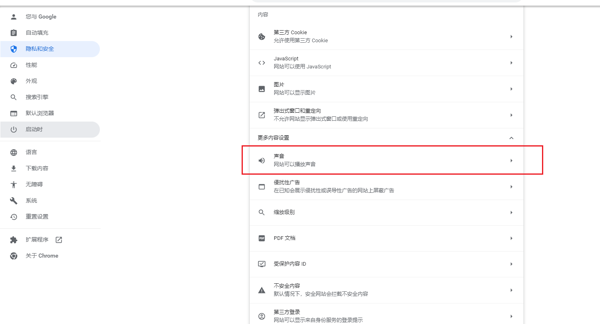

同时进入详细设置页面，选择“网站可以播放声音”，并点击下方的“添加”按钮，将https://dash.bytrack.com:443 加入白名单,如下图：

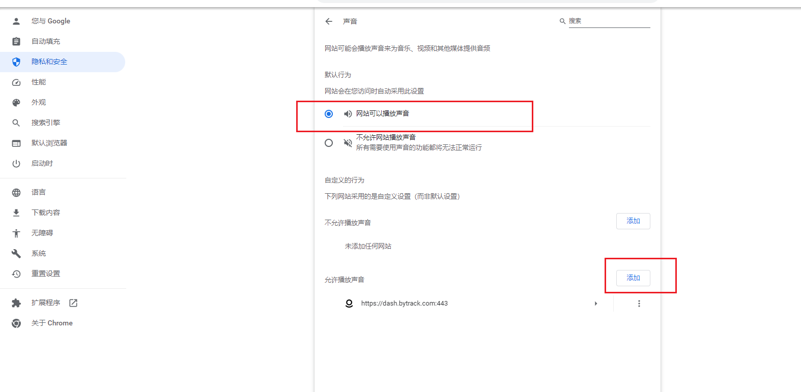

然后点击URL进入详情页，确保声音选项为“允许”，如下图：

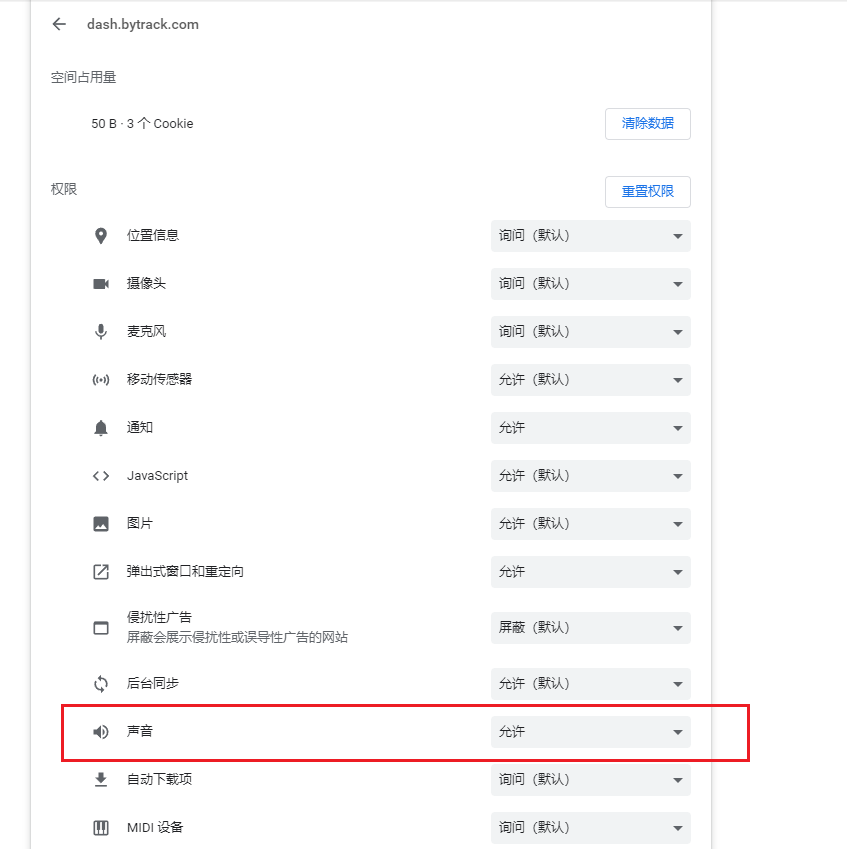
