# 智能流程使用指南

> 分类:06-自动化 | articleId:7p26seWJf7 | 描述:

👋👋👋首先，我将带您创建第一条智能流程。您只需要执行下面的几个步骤👇，既可以轻松使用。
创建流程现在让我们创建一个“欢迎客户”的智能流程。这个流程里，您只需要配置一些常见的欢迎语，在客户打开信使时，主动发送欢迎内容。
首先，您需要进入“流程列表”页面，从“智能AI”，进入“流程列表”，入口如下：

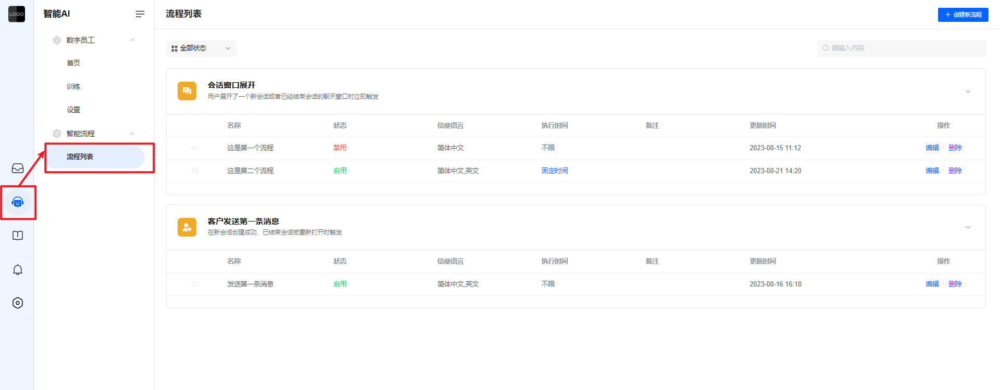

让我们开始进入创建流程阶段。
创建流程一共包括如下几个步骤：
1.选择触发器；
2.设置触发器的触发条件；
3.设置路径内容；

## 选择触发器
点击右上角的“创建新流程”，选择触发器“会话窗口展开”，如下图：

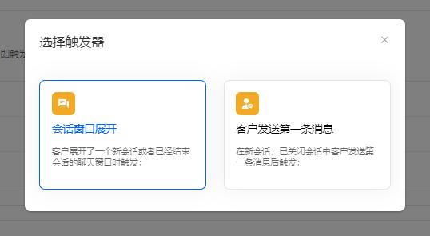

选择触发器后，会进入智能流程的画板，首先为智能流程命名为“欢迎客户”，本次创建的流程是简体中文环境中触发，因此在备注中说明：适合中文环境。如下图：

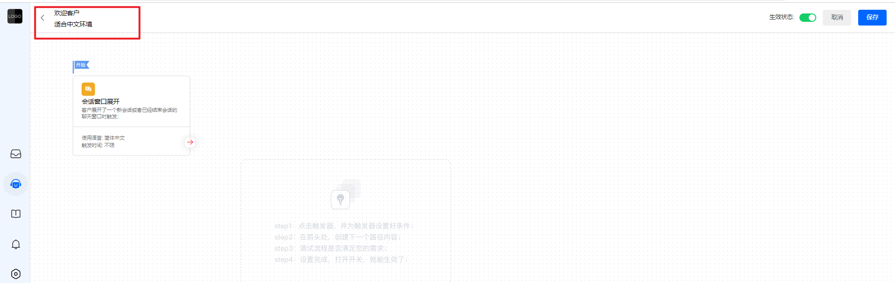

## 设置触发器的触发条件
点击画板中的智能流程触发器，进入触发器的条件设置页面，入口如下：

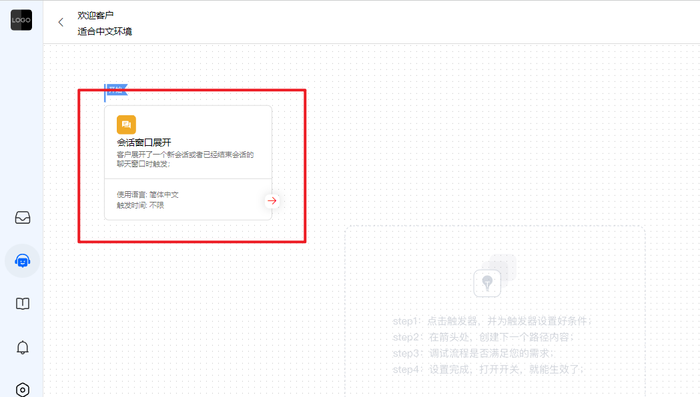

在弹出的窗口中，为智能流程配置触发条件。
我希望“欢迎客户”的流程只在中文环境的信使里，且任何时间均能触发，因此需要将执行时间选择“不限”，信使语言选择“简体中文”，如下图：

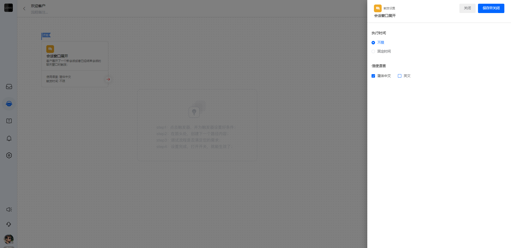

以上，触发器和触发器的触发条件设置完毕，开始为智能流程设置路径。

## 设置路径内容
点击触发器右下角的红色箭头，根据需要选择第一个路径的动作，入口如下图：

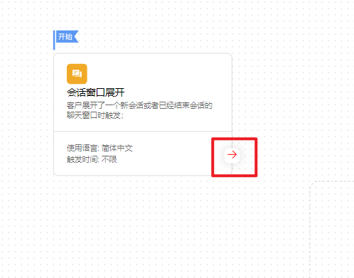

点击后如下图：

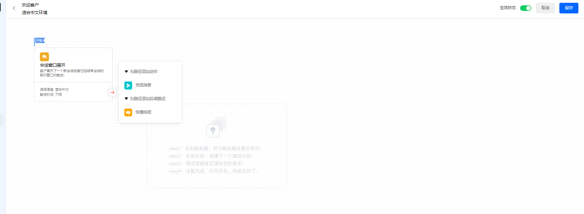

选择“发送消息”，并在路径中输入消息内容，如下图：

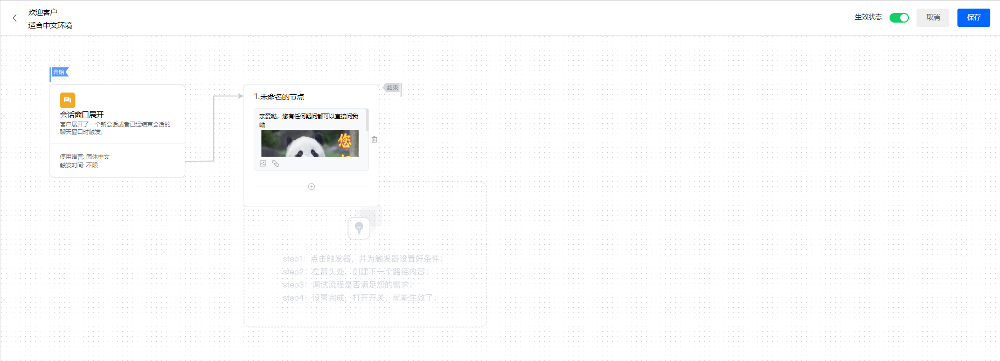

我希望在路径1后面，增加其他的路径，因此需要在路径1上添加快捷按钮，如下图：

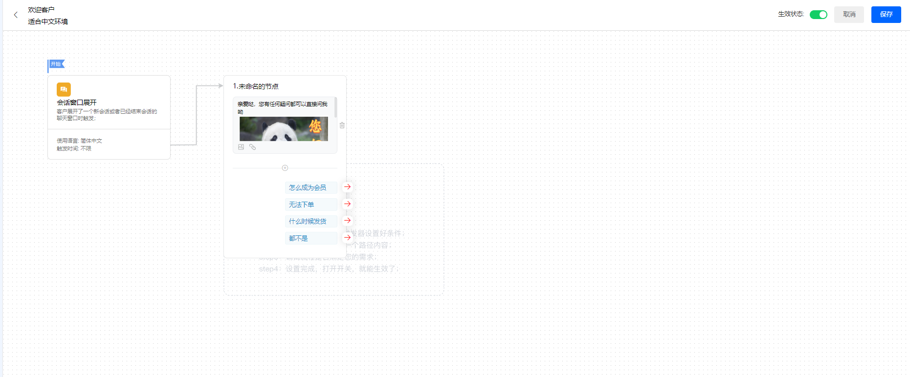

在每个按钮后，需要点击红色箭头，为该按钮添加后续路径。如下图：

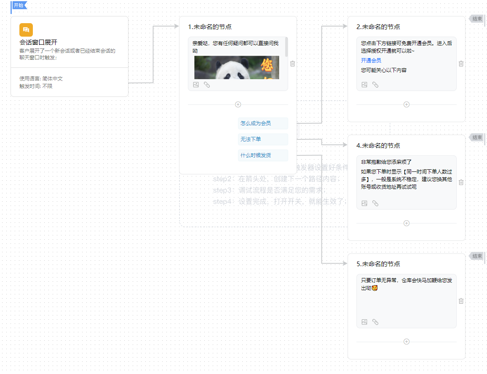

为了更好的查看整个流程的走向，可以将每个路径的名称重新整理，如下图：

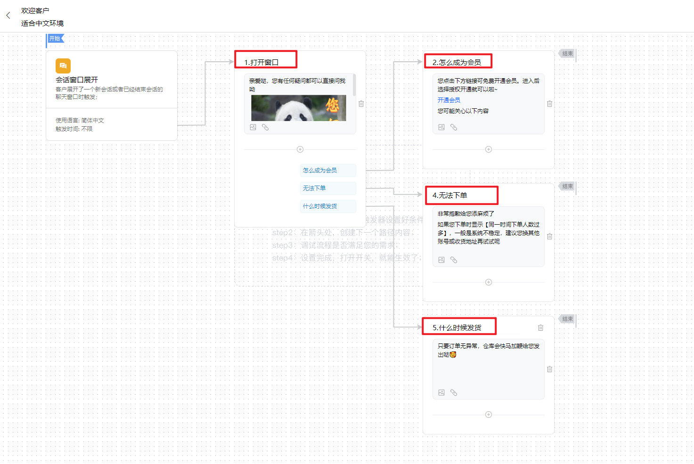

检查每条分支流程，是否都有“结束”标识，如果都有，代表整个流程是完备的，可以保存。如果有某个分支流程缺少“结束”标识，那么会显示红色箭头，您需要点击红色箭头，将后续流程补充完毕即可。
注意：当路径中有“快捷按钮”时，需要为该按钮配置后续流程。路径中其他的行为（发送消息、让数字员工回答、分配会话）会出现“结束”标识，无法配置后续行为。
测试流程将智能流程的状态设置为“开启”，并进行保存，如下图：

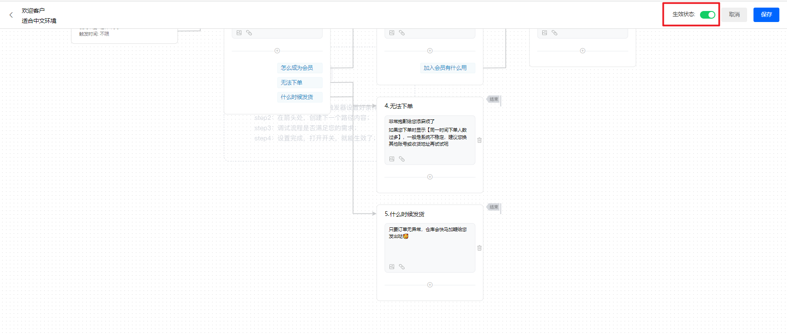

然后在流程列表页面，拖动列表左侧的图标，将该流程拖拉至列表的第一个位置，表示最先触发，如下图：

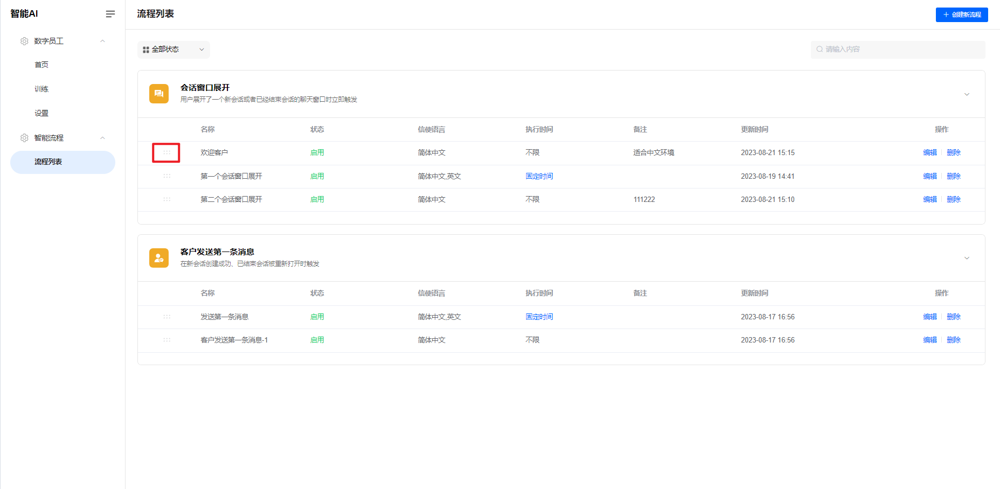

找到信使接入URL测试流程，信使接入URL查看位置：设置→会话设置→普通分配模式，如下图：

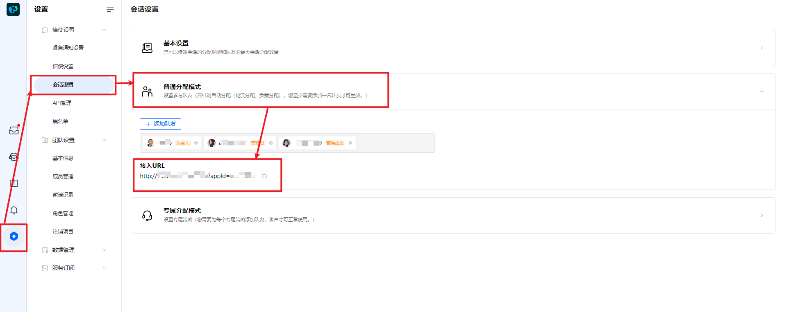

在浏览器中输入信使接入URL，测试该流程是否正常触发，如下图：

点击按钮，查看后续流程是否均能成功触发，如下图：

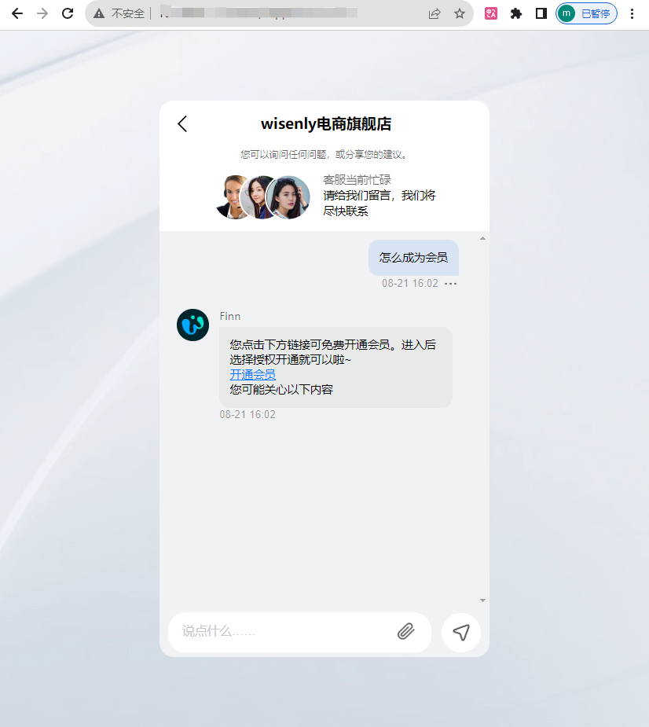

下版本中，将添加编辑页面调试的功能，敬请期待😘
开始使用 👋👋👋以上，您的第一条智能流程创建成功。您可以使用相同的步骤，为英文环境创建相同的流程。
您还可以让智能流程只在客服在线的时候触发，只需在触发条件中，将时间设置为客服在线的时间即可。
如果您想进一步了解，可以通过下方的链接快速找到您所需要的各种使用说明：
● [智能流程的详细说明](https://docs.bytrack.com/8CTFE8cF/help/wikidetail?articleId=dAmklHuZo3&usageCategoryId=870&usageGroupId=-1)
● [Finn的介绍和使用](https://docs.bytrack.com/8CTFE8cF/help/wikidetail?articleId=Z9zntxlTeJ&usageCategoryId=870&usageGroupId=-1)
