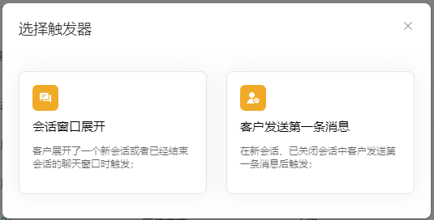
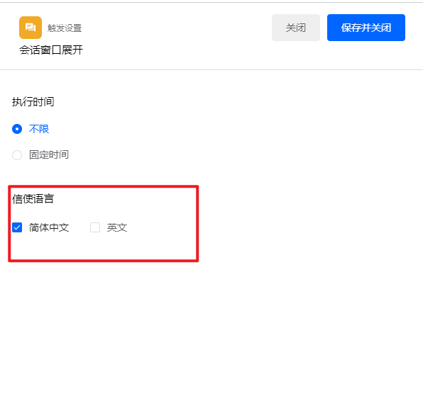
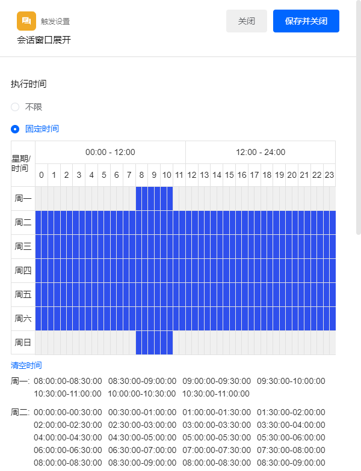
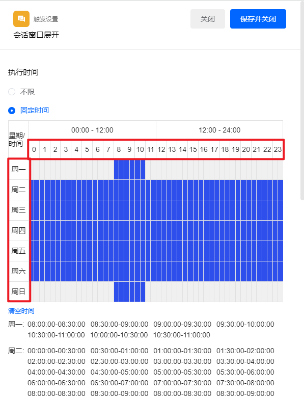
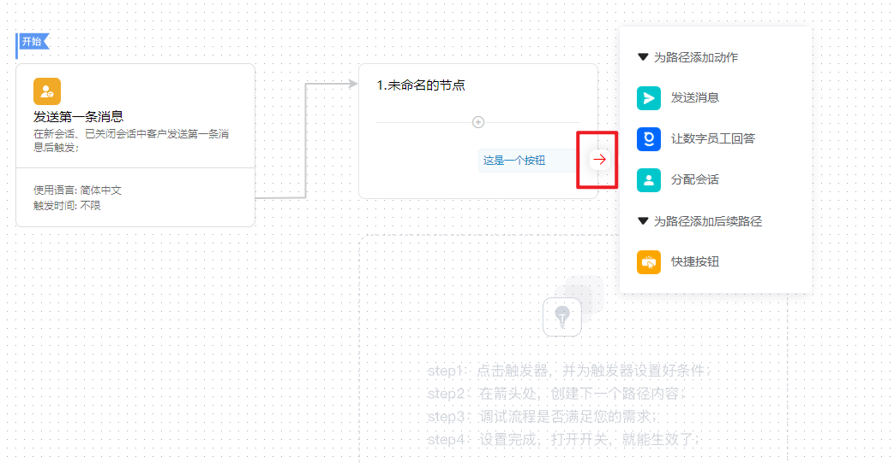
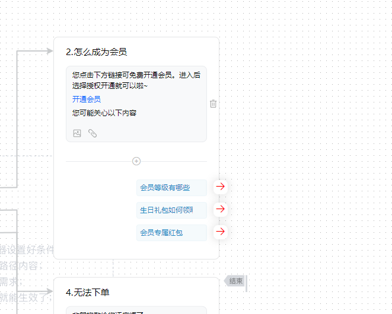
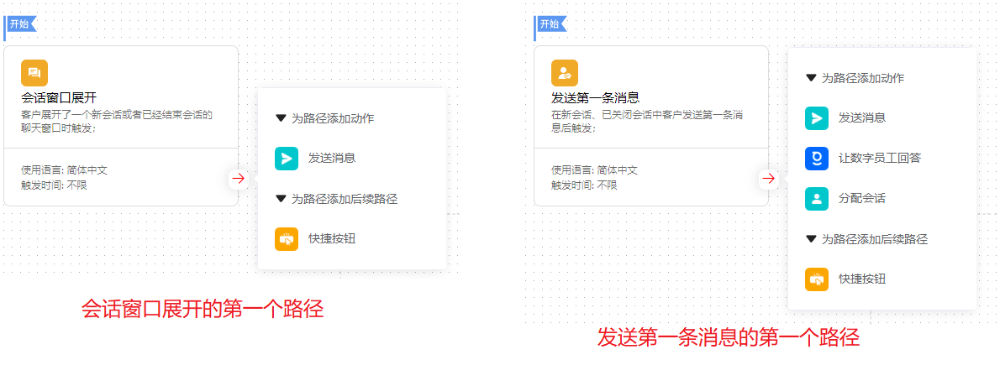
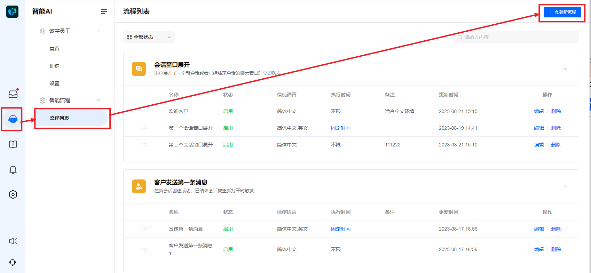
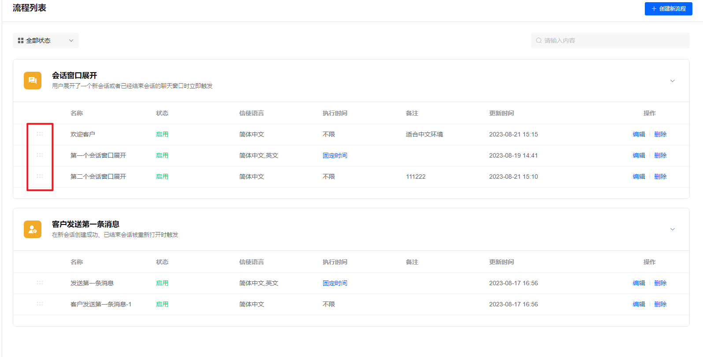

# 智能流程详细说明

> 分类:06-自动化 | articleId:dAmklHuZo3 | 描述:

功能介绍智能流程里，您可以创建自动化回复流程，让机器人帮您去回复访客消息、解决访客的初步疑惑、引导访客下单等，从而可以提高顾客咨询效率，降低客诉率。您还可以为您的团队成员自动执行重复性任务。
您可以在一个地方轻松构建强大的智能流程。
● 无需代码- 任何人都可以使用智能流程的可视化构建器在几分钟内构建和部署自动化。
● 功能强大且灵活- 智能流程可深度定制，因此您可以构建个性化的旅程，为客户提供真正的价值。
● 专为团队打造- 部署工作流程，自动处理重复性任务。
● 随时随地满足您的客户- 构建多语言自动化，随时随地以任何语言为您的客户提供支持。
概念说明一个完整的智能流程包括两个环节：触发器、路径。

## 触发器

### 触发事件
● 触发器：告诉智能流程机器人，何时开始启动流程。触发器由触发事件、执行位置、执行时间组成；
● 触发事件：当前版本包括客户发送第一条消息、会话窗口展开。
 ○ 客户发送第一条消息：在新会话创建成功、已结束会话被客户重新打开时触发；
 ○ 会话窗口展开：1.客户打开了一个新会话的窗口，但是未成功创建新会话（即用户未发送任何内容）；2.客户打开了一个已经关闭会话的窗口，但是还未重新打开会话（即用户在会话结束后未发送任何内容）。
触发事件选择如下图：

### 执行位置
● 执行位置：执行位置表示在什么样的信使上执行，包括：简体中文的信使、英文的信使；
 ○ 简体中文：信使语言为中文时触发；
 ○ 英文：信使语言为英文时触发；
执行位置设置如下图：

### 执行时间
● 执行时间：执行时间表示在什么时间段，才能触发并执行智能流程：执行时间只能精确到半小时。
系统会自动判断客户访问时段是否匹配您所设置的执行时间条件，再根据您设置好的流程继续运行。
设置执行时间，点击蓝小格即可设置。
执行时间设置如下图：

您可以点击左侧第一列，和第二行，进行复选，点击区域见下图：

点击“清空时间”，可以一键清除选择的时间段。

## 路径
● 行为：即系统主动对客户进行的行为，例如发送消息、分配会话。
● 路径：路径是一系列的行为合集，即每一个路径可以依次执行多个行为

。路径就是告诉智能流程机器人，每一步要执行哪些操作；路径和路径之间，只能通过快捷按钮建立联系。如下图：

ByteTrack的路径行为说明：
○ 发送消息；通过流程性机器人，向客户发送一条普通消息。消息支持图文、超链接；
○ 让数字员工回答：将该会话自动分配给Finn，并由Finn回答客户最近一次发送的消息。如果是手动输入则消息为手动发送的内容；如果是点击按钮则消息为该按钮的文本；
○ 分配会话：将该会话分配给普通成员，由普通成员回答客户的问题；
○ 快捷按钮：通过一系列的操作按钮，引导用户点击并进行到下一个路径。快捷按钮是唯一一个必须添加后续路径的行为。
注意：智能流程与会话分配是两条独立的线，不互相影响，即：智能流程在未分配会话里执行中，如果有成员回复了，也仍然执行分配流程，如若智能流程后续行为中有分配动作，则重新分配即可。
让数字员工回答、分配会话、快捷按钮，三个行为最多只能在路径中存在一个，不可同时存在；
针对触发事件为展开窗口的流程，第一个路径只能为快捷按钮、发送消息，不可设置让数字员工回答、分配会话。其他路径均可以设置为：让数字员工回答/分配会话/快捷按钮，与发送消息的组合。如下图所示：

功能说明
## 创建智能流程
1.在【智能AI】—【流程列表】处，点击右上角的“创建新流程”进入到智能流程新增页面，如下图：

2.选择触发器
在弹出窗口中，选择对应的触发器即可。触发器一旦选择不可更改，您可以删除该流程并重新创建即可。
3.添加路径
点击红色箭头，选择动作，为触发器添加后续路径。

## 智能流程管理
当您设置了多个生效的智能流程时，系统会选择列表中最上方满足触发条件的流程触发。一个会话同时最多只能触发并执行一个智能流程，不会自动变更智能流程。因此如若您设置了多个相同触发器的流程，您需要对这些流程进行排序，如下图：

流程删除和失效时，那些已经成功触发了流程的会话，不会受影响，流程将继续执行。只是不会再次被触发。
智能流程如何终止：
1.会话结束时，流程终止；
2.流程执行完毕，流程终止；
3.客户没有按照既定的流程执行下去，例如客户没有选择流程里预设的快捷按钮，流程终止。
 👋👋👋以上，您已能使用智能流程熟练控制您的自动化任务。
您可以根据下面的文章，创建您的第一个智能流程：
[智能流程使用指南](/8CTFE8cF/help/wikidetail?articleId=7p26seWJf7&usageCategoryId=870&usageGroupId=-1)
