# Finn的介绍和使用

> 分类:06-自动化 | articleId:Z9zntxlTeJ | 描述:

什么是Finn数字员工Finn 是一款基于NLP大语言模型的智能AI。
数字员工Finn 可以解决复杂的问题，并提供比市场上任何人工智能机器人更安全、更准确的答案。
● Finn 用简单的文字进行完整的对话，由最新的生成人工智能模型提供支持。
● Finn 无需培训，只需快速配置即可生效。
● Finn 根据您现有的支持内容提供值得信赖和准确的答案。
● Finn 将更复杂的问题直接无缝地转接给您的人工支持团队。
● Finn可以与您现有的自动化解决方案集成，让您的工作流程更加自动化和顺畅。
如何训练Finn
## 开通套餐
数字员工Finn需要您订阅符合条件的套餐，才可正常使用。您可以在订阅页面，查看符合条件的套餐并订阅。如下图：

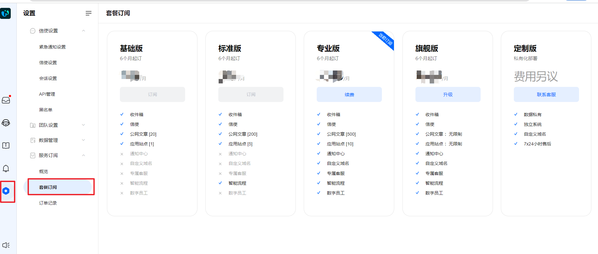

当您订阅的套餐符合数字员工Finn的使用条件时，您可以正常进入Finn的训练页面，如下图：

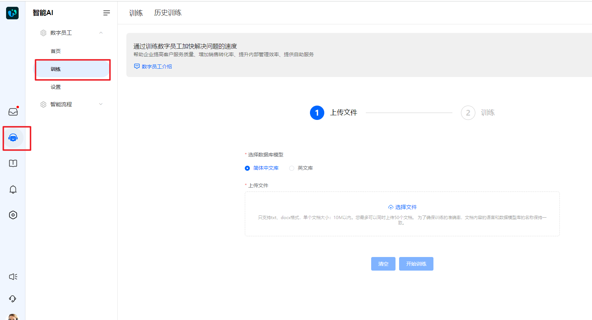

## 购买 tokens
什么是 tokens
tokens 是AI模型计算和处理的基本单位，也反映了使用计算资源的成本和复杂性。每个 token 都需要模型进行处理，包括编码、计算上下文、生成输出等等，因此模型的计算成本与输入文本中的 tokens 数量相关。
在使用 AI模型时，你所输入的文本会被分解成一系列的 tokens，然后模型会按照顺序逐个处理这些 tokens。生成的响应也会被表示为一系列的 tokens。因此，计算总共使用的 tokens 数量可以作为衡量使用模型资源的一个指标。
利用 tokens 计费可以帮助控制资源的使用和分配，以便为用户提供稳定的服务。较长的输入文本或生成的响应文本会占用更多的计算资源，因此利用 tokens 计费可以更公平地反映用户所消耗的计算成本。同时，还有助于鼓励用户更有效地使用模型，避免滥用或过度使用，从而维护系统的可用性和性能。
购买 tokens
在您创建项目时，我们会赠送您一部分 tokens。当 tokens 消耗完毕，需要您购买 tokens。
您可以在概览页面，查看您的 tokens 余额、购买 tokens ，如下图：

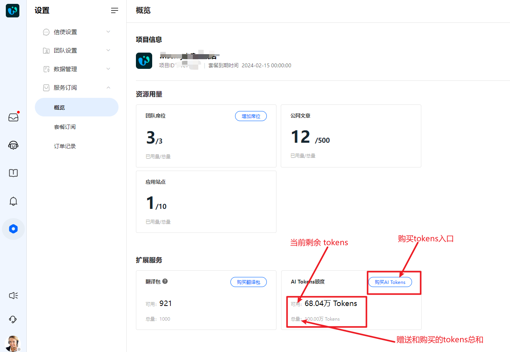

注意：tokens 没有到期时间限制。

## 上传文件
您可以在智能AI-训练页面，上传文本进行训练。如下图：

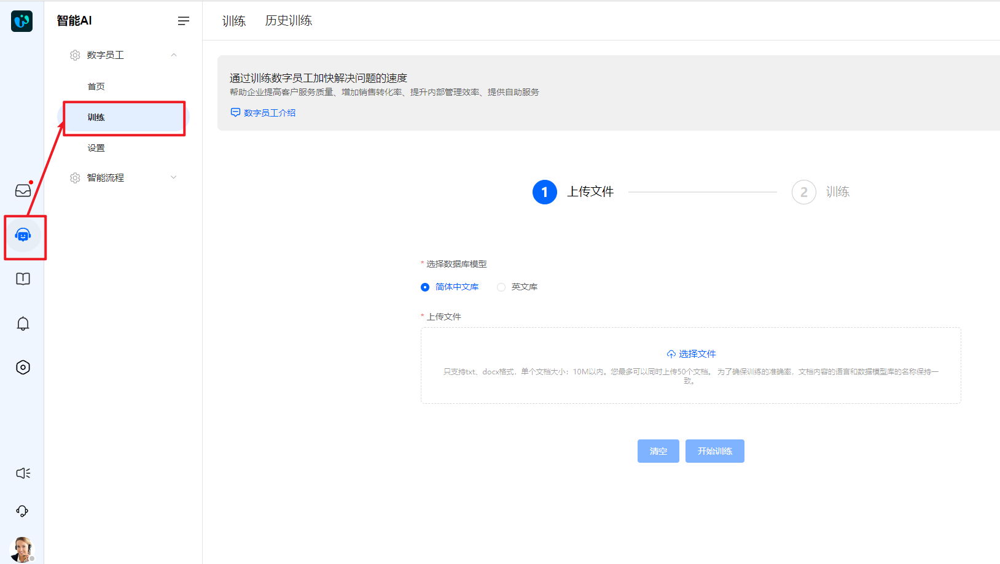

点击“选择文件”，并上传。上传后，系统会计算本次训练预计消耗的tokens，如下图：

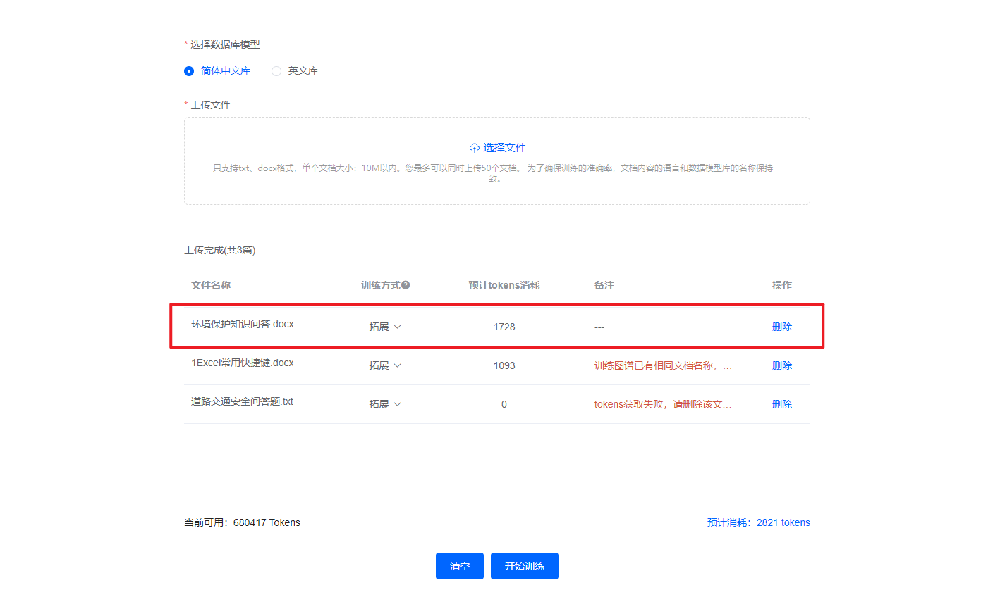

已上传列表中，当备注中出现文案，说明该文件有您需要注意的事项，主要包括如下几点：
1.相同名称的文档已经训练过，您需要留意本次上传文档的训练方式，其中覆盖方式会让您之前训练的同名文档失效；
2.文档tokens获取失败，您需要点击右侧的“删除”按钮，并重新上传该文件获取tokens；
训练方式说明：
覆盖:之前的训练数据将完全被新的训练数据覆盖。举例您之前训练过“道路交通安全”，现在您在该文档中修改了一些内容并重新训练，那么之前训练的“道路交通安全”将被清空，Finn将不再回答之前训练的“道路交通安全”。如若您之前的文本有不能再使用的内容，建议您采用该方式。
拓展:会保留旧的的训练数据,同时增加新的训练数据.。举例您之前训练过“道路交通安全”，现在您在该文档中大面积调整内容并重新训练。那么之前训练的内容将被保留，Finn也会回答之前训练的内容。
注意：
1.单次上传文件数量不能超过50个；
2.目前支持docx、txt格式上传。txt格式的编码为： UTF-8，您可以通过另存为的方式，查看您txt文件的编码，如下图：

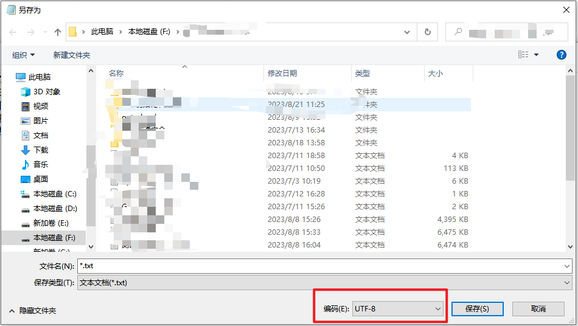

3.建议您不要在同一个文件名里反复修改内容， 防止历史训练被覆盖。
4.您需要确认您要训练的数据库模型。数据库模型决定了信使侧使用哪个模型进行回答。如若您只对简体中文库训练，那么信使端只有简体中文下，finn才会根据您训练的内容回答。

如若您批量上传的文本想要删除，您可以在训练之前，点击左侧的“清空”按钮并重新上传。如下图：

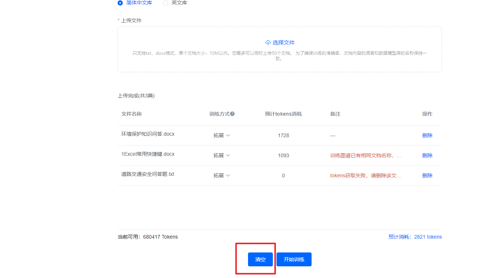

## 开始训练
文档上传完毕，可以点击“开始训练”，正式训练。
训练采用预扣费的方式，如下图：

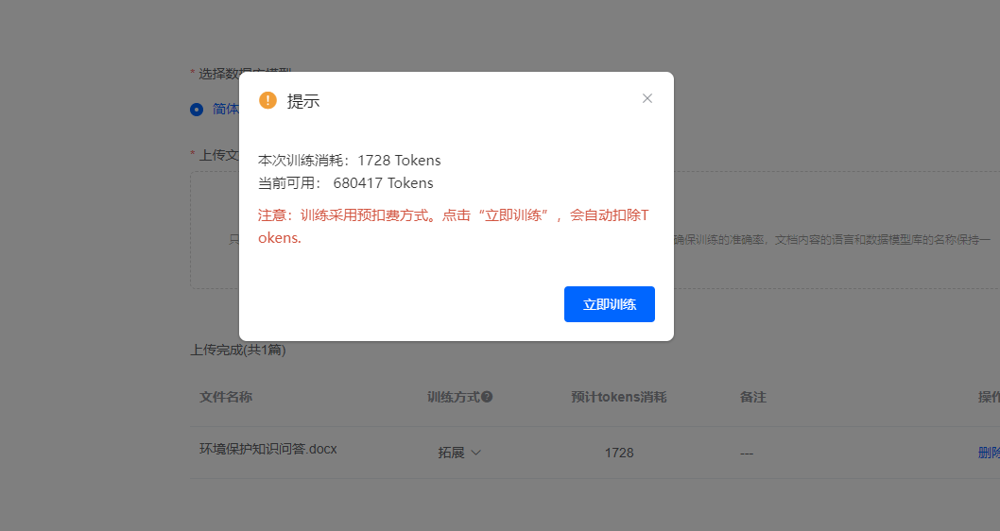

点击“立即训练”后，系统开始执行训练任务，如下图：

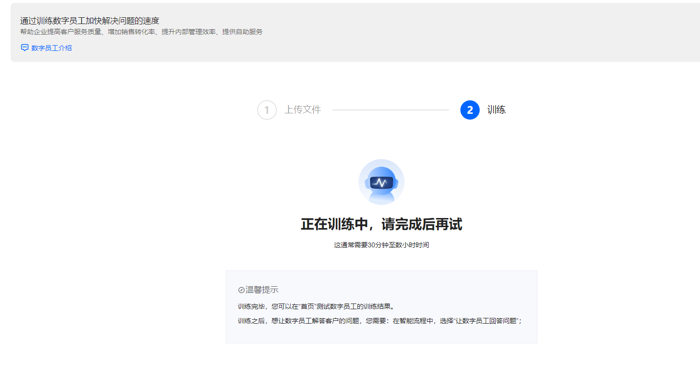

您在同一时刻只能执行一个训练任务，因此您需要等本次训练执行完毕，才可上传文档开始新的训练。
训练结束后，您可以在“历史训练”中查看本次训练实际消费的tokens，以及训练的文档，如下图：

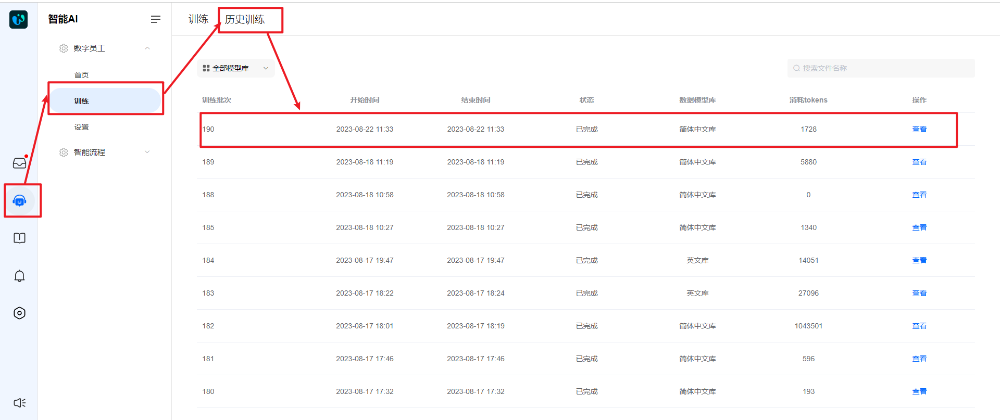

## 知识图谱管理
您可以在智能AI-首页-知识图谱中，查看当前生效的文档，如下图：

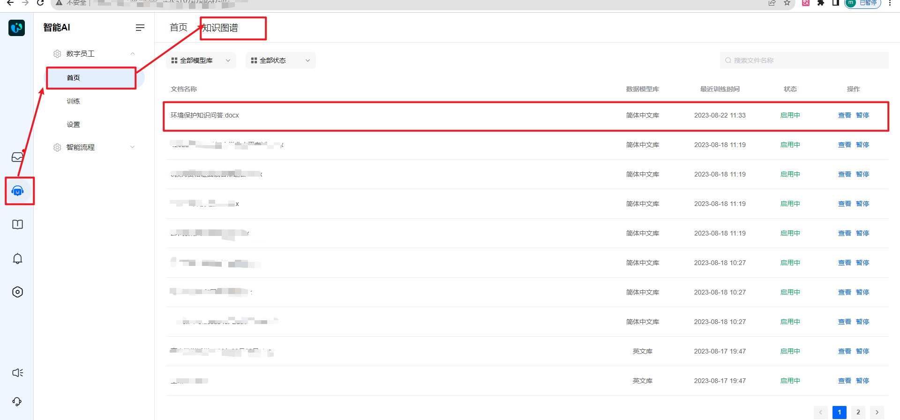

您可以点击右侧的“查看”，下载训练的文档；
可以点击右侧的“暂停”，让该文档不生效，暂停后，Finn将不再回答该文档中训练的内容。暂停后，您可以重新启用，启用后，Finn将继续回答文档中训练的内容。
如何使用Finn
## 成员如何使用
成员可以利用Finn，帮助自己更快的完成相关工作。您可以在智能AI-首页中的输入框里，对Finn进行提问，如下图：

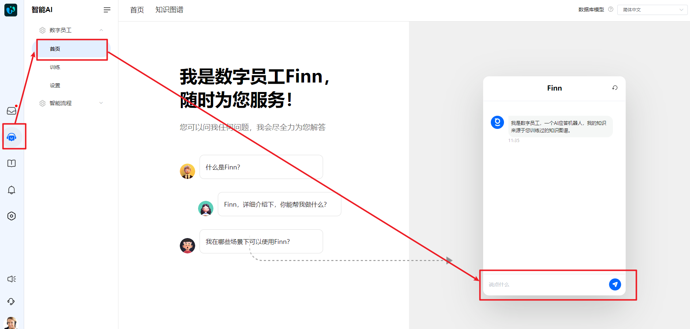

您在输入之前，需要留意数据库模型是否选择正确。
使用效果如下图：

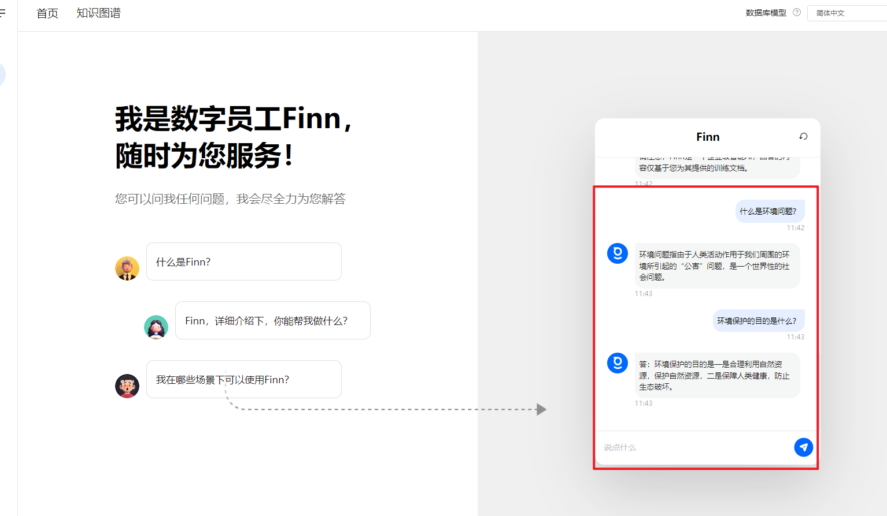

## 客户如何使用
信使端，数字员工需要结合智能流程才能使用。您需要在智能流程中配置让数字员工回答，如下图：

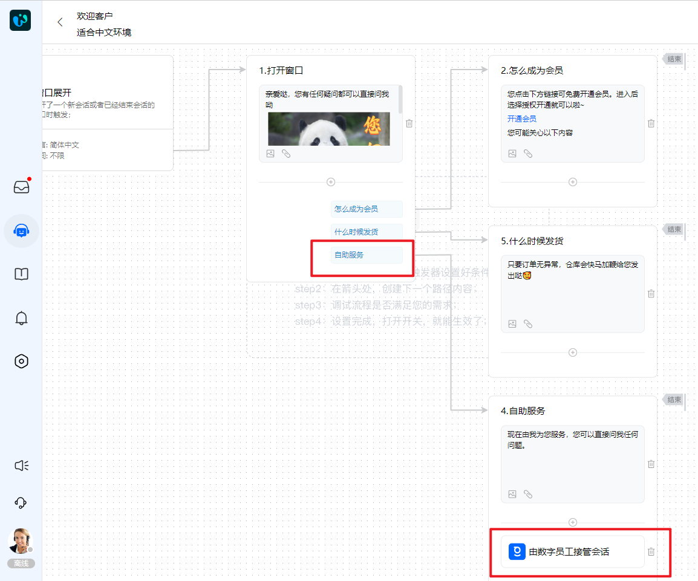

我们建议您在数字员工接管会话的路径上，设置一个文本消息，用于引导客户向数字员工提问，如下图：

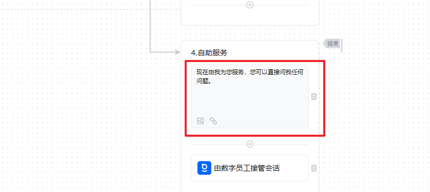

智能流程配置引导，请点击：[智能流程使用指南](https://docs.bytrack.com/8CTFE8cF/help/wikidetail?articleId=7p26seWJf7&usageCategoryId=870&usageGroupId=-1)
配置成功后，信使端点击对应的按钮后，将会由数字员工接管会话并回答，如下图：

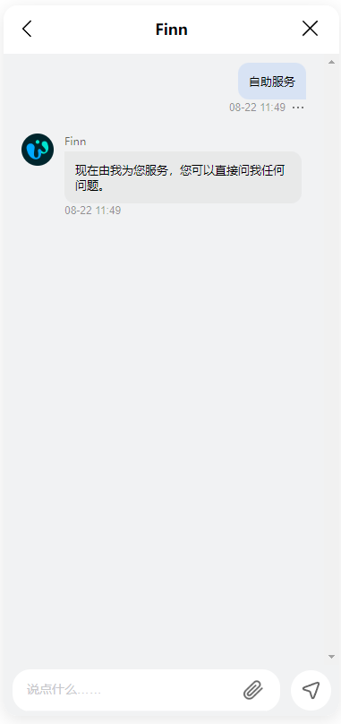

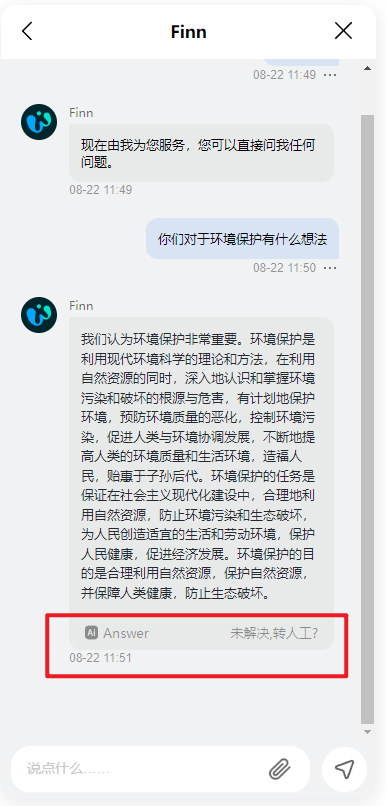

Finn的回答内容底部，会出现一个AI Answer 的标识，当客户不满意Finn的回答时，可以点击“未解决，转人工？”，系统将自动把会话转接给人工客服，由人工客服回答问题。如下图：

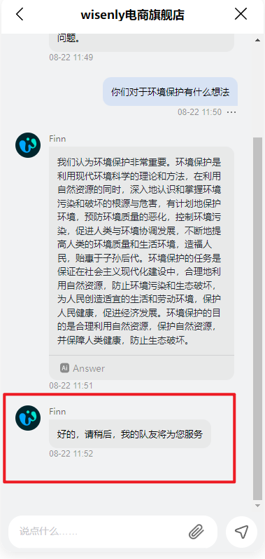

Finn的管理
## Finn的会话
 您可以在Finn的会话视图下，查看Finn当前负责的所有会话，如下图：

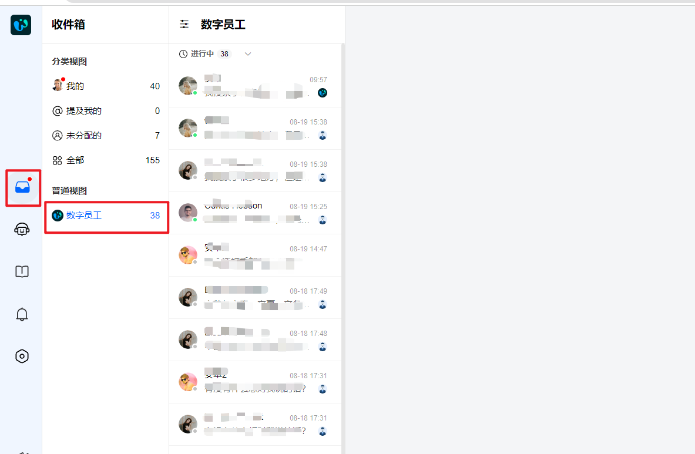

若您觉得数字员工的回复不满意，可以直接进入会话里进行回复，也可以把会话手动转接给其他成员。

## Finn的设置
您可以修改Finn的头像和名称，只需进入智能AI-设置页面调整，如下图：

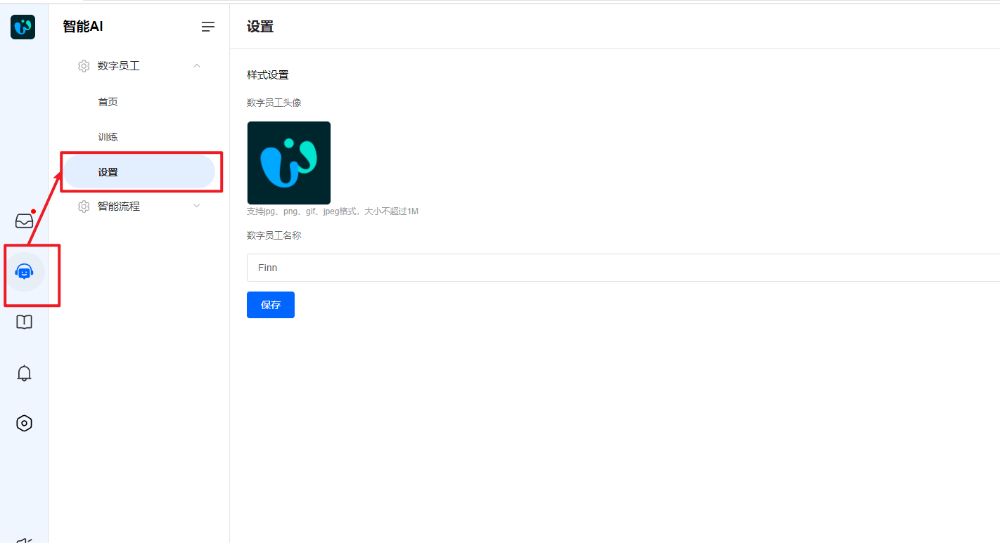

 👋👋👋以上，您已成功了解Finn的训练和使用了。您可以进一步了解智能流程的详细使用：
● [智能流程使用指南](/8CTFE8cF/help/wikidetail?articleId=7p26seWJf7&usageCategoryId=870&usageGroupId=-1)
● [智能流程的详细说明](/8CTFE8cF/help/wikidetail?articleId=dAmklHuZo3&usageCategoryId=870&usageGroupId=-1)
