# Finn的自动构建

> 分类:06-自动化 | articleId:U9NHJoyn9O | 描述:介绍虚拟员工Finn如何方便快捷的进行日常新知识的学习

👋👋👋在我们第一次使用虚拟员工Finn，作为您客服助理的时候，我们可以通过上传txt等文件的方式，将知识内容提供给Finn进行基础的学习。
 伴随着我们客服系统在日常使用过程中，会出现Finn无法回答的问题（因为这些问题和内容，您并没有完全提供给Finn，所以Finn并没有掌握）。针对这些零碎的知识点，如果让您一个个记录，并汇总到一个文档中，再次上传并提交给Finn学习的话，这种方式太过于麻烦。
 现在，我们支持Finn知识的自动构建，能够方便快捷的，在客服和用户日常对话中，提炼出新的知识点，并将知识点提供给Finn进行学习。Finn经过学习，再后续遇到相同问题的时候，就可以完美的进行回答。
 👋👋👋针对Finn的知识资料学习，目前就会存在两种方式：
- 初始配置Finn的时候，提供您现有的知识资料文件，比如txt等。在后续日常服务中，通过自动构建知识的方式，给Finn提供动态的学习能力，这样Finn会服务的越来越完善。
- 初始配置Finn的时候，您无法提供知识资料文件。没有关系，您只需要在后续的日常服务中，通过自动构建知识的方式，给Finn提供动态的学习能力，这样Finn也可以服务的越来越完善
 接下来，我们将注重介绍下，怎么使用Finn的自动构建！

## 1，自动构建

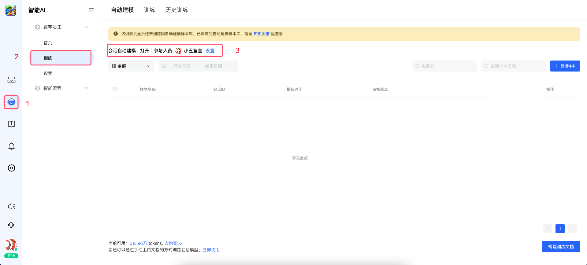

选择“智能AI-->数字员工-->训练-->自动建模”，将“自动建模”的设置开启，选择指定的客服。

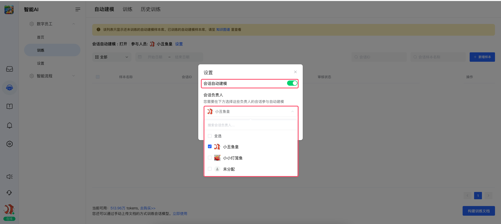

注意：
1，开启“自动构建”按钮
2，选择指定的客服成员，只有经过您指定的客服，处理过的对话内容，才会进行自动的提炼，并最终形成知识点样本。（客服成员的技能水平不同，我们希望您能够选择您信任的客服，通过他们的沟通服务，才能形成最好的回答模式和内容。这里，比如您选择的客服主管）
3，数字员工的“自动构建”功能，需要您具备充足的AI Tokens。如果您没有AI Tokens资源，可以在上述页面，点击进行后续的购买。
👋👋👋恭喜，您已经正确开启数字员工的“自动构建”功能。
当该功能开启之后，您业务系统内的用户，通过客服系统，和您的客服成员之间进行对话。当该对话服务完毕时，您需要将该会话结束掉。当会话结束时，我们就会自动构建上一次对话片段中的知识点样本。

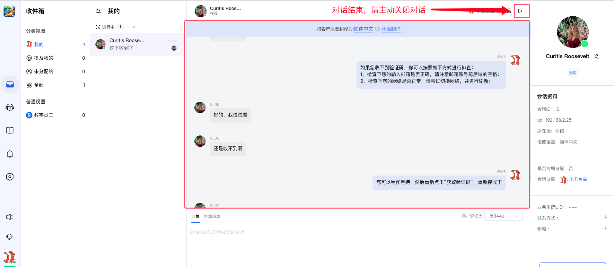
 
当您主动结束该对话之后，我们会将满足条件的客服成员所负责的对话片段进行自动提炼和总结，并最终出现在“自动构建”的列表中

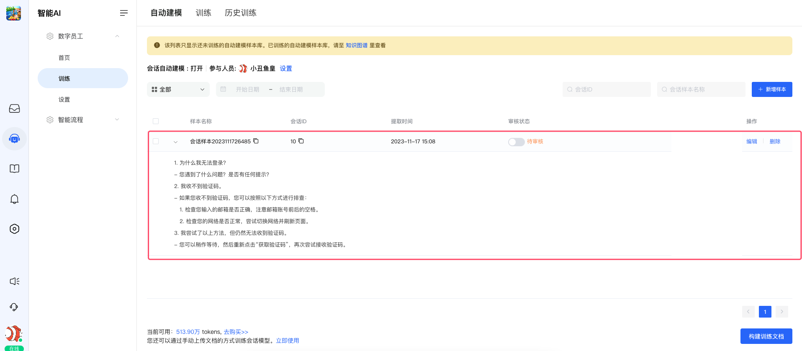

如果您觉得，自动构建的知识库样本不够完美，那么您可以在此处，针对知识样本进行编辑修改，修改完成之后，点击保存。我们会默认为：这个知识样本，您已经审核通过，后续可以提供给Finn进行训练

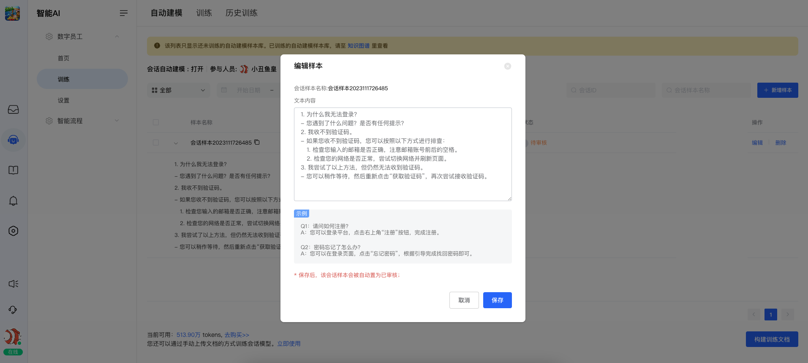

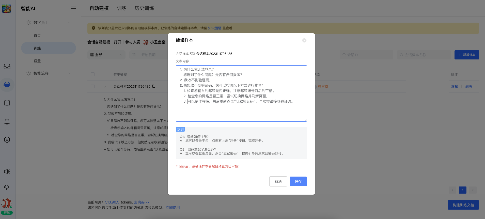

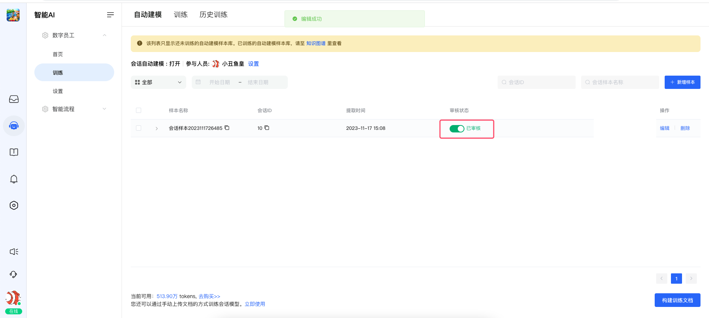

 当然，您也可以随时手动新增知识样本。编辑并保存知识点样本之后，您也可以在样本列表中看到它

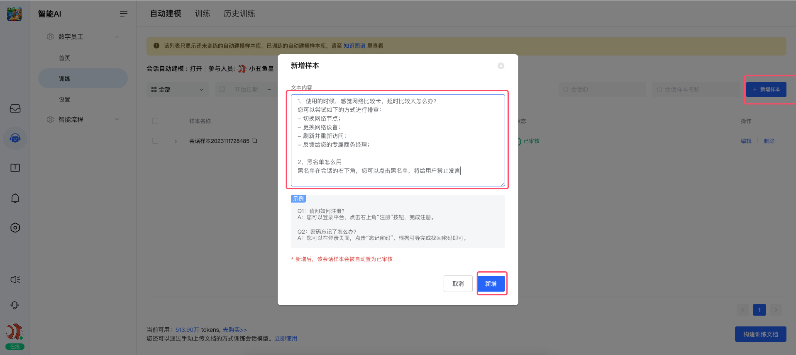

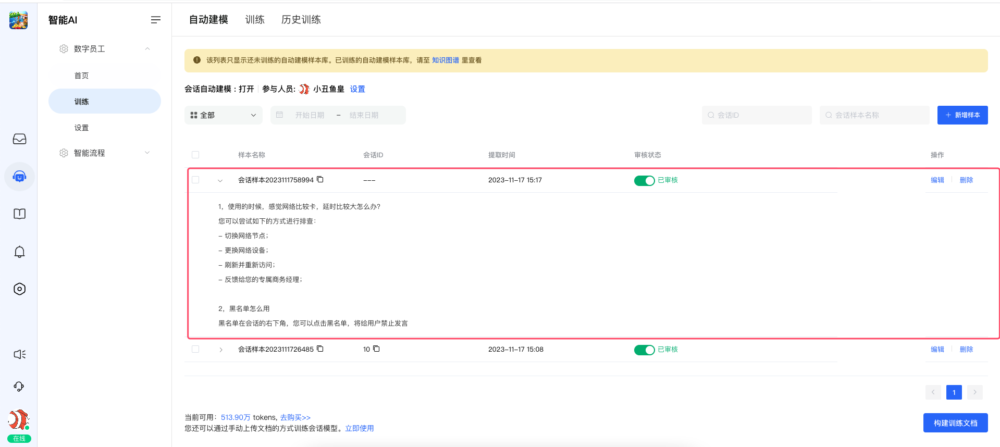

👋👋👋注意：
- 使用该功能，请务必开启“自动构建”功能
- 请妥善选择能够参与“自动构建”的客服成员。这样可以帮助您，有效的避免很多垃圾类容
- 为了保障你提供给Finn学习的知识点的正确订，请针对提炼的知识点样本进行审核。因为AI的使用，是很依赖于您提供知识资料的正确性。如果提供学习的知识资料本身不正确，那么AI也无法给出您满意的回答（当然，您也完全可以不审核，这样数字员工受限会比较严重，无法提供更优质的反馈）
- “自动构建”的目标，是会话中最近一次的对话片段：即本次对话开始，到对话结束之间。历史对话信息，不会参与提炼。

## 2，指向性构建
 如果您不需要针对每条对话，在结束的时候都自动进行构建，那么您可以关闭“自动构建”功能。
 当您审查对话，发现一个新的知识点时，您可以在会话页面，手动进行知识样本的构建，如下图所示：

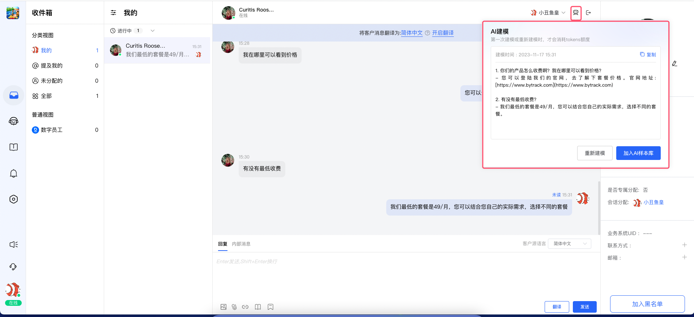

您可以“重新建模”或者将该知识点样本“加入AI样本库”中，加入之后，您可以在样本库列表中看到它，如下图所示：

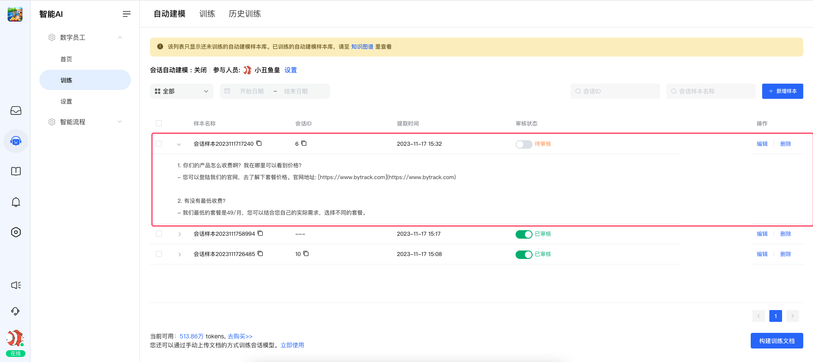

## 3，Finn训练
 经过“自动构建”和“指向性构建”，您将会生成自己的知识库样本列表。您需要针对样本列表，进行认真的审核。审核完毕之后，您需要选择若干样本记录，将其提供给FInn进行训练。

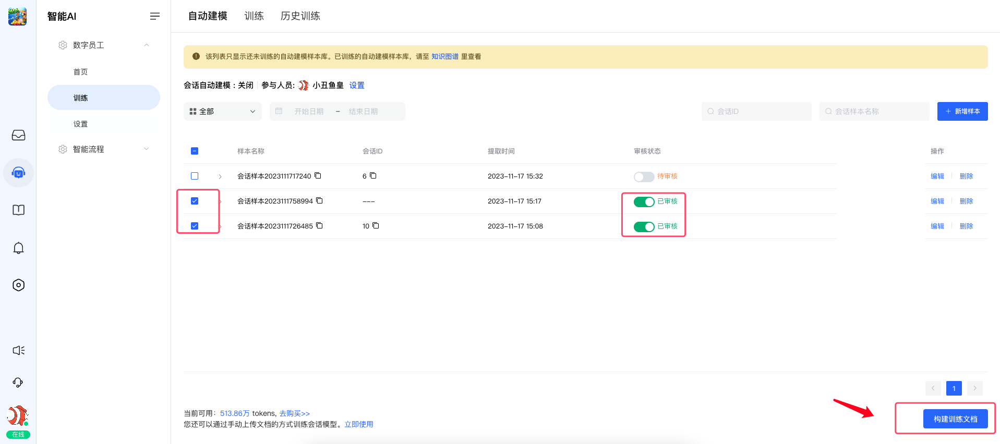

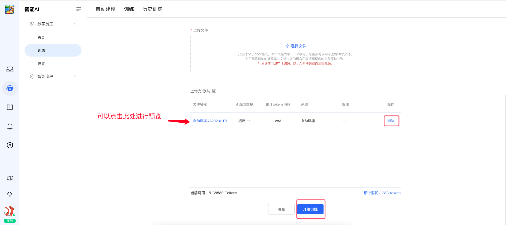

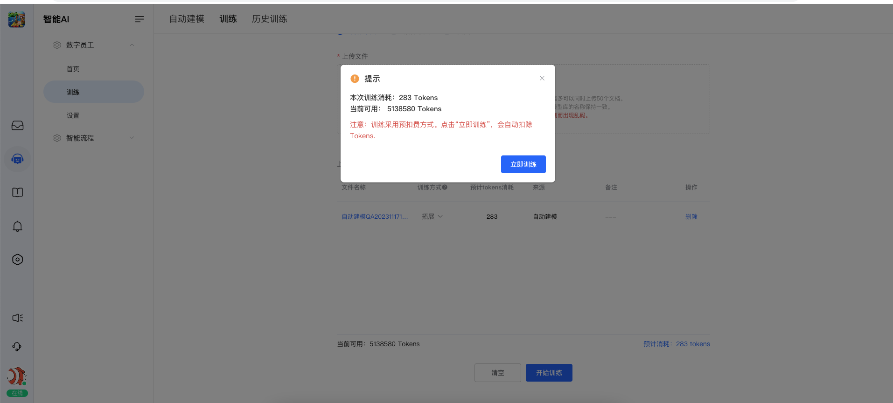

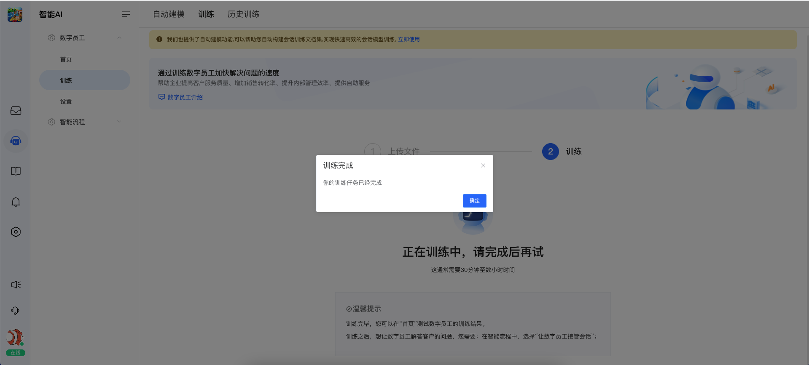

训练完成之后，您可以去“历史训练”中进行本次训练内容的产看和预览

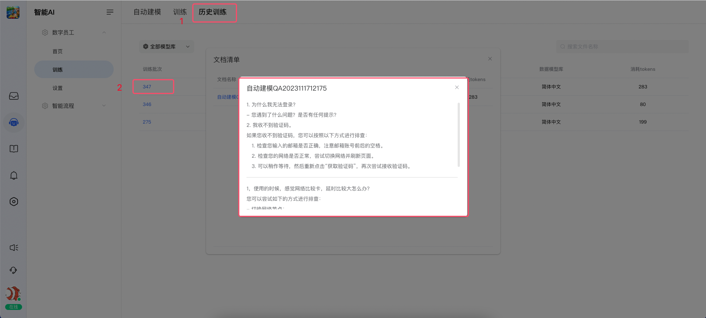

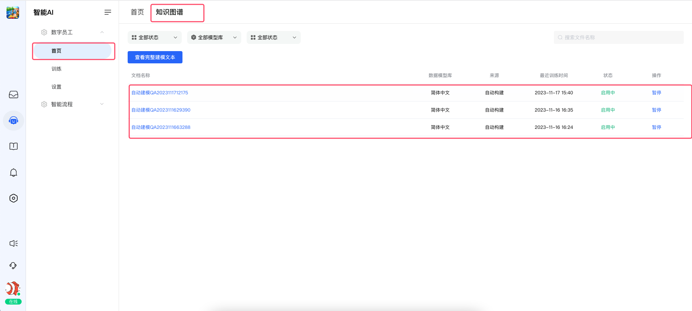

如此，您的数字员工，就可以学习到新的知识内容。
关于如何进行训练和数字员工的使用，请参考帮助中心里面对应的文章介绍。
本文档仅介绍如果使用“自动构建”和“指向性构建”的相关内容。

## 4，Finn的AI客服服务
👋👋👋恭喜，至此，您的数字员工，已经动态学习到了新的知识点，我们可以去客服对话中，尝试下效果

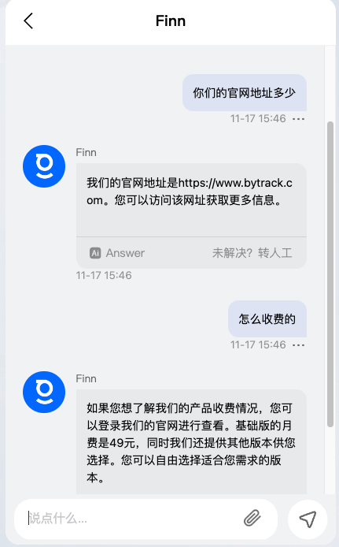

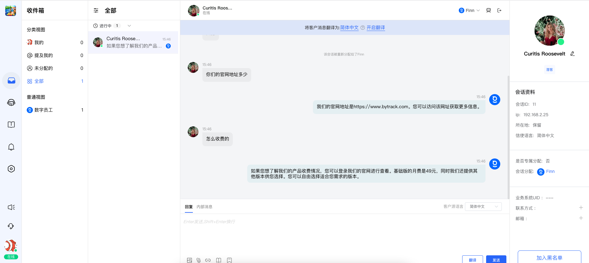
