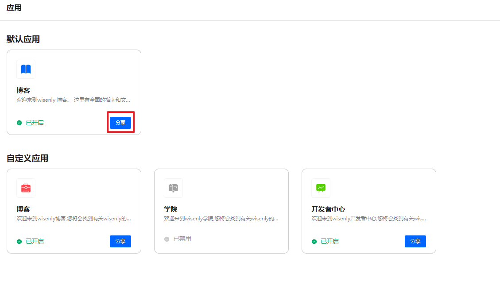
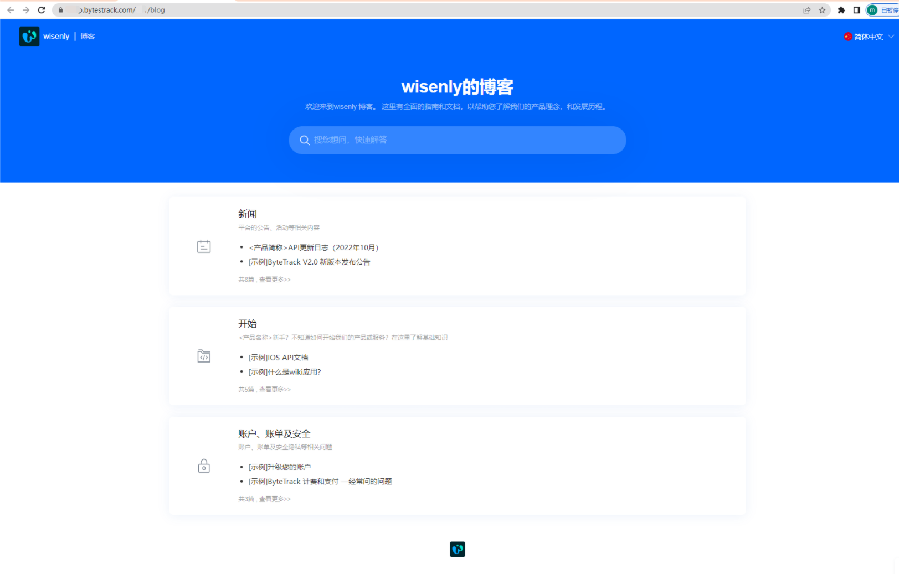
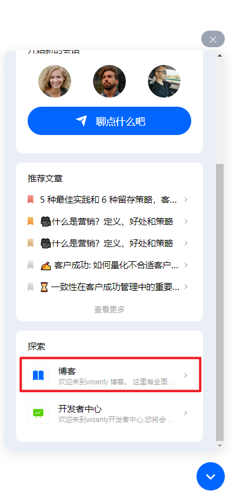

# 什么是wiki应用？

> 分类:07-wiki知识库 | articleId:iHnSNyrw5Q | 描述:

什么是wiki应用？ 您是否遇到这样的问题：想拥有自己的企业博客网站、产品帮助中心网站，您需要购买服务器、域名、然后还需要会些代码知识，这对于不少中小企业来说是一个门槛。那么如何快速搭建属于自己的网站呢？ByteTrack提供了一键方式建站功能，支持同时创建多个站点。
 ByteTrack中，每一个wiki应用，都是一个文章站点， 这个站点里是您在ByteTrack创建的文章合集。您可以构建一个或者多个属于自己的文章站点，同时关联需要的文章，满足您对于类似“帮助中心”、“开发者中心”、“学院”、“博客”等场景的需求。
wiki应用站点 当您在ByteTrack中创建好wiki应用后，您可以在应用的右侧点击“分享”按钮，查看自己的站点效果。
 “分享”按钮位置如下图：

 
站点预览效果如下图：

 
通过复制浏览器中站点的URL，您可以在您的业务系统、ByteTrack信使中，引用该wiki站点。
信使引用wiki站点 您可以在ByteTrack信使设置中进行wiki站点的关联，关联后，您的客户在访问ByteTrack信使时，同时能访问您的这些wiki站点，让客户和您的关系进一步加强。下图是关联后信使端的显示：

 

👏👏👏现在您已初步了解wiki应用，那么就让我们继续吧👇
[创建您的第一个wiki应用](https://docs.bytrack.com/8CTFE8cF/help/wikidetail?articleId=5rvGvTbEZE&usageCategoryId=429&usageGroupId=833)
[编辑wiki应用的样式和基础信息](https://docs.bytrack.com/8CTFE8cF/help/wikidetail?articleId=5xVo9e2kZo&usageCategoryId=429&usageGroupId=833)
[为wiki应用关联文章](https://docs.bytrack.com/8CTFE8cF/help/wikidetail?articleId=5xVo9e2kZo&usageCategoryId=429&usageGroupId=833)
[信使中关联wiki应用](https://docs.bytrack.com/8CTFE8cF/help/wikidetail?articleId=V0lJB8YoIl&usageCategoryId=429&usageGroupId=833)
 [为wiki站点自定义域名](https://docs.bytrack.com/8CTFE8cF/help/wikidetail?articleId=NADLvsROWA&usageCategoryId=429&usageGroupId=833)
