# wiki文章管理

> 分类:07-wiki知识库 | articleId:AXVBDeqPkw | 描述:

● 什么是wiki？
 ● 如何管理wiki的文章？
 ● 如何使用wiki的文章？
Wiki介绍Wiki是一种超文本系统，由各种文章组成，可让您的团队为客户提供更快的支持。通过wiki的编辑器，您可以创建丰富的文章，借助这些文章，您的团队可以让客户在聊天之前快速自助，也可以在聊天过程中更快地回答客户的问题。同时您可以通过文章外链，在各个平台分享您的产品介绍。
文章管理
## 文章列表

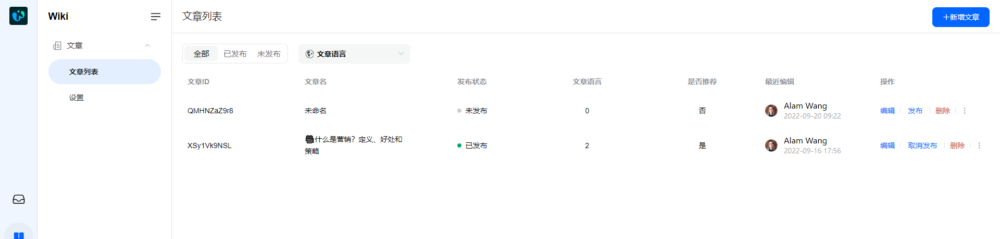

文章列表由以下参数组成：
1.文章ID：文章的唯一性标识；
2.文章名：文章名称，文章名默认显示简体中文，当在搜索处选择语言时，文章名会切换成其他语言项。
3.发布状态：该文章是否被发布；
注意：已发布的内容不一定是文章的最新版本。 您可以在文章详情中查看是否有“有变更”的提示，如若有，表示文章最新调整的内容还未发布。
4.文章语言：当前文章支持简体中文、英文的发布；文章语言表示文章设置了多少种语言的内容；
5.是否推荐：文章一旦设置为推荐，则信使端可见推荐的文章；
6.最近编辑：最近编辑人和最近编辑时间；
7.文章链接：已发布的文章的分享外链。

点击文章名，可以直接进入文章详情。

## 新增文章
文章的属性包括：文章名、文章描述、文章正文。同时文章支持多语言。切换到不同语言下，即可编辑不同语言的文章内容。
注意：当前文章支持中文、英文。

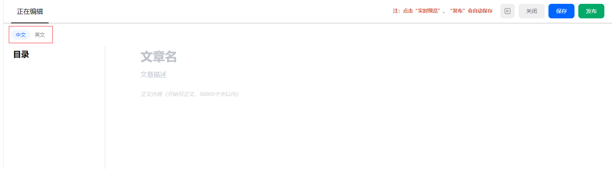

编辑过程中，可以点击“实时预览”查看文章的显示效果。
注意：点击“实时预览”、“发布”，文章均会自动保存。
点击“关闭”按钮，可以返回到文章详情页。

## 文章详情
文章详情是文章的全方位展示。
文章一共有两个视图：草稿视图、已发布视图。
草稿视图：即草稿箱，用来存放暂时性的、待修改的文件或存放草稿的地方。
已发布视图：已经发布到线上的文档。
注意：已发布视图，和草稿视图的内容会存在不一致的情况。

### 已发布

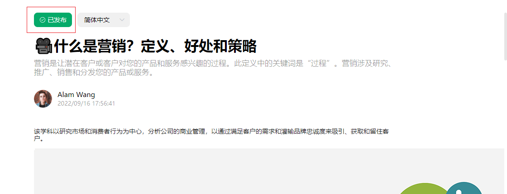

已发布表示文章的草稿箱内容和已发布内容是一致的。

### 有变更

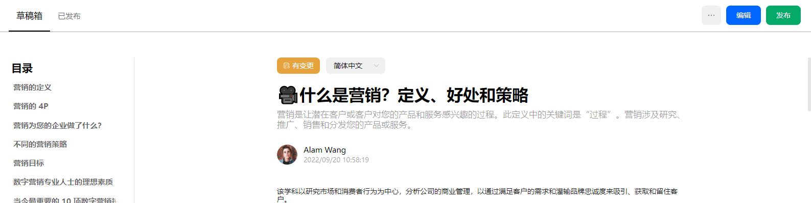

有变更表示草稿箱内容有更新，与已发布内容不再一致。

### 未发布

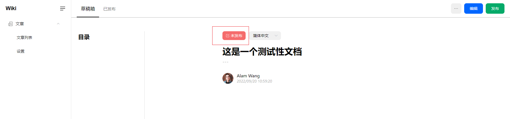

未发布表示文章的草稿箱内容还未发布。

## 查看历史记录
在文章详情中点击“历史记录”，可以查看文章的历史修改版本。
当前历史修改行为包括：创建、编辑、发布、取消发布。
点击其中某个版本，可以预览对应版本的详细内容。

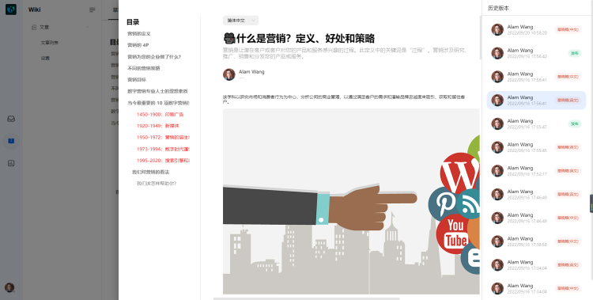

文章使用
## 分享文章外链
针对已经发布的文章，会生成文章分享链接。在文章详情的已发布视图下，可以看到该链接地址。

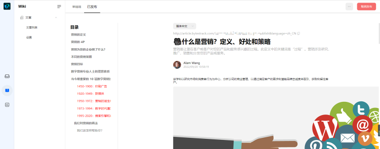

还可以在文章列表的操作区域，直接复制文章外链。
外链可以分享到其他平台访问查看。

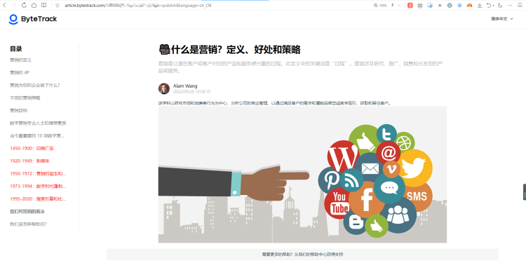

注意：外链支持手机端、PC端访问。
如若文章设置了多语言，则在文章预览时，可以切换语言项显示。

## 收件箱发送文章
您的队友在和客户沟通时，可以直接发送您已发布的文章，帮助客户更好的了解您的产品。
收件箱中，点击对应的“知识库”图标，即可在弹框中选择文章发送。

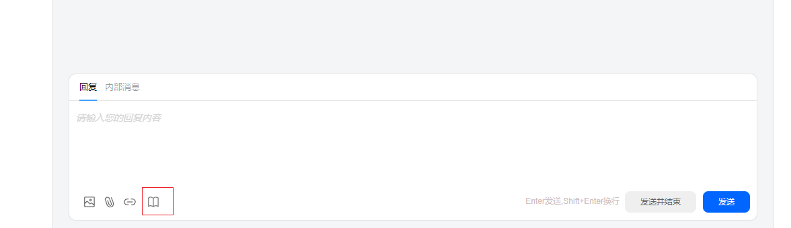

您队友也可以选择想要给客户发送的文章语言项。

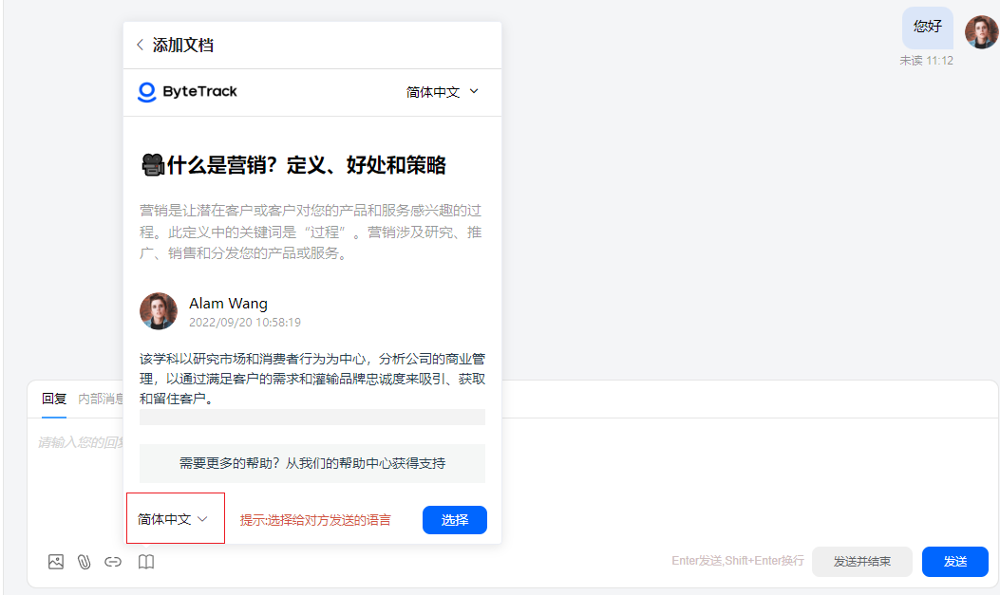

## 文章推荐
当已发布的文章被设置为推荐时，用户打开信使即可第一时间看到您推荐的文章。信使端显示如下图：

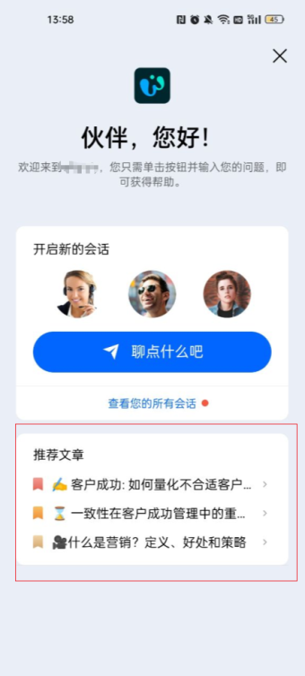

您只需要在文章管理中，为您需要展示的文章设置为推荐。
注意：设置为推荐后，需要文章为发布状态，信使端才可见。

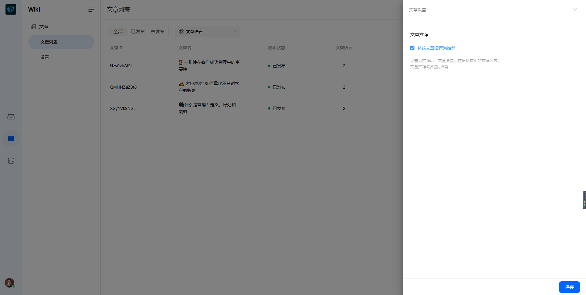
