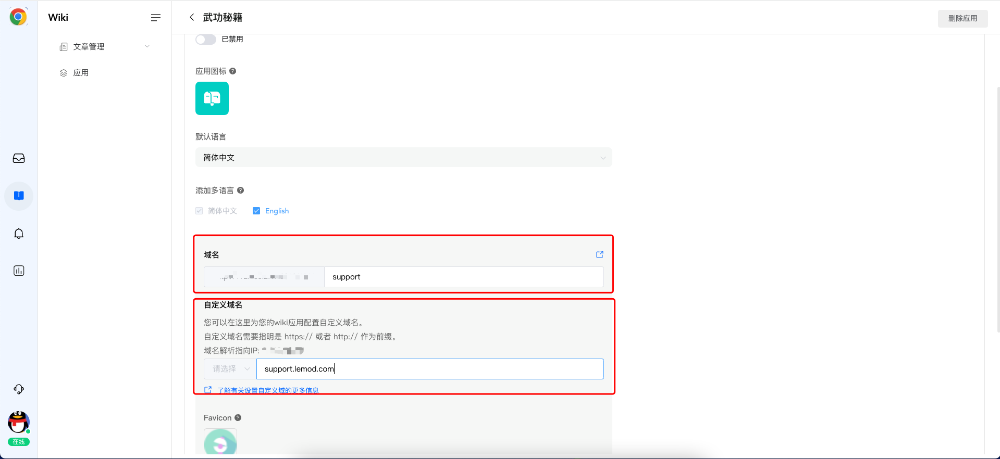
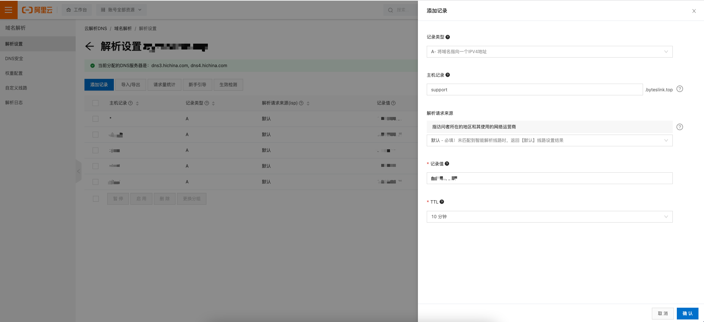
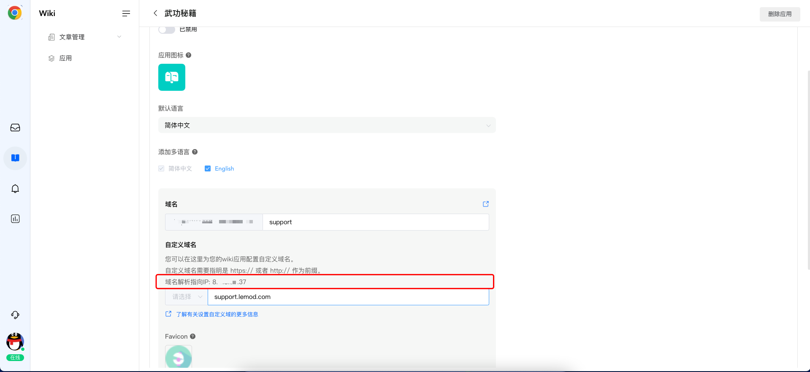
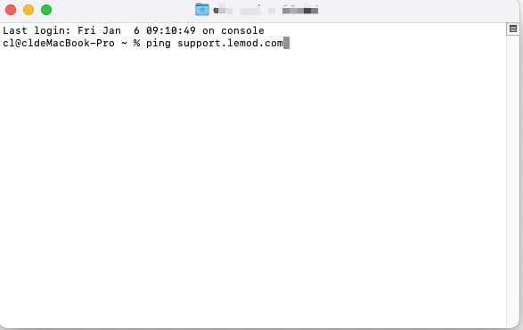
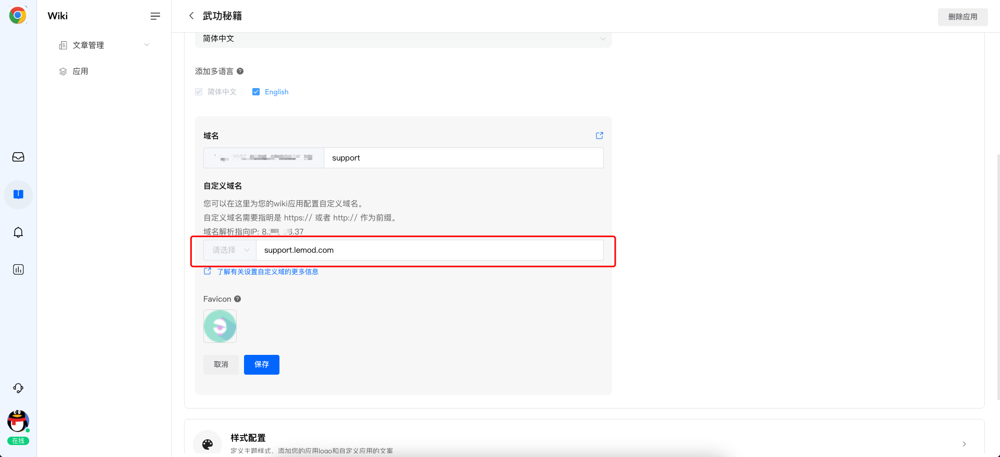

# wiki应用站点的自定义域名

> 分类:07-wiki知识库 | articleId:NADLvsROWA | 描述:

1、应用站点的访问地址 在wiki应用中，您可以构建属于您自己的文章站点，用于满足您对于类似“帮助中心”，“开发者中心”等场景的实际需求。您将应用站点构建成功之后，可以通过配置参数的方式，去调整该站点的公开访问地址。ByteTrack向您提供两种方式，以便于您可以更加便捷的进行站点地址的配置和使用。

1. 使用ByteTrack系统默认的地址，例如上图中“https://docs.bytetrack.com/kaixih/support”
2. 使用自定义域名，例如上图中的“https://support.lemod.com”

 使用系统默认的地址很简单，只需要您将站点的标识，例如上图中“support”填写完成即可使用。下面我们将针对自定义域名进行使用的讲解

2、自定义域名的设置方法

1.申请域名
2.解析域名
3.在应用的“站点配置”相中，将域名填写好，并进行保存
4.自定义域名设置成功

## 2.1、申请域名

 您可以在您熟悉的域名服务商除申请域名，我们推荐使用阿里云进行域名的购买，具体的购买流程，请参考[阿里云域名注册](https://help.aliyun.com/document_detail/57266.html?spm=a311a.7996332.0.0.22313080r3IwnD&alywebchat=1061050145)。

👋👋👋注意：针对中国大陆的用户，您申请的域名需要进行备案，才可以使用。我们推荐使用阿里云上直接进行域名备案，具体的备案流程，请参考[阿里云域名备案](https://help.aliyun.com/document_detail/61819.html?spm=a2c4g.11186623.6.649.5cfc3b7azgFS3E)。

## 2.2、解析域名

 您的域名申请成功之后，下一步，您需要将域名进行解析。解析的方式很简单，只需要将域名解析到对应的ip地址上即可，例如下图所示：

👋👋👋注意：
· 域名解析指向的ip，可以在您的“wiki-->应用--->站点配置”出获取到，如下图所示。
· 请按照该IP地址进行解析。

 在域名解析完成之后，您可以通过ping命令来检查下，该域名解析是否已经生效，如下图所示：

## 2.3、填写域名并保存

 经过上述两步，您已经将域名准备好。接下来，您只需要将该域名正确的填写到对应的设置项中，点击保存，整个配置过程就完成了。

· 您可以选择http或者https的方式，来访问您的站点应用。
· 如果您设置了自定义域名，您将可以直接通过该域名去访问您的站点，例如：“https://support.lemod.com”

👏👏👏恭喜，您通过上述的操作，即可以使用您的自定义域名去访问文章站点。
👇如何丰富您的wiki应用？
[编辑您的wiki应用](https://docs.bytrack.com/8CTFE8cF/help/wikidetail?articleId=5xVo9e2kZo&usageCategoryId=429&usageGroupId=833)
[在信使中关联wiki应用](https://docs.bytrack.com/8CTFE8cF/help/wikidetail?articleId=V0lJB8YoIl&usageCategoryId=429&usageGroupId=833)
