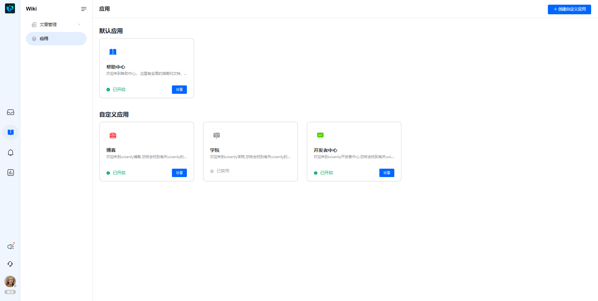
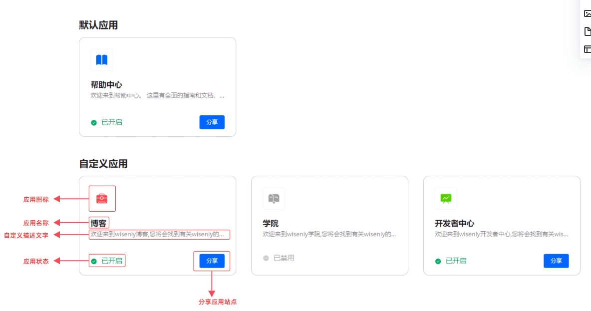
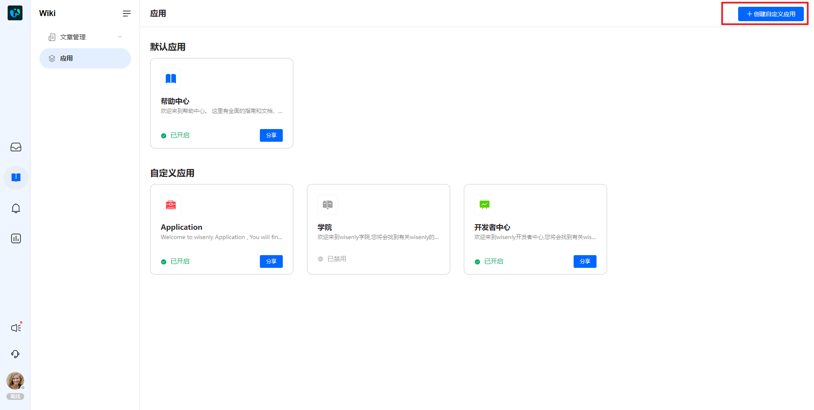
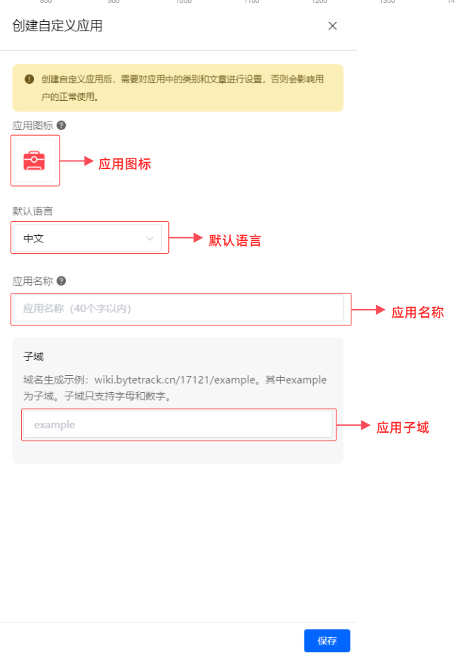

# 创建您的第一个wiki应用

> 分类:07-wiki知识库 | articleId:5rvGvTbEZE | 描述:

现在，让我们开始创建第一个wiki应用吧。
如何创建wiki应用？ByteTrack的wiki应用分为两大类：默认应用、自定义应用。
○ 默认应用：ByteTrack为您初始化好的应用，当前版本只有“帮助中心”，同时应用中关联了一些示例文档，供您快速上手使用；默认应用可以修改应用的任何属性，但是不可删除；
○ 自定义应用：您自己创建的应用，可以修改应用的任何属性，同时可以删除。
注意：删除后不可恢复。

## wiki应用列表查看
在项目方中台，点击wiki→应用，进入wiki应用列表，如下图：

 

上图中创建了三个自定义应用，分别为：博客、学院、开发者中心。
列表中每个应用的属性说明如下：

 

● 应用图标：主要用于信使中，明显区分各个应用站点；应用已开启，图标为彩色，应用已禁用，图标为灰色；应用图标只支持从图标库中选择，暂不支持自定义上传；
● 应用名称：显示该应用默认语言下的名称；
● 自定义描述文字：显示的是该应用站点首页中的描述性文字；
● 应用状态：每个应用上都显示了该应用站点的状态，包括已开启、已禁用。
 ○ 已开启：站点内容已丰富完毕，客户可以访问，就需要将站点设置为“已开启”；
 ○ 已禁用：站点处于丰富中，不希望客户访问，需要将站点设置为“已禁用”。此时历史分享出去的站点URL也无法访问；
● 分享应用站点：针对“已开启”的应用站点，点击后可以获取外网访问的站点URL（通过新标签页方式打开该应用的首页，您直接在地址栏复制地址即可），同时会自动复制URL到您的剪贴板中；

## 创建自定义应用

 

 wiki应用列表中，点击右上角的“创建自定义应用”，可以进入创建页面，如下图：

 

● 应用图标：系统会初始化为您选择一个图标，您可以在图标库中更换。这里的图标不区分是否开启；
● 默认语言：客户访问您的站点和站点中的文章时，默认以何种语言显示；您可以在此处下拉更换默认语言；
● 应用名称：这里需要设置您应用的名称，建议与默认语言的类型保持一致；
● 子域：设置站点域名的子域后，才能为您的wiki应用生成一个完整的URL。一个项目下不可使用相同的子域，防止URL冲突；
👏👏👏 点击底部的“保存”按钮，您的wiki应用就创建完毕啦！
注意：创建后的wiki应用为已禁用状态，需要进行手动开启；
👇 如何开启应用？您需要进入站点配置页面，开启它。让我们继续往下看吧。
[编辑您的wiki应用](https://docs.bytrack.com/8CTFE8cF/help/wikidetail?articleId=5xVo9e2kZo&usageCategoryId=429&usageGroupId=833)
