# 编辑您的wiki应用

> 分类:07-wiki知识库 | articleId:5xVo9e2kZo | 描述:

编辑入口 从wiki应用列表，点击某个具体的应用，进入该应用的相关参数编辑页面。如下图：

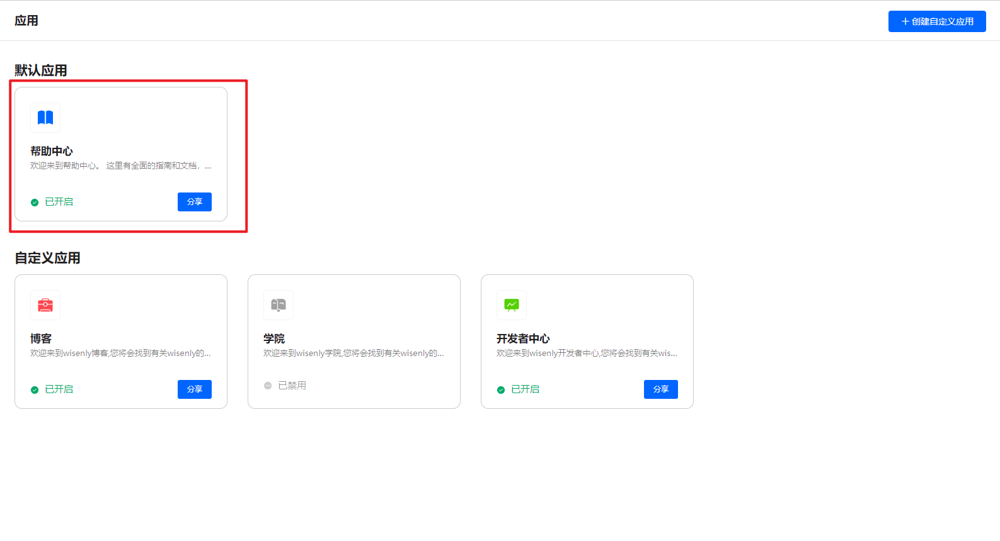
 
点击后进入编辑页面，如下图：

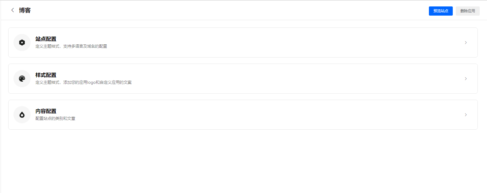
 

 wiki应用的编辑一共包括三大类：站点配置、样式配置、内容配置、删除应用。
编辑站点基本信息-站点配置 站点配置中，您可修改该应用的状态、应用图标、默认语言、多语言、子域、自定义域名、Favicon 等内容。如下图：

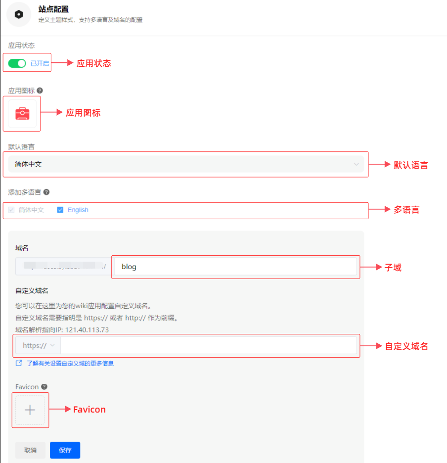
 

● 多语言：新创建的wiki应用默认只有一种语言，您可以在这里开启多语言显示。开启后，您的客户在访问站点时，可以切换语言查看站点。
注意：开启多语言后，需要您为不同语言设置站点的展示文案和文章。详细见下文的“样式配置”、“内容配置”。
● 子域：子域可以在这里修改，但是同一个项目下不可重复；
● 自定义域名：您可以为站点设置单独的访问域名，详见文章[“](www.baidu.com)[wiki应用站点的自定义域名](https://docs.bytrack.com/8CTFE8cF/help/wikidetail?articleId=NADLvsROWA&usageCategoryId=429&usageGroupId=833)”；
● Favicon：您可以为站点设置icon图标。设置后访问站点效果如下：

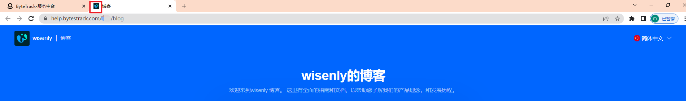
 

👏👏👏点击Favicon下方的“保存”按钮，您的站点配置就操作完毕啦！
注意：保存后，您可点击右上角的“预览站点”按钮，实时预览您设置的效果；
“预览站点”位置如下图：

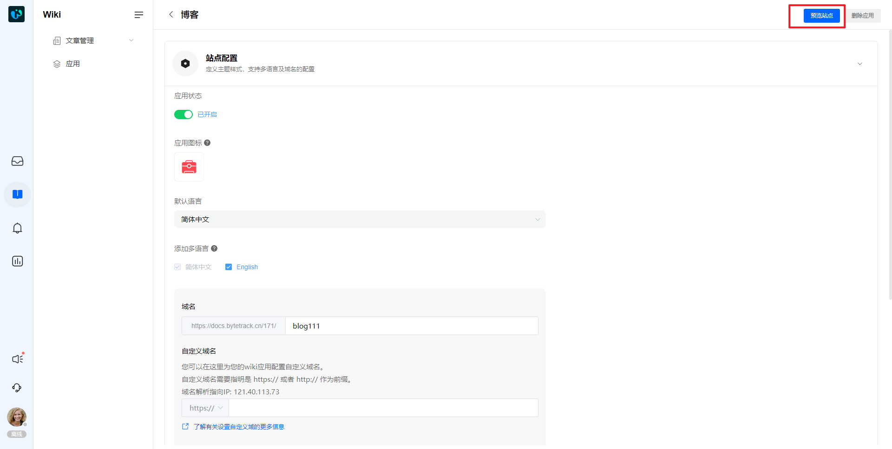
 

👇 如何设置站点的样式？让我们继续往下看吧。
配置站点的呈现-样式配置 样式配置主要是为站点的首页配置宣传文案、类别页配置文章布局。如下图：

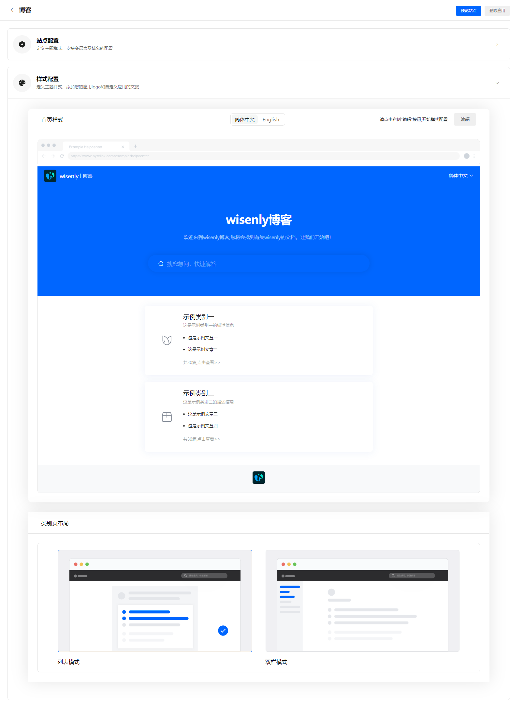
 

## 首页样式配置
 点击右侧的“编辑” 按钮，进入首页配置编辑页面，入口如下图：

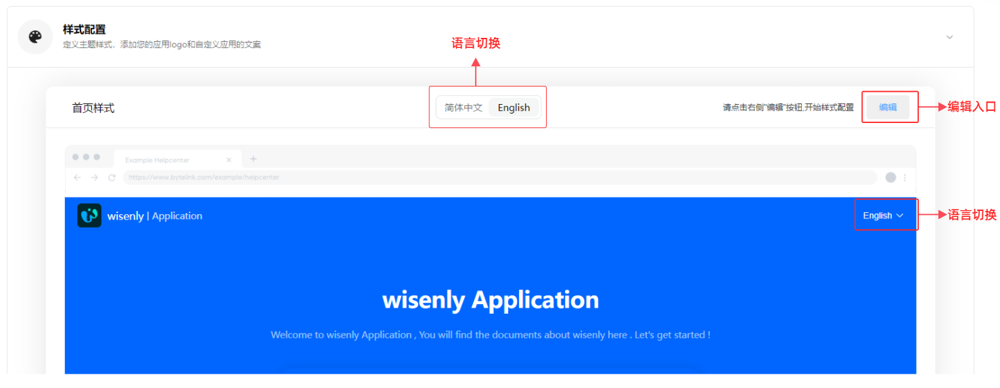
 

注意：如若您设置了多语言，需要在上图的“语言切换”处，选择对应的语言项，再点击“编辑”按钮；否则默认进入“简体中文”环境的编辑页面；
 编辑页面打开后如下图：

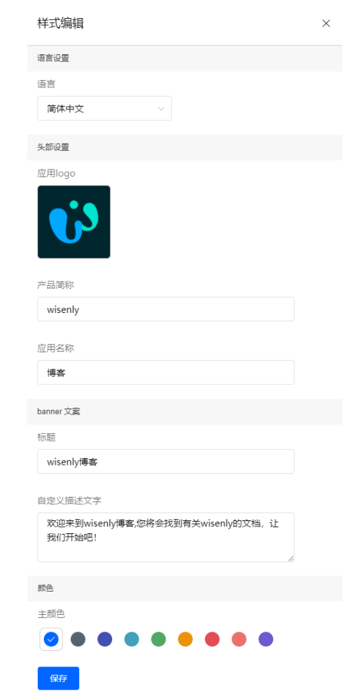
 

 以下对每个参数的内容和显示效果进行说明：
● 语言：标识了您当前为站点的哪种语言环境设置样式。
注意：设置应用名称、标题、自定义描述文字时，您输入的语言请和您选择的语言保持一致；
● 应用LOGO、产品简称、应用名称：这三个参数在wiki站点中的显示位置如下图：

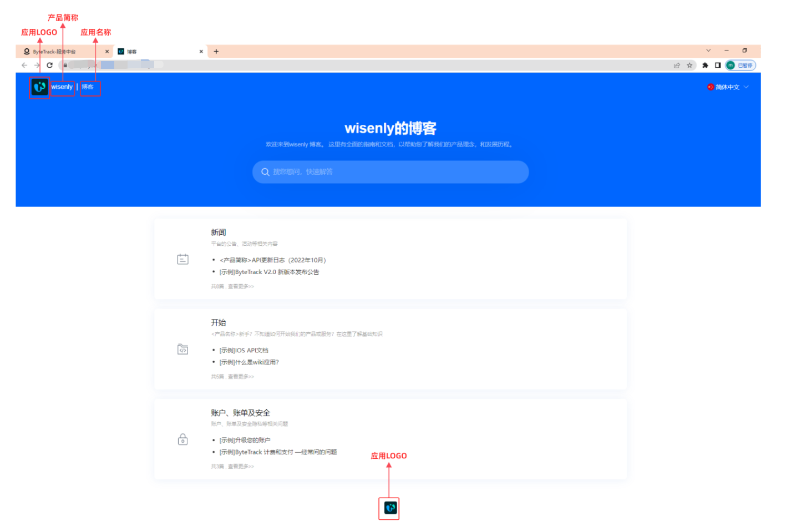
 

注意：应用LOGO、产品简称这两个参数的调整，会自适用于站点的所有页面；应用名称参数的调整，会自适用于修改语言下，站点的所有页面；
● 标题和自定义描述文字：这两样是显示在wiki站点首页中的宣传性文案。建议这里的文案简洁干练，如果您的站点需要多语言，请不要忘记各个语言下的设置。具体显示位置如下图：

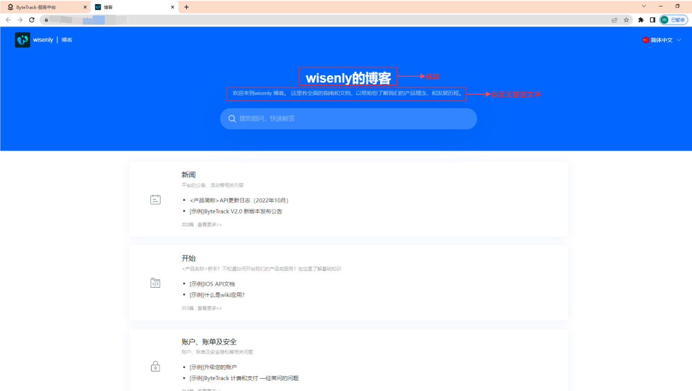
 

针对初始化的“帮助中心”，我们自动生成了标题和自定义描述文字，您可以根据按需调整；
● 主题色：主题色是您站点的主要配色。ByteTrack目前支持多个主题色任选。您在修改了主题色后，点击“保存”按钮，既可以在“样式设置”预览页面查看显示效果，如下图：

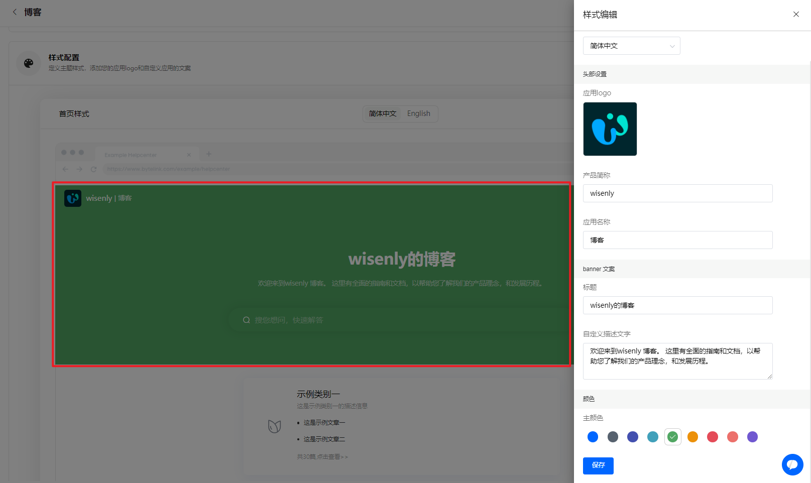
 

注意：样式设置的预览页面，可以预览您整个站点的首页样式呈现效果（不包括文章和分组）。您还可以点击右上角的“预览站点”，查看站点的实际显示效果。位置如下图：

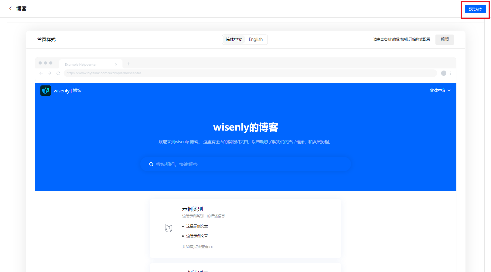
 

如若您的站点处于禁用状态，“预览站点”获取的URL请不要对外分享。
注意：如果您需要配置其他语言项下的首页内容，记得先保存；

## 类别页布局配置
 当前ByteTrack提供了两种类别页的布局，分别是：列表模式、双栏模式。两种模式的样式分别介绍如下：

### 列表模式
 WEB端的文章列表页面（即类别详情页）样式如下：

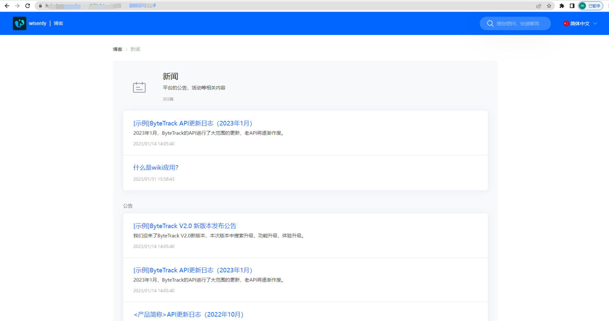
 

 WEB端的文章详情页面样式如下：

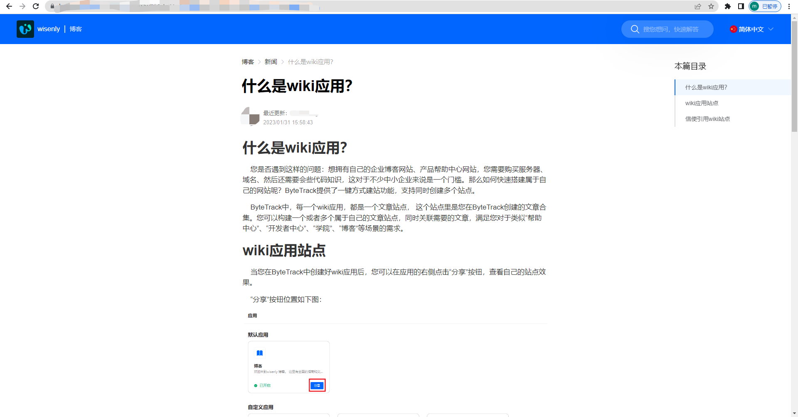
 

 H5端的文章列表页面（即类别详情页）样式如下：

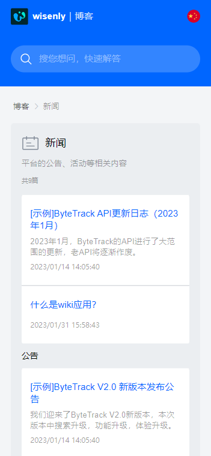
 

 H5端的文章详情页面样式如下：

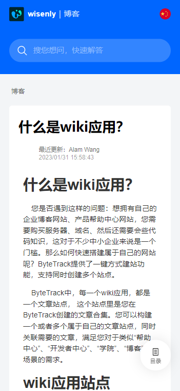
 

### 双栏模式
 WEB端的文章详情页面样式如下：

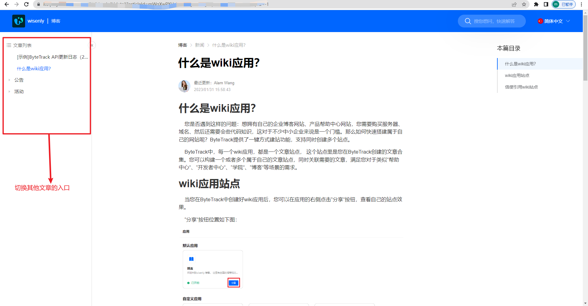
 

 H5端的文章详情页面样式如下：

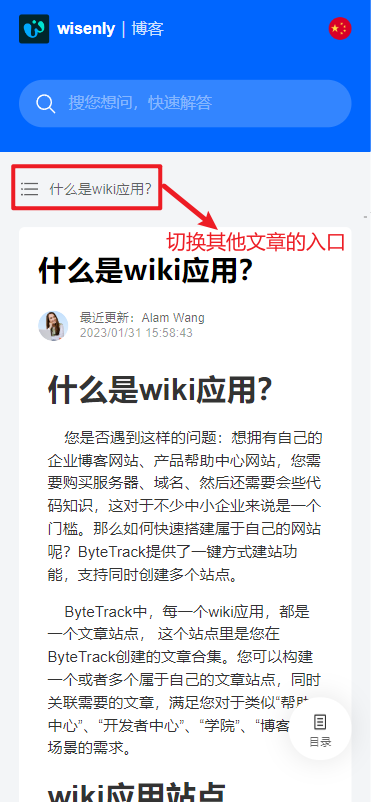
 

### 两者区别
● 列表模式有文章列表页（即类别详情页），双栏模式没有文章列表页，只能从首页进入文章详情页；
● 双栏模式的文章详情页有文章列表入口，列表模式的文章详情页没有文章列表入口；
丰富站点的文章-内容配置您可以在内容配置中，为您的站点配置类别以及类别下的文章。
类别在用户端的显示如下图：

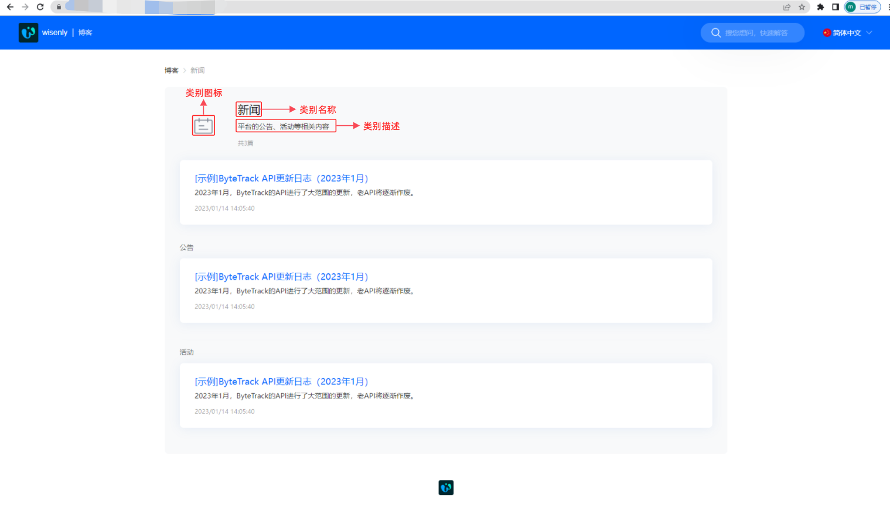
 

您可在内容配置页面，查看和创建您的类别，如下图：

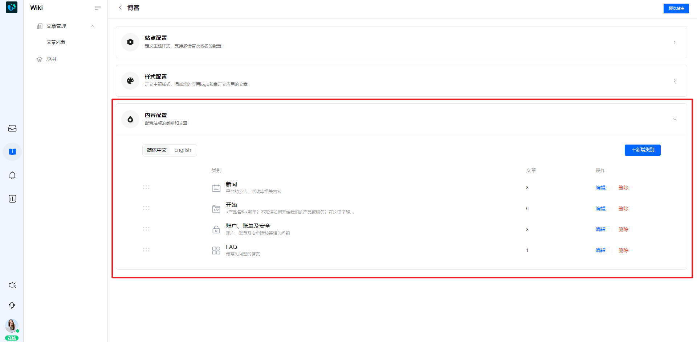
 

切换不同的语言，可以查看每个语言下类别的显示，以及关联的文章。
您可以拖动左侧的图标，对类别进行排序；点击右侧的编辑，对类别的基本信息进行修改；
注意：这里的文章数量，是已关联的未发布、已发布文章总和，且统计没有区分语言。如若想看每个类别下，每种语言中的具体文章数量和内容，请点击“类别名称”进入类别详情页查看。

### 关联文章
文章需要关联到某个类别下才能生效；
您可以在内容配置里，点击某个类别名称，进入类别下的文章列表页，对该类别的文章进行配置。
入口如下：

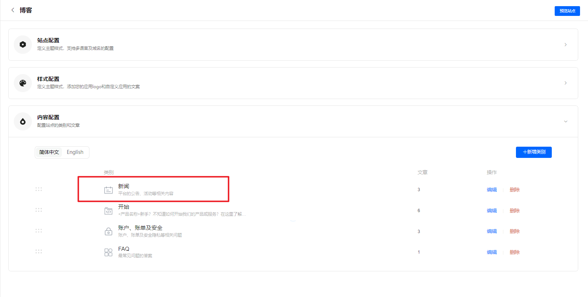
 

类别详情页如下：

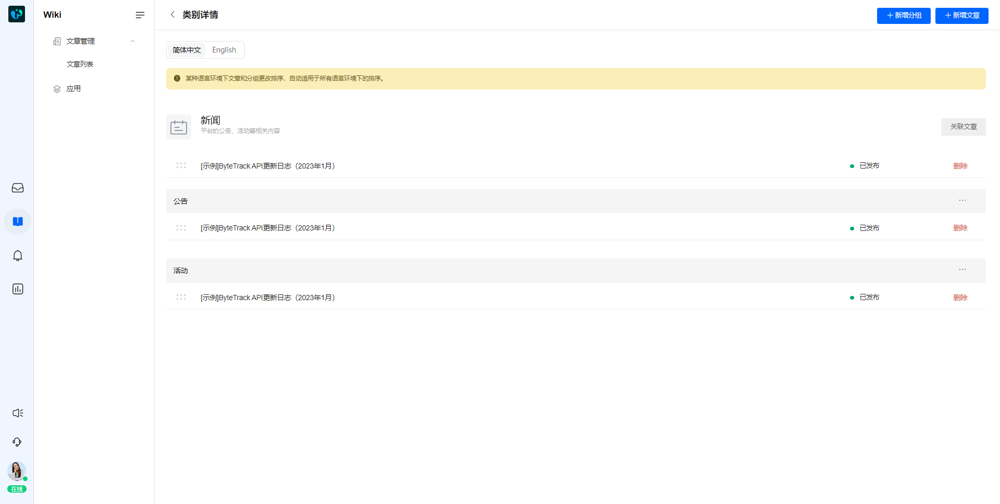
 

类别详情下，您可以新增分组、新增文章、可以为某个分组，或者类别关联已经写好的文章，也可以删除某个文章的关联关系。
注意：删除的是文章和该类别的关联关系，不会删除文章列表的文章信息；
您可以点击左侧的按钮，拖动文章进行排序；如下图：

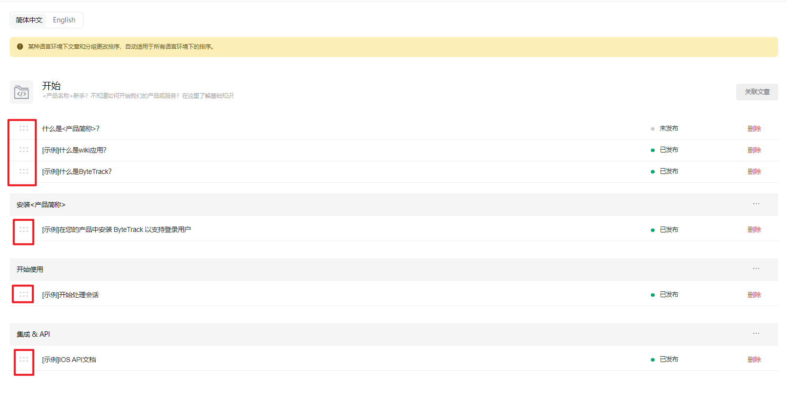
 

也可以在分组的右侧，对分组进行编辑、排序。如下图：

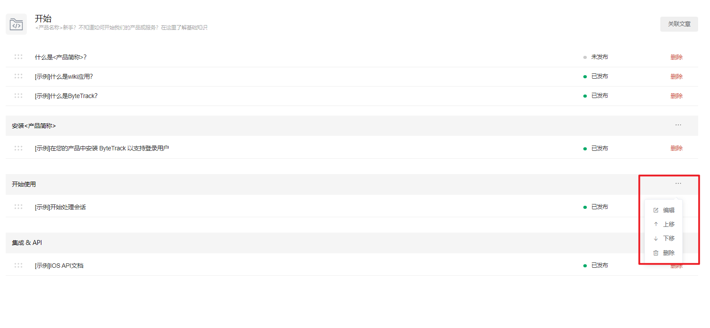
 
👏👏👏 经过以上步骤，您就能拥有一个丰富的文章站点了。
站点如何在信使中显示？让我们继续往下看。
[在信使中关联wiki应用](https://docs.bytrack.com/8CTFE8cF/help/wikidetail?articleId=V0lJB8YoIl&usageCategoryId=429&usageGroupId=833)
