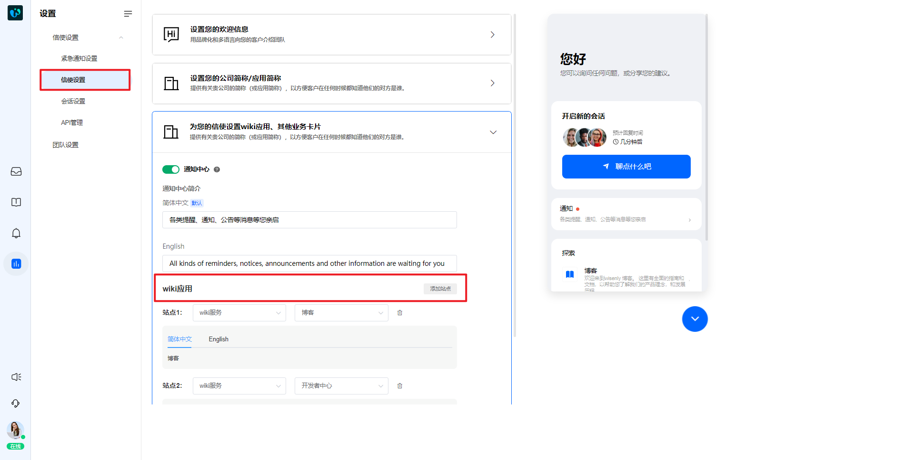

# 在信使中关联wiki应用

> 分类:07-wiki知识库 | articleId:V0lJB8YoIl | 描述:

您可进入设置→信使设置页面，为信使关联wiki应用，如下图：

 

只能关联已启用的应用，关联后您可以在右侧预览里看到它们的显示样式和排序。
如若想调整它们的显示顺序，删除wiki应用站点后重新关联即可。
👇如何丰富您的wiki应用？
[编辑您的wiki应用](https://docs.bytrack.com/8CTFE8cF/help/wikidetail?articleId=5xVo9e2kZo&usageCategoryId=429&usageGroupId=833)
