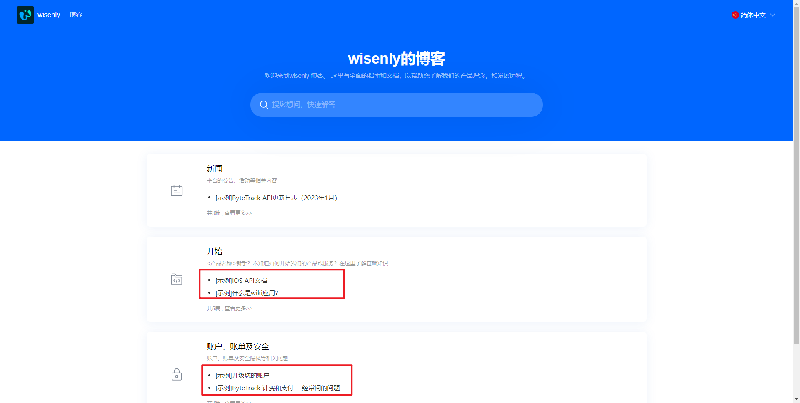
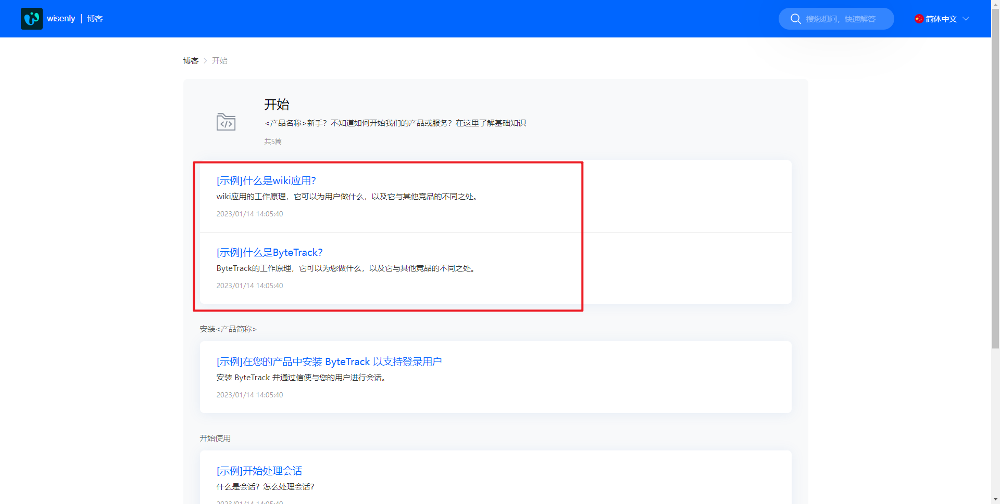

# 如何在站点中对文章进行排序？

> 分类:07-wiki知识库 | articleId:ujeTw73fFq | 描述:ByteTrack允许您通过更改文章在类别或组别中的位置来手动设置文章的顺序。

站点首页文章排序显示位置如下图：

站点首页的文章排序，是根据文章的最后更新时间倒序排列。即最近更新的文章，显示在最上面。如若想调整文章在首页的排序，只要更新下最上面的文章即可。
文章列表的文章排序ByteTrack 允许您通过更改文章在类别或分组中的位置来手动设置文章的顺序。通过这种方式，您可以指定阅读文章的顺序。
显示位置如下图：

要手动重新排序类别和/或组别中的文章，请按照以下步骤操作：
1. 在应用列表中点击应用名称，进入应用详情；
2.在类别列表下方，点击某个类别，进入类别详情；
3.抓取一篇文章并将其拖动到想要呈现的位置。文章位置即时保存。
如下图：

