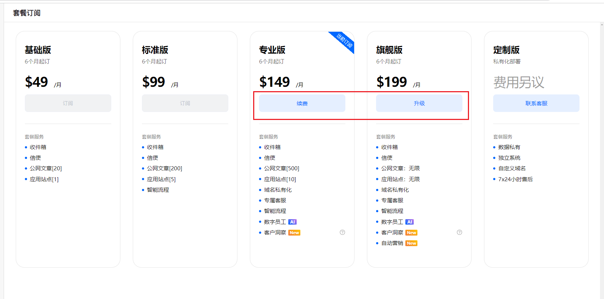
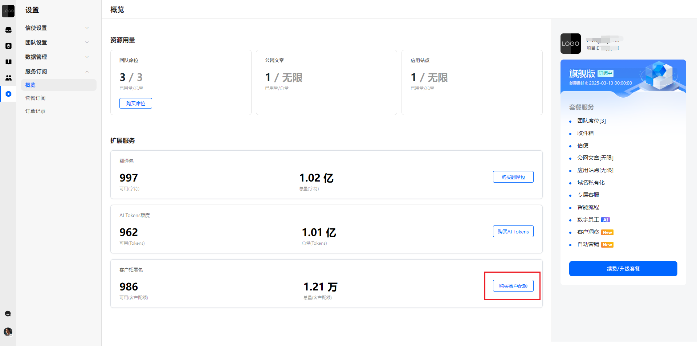
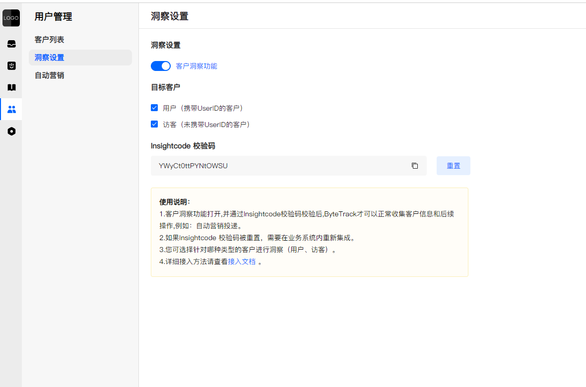
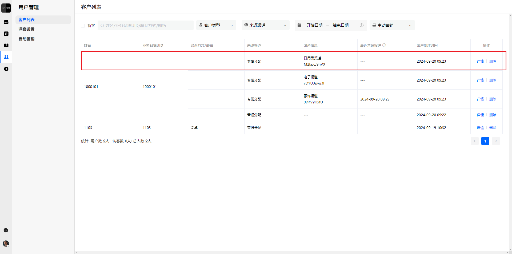
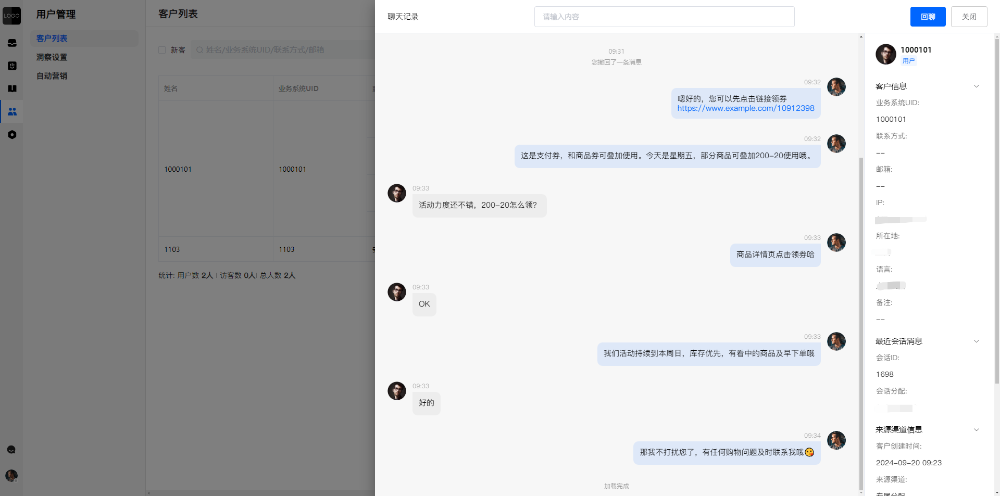
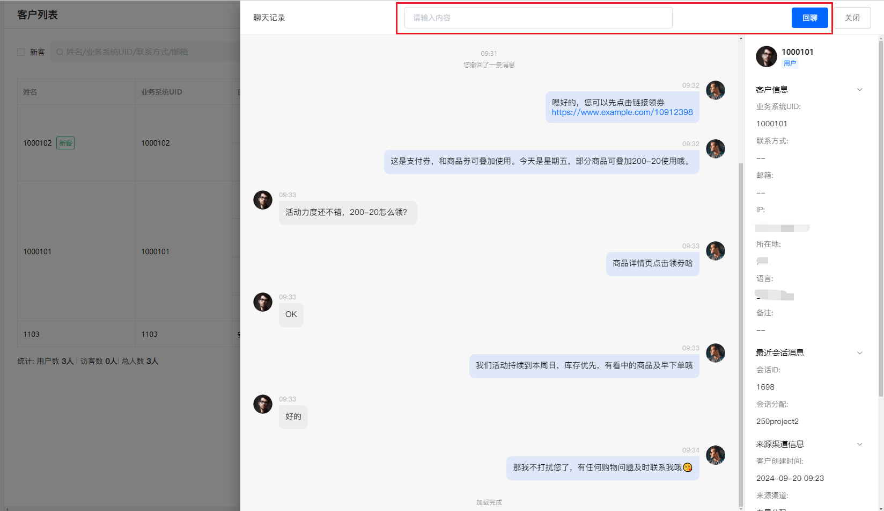
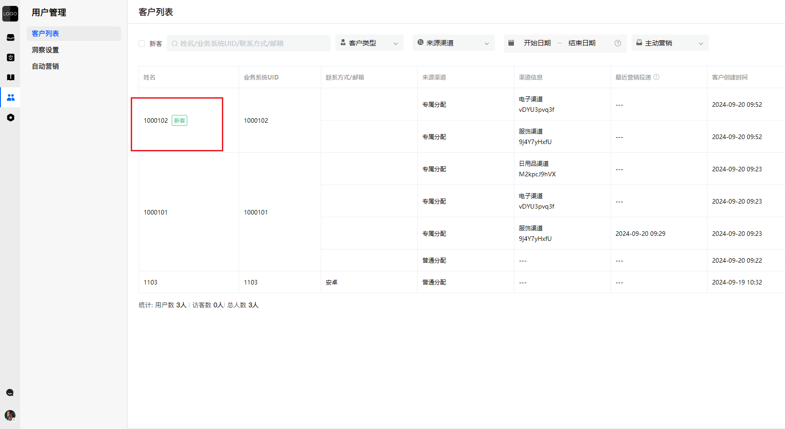
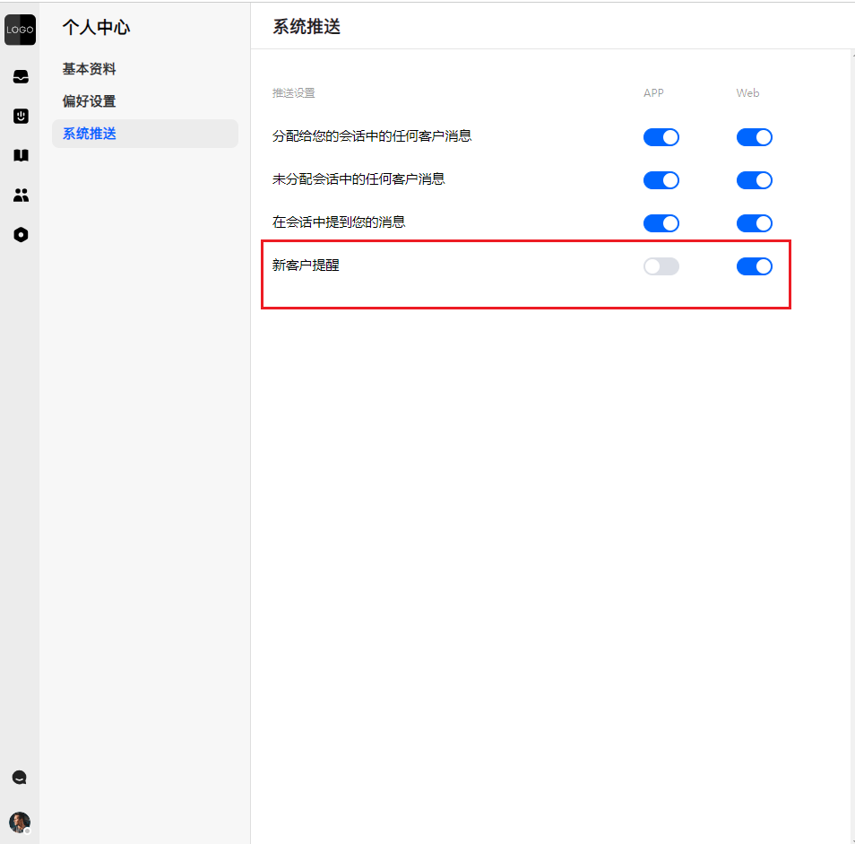
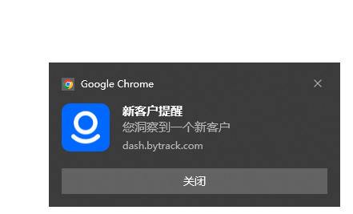

# 客户洞察详细说明

> 分类:08-主动营销 | articleId:nOvEPqbejq | 描述:全面解析客户洞察功能的使用方法，助力企业精准获取客户信息，实现智能营销和精细化管理。

客户洞察功能让您能够全面了解来自不同渠道的客户信息，无论是网站访客、平台用户，您都可以轻松获取他们的来源、互动历史。它还能统计访客和用户的数量，帮助您更好地了解客户画像，提升业务决策的效率和精准度。
使用客户洞察功能，请先完成下面这几步：👇
1. 升级到满足的套餐；
2. 检查客户配额是否足够；
3. 在信使中接入“客户洞察”方法；
4. 进行“客户洞察”设置；

1. 准备工作
## 1.1 升级套餐
客户洞察功能，需要订阅套餐为专业版、旗舰版、定制版才可使用。因此若您想使用客户洞察功能，请在 设置→服务订阅→套餐订阅 页面升级您的套餐👇

👋如果您想升级到定制版，请联系平台客服。

## 1.2 补充客户配额
客户配额是 ByteTrack 系统中的一个重要概念，它代表了系统能够识别和存储的不同渠道终端用户信息的数量。这个配额直接影响您进行主动营销的能力，因为只有 ByteTrack 成功识别到终端用户信息，您才能向他们发送营销内容。
每个渠道的每个客户信息都会占用一个客户配额。例如，如果同一个客户在多个渠道都有信息需要识别，将会相应地消耗多个客户配额。
为了帮助您开始使用，ByteTrack 在项目创建后会默认赠送 100 个客户配额。但是，如果您的客户配额不足，可能会导致以下问题：
1. 客户洞察功能将无法正常工作
2. 自动营销触发可能会失败
请注意，配额不足不会影响已经存在于客户列表中的渠道数据。
为确保您的业务运营不受影响，建议定期检查并及时补充客户配额。请在 设置→服务订阅→概览 页面，购买客户配额👇

## 1.3 信使中接入“客户洞察方法”
ByteTrack目前支持SDK、URL、JS网页插件接入。针对不同的接入方式，调用逻辑如下：
URL接入：由URL站点执行客户洞察方法；
JS网页插件接入：由业务方添加JS代码，由JS代码执行方法；
SDK接入：业务方自行调用执行；
在接入时，需要使用Insightcode 校验码。请在 用户管理→洞察设置 页面中查询👇

👋insightcode校验码被重置后，您需要在信使中重新接入，才可继续使用客户洞察功能。
客户洞察具体接入方法请参考👇
[Android 接入指南](https://docs.bytrack.com/8CTFE8cF/developers/wikidetail?articleId=rAYwlVm7Ev&usageCategoryId=445&usageGroupId=-1)
[IOS 接入指南](https://docs.bytrack.com/8CTFE8cF/developers/wikidetail?articleId=lV75UrsB5C&usageCategoryId=444)
[Web 接入指南](https://docs.bytrack.com/8CTFE8cF/developers/wikidetail?articleId=dWLrO50NUs&usageCategoryId=443&usageGroupId=-1)

## 1.4 客户洞察设置
完成前期准备工作后，您需要执行以下两个关键步骤来启用客户洞察功能：
1. 开启"客户洞察"功能
请在 用户管理→洞察设置 页面，找到"客户洞察功能"开关并启用它。这个开关让您可以灵活地控制功能的开启和关闭，以满足不同时期的需求。
2. 指定洞察目标客户
请在 用户管理→洞察设置 页面，选择您希望深入了解的客户群体。您可以根据需求选择洞察：
- 用户：已注册的客户
- 访客：浏览但未注册的潜在客户

通过精确选择目标客户群，您可以更有效地利用客户配额，避免不必要的资源消耗。

👏通过这两个步骤，您可以开始使用客户洞察功能，获取有价值的客户信息，同时优化您的客户配额使用。

2. 使用🎉🎉🎉 现在您已经准备好客户洞察的所有设置了。当在某个渠道有新的客户信息时，您将在 用户管理→客户列表 页面中看到这条数据👇

最近营销投递：最近一次，平台主动（手动、自动）联系客户的时间；
客户创建时间：客户在该渠道下，被收集到信息的时间；
👉收集时间，取决于信使调用“客户洞察”方法的时间，和信使初始化时间可能不一致。

点击详情，您可以查看这个用户在某个渠道下的最近沟通记录和客户信息👇

如果您觉得这条客户的渠道数据不再需要，也可以删除它。
👉删除后，若重新洞察这条客户的渠道数据，需要继续消耗“客户配额”。

您可以在“最近沟通记录”中，根据关键词搜索，也可以点击“回聊”，跳转到收件箱，继续聊天👇

3. 新客新客：这名客户在任何渠道里均没有沟通记录，则为“新客”。客户列表中，会出现“新客”的标识显示👇

当感知到新客时，会进行“新客户上线提醒”。需要您在个人中心→系统推送中，开启“新客户提醒”👇

电脑端后台中，新客的提醒效果👇

📣 APP端暂不支持“新客户提醒”。

4. 问答1、为什么访客的客户姓名，和会话详情的姓名不一致？
答：这种不一致可能出现是因为：
1. 客户洞察和客户主动发起会话是两个独立的过程。
2. 如果是您的团队成员在客户洞察后创建会话，姓名将保持一致。
3. 对于访客，系统会随机生成姓名和头像，因此客户洞察和客户主动发起会话时，姓名和头像都可能不同。
4. 对于用户，系统会随机生成头像，因此客户洞察和客户主动发起会话时，头像可能不同。

2、为什么有聊天记录，但是“最近营销投递”没有数据？
答：这是因为聊天记录包含两种类型：
- 客户主动发起的对话
- 您的团队成员主动发起的对话
具体来说：
1. 当您的团队成员发送消息并创建或重新打开会话时，系统会将其记录为一次营销投递。
2. 客户主动发起的对话不计入营销投递数据。
理解这些区别有助于您更好地解读系统数据，并优化您的客户互动策略。

3、为什么APP端收不到“新客户提醒”？
答：目前APP端暂不支持“新客户提醒”

4、为什么PC端收不到“新客户提醒”？
答：请您确认以下几个步骤是否正常：
1. 个人中心→系统推送中，开启了“新客户提醒”；
2. 您的账号状态正常（账号未被禁用、未被删除、未退出登录）；
3. 您的浏览器和电脑开启了“通知”功能。详细参考：[如何设置系统通知](https://docs.bytrack.com/8CTFE8cF/help/wikidetail?articleId=TQdEabnndo&usageCategoryId=593&usageGroupId=-1)

🎉🎉🎉现在您已掌握了如何使用客户洞察功能，您可以深入了解客户行为，制定更精准的营销策略，并提供个性化的服务体验。利用这些洞察，让您的决策更加明智！
想要了解更多？请继续👇
[主动营销详细说明](https://docs.bytrack.com/8CTFE8cF/help/wikidetail?articleId=Tqnc45sPCh&usageCategoryId=2826)
[智能流程详细说明](https://docs.bytrack.com/8CTFE8cF/help/wikidetail?articleId=dAmklHuZo3&usageCategoryId=870)
